## Introduction to Linux

### The Linux operating System

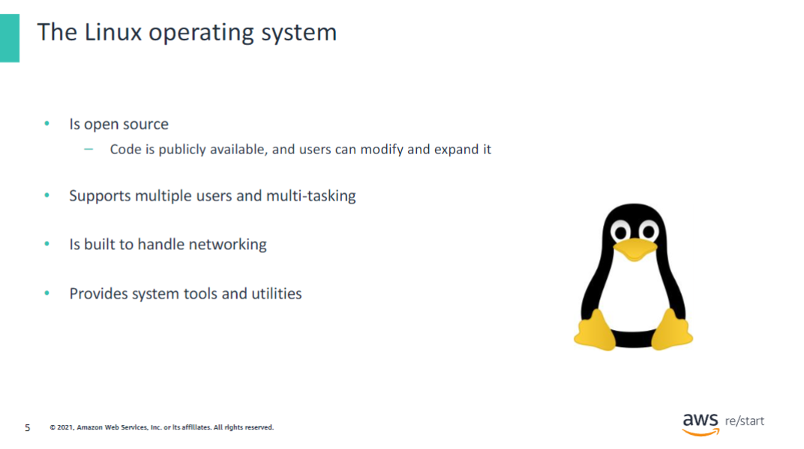

Linux is an operating system that is freely distributable under the terms of the Gnu is Not Unix (GNU) General Public License (GPL). It is open source because it provides the source code for the core functionality of an operating system, called a **kernel**, and users can modify and expand it. As a result, many **distributions** of Linux are available today.

With Linux, multiple people can use the same computer at the same time and can run multiple applications simultaneously. It also supports network functionality and provides system tools and utilities to increase usability.

#### Linux history and benefits

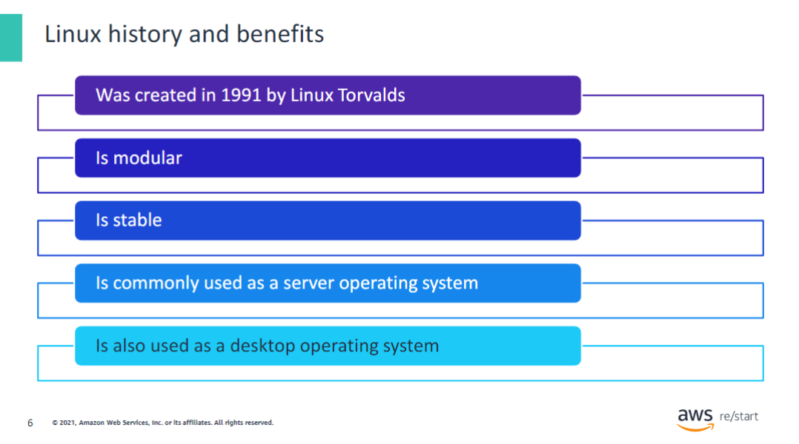

Linus Torvalds, a graduate student at the University of Helsinki in Finland, created Linux in 1991. Linux is similar to another operating system that is called Unix, which was developed in the late 1960s. In addition to being open source, Linux is modular, which means that you can extend it. It is also stable and does not experience frequent system freezes that require computer restarts. Because of these benefits, you can use Linux both as a desktop system and a server operating system.

#### Distributions

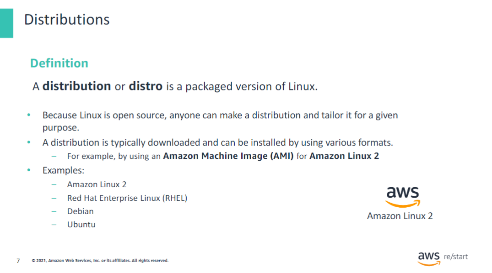

A Linux distribution is a packaged version of Linux that a group of individuals or a company develops. It includes the core operating system functionality (kernel) and additional complementary tools and software applications. Distributions are typically downloaded but can also be installed by using various media and formats. Examples include compact disk (CD), Universal Serial Bus (USB) device, and downloadable International Standardization for Organization (ISO) image. Examples of Linux distribution include Amazon Linux 2, Red Hat Enterprise Linux (RHEL), Debian, and Ubuntu. In the AWS Cloud, the Amazon Linux 2 operating system is readily distributed by using an Amazon Machine Image (AMI). An AMI contains an operating system and other pre-installed software relevant to the image. You will learn more about Amazon Linux 2 in a later section.

#### Major components of Linux

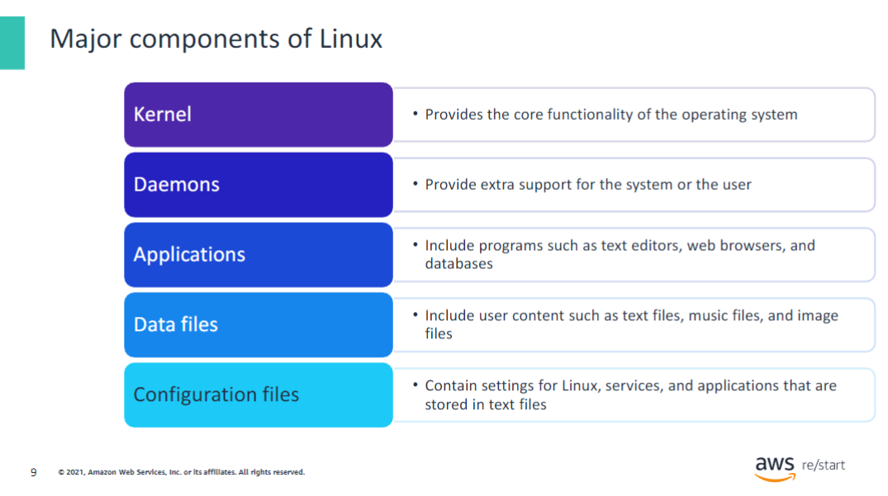

The major components of a Linux distribution consist of a kernel, daemons, applications, data files, and configuration files. You will review them in more detail in the next slides.

### The Linux kernel

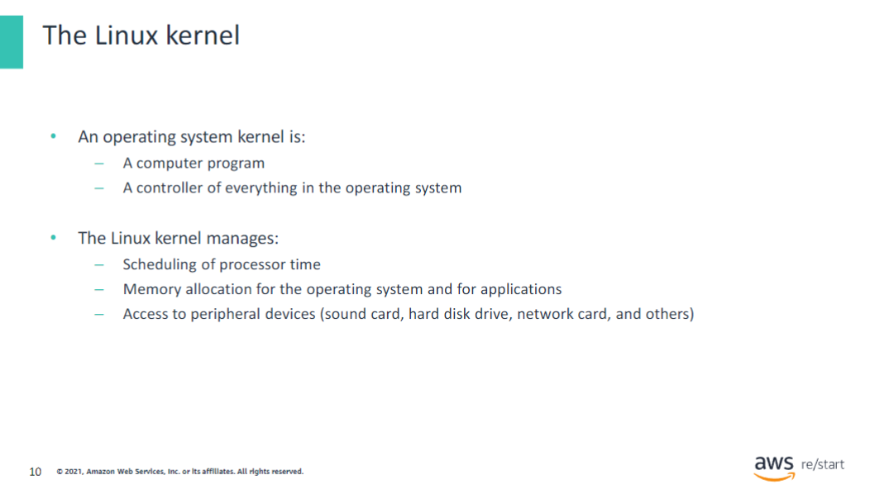

The kernel refers to the core component of an operatingsystem. It controls everything in the operatingsystem, including the allocation of CPU time and memory storage to running programs, and access to peripheral devices.

#### Functions of the Linux kernel

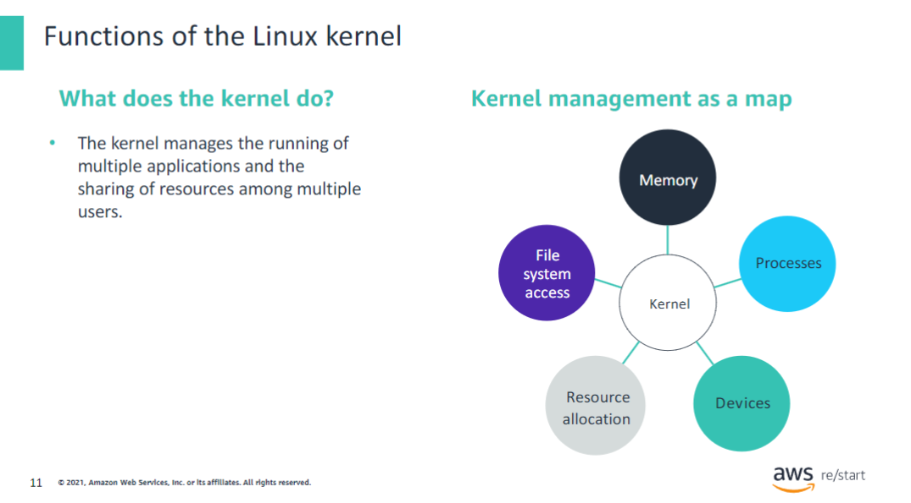

The Linux kernel manages the running of multiple applications and the sharing of resources among multiple users. It also controls the interface to the input/output (I/O) devices that are connected to the computer, and it manages files and directories.

#### Daemons

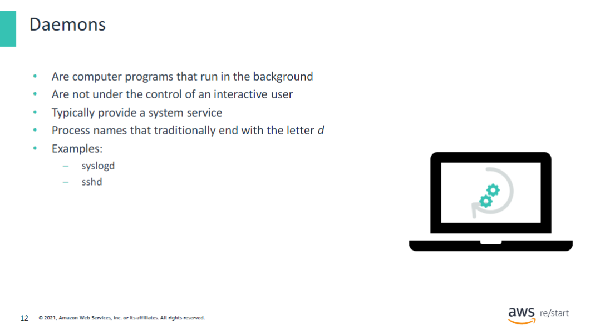

A daemon is a computer program that runs in the background and is not under the control of an interactive user. It typically provides a service to other running programs. Examples of daemons include the following:

- **syslogd**: When system or user applications generate messages, the `syslogd` daemon captures the messages and stores them to a file, which is called a log.
- **sshd**: The `sshd` daemon handles Secure Shell (SSH) connections to the computer. This type of connection uses encryption to secure the communication between the client and the server.

You will learn more about daemons in the Managing Processes lesson.

#### Applications

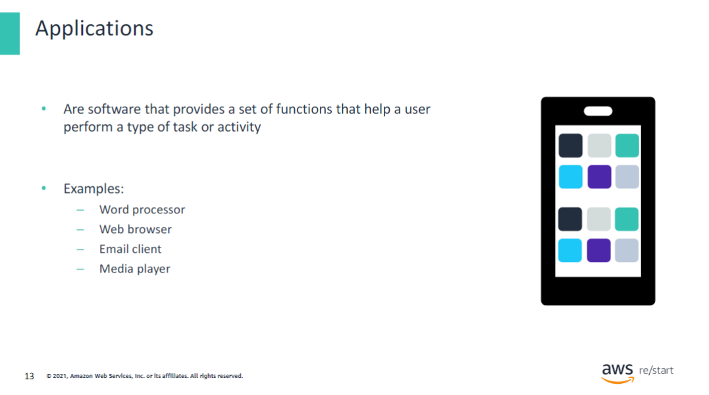

An application, is a computer program that provides functions that help users perform a type of task or activity. For example, with a word processor app, users can create and edit text content, and this type of app facilitates document authoring and modification. Likewise, with a web browser app, userscan access the internet and visit websites.  

#### Data files

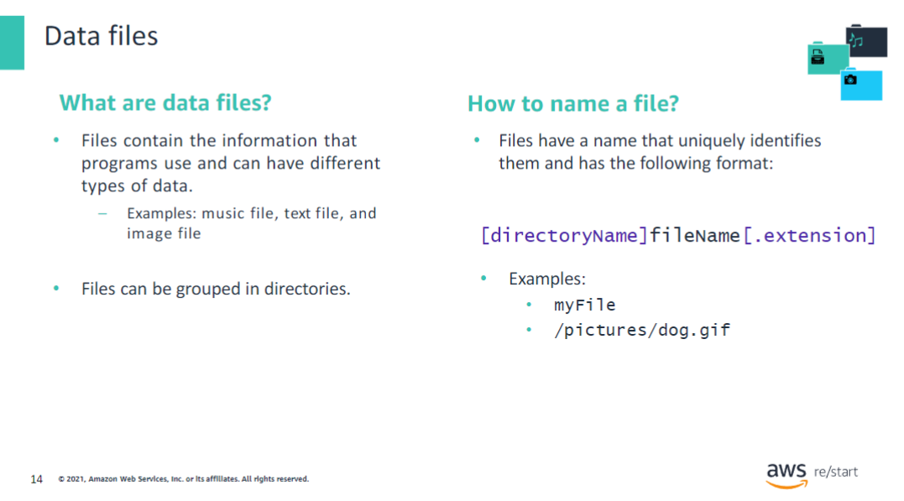

A file contains information, or data, that the user has created or captured. Files can be of different types depending on the type of data that they contain. A program can process the data in a file. Examples of data files include music, text, or image files. Files are also typically grouped in directories for organizational purposes. A file has a name that uniquely identifies it. The format of a complete file name consists of an optional directory name, the actual file name, and an optional extension. A period precedes the extension. In the last file name example that is shown:

- `/pictures` is the directory name.
- `dog` is the file name.
- `.gif` is the extension.

#### Configuration files

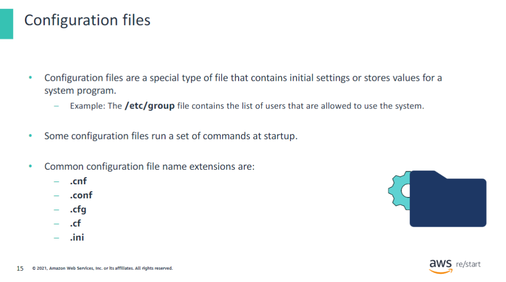

A Linux configuration file is a special type of file that stores initial settings or important values for a system program. These values configure the behavior of the associated program or capture the data that the program uses. For example, the `/etc/group` configuration file contains the list of authorized users for the system. Some configuration files are used to run a set of commands when the system is started or when the user logs in. With these commands, the Linux environment can be customized to the specific preferences of the user. Configuration file names use a common set of extensions, including `.cnf` and `.conf`.

#### How to interface: CLI compared with GUI

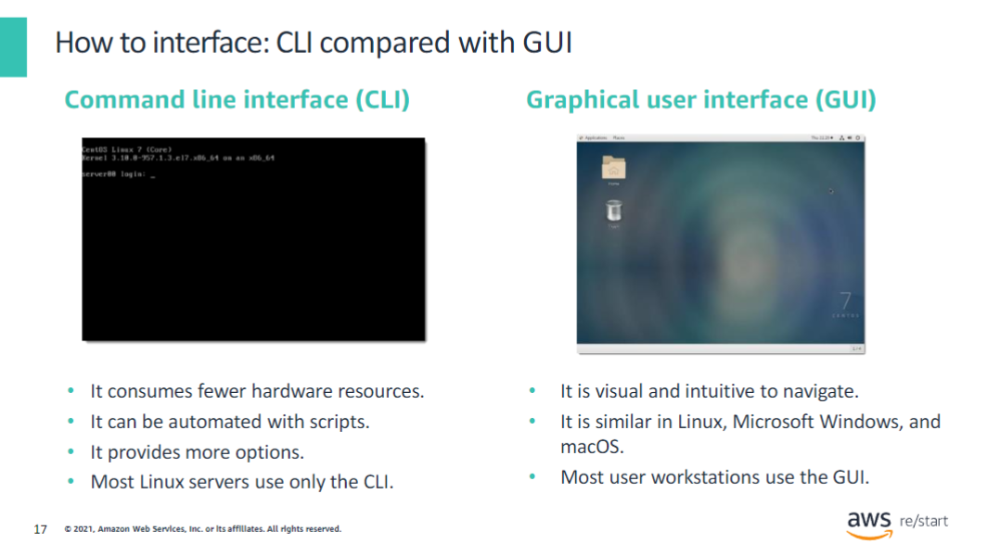

You can use either the CLI or GUI based on your preference.

#### The shell

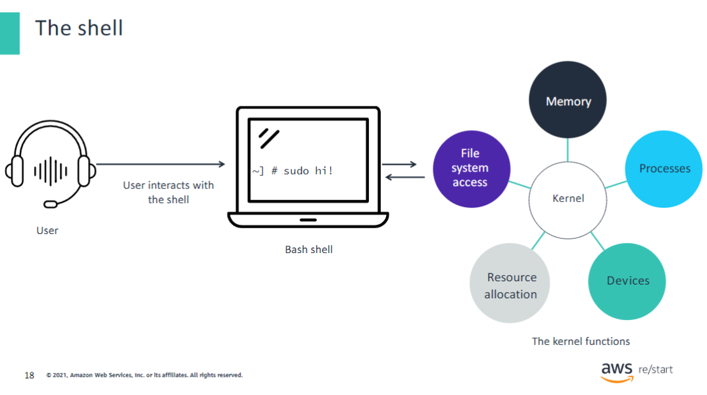

When you use the CLI, the **shell** that you select defines the list of commands and functions that you can run. A shell interprets the command that you type and invokes the appropriate kernel component that runs the command. You can use many types of shells, and each Linux distribution defines the types that it can support.

#### Shell types

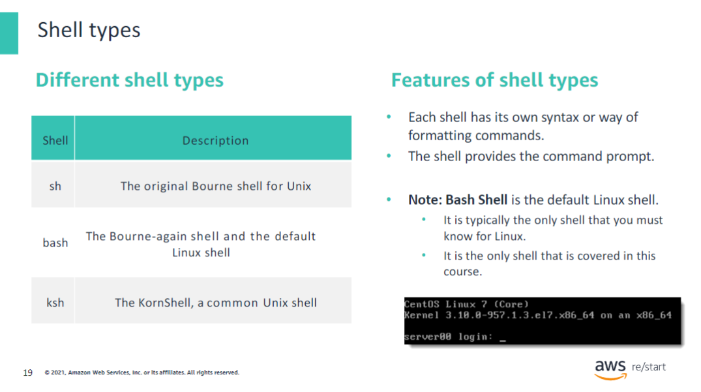

There are different shell types, but the only one you need to know for Linux is the Bash Shell. An upcoming lesson will detail how to use the Bash Shell.

### Linux Documentation

#### Manual Pages

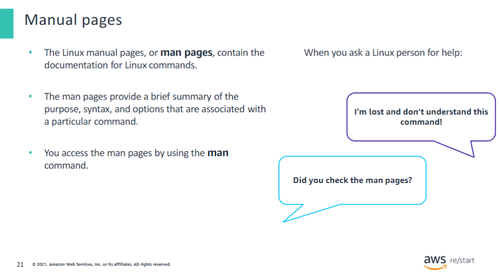

The primary source of Linux documentation is the manual pages. They contain a description of the purpose, syntax, and options for a Linux command.

When you ask a Linux person for help, the most likely first answer that you will get is, “Did you check the man pages?”

You access the `man` pages by using the mancommand.

#### The man command

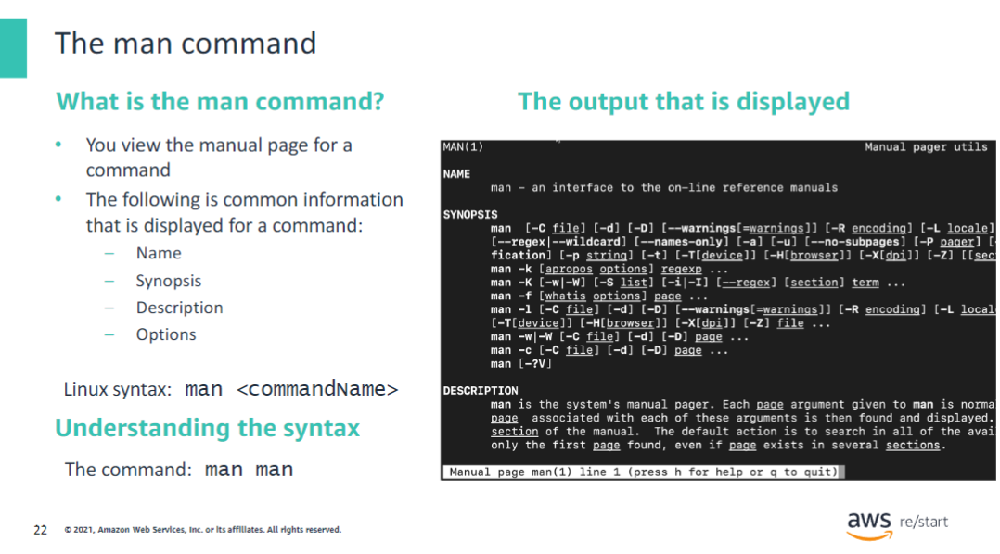

The `man` command displays documentation information for the command that you specify as its argument. This information includes the following:

- **Name:** The name and a brief description of the purpose of the command
- **Synopsis:** The syntax of the command
- **Description:** A detailed description of the command’s usage and functions
- **Options:** An explanation of the command’s options

The example screen capture shows the output of the `man` command.

#### Command features of the `man` command

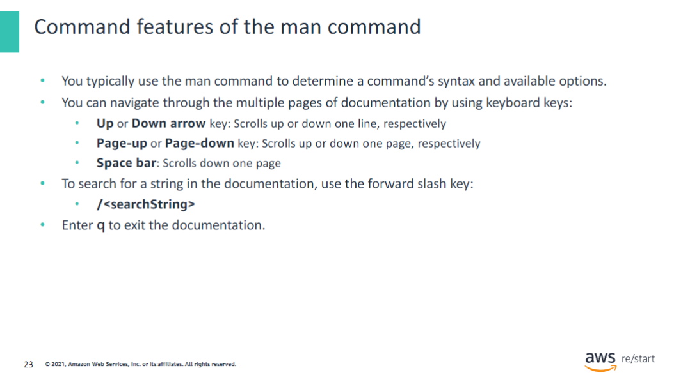

Using the `man` command, you can determine the syntax of a particular command. It is also very useful in understanding a command’s options. The documentation that is displayed for a command will typically consist of many pages. To navigate through the pages, use the following keyboard keys:

- **Up arrow** or **Down arrow** key: Scrolls up or down one line, respectively
- **Page-up** or **Page-down** key: Scrolls up or down one page, respectively
- **Space bar:** Scrolls down one page

You can also search a command’s man page by using the forward slash (/) character: `/<searchString>`

To exit the manual pages, enter `q`.

### Linux distributions

#### Sources of major distributions

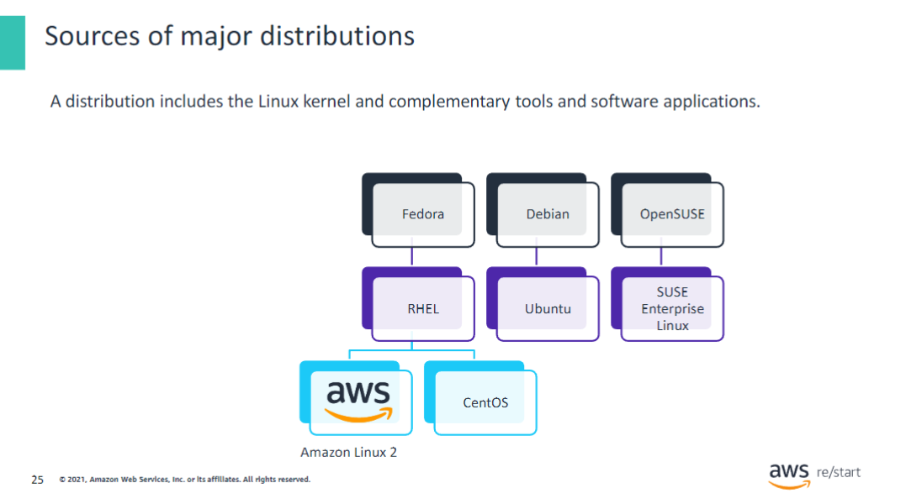

A Linux distribution includes the Linux kernel and the tools, libraries, and other software applications that the vendor has packaged. Most widely used distributions are derived from the following sources:

- **Fedora:** Red Hat, an IBM company, mainly sponsors this distribution. Fedora is used to develop, test, and mature the Linux operating system. Fedora is the source of the commercially distributed RHEL from which the Amazon Linux 2 and CentOS distributions are derived.
- **Debian:** This Linux distribution adheres strongly to the free software principles of open source. The Ubuntu distribution is derived from Debian, and the British company Canonical Ltd. maintains it.
- **OpenSUSE:** The German company SUSE sponsors this distribution, which is used as the basis for the company’s commercially supported SUSE Enterprise Linux offering.

#### Amaxon Linux 2

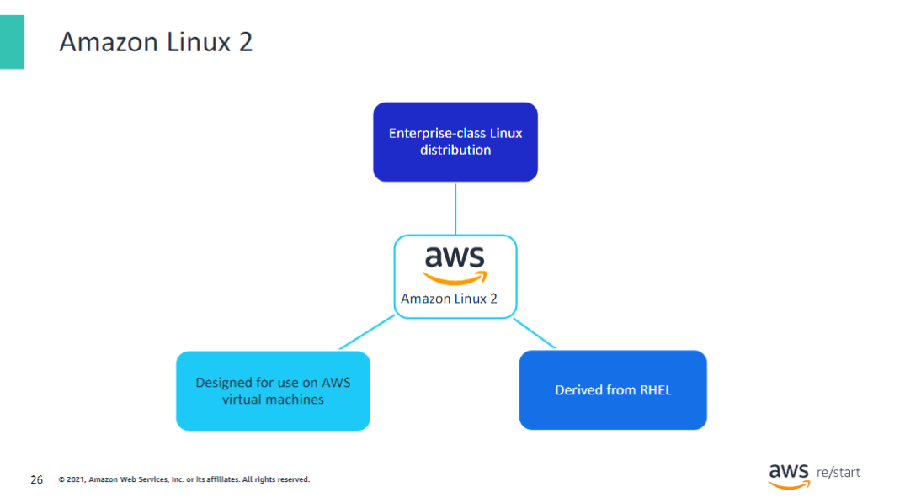

Amazon Linux 2 is the latest Linux operating system that AWS offers. It is designed to provide a stable, secure, and high-performance runtime environment for applications that run on Amazon Elastic Compute Cloud (Amazon EC2). It supports the latest EC2 instance type features and includes packages that facilitate integration with AWS.

Amazon Linux 2 enhances security by automatically applying critical or important security updates when an instance is booted. For more information on Amazon Linux 2, see [Amazon Linux 2](https://aws.amazon.com/amazon-linux-2/).

#### CentOS

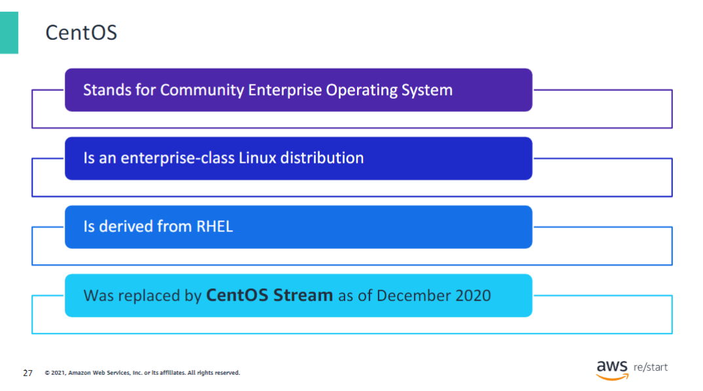

CentOS (or Community Enterprise Operating System)is a free Linux distribution and is functionally compatible with its upstream source, RHEL.

CentOS is currently used in the lab environment for this course.

As of December 2020, Red Hat has cancelled any further development for CentOS Linux and replaced it with CentOS Stream.

### Connecting to a remote Linux server

#### Lab environment

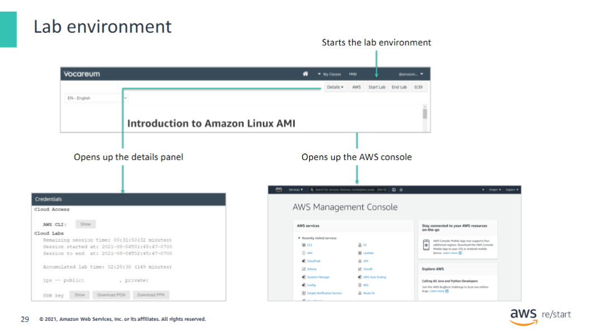

You will connect to Vocareum to work on your labs. The interface offers all the lab information and steps, as well as buttons to start the AWS instance you will work with.

- The **Start Lab** button will generate your AWS working environment.
- The **Details** pane displays information such as the IP address of the EC2 instance that you will work with. It also provides the URL to download the private SSH connection key.
- The **AWS** button opens the AWS console. While you won't need to access this console when working on the Linux labs, you should familiarize yourself with it for future use.

#### Lab architecture

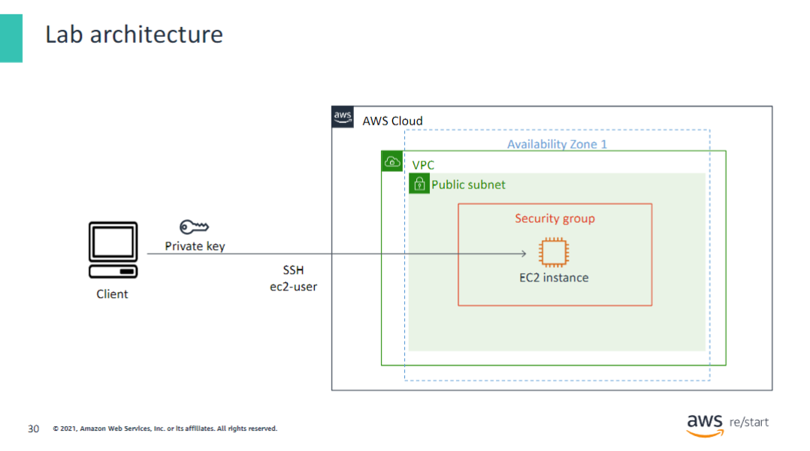

When you start working on your labs, an Amazon Linux 2 EC2 instance instantiates automatically. You will download a key to securely connect to this instance using Secure Shell (SSH) with the user `ec2-user`. SSH is a network protocol that provides a secure way to access a computer. To connect to a host via SSH:

- On MacOS or Linux, you can typically access an SSH client directly from the terminal.
- On Windows, you can use a tool called PuTTY, which provides a graphical interface.

SSH connections usually use port 22. The security group linked to the EC2 instance automatically opens this port.

#### Additional details

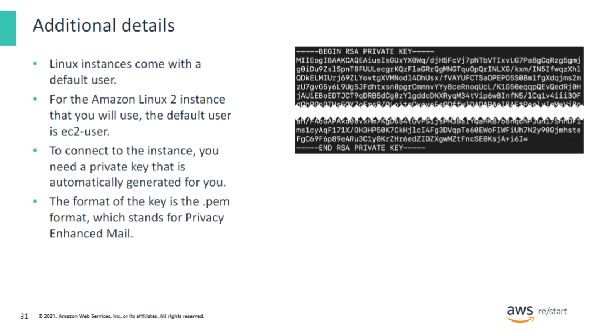

On Windows. PuTTY uses a slightly different format, the.ppk (which stands for PuTTY private key) format. PuTTYgenis a tool that can convert a .pem key into a .ppk key.Both .pem and .ppk keys are provided in the lab.

#### How to access Linux AMI

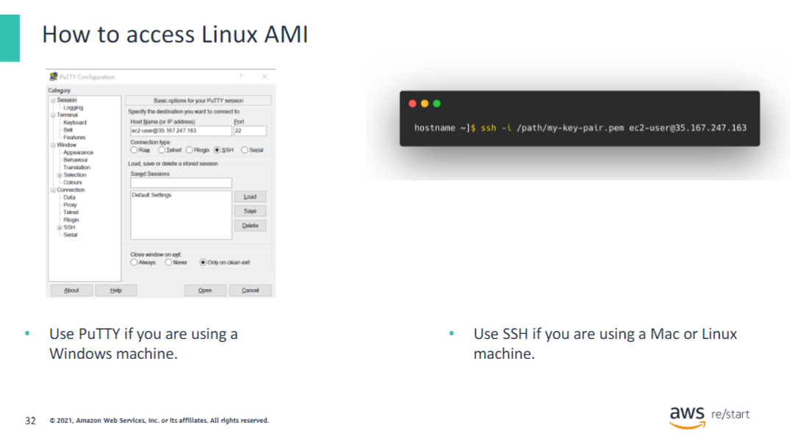

After launching an EC2 instance, you can connect to it and use it as you would with a computer in front of you. Depending on your operating system, there are two ways to access the EC2 instance:

- **Using PuTTY (Windows):** PuTTY is an open-source SSH and telnet client that allows you to connect to your instance from a Windows machine.
  
- **Using SSH (macOS/Linux):** If you are using a macOS or Linux machine, it likely includes an SSH client by default. You can check for the SSH client by entering `ssh` at the command line.

#### Checkpoints questions

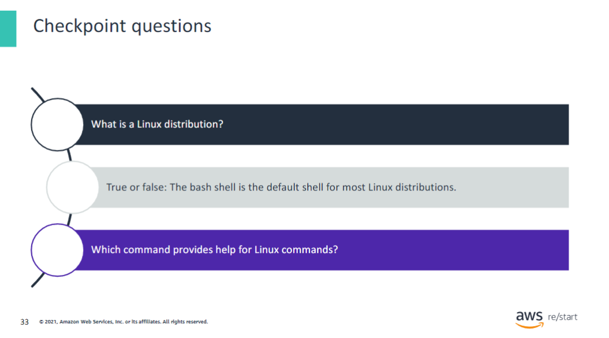

What is a Linux distribution?

- A Linux distribution is a packaged version of Linux that a group of individuals or a company develops. It includes the core operating system functionality (kernel) and additional complementary tools and software applications.

True or false: The bash shell is the default shell for most Linux distributions.

- True

Which command provides help for Linux commands?

- `man`

### Key Takeaways

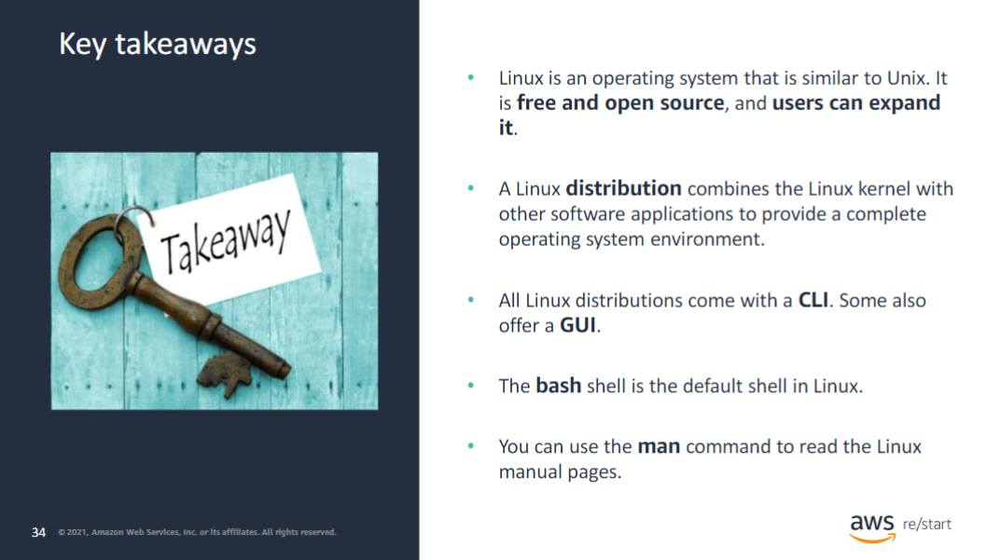

Some key takeaways from this lesson include:

- Linux is an operating system that is similar to Unix. It is free and open source, and users can expand it.
- A Linux distribution combines the Linux kernel with other software applications to provide a complete operating system environment.
- All Linux distributions come with a CLI. Some also offer a GUI.
- The bash shell is the default shell in Linux.
- You can use the `man` command to read the Linux manual pages.

## Linux Command Line

### Linux login workflow

### The login prompt

After a network connection is made, you can connect by using a program like PuTTY or by using the terminal on macOS. You will encounter the login prompt. All Linux sessions begin with the login process (default authentication process). Linux sessions start with the user entering their username at the prompt. The login prompt is used to authenticate (prove the user’s identity) before using a Linux system.

When the password is typed, it does not echo (a line of text isn’t displayed). The username is checked against the `/etc/passwd` file, which is stored in the `/etc` directory. The file represents an individual user account and contains the following fields separated by colons (:):

1. **Username or login name**
2. **Encrypted password**
3. **User ID**
4. **Group ID**
5. **User description**
6. **User’s home directory**
7. **User’s login shell**

### The login workflow

During the login workflow, the name is checked against the `/etc/passwd` file, and the password is checked against the `/etc/shadow` file. The username field has a maximum of 32 characters. To avoid any confusion, avoid using initial capitalization in usernames. For example, “salazar" is not the same as "Salazar."

Linux has moved the user's password into a separate file `/etc/shadow`. Because the user's password is stored in the `/etc/shadow` file, a placeholder is used in `/etc/passwd` as a reference.

## Linux command prompt

### Anatomy of the command prompt

The default shell in Linux is Bash, which provides the command prompt. The Linux command prompt or command line is a text interface to your Linux computer. It is commonly referred to as the shell, terminal, console, or prompt. The default shell contains the user name, and the user's home directory has the same name as the user (which it does by default). Although this format is common, it is changeable and not always consistent in different Linux distributions.

### Command syntax example

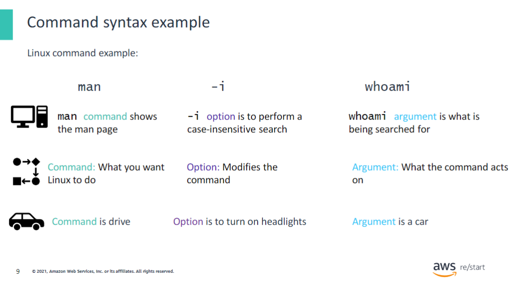

The command syntax is case-sensitive. Most commands in Linux follow syntax rules. Depending on the command, the syntax comprises the command itself, an option, and an argument. If you review the example above, this structure is reflected.

The best way to describe the command syntax is as follows:

- **Command:** What you want Linux to do
- **Option:** Modifies the command
- **Argument:** What the command acts on

For example, consider the analogy of a car. If you drive a car, drive would be the command. An option could be noted as turn on the headlights, and the argument is a car.

To reinforce this concept, a car was used as an example:

- **The command** is drive.
- **An option** is to turn on the headlights.
- **The argument** is a car.

Reference: Image of Tux made by Larry Ewing (lewing@isc.tamu.edu) by using The GIMP.

### The `whoami` command

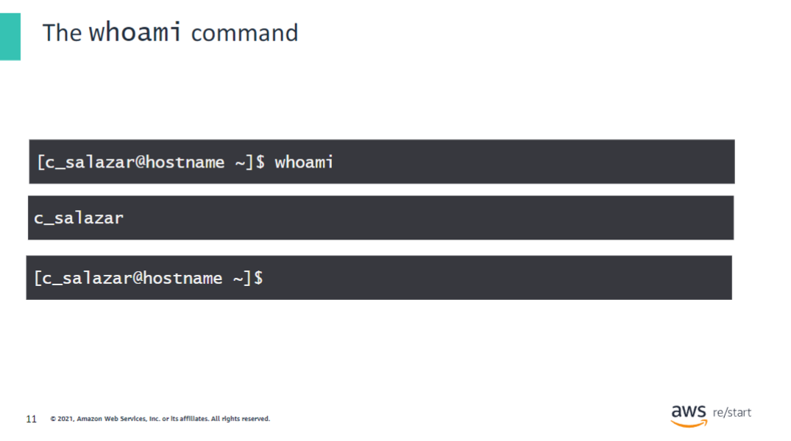

The concatenation of the strings *who*, *am*, and *i* is *whoami*. In Linux, it's used to show the current user's user name when the command is invoked. A use case for this command would be to use it after you log in as UserA. Then, switch users and run commands as another user to see the context.

### The `id` command

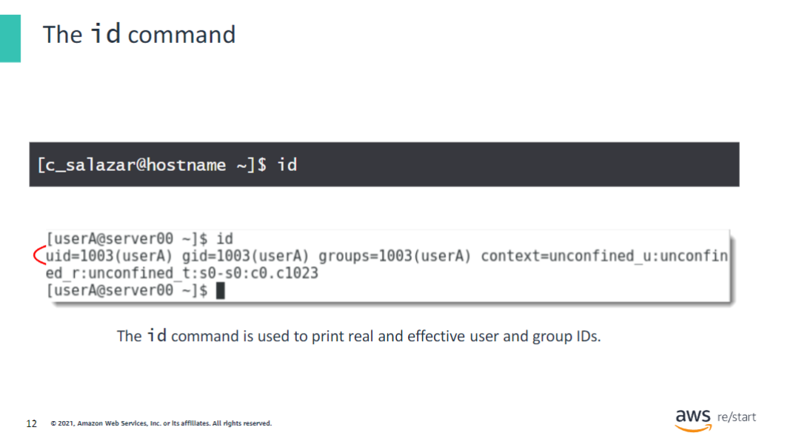

This command helps identify the user and group name and numeric IDs (UID or group ID) of the current user or any other user on the server. This command displays the user and group information for each specified USER or (when USER is omitted) for the current user.

### The `hostname` command

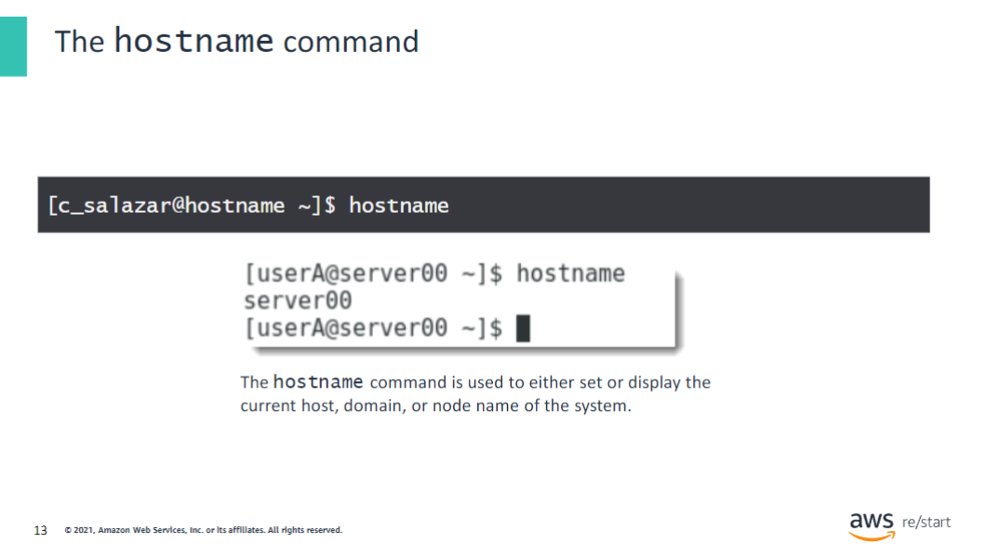

This command displays the TCP/IP hostname. The hostname is used to either set or display the system's current host, domain, or node name. Many networking programs use hostnamesto identify the system.

### The `uptime` command

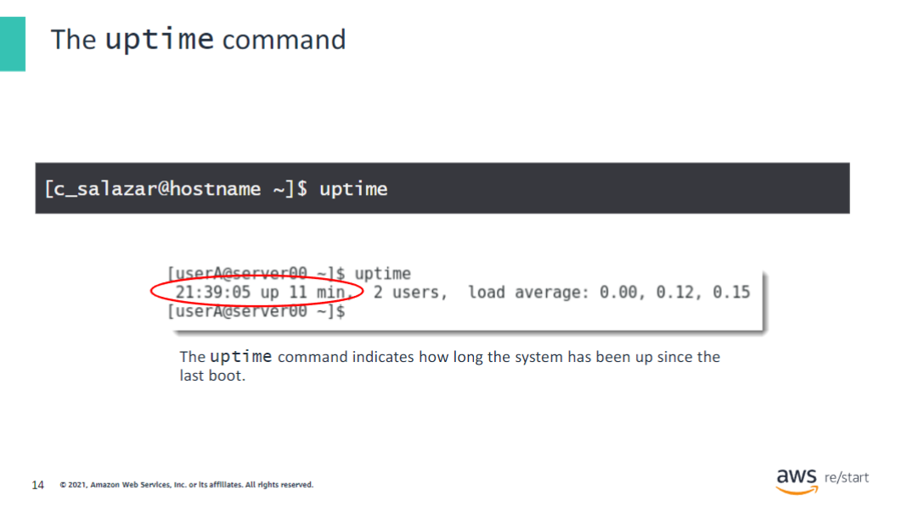

This command indicates how long the system has been up since the last boot.

### The `date` command

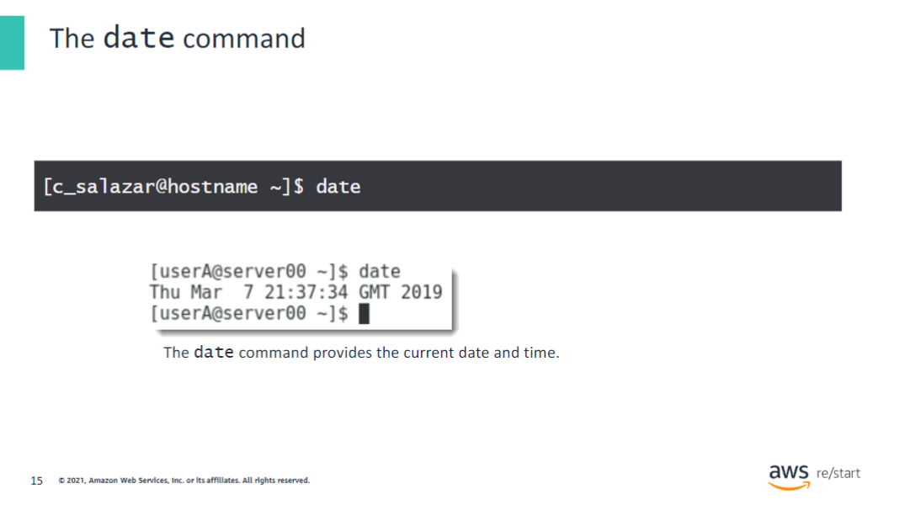

This command can display the current time in a given forma.It can also set the system date.

### The `cal` command

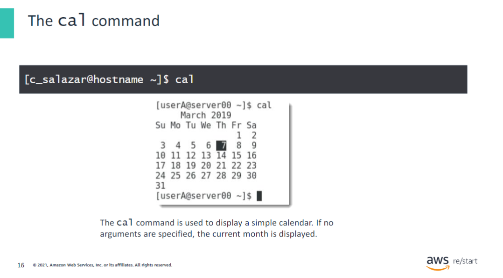

The `cal` command is used to display a calendar. If no arguments are specified, the current month is displayed. Note: The month can be specified as a number (1–12), a month name, or an abbreviated month name according to the current locales.

### The `clear` command

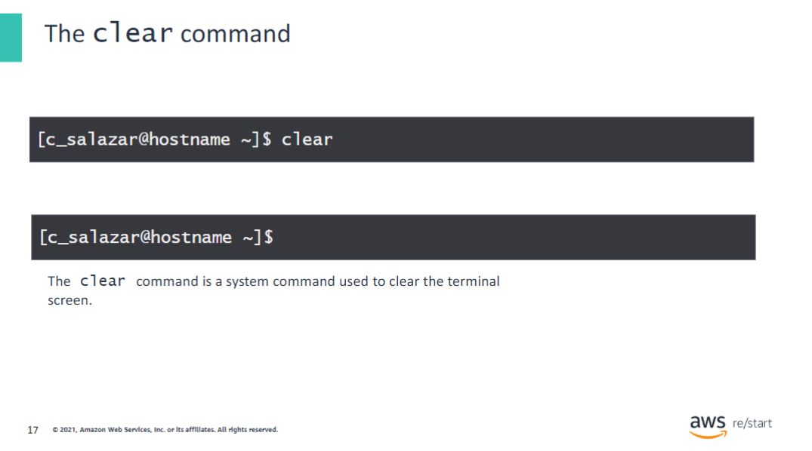

The `clear` command is used to clear the terminal screen. This command, when ran, clears all text on the terminal screen and displays a new prompt.

### The `echo` command

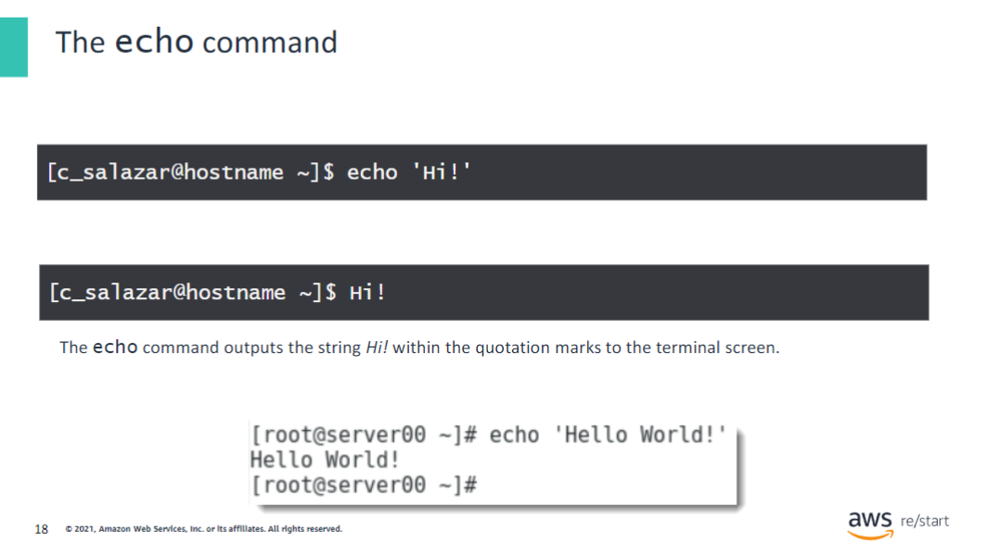

The `echo` command places specified text on the screen. It is useful in scripts to provide users with information as the script runs. It directs selected text to standard output or in scripts to provide descriptions of displayed results.

### The `history` command

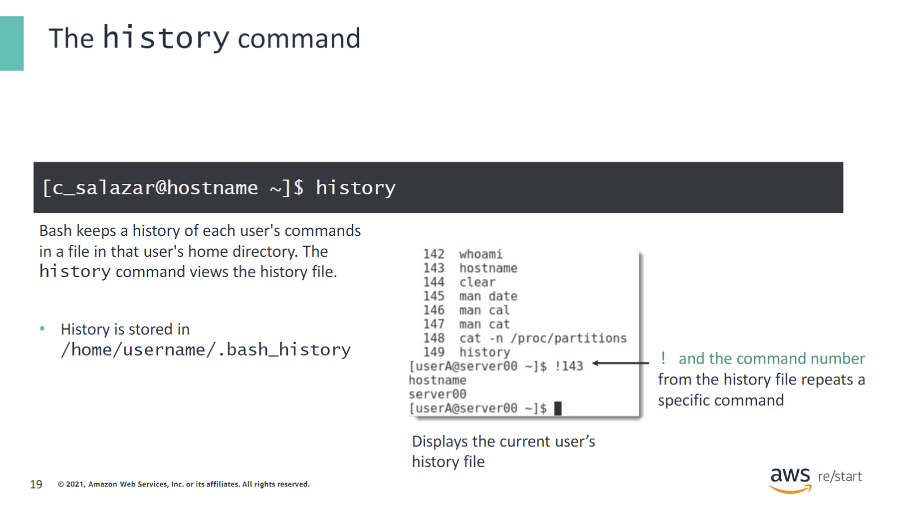

Bash keeps a history of each user's commands in a file in that user's home directory. The `history` command views the history file.

- It displays the current user's history file.
- Up and down arrow keys cycle through the output or the history file.
- This command can be run by using an event number: for example, `!143`.

Note: If you make a mistake when writing a command, don't reenter it. Use the `history` command to call the command back to the prompt, and then edit the command to correct the mistake.

You should use the `history` command in the following use cases:

- Accessing history between sessions
- Removing sensitive information from the history: for example, a password that is entered into a command argument

### The `touch` command

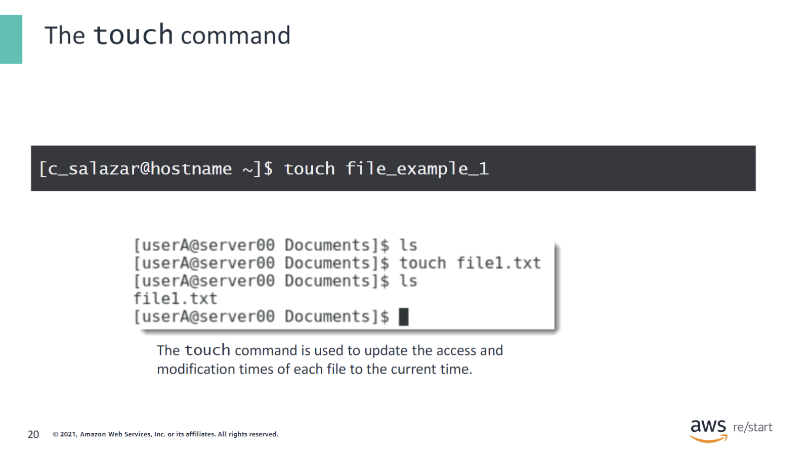

The `touch` command can be used to create, change, or modify timestamps on existing files. Also, the `touch` command is used to create a new empty file in a directory.

To create a new file by using the `touch` command, enter `touch file_example_1`

You can use the `touch` command to generate more than one new file at a time, by writing the syntax `touch file_example_1 file_example_2 file_example_3`

Note: You see the `ls` command in the screenshot. You'll learn more about the `ls` command in the next lesson.

### The `cat` command

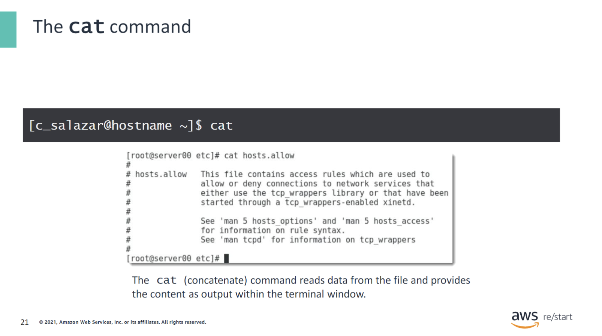

The `cat` command is used to show the contents of files. This command is useful to administrators because Linux configurations are held in text files.

In the example that is shown, you can use this command to view the contents of the `hosts.allow` file.

## Additional commands

Standard streams are interconnected input and output communication channels. There are three input/output (I/O) streams. The standard streams are:

- **#0 Standard in (`stdin` command)**
- **#1 Standard out (`stdout` command)**
- **#2 Standard error (`stderr` command)**

These communication channels handle incoming data or outgoing data from an input device or write data from applications. In modern operating systems, the standard error stream is redirected to log files.

### Standard input - `stdin` command

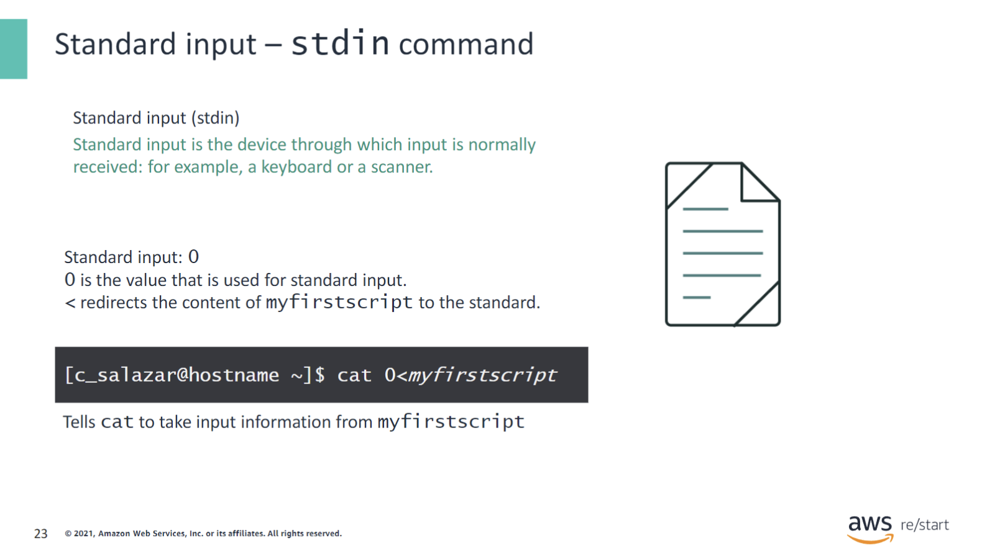

Standard input is the file handle that your process reads to get information from you. It can be from the user who provides the information or from a file.

- **Standard input:** `0`

The example `cat 0<myfirstscript` tells `cat` to take input information from `myfirstscript`. `0` is the value that is used for standard input. `<` redirects the content of `myfirstscript` to the standard input.

### Standard output - `stdout` command

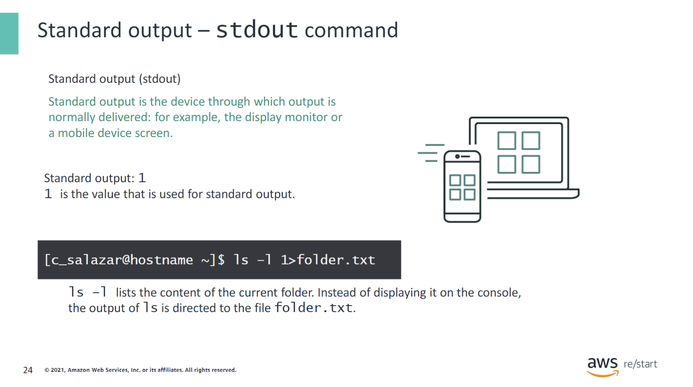

Standard output consists of the standardized streams of data that flow out of command line interface (CLI) commands. It simplifies the use of Linux on different devices and in different programs. It reduces the need to adjust output depending on the device that is used.

- **Standard output:** `1`

Consider the command: `ls -l > folder.txt`

`ls -l` lists the content of the current folder. Instead of displaying it on the console, the output of the `ls` command is directed to the file `folder.txt`.

### Standard error - `stderr` command

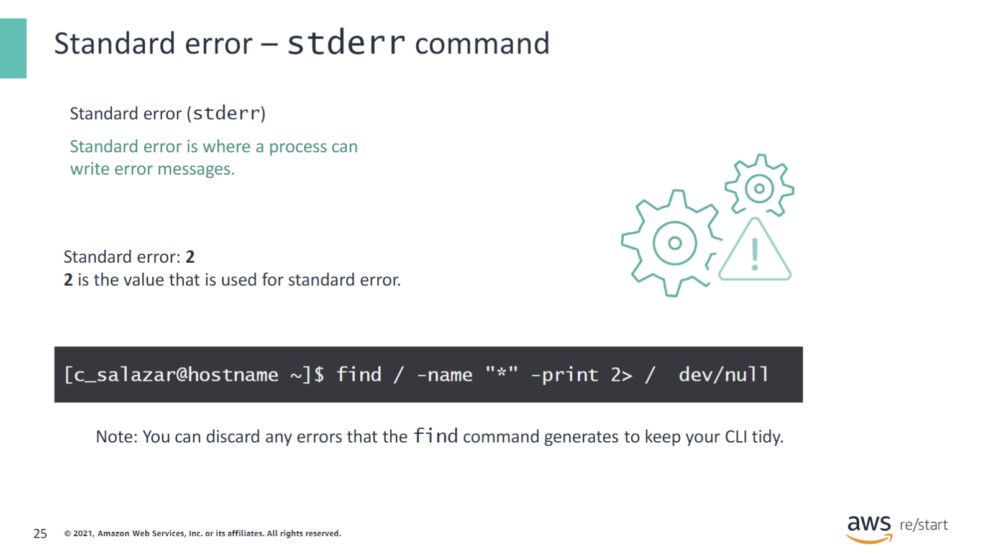

Standard error (stderr) is used to print error messages on the output screen or terminal window.

- **Standard error (stderr):** `2`

For example, consider the command: `find / -name "*" -print 2> /dev/null`

This command discards any errors that the `find` command generates to keep your CLI tidy.

### Bash tab completion

In Bash tab completion, the tab key automatically completes commands and file or directory names. The Bash tab saves time and provides greater accuracy. To use this feature, you must enter enough of the command or file name for it to be unique.

### Best practice: History and tab completion

For history and Bash tab completion, best practices include the following:

- **Develop the habit of using both of these features to make usage of the command line faster.**
- **Use the features of Bash to work smarter, not harder.**

### Checkpoint questions

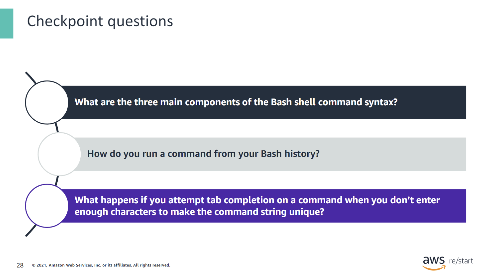

Be sure that you can answer these key questions about this content:

1. **Command, Option, Argument**

2. **The history command**
   Example: [c_salazar@hostname ~]$ history

3. **You will be shown all possible options if you press tab twice.**

### Key Takeaways

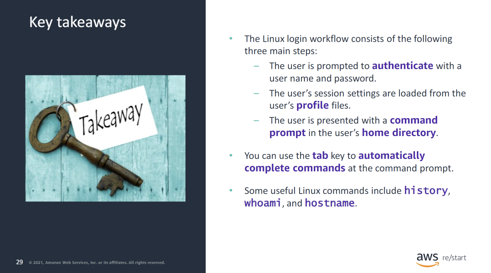

Some key takeaways from this lesson include the following:

- The Linux login workflow consists of the following three main steps:
  - The user is prompted to authenticate with a user name and password.
  - The user’s session settings are loaded from the user’s profile files.
  - The user is presented with a command prompt in the user’s home directory.
- You can use the `tab` key to automatically complete commands at the command prompt.
- Some useful Linux commands include `history`, `whoami`, and `hostname`.

## Users and Groups

### User accounts