## Working with Files

In this lesson, you will learn how to:

- Describe the use of the `hash`, `cksum`, `find`, `grep`, and `diff` commands
- Differentiate hard links from symbolic links
- Compare the `tar`, `gzip`, and `zip` commands

### The `hash` command

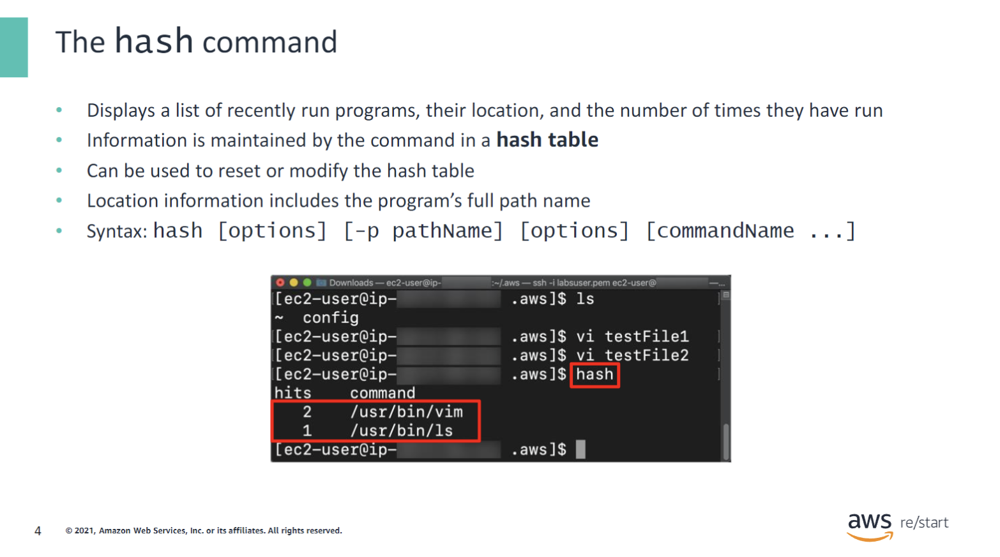

The `hash` command can be used to view recently run programs, their location in the file system, and the number of times they were run. Specifically, the `hash` command displays or modifies the remembered location of the program associated with a given command and how many times the command was run. It stores this information in a hash table and provides options to display, reset, or delete the table’s content. A program’s location information consists of its full path name in the file system.

**Syntax:**

`hash [-lr] [-p pathName] [-dt] [commandName ...]`

Some command options are as follows:

- `-d`: Deletes the location for `commandName` from the hash table
- `-l`: Displays output in a format that can be used as input to another command
- `-p`: Sets `pathName` as the full path location for `commandName`
- `-r`: Empties the hash table
- `-t`: Displays the location of `commandName`

### The `cksum` command

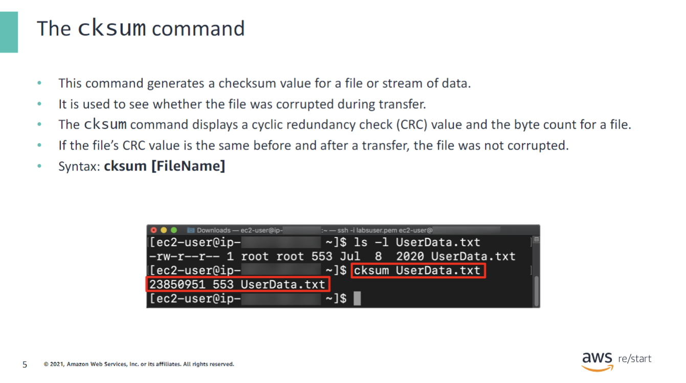

The `cksum` command generates a checksum value for a file or stream of data that the user can use to see whether the file was corrupted during transfer. Specifically, it computes and displays a *cyclic redundancy check (CRC)* value for the file and shows its size in bytes.

The CRC value is derived from the contents of the file and is used to validate the file's integrity. If a file's checksum value is the same before and after a transfer, the file was not corrupted.

### The `find` command

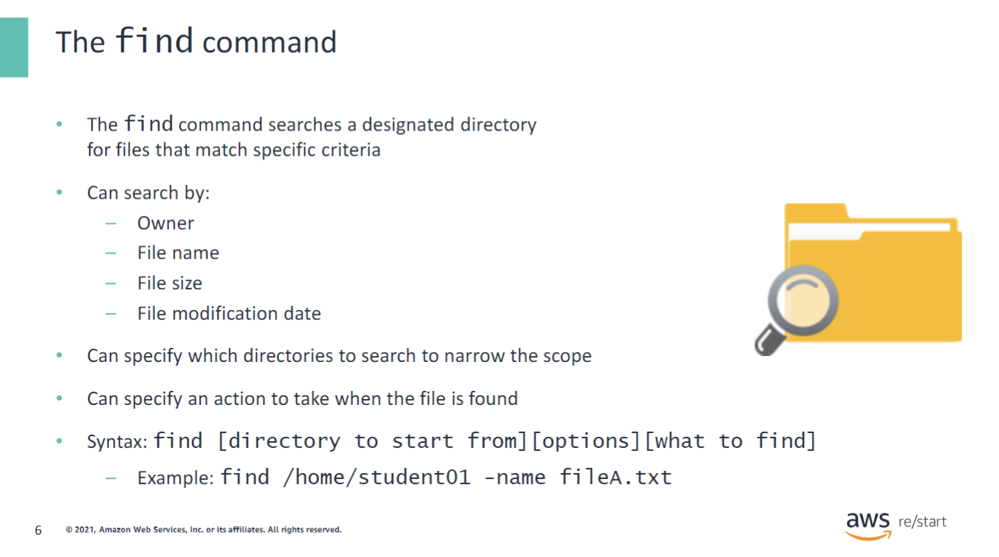

The `find` command searches a directory and any of its subdirectories for files that match specific criteria. Search criteria can include:

- File name
- File type
- File size
- File owner
- File modification date

You can search by logical expressions. When searching by name, wildcard characters can be used to match based on a character pattern. In addition, you can specify an action to take on matching files, such as delete or run a specified command on them.

The `find` command can also be used with pipe (`|`) to input the findings into another program.

In the example that is shown, the `find` command returns all files with a name of `fileA.txt` in the `/home/student01` directory and its subdirectories.

#### `find` options

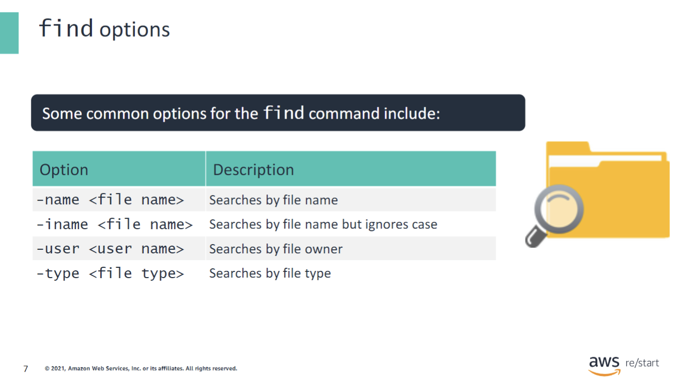

You can use the options for the `find` command to specify the type of search to perform: for example, by name, owner, or file type. You can also specify actions to take on the returned file matches.

#### Actions that are used with the `find` command

The `find` command can perform actions on the files that match the search criteria. Some examples are as follows:

- `-fprint fileName`: Writes the output of the command to the specified file name
- `-exec commandName`: Runs the specified command on the returned file or files
- `-delete`: Deletes the returned file or files

#### Examples of the `find` command

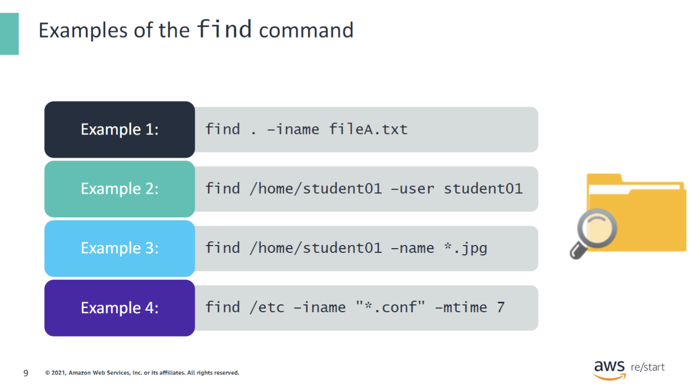

This slide shows examples of the `find` command:

- The first example shows how to search for a file that is named `fileA.txt` and starts in the current directory. The search should ignore the case of the letters in the file name pattern.

- The second example shows how to search for files that `student01` owns, which start in the `/home/student01` directory.

- The third example shows how to search for files with a file name extension of `.jpg` that start in the `/home/student01` directory.

- The fourth example shows how to search for files with a file name extension of `.conf` that start in the `/etc` directory. The search should be case insensitive and return only those matching files that were modified exactly 168 (7 x 24) hours ago.

#### Demonstration: the `find` command

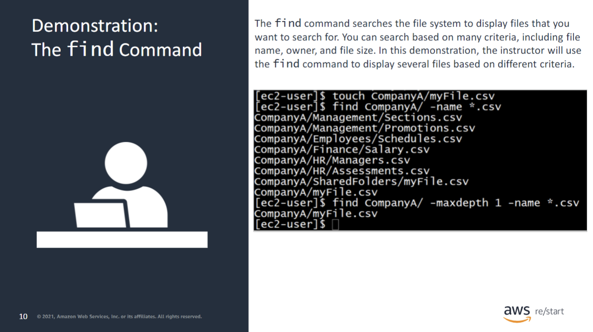

In this demonstration, the instructor will show various forms of the `find` command. Some examples are as follows:

- Find files that have a specific name extension: `find <startingDirectoryName> -name <*.extension>`
- Find files that have a specific name extension up to a subdirectory depth of 1: `find <startingDirectoryName> -maxdepth 1 -name <*.extension>`

### The `grep` command

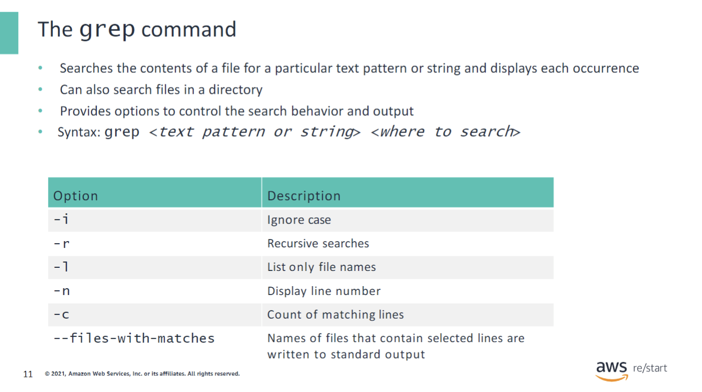

The `grep` command searches a file or a directory for a particular text pattern or string and displays each occurrence. You can control the search behavior and output through various options.

#### Example: The `grep` command

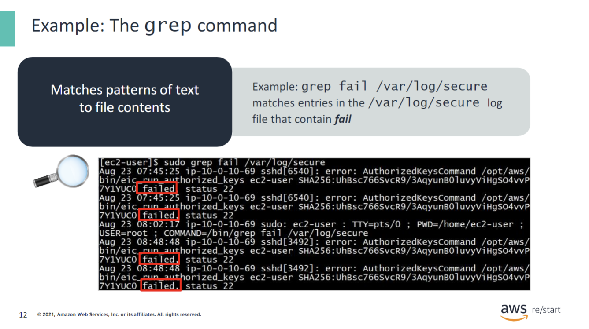

In this example, the `grep` command matches the pattern text fail to the file contents.

#### `find` and `grep` comparison

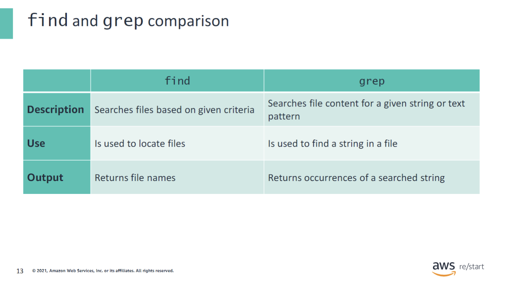

The `find` and `grep` commands have one main difference:

- The `find` command is used to **locate files** that match specified criteria.
- The `grep` command is used to **find a string in a file**.

### The `diff` command

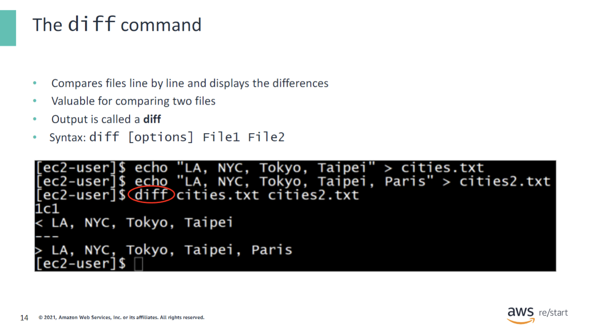

The `diff` command compares two files line by line and displays the differences between the two files.

### Links and inode

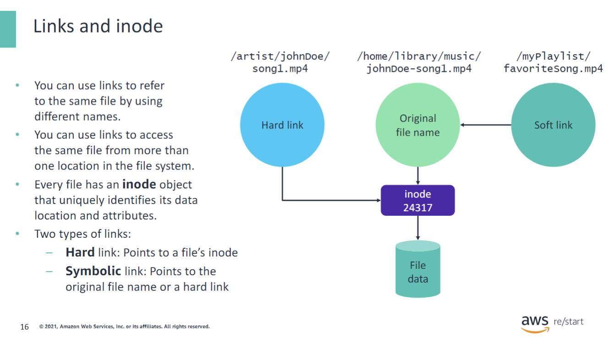

You can use a link to refer to a given file by using different names. By creating multiple links for the same file, you can access it from more than one location in the file system.

Linux has two types of links:

1. **Hard link**: Every file has an object that is called inode, which stores the file's disk block locations and attributes. An inode is identified with a unique number. A hard link is a pointer to a file's inode.

2. **Symbolic link**: Also known as a soft link or symlink, a symbolic link points to the original file name or a hard link.

In the example, a music file was originally created with a complete path name of `/home/library/music/johnDoe-song1.mp4` and an inode that was identified as `24317`. 

A hard link was then created to allow access to the file through a directory structure that categorized the song by its artist's name: `/artist/johnDoe/song1.mp4`. 

A soft link was also created to identify it as the favorite song in a playlist directory: `/myPlaylist/favoriteSong.mp4`.

### Hard link

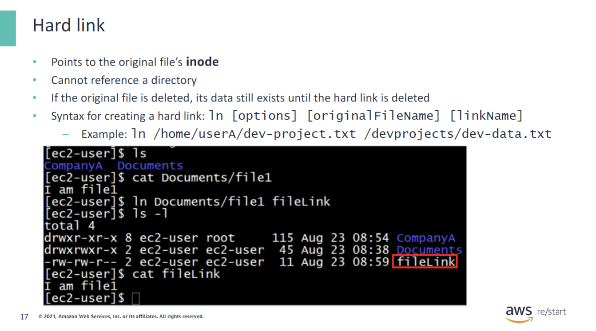

Some important things to keep in mind with hard links include the following:

- No visual difference exists between a hard link and a file in a directory listing. When you use the `ls` command to list a directory, no special indicators show that an entry is a hard link.

- If the original file is deleted, its contents still exist until the hard link is deleted.

The screen capture shows how to create a hard link that is named `fileA` for the file that is named `file1`.

### Symbolic Link

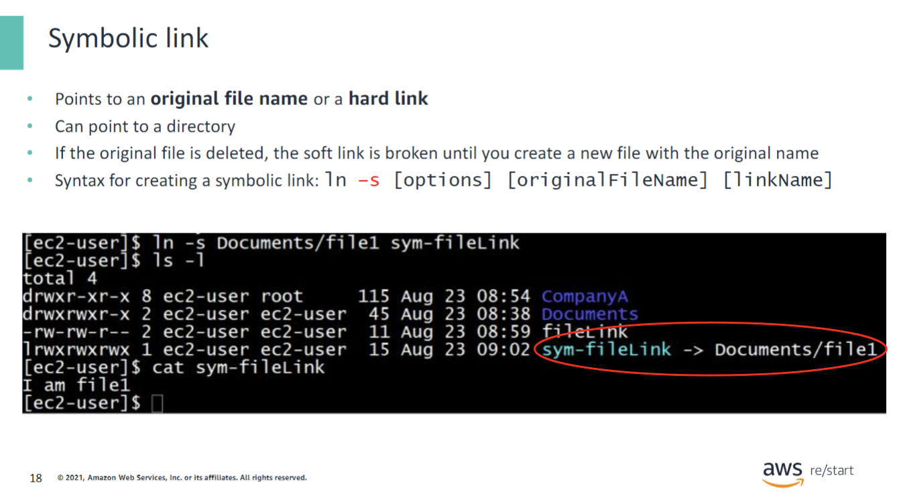

Some important things to keep in mind with symbolic links include the following:

- Technically, you can also make a symbolic link point to a hard link. A hard link is like the original file name because it points to the file's inode.

- A visual difference exists between a symbolic link and a file in a directory listing. When you use the `ls` command to list a directory, a symbolic link points to its original file name.

- If the original file is deleted, the symbolic link is broken and has no value. If you create a new file with the original name, the symbolic link will work as expected again.

The screen capture shows how to create a symbolic link that is named `sym-fileA` for the file that is named `fileA`.

#### Demonstration: Links

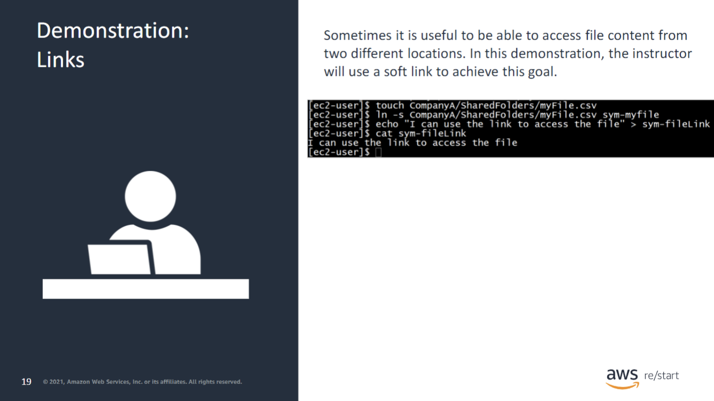

In this demonstration, the instructor will show you how to create a soft link by using the link command: `ln -s [originalFileName] [linkName]`

### The `tar` command

The `tar` command is used for the following:

- File downloads
- Large numbers of files to copy or move
- Internet downloads, including software

#### Common `tar` options

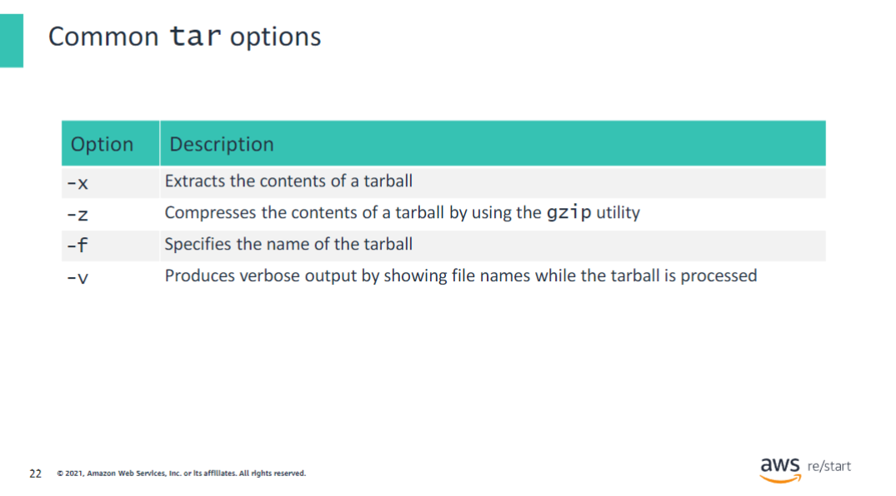

Some `tar` options are mandatory when extracting:

- `-x`: Extracts a tarball (an archive file)
- `-z`: Uses `gzip` (see later in this lesson)
- `-f`: Provides the name of the tarball
- `-v`: Shows the progress as the tarball is created

### The `gzip` command

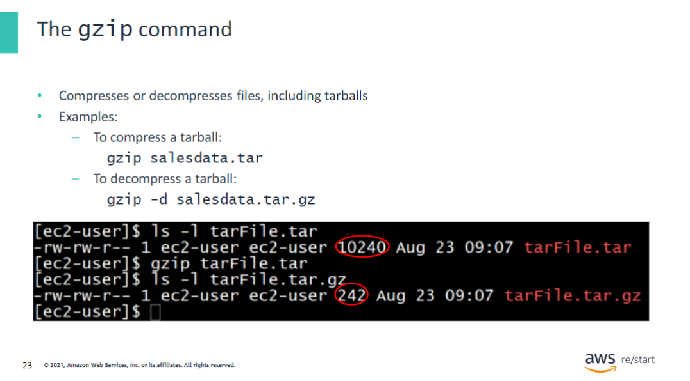

Use the `gzip` command to compress or decompress files, including tarballs:

- Common with internet downloads
- Common with archiving log files
- Common with archiving old data

Files can be both tarred and gzipped, and files that are created with the `gzip` command will have the `.gz` extension.

### The `zip` and `unzip commands`

When a folder or directory is zipped, you can use the recursion option `-r` to include the contents of its subdirectories.

By default, the name of the created compressed file will have a `.zip` extension.

#### Checkpoints Questions

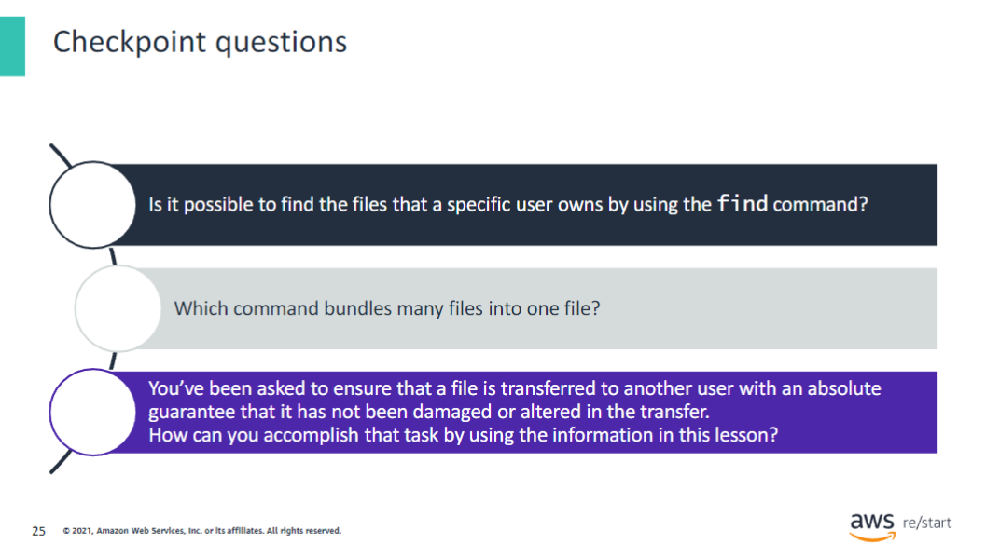

Answers:

1. Yes, by using the `-user` option

2. The `tar` command

3. Before transferring the file, run the `cksum` command on it and record the result. After transmission, run `cksum` again, and compare the new result with the original one. If the results match, the file was not altered during transfer.

### Key Takeaways

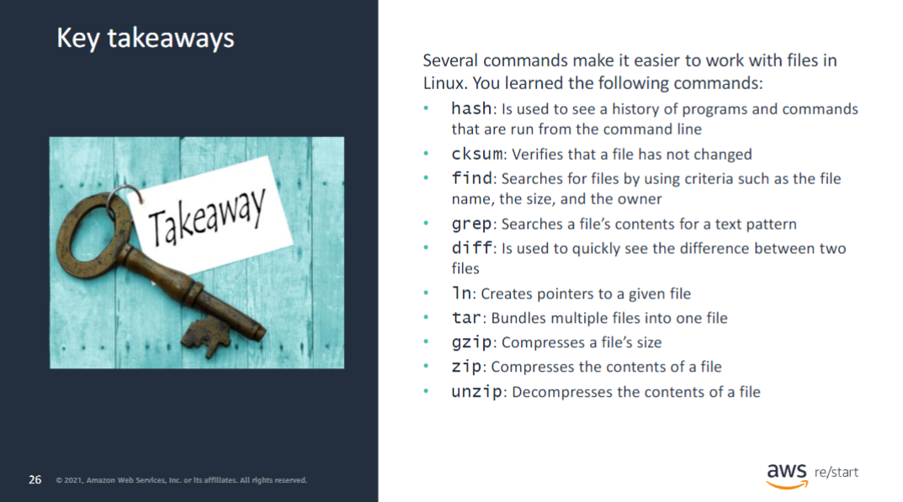

The commands introduced in this lesson are summarized as follows:

- `hash`: Is used to see a history of programs and commands that are run from the command line
- `cksum`: Verifies that a file has not changed
- `find`: Searches for files by using criteria such as the file name, the size, and the owner
- `grep`: Searches a file's contents for a text pattern
- `diff`: Is used to quickly see the difference between two files
- `ln`: Creates pointers to a given file
- `tar`: Bundles multiple files into one file
- `gzip`: Compresses a file's size
- `zip`: Compresses the contents of a file
- `unzip`: Decompresses the contents of a file

## Managing Linux Files Permissions

You will learn how to:

- View and change file permissions
- Compare symbolic and absolute representations of file permissions

### Linux permission types

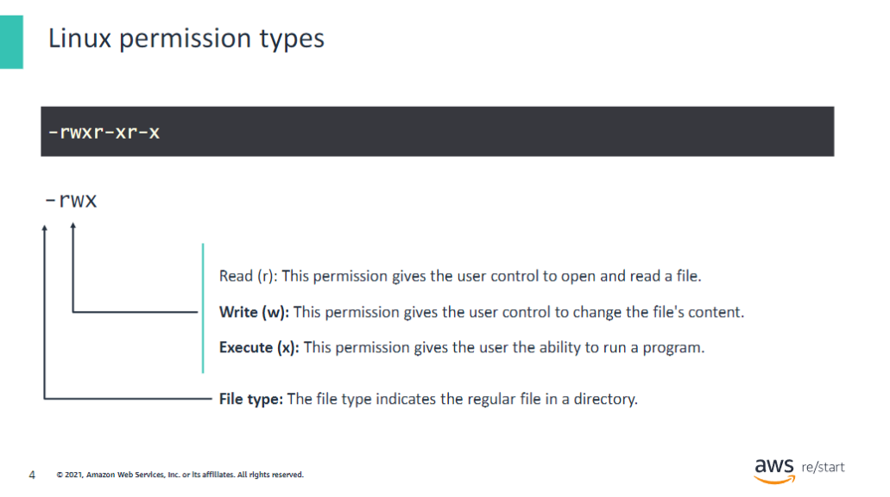

In Linux, the term **permissions** refers to how someone can use a file or directory. Files and directories in a Linux system have the following three permissions:

- **Read**: The read permission allows opening and reading a file. For example, having read permission on a directory allows printing out the file's content.
- **Write**: The write permission allows changing the file's content. For example, having write permission on a directory allows adding, removing, and renaming files stored in the directory. A user might have write permission on a file within a directory but not on the directory itself. In that case, the user can change the file contents but cannot rename or remove the file from the directory.
- **Execute**: This permission is required in Linux to run a program. Without execute permission, a user can view or modify the program code (if read and write permissions are set), but cannot execute it.

#### Permission modes

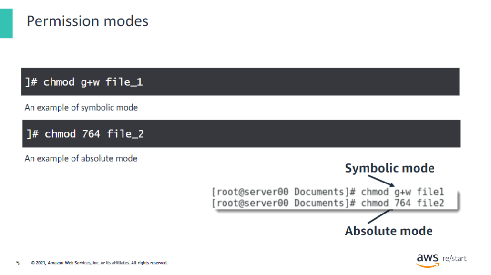

Linux uses two modes to configure permissions. You must be able to interpret and use both modes, though you might prefer one over the other.

The two modes are:

- **Absolute mode**: Uses numbers to represent file permissions. This mode is the most commonly used to set permissions.
- **Symbolic mode**: Uses a combination of letters and symbols to add permissions or to remove any set permissions.

Note: With the `chmod` command, the user can change the permissions on a file. You must be a superuser or the owner of a file or directory to change its permissions.

#### Using the `ls -l` command to view permissions

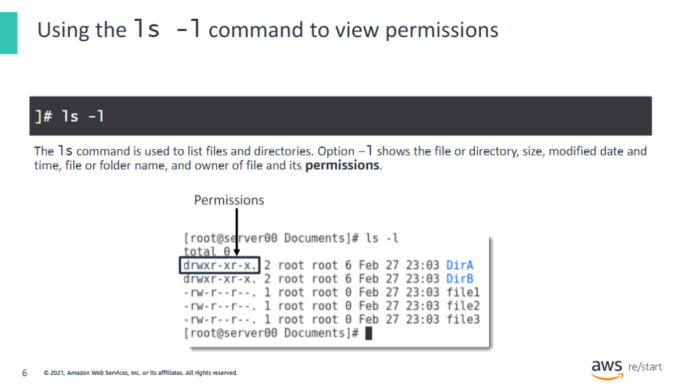

The `ls -l` command is used to print out (view) detailed information about a file or directory's permissions. The option `-l` displays the file or directory's size, modified date and time, file or folder name, owner of the file, and its permissions.

When this command is used, you will see a list of various essential file attributes that include information about file permissions.

#### Understanding the differences

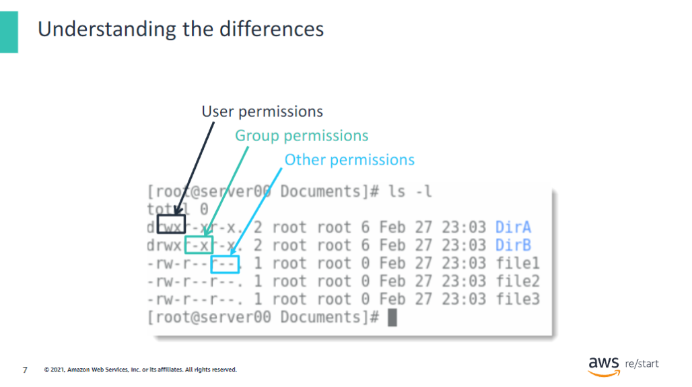

Files and directories in a Linux system assign three types of ownership. The three ownership types are as follows:

**Note**: A user is the owner of the file. Every file in the system belongs to precisely one user name, which is also called the file owner.

- **User**: A user can create a new file or directory. The file's ownership is set to the user ID of the user who created the file.
- **Group**: A user group can contain multiple users. Users who belong to that group will have the same Linux group permissions to access the file. Every file is also associated with one group name, which is called the group owner.
- **Other**: Other ownership means that the user did not create the file and does not belong to a user group that could own the file.

In the following few slides, you will look at permissions in Linux.

#### User or owner identity

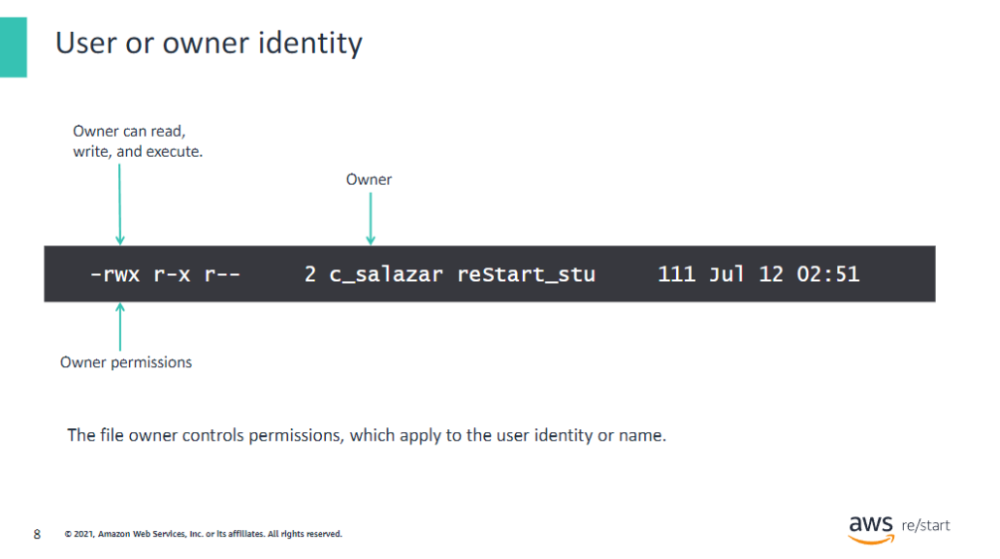

The owner of the file is displayed to the right of where the permissions are displayed. The file owner controls permissions, and the permissions are set for the owner and apply to that user identity or name.

## Working with Linux Commands
