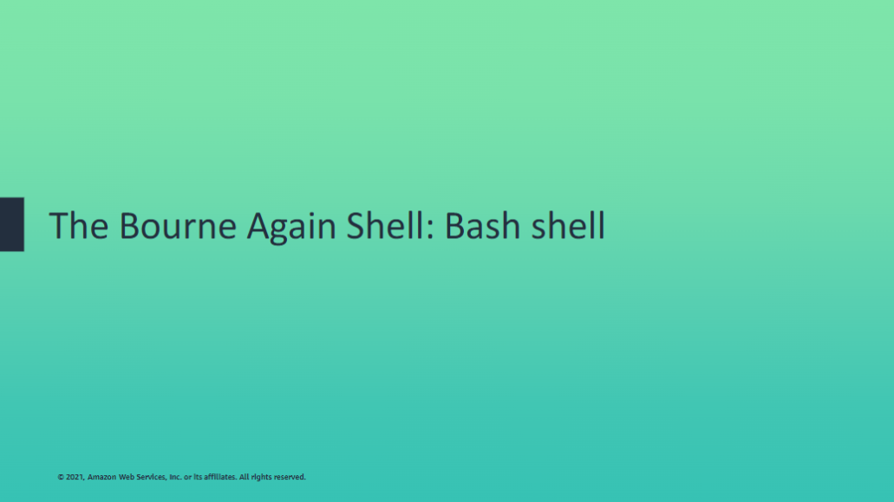

You will learn how to:

- Describe features of the Bash shell
- Explain how to display shell variables
- Explain how environment variables are used
- Describe the value of the alias command

## The Linux Shell

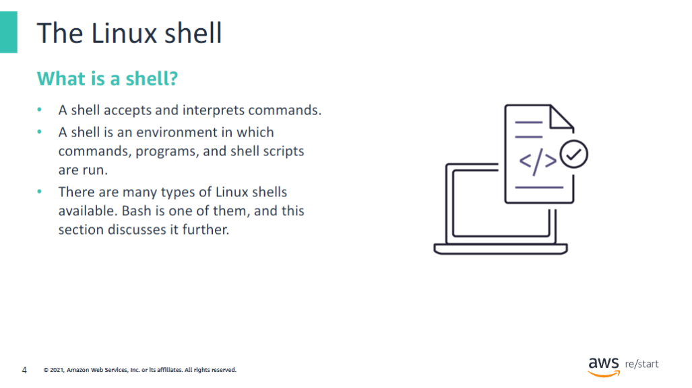

### What is a shell?

The primary purpose of a shell is to allow the user to interact with the computer operating system. It has two different functions: 

- **Program:** As a program, the shell provides the interface for utilities and programs.
- **Command Interpreter:** As a command interpreter, the shell accepts and interprets the commands you enter into the command line interface (CLI) or terminal.

## The Bourne Again Shell: Bash

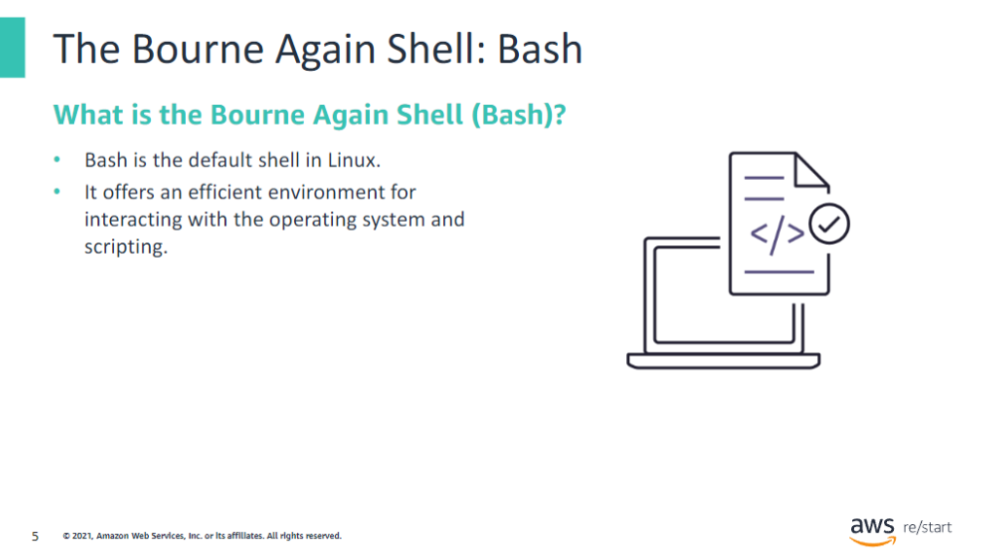

### What is Bash?

Bash is a programming language for running commands. Bash is the default shell in Linux operating systems. It is widely used, so some familiarity with Bash is expected in many systems or development roles.

## Shell variables

This section explains what Bash shell variables are, how to name them,what the rules are for writing them, and how to assign a value to them.

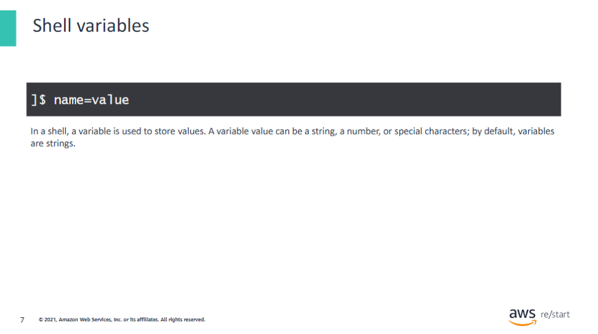

In a shell, a variable is used to store values. Variables can be a name, a number, or special characters; by default, variables are strings. Variables are character strings to which you can assign a value; a value can be assigned as a number, text, file name, device, or other data type. Variables are a symbolic label for a portion of memory used to assign values and read and manipulate contents. 

Scripts or other commands can call shell variables. The values that these shell variables represent are then substituted into the script or command. The next slide provides a few shell syntax rules for creating variables; you will look at these rules.

### Syntax rules: Variable syntax structure

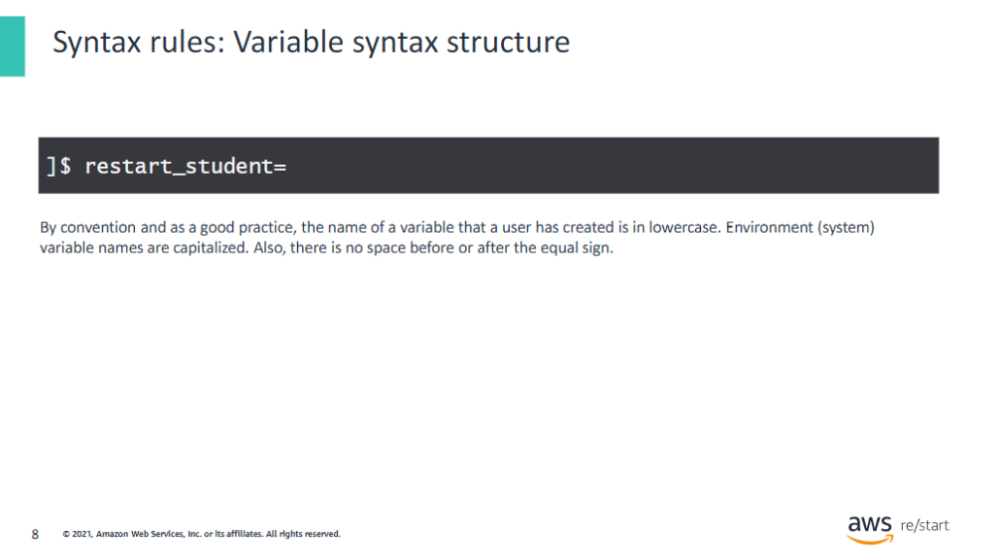

There are rules for defining or creating variables in the shell. When defining a variable:

- The variable name must be prefixed with the dollar ($) symbol.
- The variable must contain no spaces or special characters within the variable name.
- A variable name can contain only letters (a to z or A to Z), numbers (0 to 9), or the underscore character (_), and they are usually capitalized (e.g. VARIABLE).

### Syntax rules: Naming variables

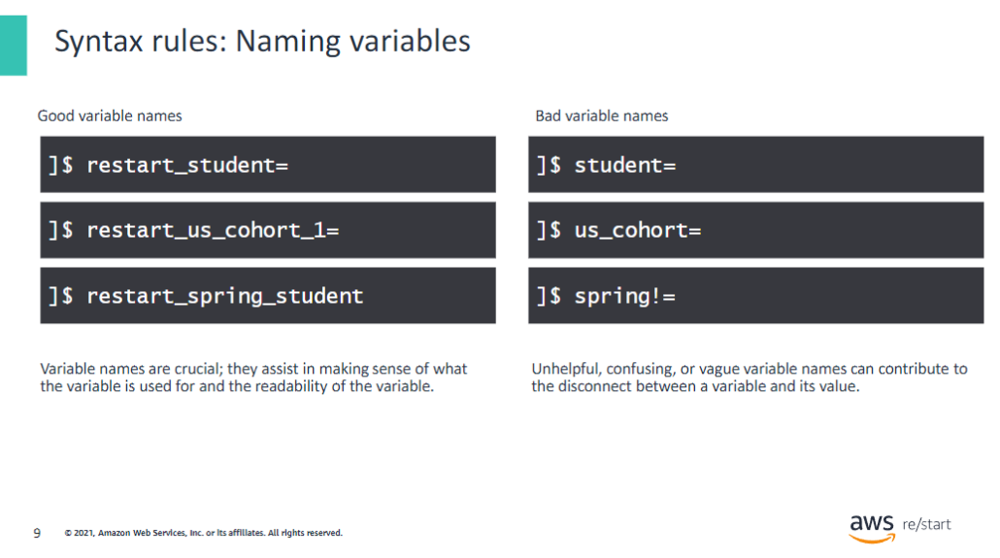

Naming variables in Bash can be difficult, but if you name variables properly, it is useful.  Good variable names are crucial; they assist in making sense of what the variable is used for and the readability of the variable. It is good practice to be consistent in your naming pattern. Unhelpful, confusing, or vague variable names can contribute to the disconnect between a variable and its value.

The variablenameson thisslideare examples ofafew good and a few bad variable names.

### Assigning a value to a variable

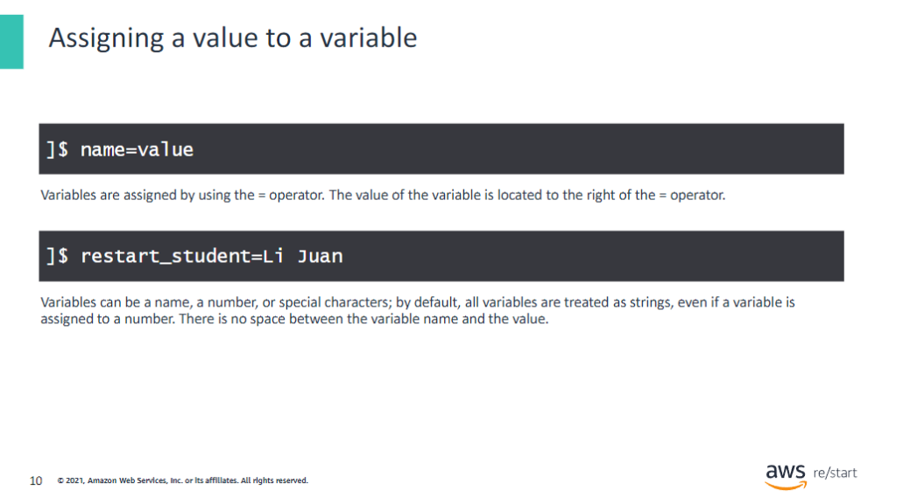

A value can be assigned as a number, text, file name, device, or other data type.

Again, as discussed earlier, a variable is used to store values. Variables can be a name, a number, or special characters; by default, all variables are treated as strings, even if avariableis assigned to a number. Variables are assigned by using the = operator. There is no space between the variable name and the value.

### Displaying shell variables

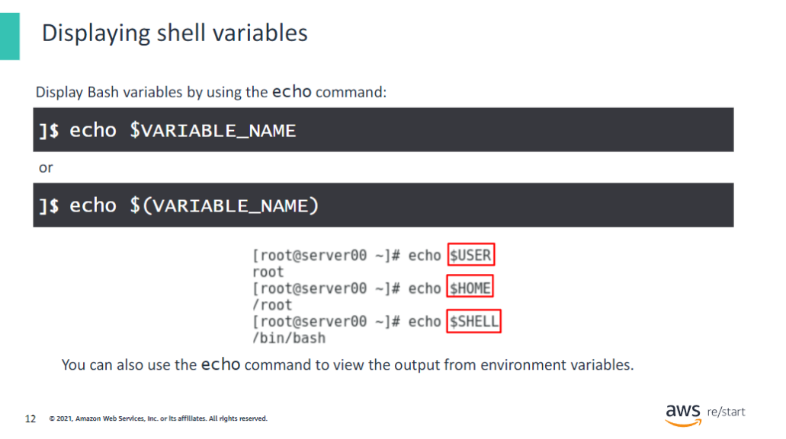

To display the value of a variable, use the echo $VARIABLE_NAME. Also use the echocommand to view the output from environmentvariables or system-wide variables.

## Environment variables

Environment variables are structurally the same as shell variables; they are no different from each other. Both use the key-value pair, and they are separated by the equal (=) sign.

Environment variables are systemwide, and all child processes and shells inherit them. With environment variables, you can pass information about the current operating environment to a program running. Finally, applications and daemons referenceenvironment variables as needed.

### Common environment variables

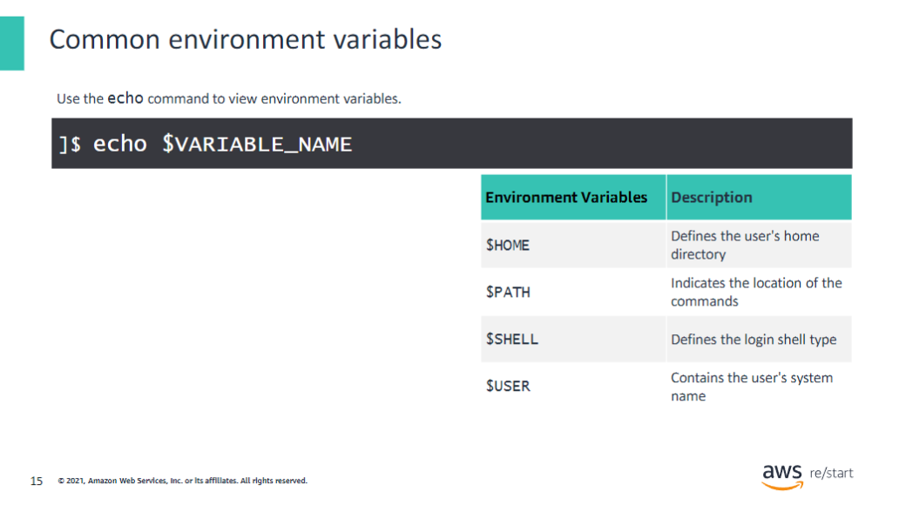

The table on this slide displays a list of a few common environment variables you may encounter when using Linux.

### Common environment variables: $HOME

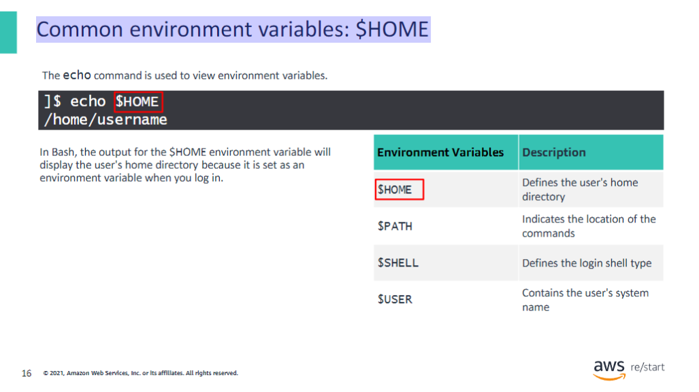

In Bash, for example, the output for the `$HOME` environment variable will display the user's home directory.

### Common environment variables: $PATH

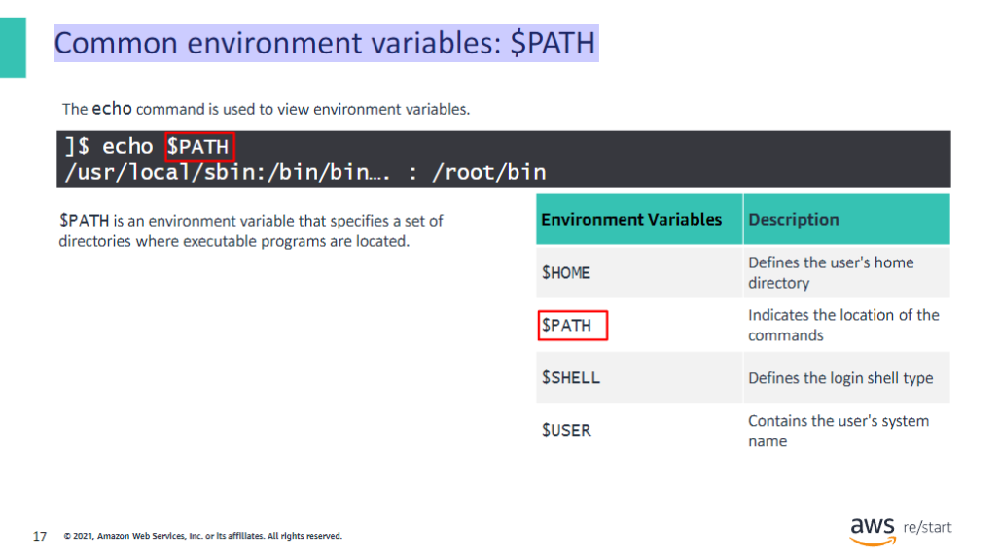

`$PATH` is anenvironment variablethat specifies a set ofdirectorieswhere executable programs are located. In general, each runningprocessoruser sessionhas its own PATH setting.

## The `env` command

The env command is a shell command for Linux. You use this command to print a list of environment variables or run another utility in an altered environment.

### The initialization process for Bash environment files

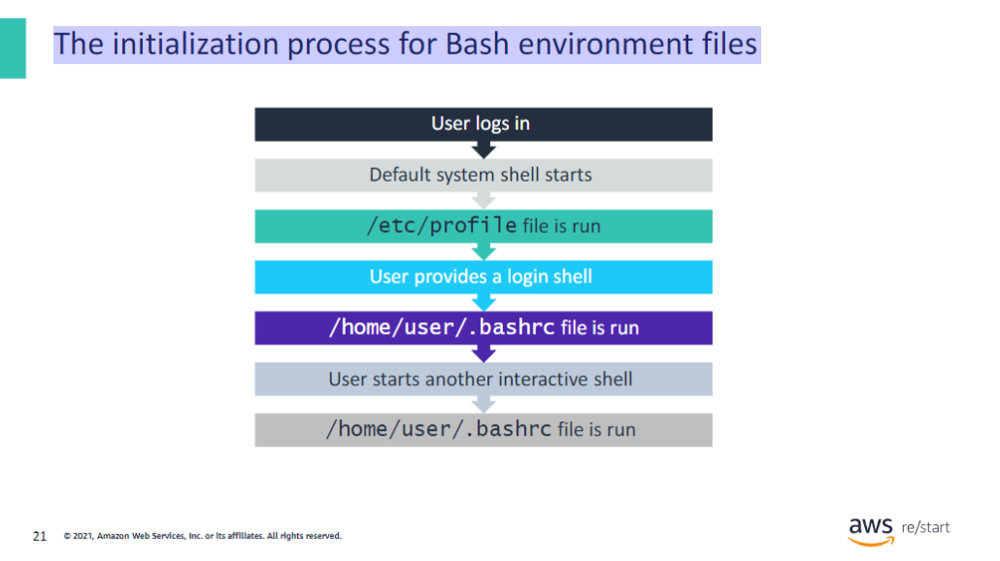

During the initialization process of Bash environment files, two different initialization shell files are invoked.

- The `/etc/profile` file contains system-wide environment configurations and startup scripts for login setup. The command line prompt is set within this file. All configurations that you want to apply to all system users’ environments should be added to this file. When you log in, Bash reads the `/etc/profile` instructions. The `/etc/profile` file usually sets the shell variables `PATH`, `USER`, `HOSTNAME`, etc.
  
- The `/etc/bashrc` file contains system-wide functions and aliases, including other configurations that apply to all system users.

## Aliases

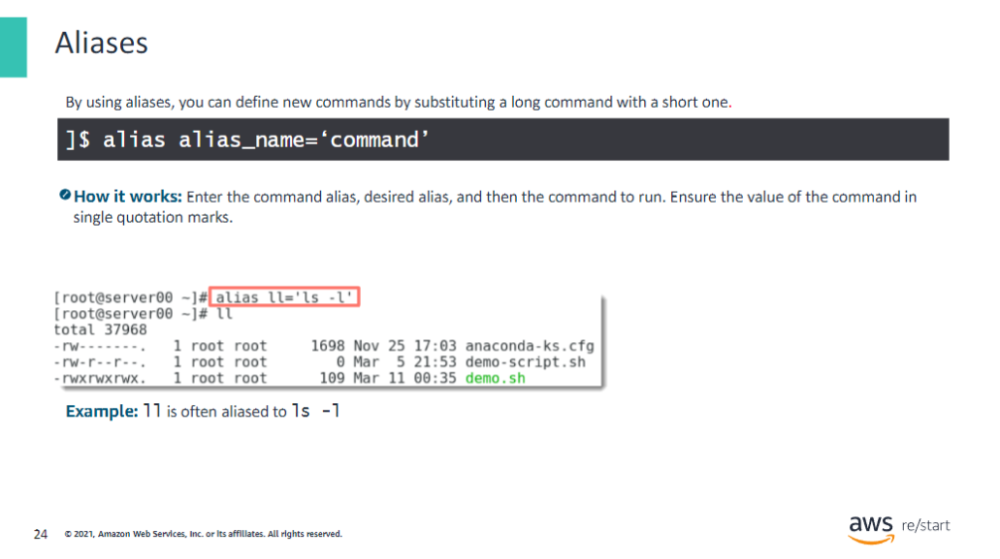

By using aliases, you can define new commands by substituting a long command with a short one. Aliases can be set temporarily in the current shell, but it is more common to set them in the user's `.bashrc` file so that they are permanent. In the example, `ll` is often substituted or aliased to `ls –l`.

Extra: In many distributions, you can create an alias of destructive commands—such as `rm`, `cp`, and `mv`—with the `-i` interactive option.

## The `unalias` command

The unalias command removes the configured alias if it is not configured in the .bashrc file.

In the example, the unalias command is used to remove the new alias that was created earlier.

### Add an alias to the `.bashrc` file

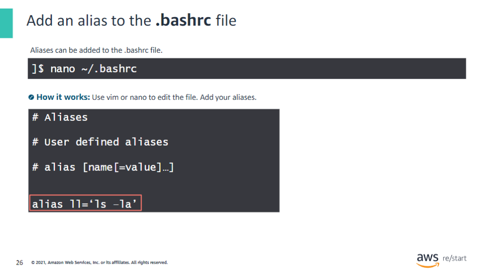

The `.bashrc` file is stored in the home directory of each user. As mentioned earlier,the .bashrc file is used to store configurations specific to the user. When creating analias, remember that after you create it, the aliasisapplied to the .bashrc file.

## Checkpoints questions

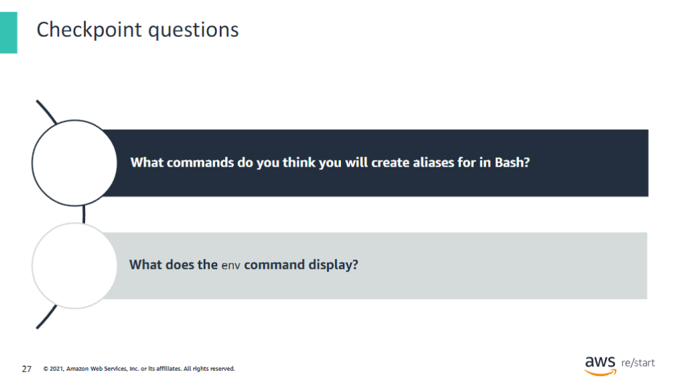

1. Some commands used for aliases (other than the commands that were listed previously) include those that return the following:
   - The name of the user who is running the application
   - A user’s preferences when they play a game (for example, sound and music levels)
   - A value that is commonly used when running calculations (pi, the fixed cost of a product)

2. The `env` command displays the environment variable. You use this command to display your current environment.

## Key Takeaways

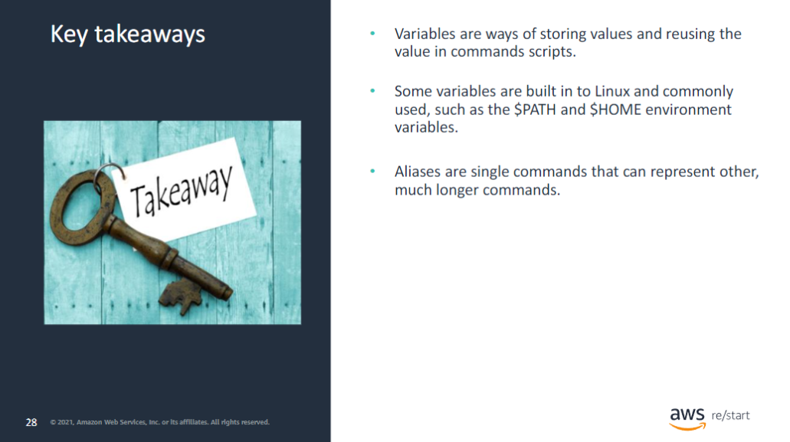

Key takeaways include the following:

- Variables are ways of storing values and reusing the value in commands scripts.
- Some variables are built-in to Linux and commonly used, such as the `$PATH` and `$HOME` environment variables.
- Aliases are single commands that can represent other, much longer commands.
