In this module, you will learn how to:

- Describe common tasks that are accomplished through shell scripts
- Describe basic commands that are frequently included in shell scripts
- Describe basic logical control statements that are frequently included in shell scripts
- Run a shell script

## What are scripts

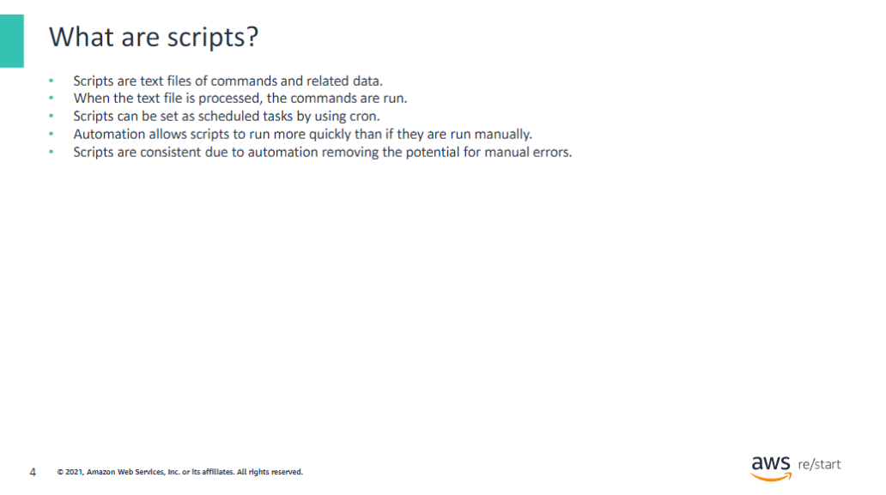

Common script tasks:

- Creating backup jobs
- Archiving log files
- Configuring systems and services
- Simplifying repetitive tasks
- Automating tasks

### Example Script

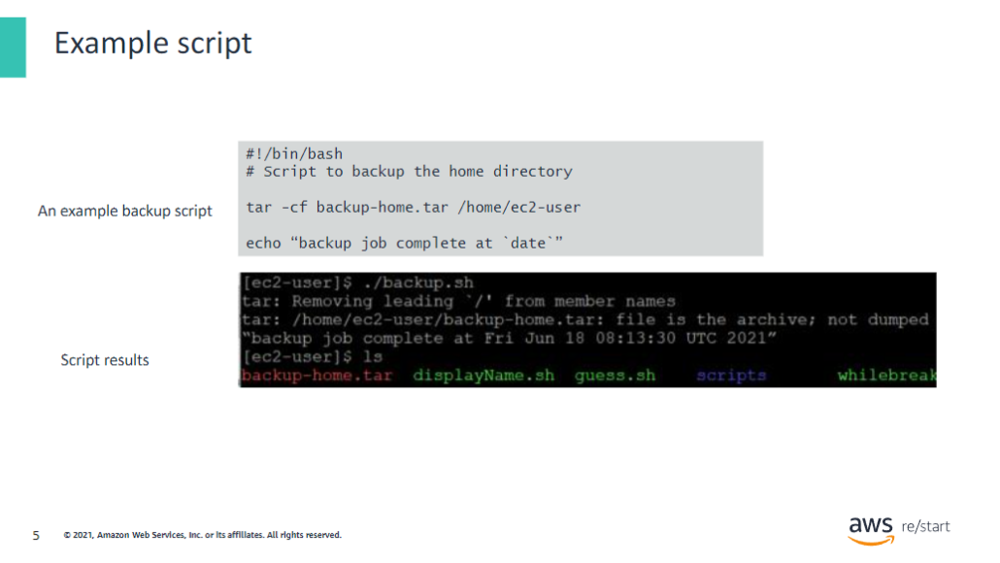

This script creates a tar archive with the content of the folder /home/ec2-user.

## Shell Scripts

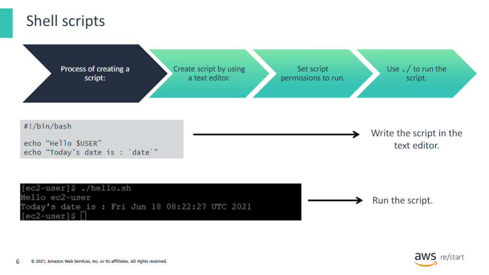

The process of creating a script follows these steps:

1. Create the script using a text editor.
2. Set the script permissions to run.
3. Use `./` to run the script.

## Amazon EC2 user data script

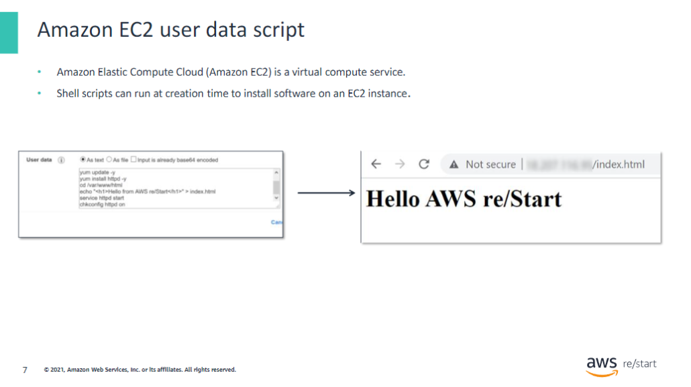

This screencaptureis an example of a user shell script that runs when the EC2 instance is created.

An HTTP web server is installed and run.

A basic HTML page is created.

The web server can be accessed via the public IP address of the EC2 instance.

## Basic scripting syntax


## The `#` character

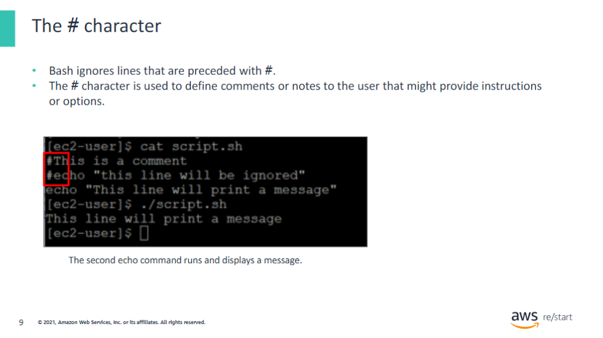

Only the second echo command runs and displays a message.

### `#!/bin/bash` and `#comments`

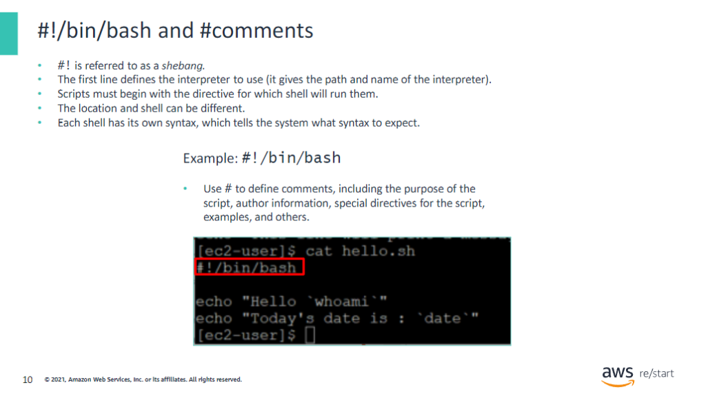

If the first line does not define the interpreter, the operating system will find one, usually the one defined for the current shell.

## Script documentation

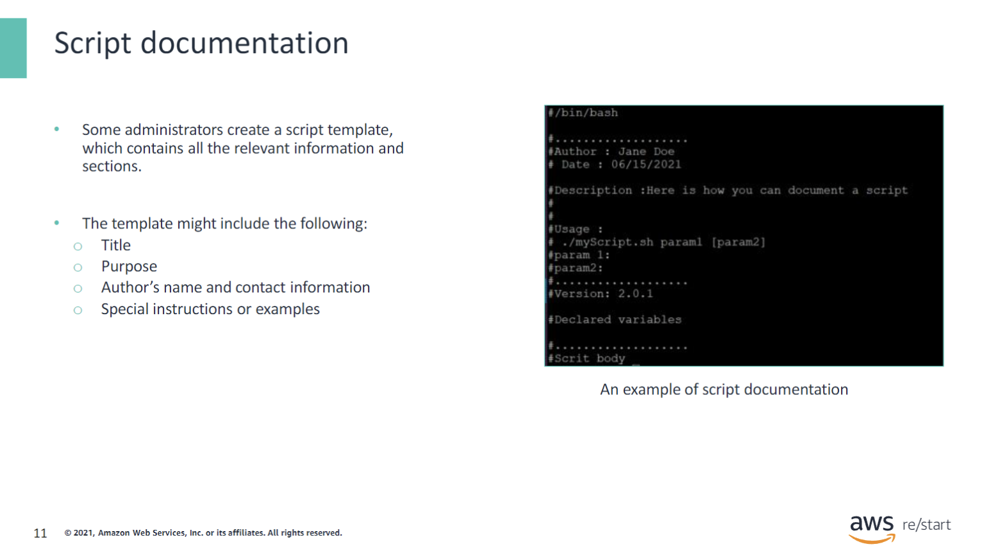

There is no exact format definition that scripts should follow.

## Declare a Bash variable

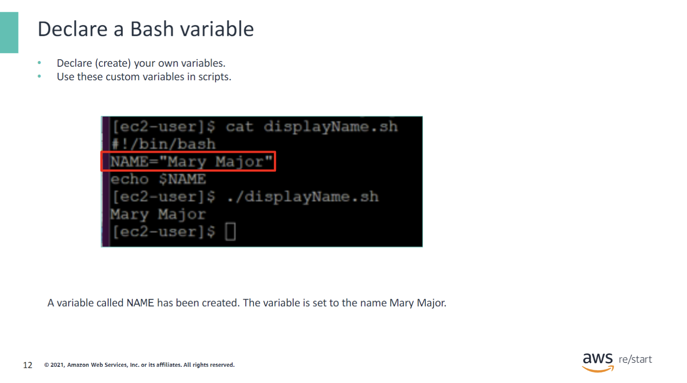

In the example, a variable NAMEhas been created.

## Useful commands

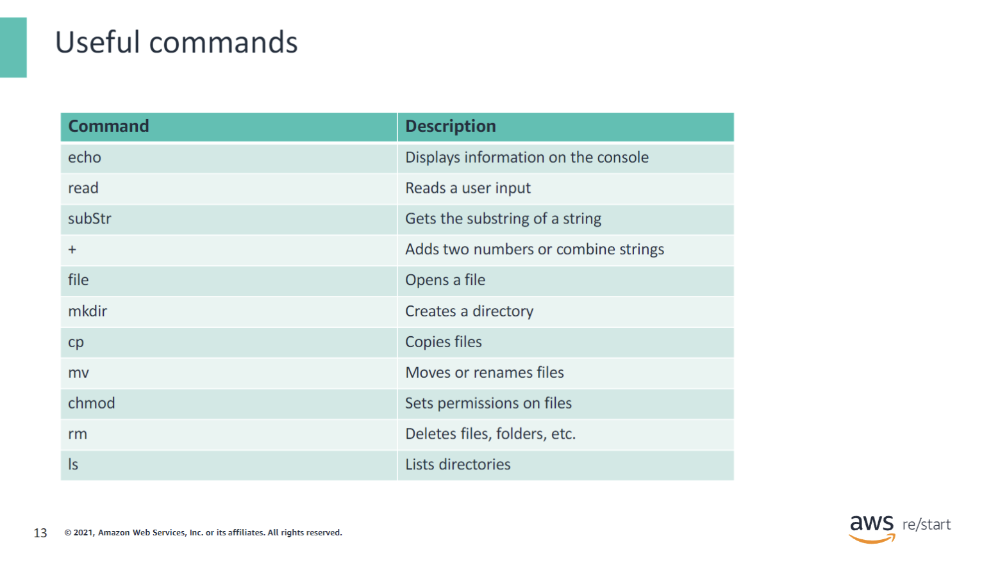

This table lists the most useful commands that you can use in a script. You can use all the shell commands that you saw earlier in the course, such as `grep`, `touch`, and redirectors (`>`, `>>`, `<`, `<<`). You can also use shell scripting to create programs using statements such as `if`, `else if`, `for`, `while`, `case`, and create functions using the `function` keyword.

### Demonstration: Declaring a Variable in a Script

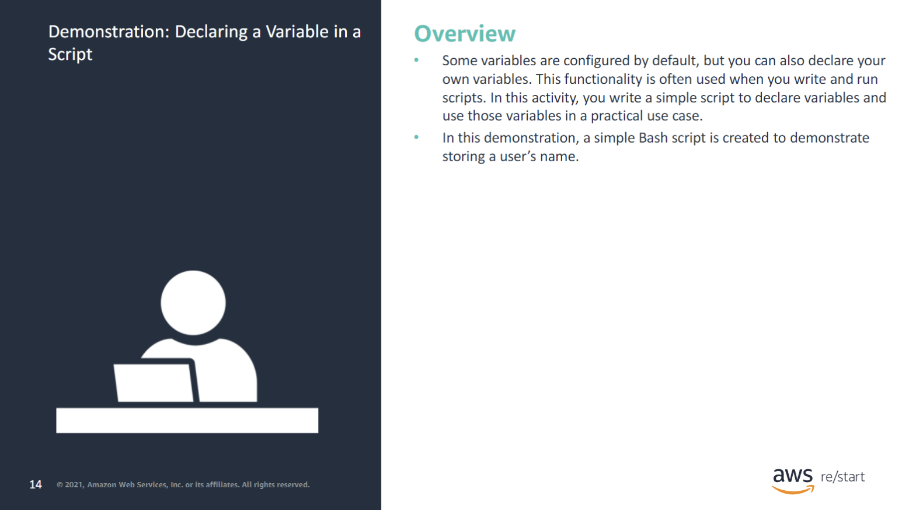

1. For this demonstration, create a file and enter the following text:

   ```bash
   #!/bin/bash
   echo "What is your name?"
   read name
   echo "Hello $name"

2. As soon as you finish, save the file and run the following command (for this example, the file is named getname.sh):

    ```bash
    #!/bin/bash
    chmod +x getname.sh

3. Run the script by entering the following (for this example, the file is named getname.sh):

    ```bash
    #!/bin/bash
    ./getname.sh

## Operators

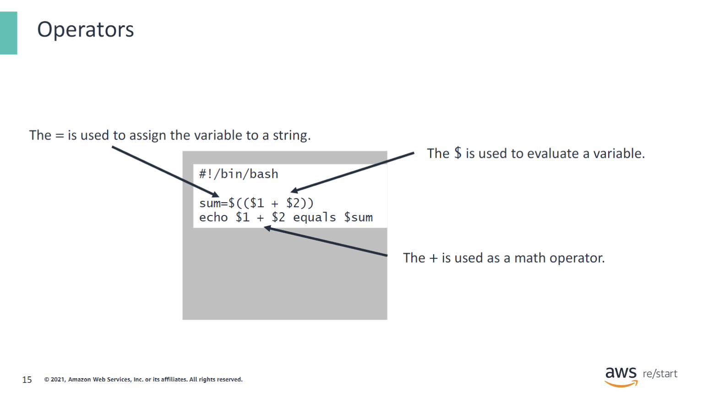

$1 and $2 are the parameters passed to the scripts. You can also use the + operator to concatenate string.

## Arguments

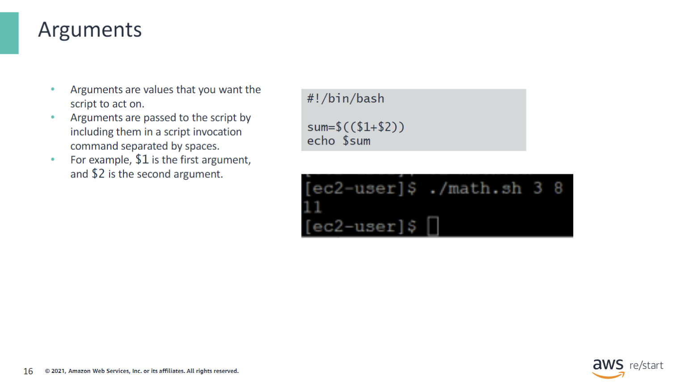

In this example, the arguments input by the user are 3 and 8. Therefore, $1 is equal to 3 and $2 is equal to 8.

## Expressions

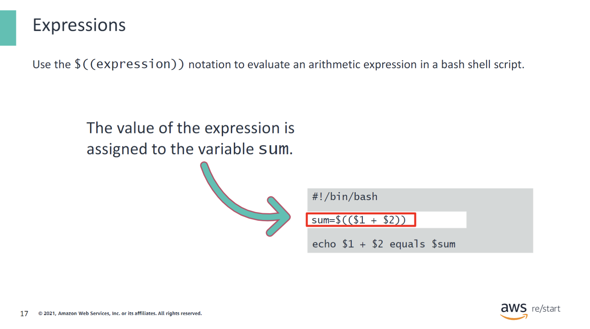

Expressions are evaluated and usually assigned to a variable for reference later in the script. In this example, the script:

1. Evaluates the sum of the first two arguments passed to the script.
2. Assigns the result to the `sum` variable.
3. Echoes a message showing the value of the arguments and their computed sum.

## Conditional Statements

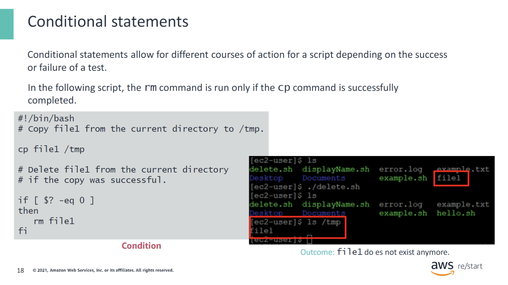

A conditional statement runs a command or block of commands only if a specified condition is satisfied. In the example shown, a script named `delete.sh` copies a file named `file1` from the current directory to the `/tmp` directory. If the copy command is successful, the script deletes the original file from the current directory.

Notice how the script uses the special variable `$?` to test whether the copy command was successful or not. This variable contains a value that represents the exit status code of the last command that was run. If the command was successful, the return value is 0; otherwise, the return value is 1.

## Logical control statements


The section focuses on basic logical control statements that are frequently included in shell scripts, such as if, if-else, if-elif-else, and test.

## The `if` statement

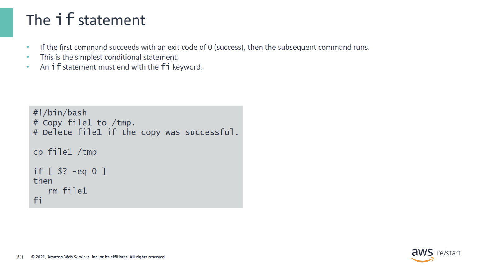

An if statement is written as follows:

```bash
if <condition>; then
    <command>
fi
```

Or, if writing everything in one line:

```bash
if <condition>; then <command>; fi
```

Note that the semicolon (;) is required to separate multiple commands on the same line. Indentation is used for better readability but is not required.

## The `if - else` statement

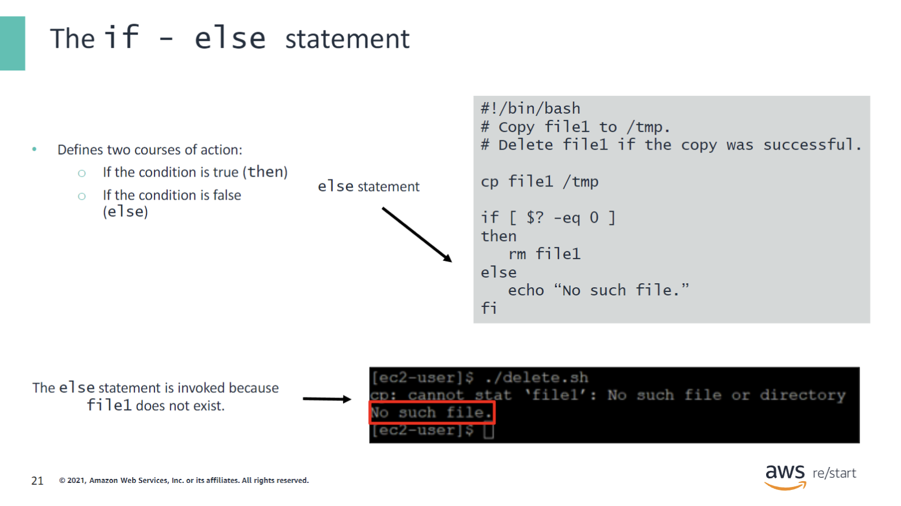

An if-else statement is written as follows:

```bash
if <condition>; then
    <command>
else
    <other_command>
fi
```

## The `if - elif - else` statement


The example compares two numbers passed as parameters to the script:

- `-gt` means greater than
- `-lt` means less than

An if-elif-else statement is written as follows:

```bash
if <condition>; then
    <command>
elif <other_condition>; then
    <other_command>
else
    <default_command>
fi
```

- You can embed `if-elif-else` statements.
- You can access all local objects of its immediately enclosing function and also of any function or functions that enclose that function.
- Nesting is theoretically possible to unlimited depth.

## The `test` command

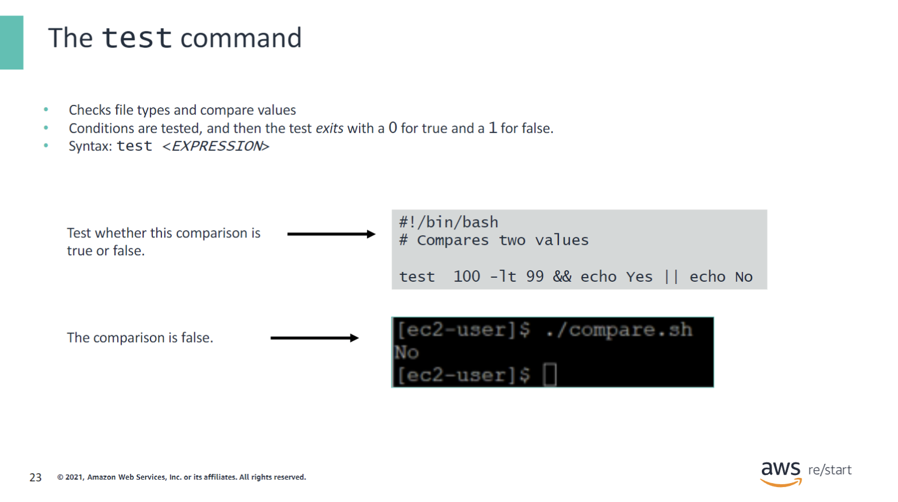

You use the test command to compare values.

## Integer comparison operators

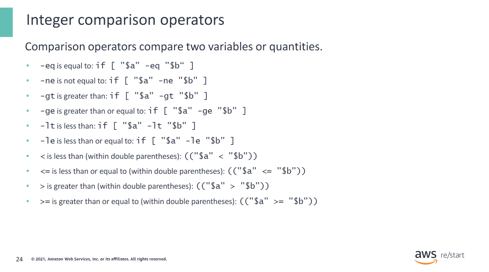

In these examples, you can see that brackets or double parentheses surround the condition.

- `((` are for numerical comparison:
  - `(( $a < $b ))` is equivalent to `[ $a -lt $b ]`

- You will also see some conditions using double brackets:
  - `if [[ $a -lt $b ]]`
  - This is basically a notation equivalent to a simple bracket with enhanced features, but this goes beyond this course.

- Note also that quotation marks are not mandatory:
  - `if [ "$a" -lt "$b" ]` is equivalent to `if [ $a -lt $b ]`

### Integer comparison operators examples

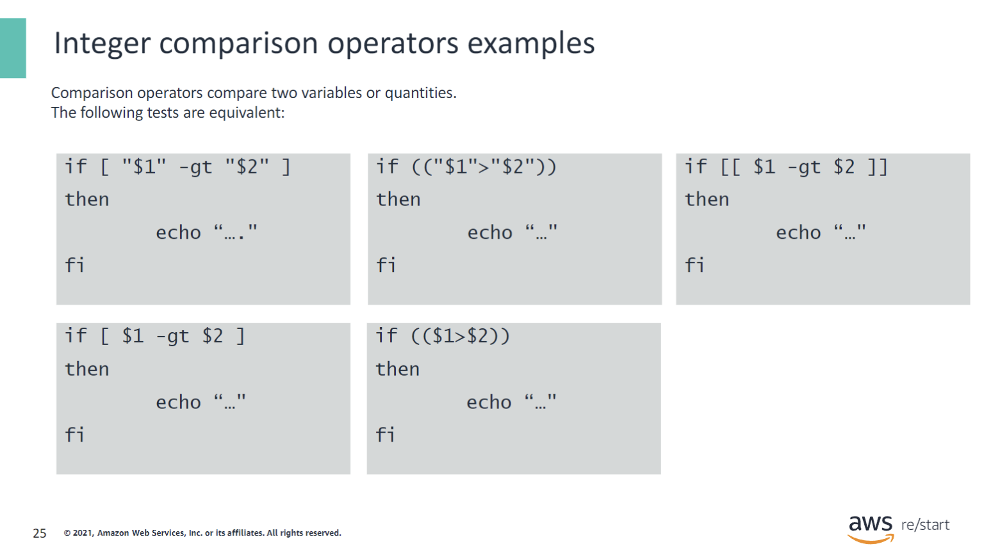

- Double quotes are not mandatory:
  - `if [ "$a" -lt "$b" ]` is equivalent to `if [ $a -lt $b ]`

- The semicolon (;) is mandatory only if the clauses of the if statement are written in the same line:
  - `if [ $a -lt $b ]; then ...; else ...; fi`

## String comparison operators

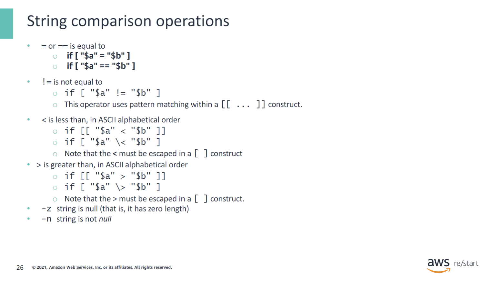

Familiarize yourself with these string comparison operations. In the examples shown, $a and $b represent string variables.

### String comparison operators example

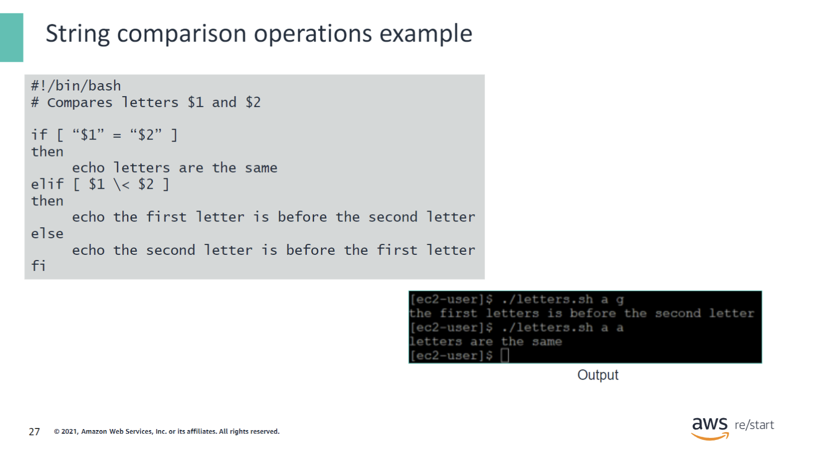

In a Bash shell script, the $1 and $2 variables contain the values of the first and second parameters passed to the script at runtime, respectively.

## Loop Statements

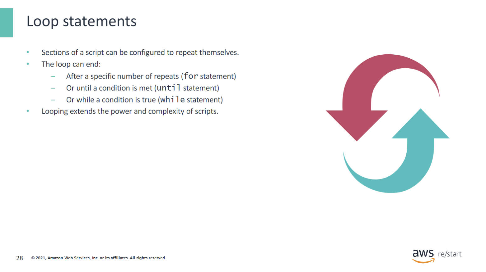

Loops provide you the ability to repeat sections of a script.

Loops can end:

- After a specific number of repeats (`for` statement)
- Until a condition is met (`until` statement)
- While a condition is true (`while` statement)

### The `for` statement

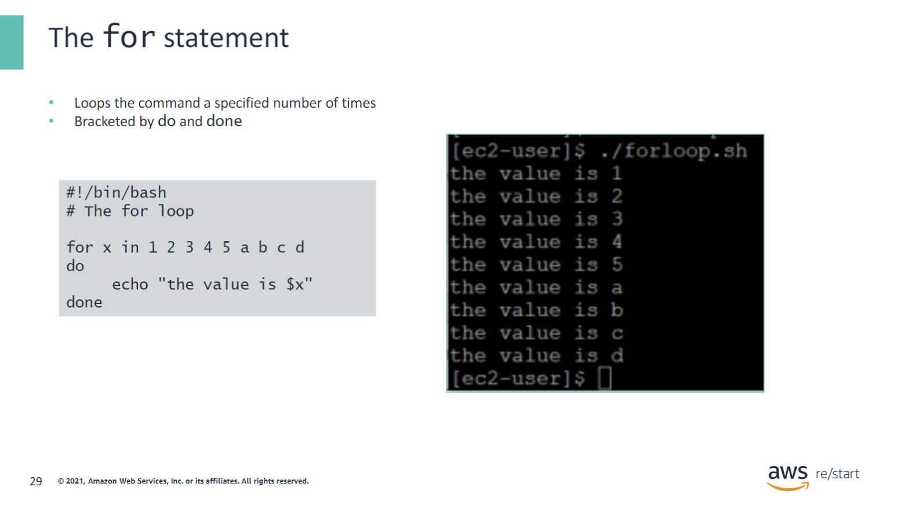

To loop a command a specific number of times, use the for statement.

### The `while` statement

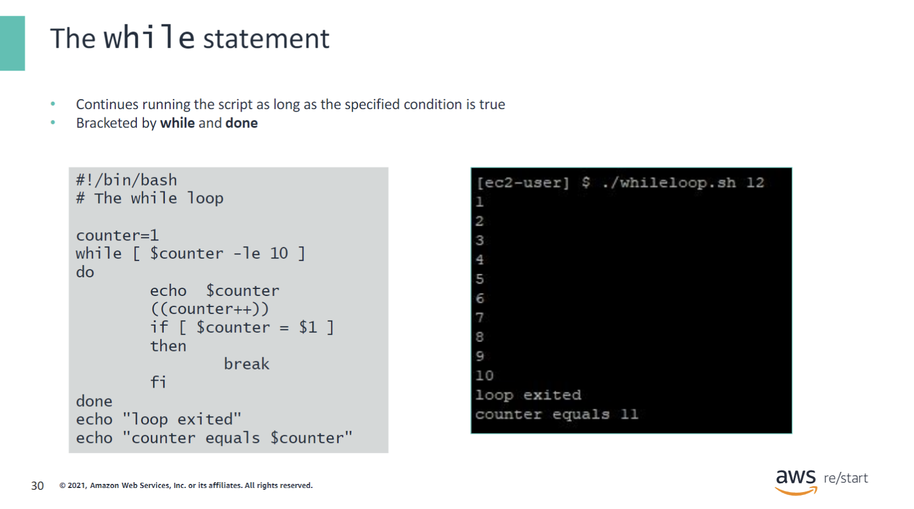

In this example, the while loop runs as long as the counter is lower or equal to 10, and the counter is not equal to the value of the first parameter passed to the script.

The body of the loop:

- Displays the value of the counter.
- Increments the counter by 1 (counter++ means counter = counter+1).
- Tests if the counter is equal to the first parameter value and breaks (exits) the loop if this is true.

### The `until` statement

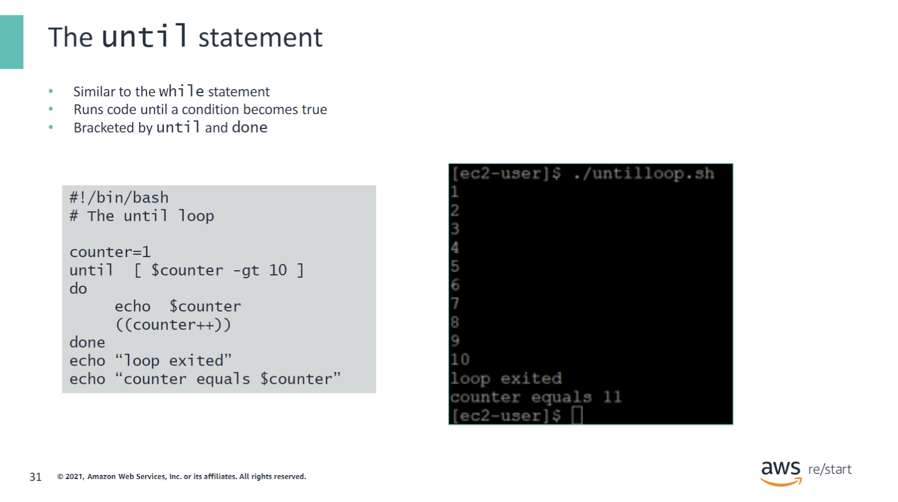

The until loop works the same way as the while loop. In the example, the loop loops until the counter reaches 10 and then exits.

### Loop control statement: Break

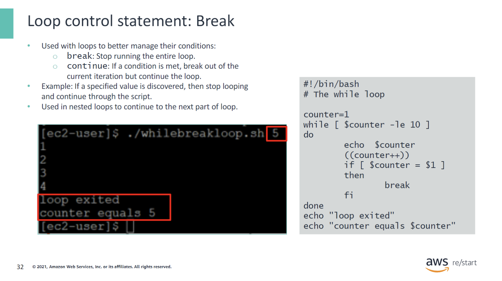

In this example, the while loop exits before the condition of the loop is met because the counter reaches the value passed as a parameter. Specifically:

- The parameter ($1) is 5.
- The `if` condition is met when counter = 5.
- When this condition is true, the `break` statement is run, and the loop exits.

### Loop control statement: Continue

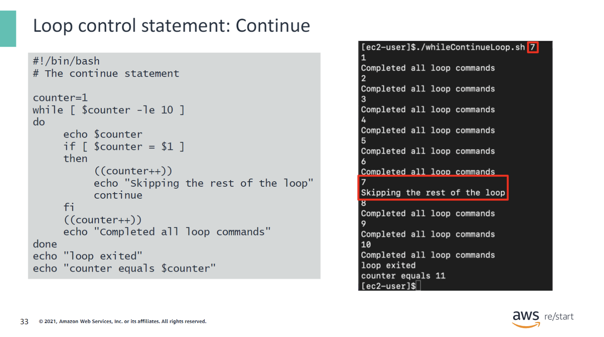

The `continue` keyword terminates the current loop iteration and returns control back to the top of the loop.

In the example, the bottom part of the loop is skipped when the counter is equal to 7. Specifically:

- The parameter is 7.
- The `if` condition is met when counter = 7.
- When this condition is true, the `continue` statement is run, and the rest of the loop is skipped.
- The loop keeps running until counter = 11 (original while condition).

## The `read` command

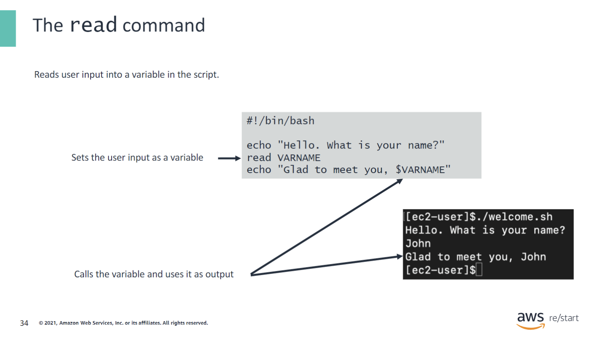

Read incorporates the user’s input as a variable into a script.

## The `true` and `false` command

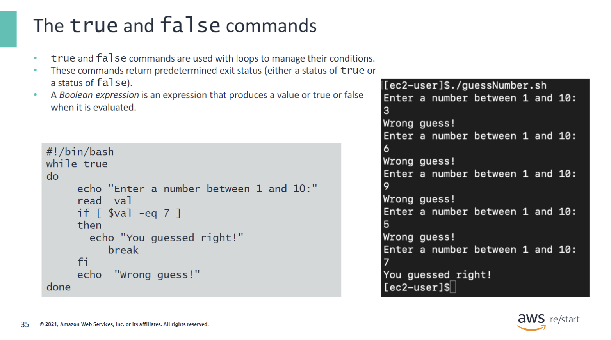

In the example, a `while` statement with a `true` condition creates a continual loop that asks the user to enter a value between 1 and 10. If the user does not enter the value of 7, the loop continues; otherwise, the loop exits using a `break` statement.

## The `exit` command

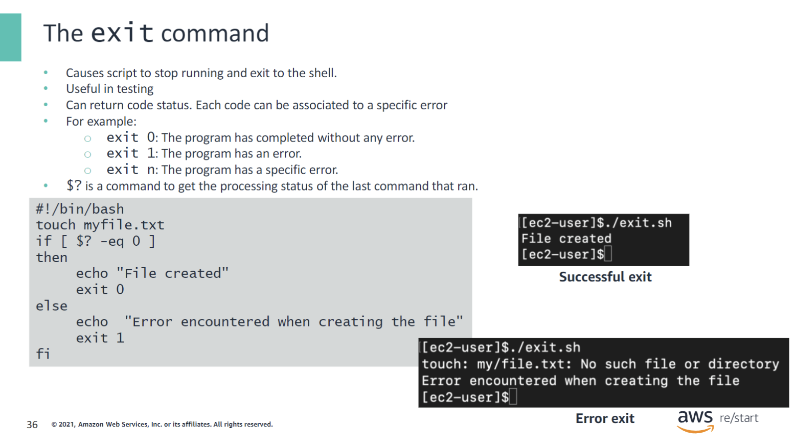

This script creates a file using the `touch` command. It tests the status code of the `touch` command and exits accordingly. The slide shows the output of a successful exit and of an error exit. The error exit is caused by running the script with an invalid file name in the `touch` command. In this case, the name included an invalid forward slash character.

### Command substitution (review)

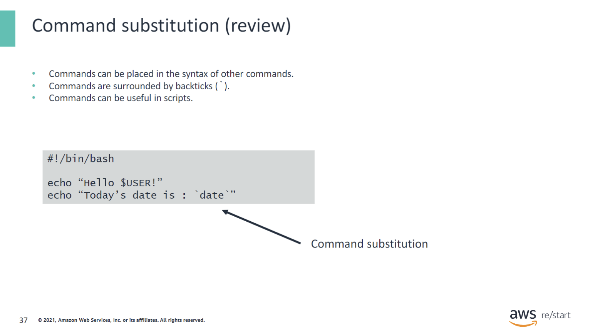

Command substitutions are useful in scripts.

## Run a shell script


### Script permissions (review)

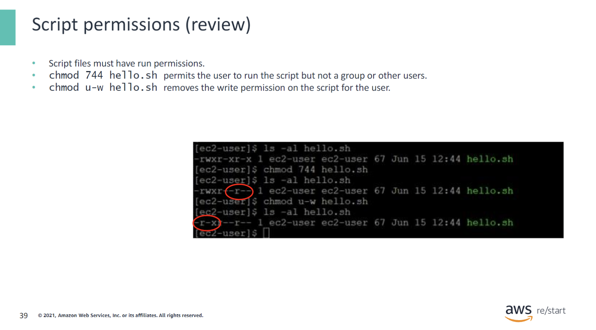

`chmod 744` is:

- Read (r) for the owner, the group of the owner, and others
- Write (w) for the owner only
- Execute (x) for the owner only
- Hence rwxr--r--

The second command, `chmod u-w`, removes the write right for the owner:
rwxr--r-- becomes r-xr--r--

### Running a script in Bash

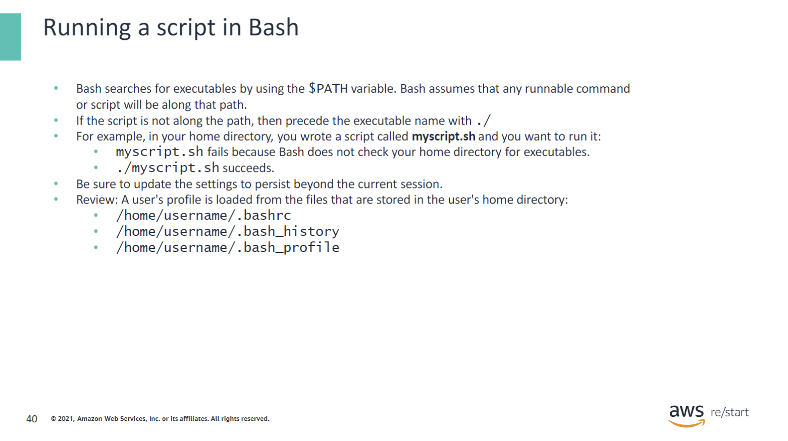

Review this information sothat when you run a script in Bash you don’t have any issues.

### Run a script and `./` (review)

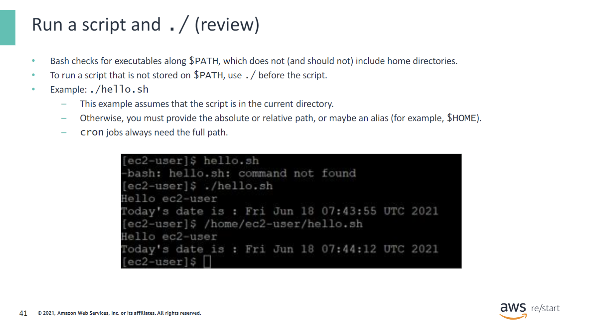

The home folder is not in `$PATH`

- `hello.sh` fails.
- `./hello.sh` succeeds because the current folder is the folder containing the script.
- Using the full path `/home/ec2-user/hello.sh` works from any folder.

## Checkpoint questions

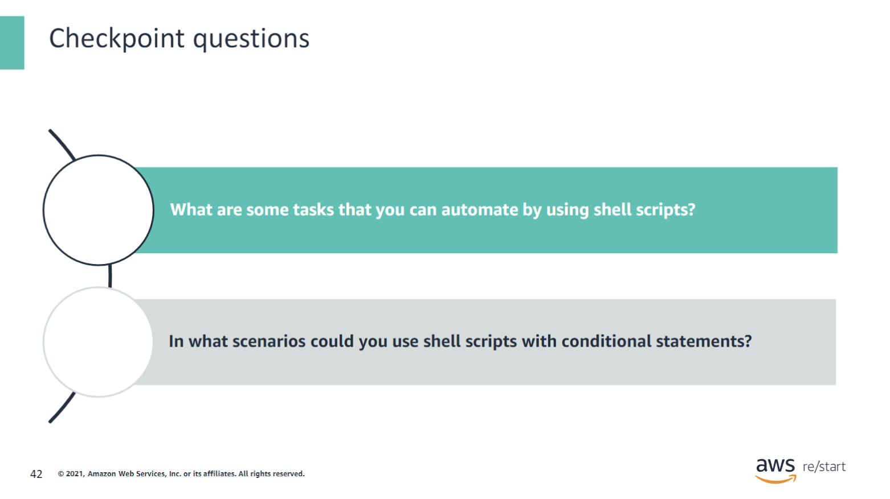

1. Some common tasks for shell scripts include:
   - Backing up important information
   - Moving files to storage locations so that only the newest files are visible
   - Finding duplicate files where thousands of files exist

2. Shell scripts with conditional statements can be used when:
   - The script asks the user a question that has only a few answer choices
   - Deciding whether the script must be run
   - Ensuring that a command ran correctly and taking action if it failed

## Key Takeaways

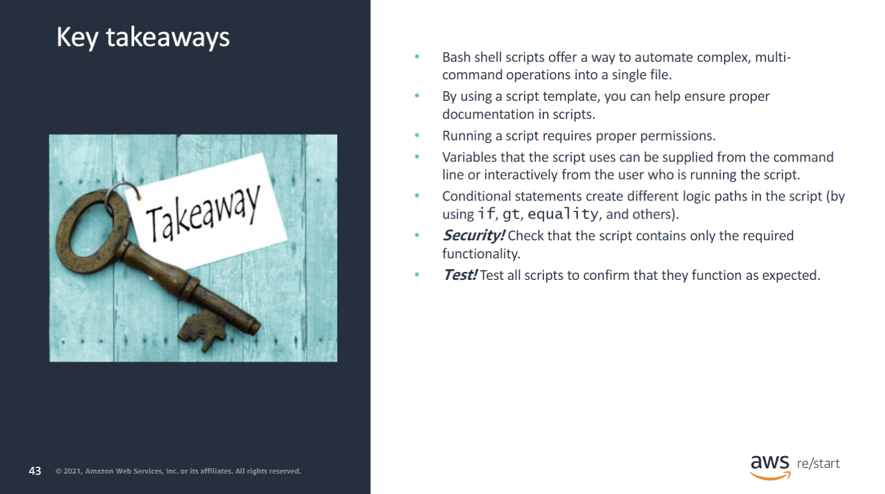

Some key takeaways from this lesson include:

- Bash shell scripts offer a way to automate complex, multi-command operations into a single file.
- By using a script template, you can help ensure proper documentation in scripts.
- Running a script requires proper permissions.
- Variables that the script uses can be supplied from the command line or interactively from the user who is running the script.
- Conditional statements create different logic paths in the script (by using `if`, `gt`, equality, and others).
- Security! Check that the script contains only the required functionality.
- Test! Test all scripts to confirm that they function as expected.
