You will learn how to:

- View and change file permissions
- Understand what the Internet is, its purpose and function for users. You will examine the history of networking through the lens of the components which make up a network.
- Compare symbolic and absolute representations of file permissions

## What is the Internet

In this section, you will understand how the internet was born.

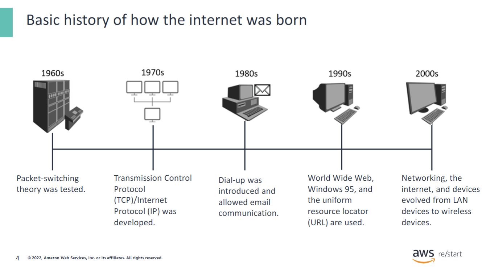

A brief history of how the internet was born:

- It all started in the 1960s. The US department of Defense Advanced Research Projects Agency (DARPA) worked on a packet-switching theory to send a message between themselves and a partner university.
- In the 1970s, Transmission Control Protocol and Internet Protocol (IP) was developed in order to link multiple networks together.
- In the 1980s, dial-up was introduced as a way to access the internet and allowed the revolutionary way to communicate across the world using email. This was possible through a local area network (LAN).
- In the 1990s, hypertext markup language (HTML) and uniform resource locator (URL) were created to visualize what is called the World Wide Web (www). In 1995 big things were happening, such as Windows 95, and large company launches that you most likely still shop on today.
- In the 2000s, the dotcom bubble had reached its end; however, this created a new wave of opportunity for technology. Networking, the internet, and the devices you use today have evolved rapidly since the start of the early 2000s. From desktops, to laptops, to tablets, technology is constantly evolving, and so is the complexity of networking to it.

## What is computer networking

In this section, you will review what a computer network is.

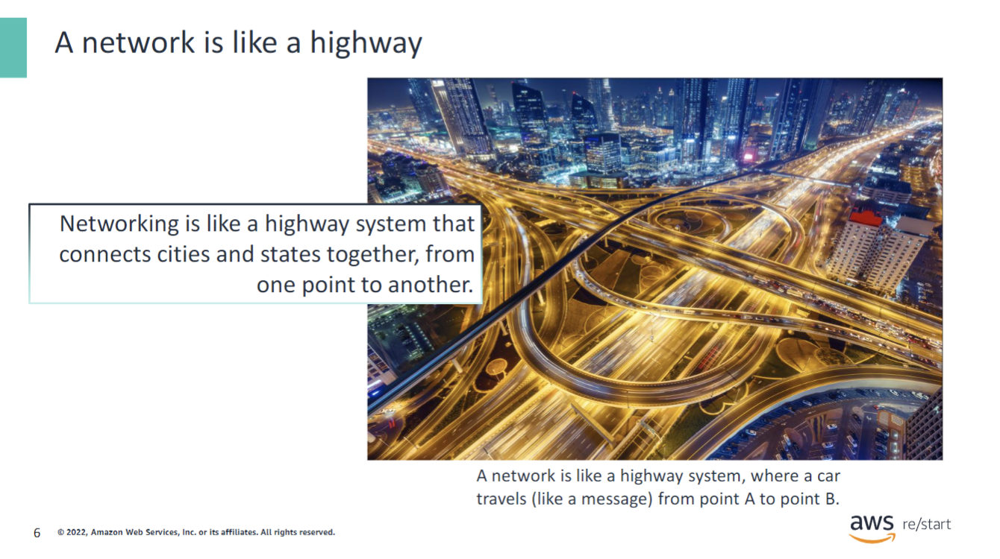

In this example, point A is your house (the client), and point B is the grocery store (website). In this example, in order to get to point A to point B, you would get in some type of transportation (send a request) to go to the store to buy what you need. To get there, transportation takes a series of roads (networks) to get to point B.

### What is computer networking ?

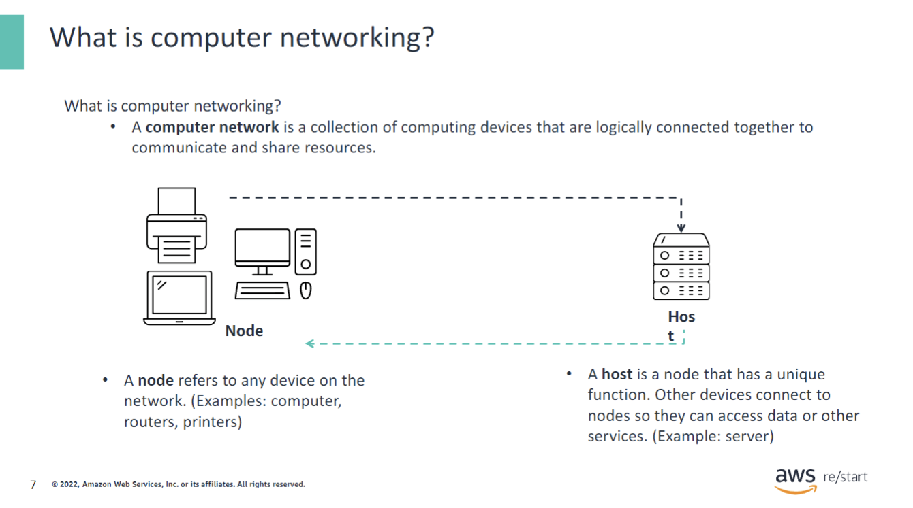

What is computer networking?

- It’s a collection of computing devices that are logically connected together to communicate and share resources.
- An example is like an interstate highway system that connects cities and states together from one point to another. Like networking, it made it possible to be connected in a faster and easier way.

How does it work at a basic level?

- It has a node. A node is like a computer, router, switches, modems, and printers, which are connected through links (a way for data to transmit, such as cables), that follow rules to send and receive data.
- It has a host. A host is a node that has a unique function. Other devices connect to nodes so they can access data or other services. An example of a host is a server, because a server can provide access to data, run an application, or provide a service.

### Basic computer network

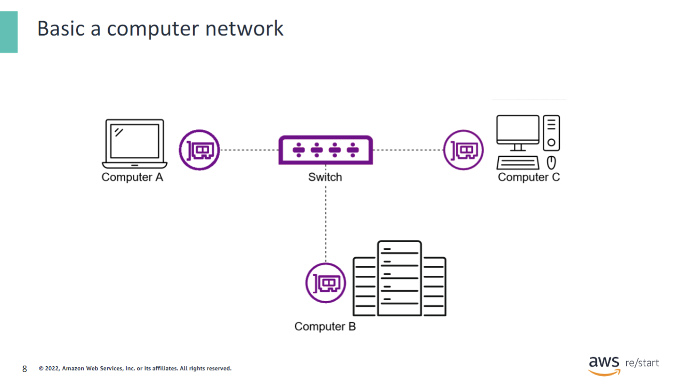

Above is an example of a basic computer network where a computer is connected through a network interface card (NIC) and traffic is routed/switched through a switch to its intended destination. When there are more computers within buildings, computers are grouped together to a switch that is then connected to a router as seen on the next slide.

### Elements of a computer network

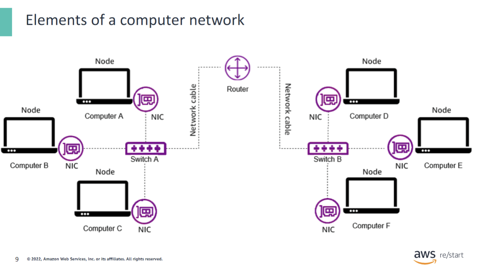

As noted in the previous slide, in a bigger network, the computers are grouped to a switch, in this example, switch A and B, also known as subnets. These switches send traffic to a router, which is ultimately a bigger switch with more intelligent functions.

- Computer A is a typical node on a network. On the network, it can be either a client or a server. Clients and servers will be discussed shortly.
- Network interface card (NIC) connects a computer to a network cable.
- Network cables connect the nodes on a network.
- Switch A and B connect multiple devices on a network.
- Router connects multiple switches on a network.

## Data and the OSI model

In this section, you will learn what data is and the basics of the Open System Interconnection (OSI) model.

### What is data

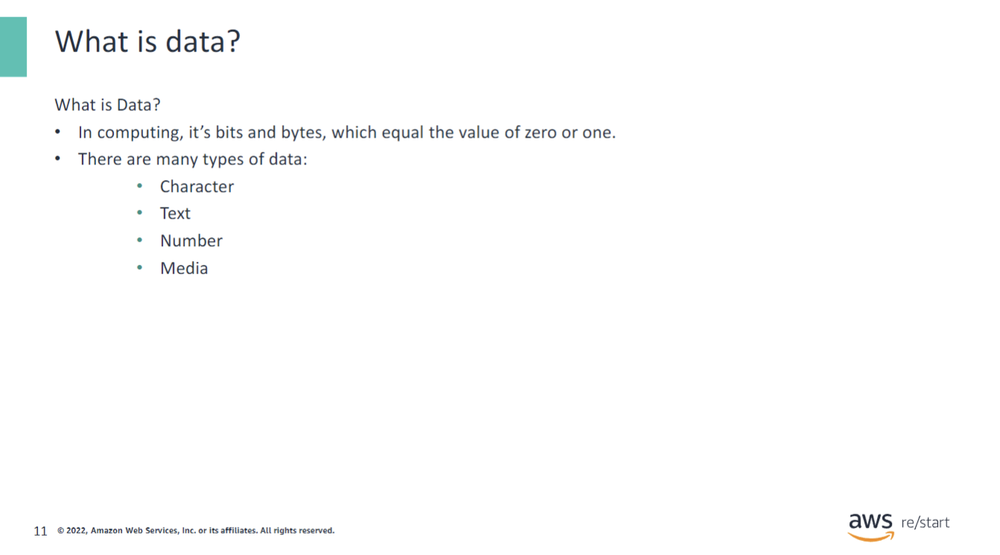

Data:

- Data can be pictures, documents, code, text, etc.
- Data can be sent over a network and saved.

### The OSI Model

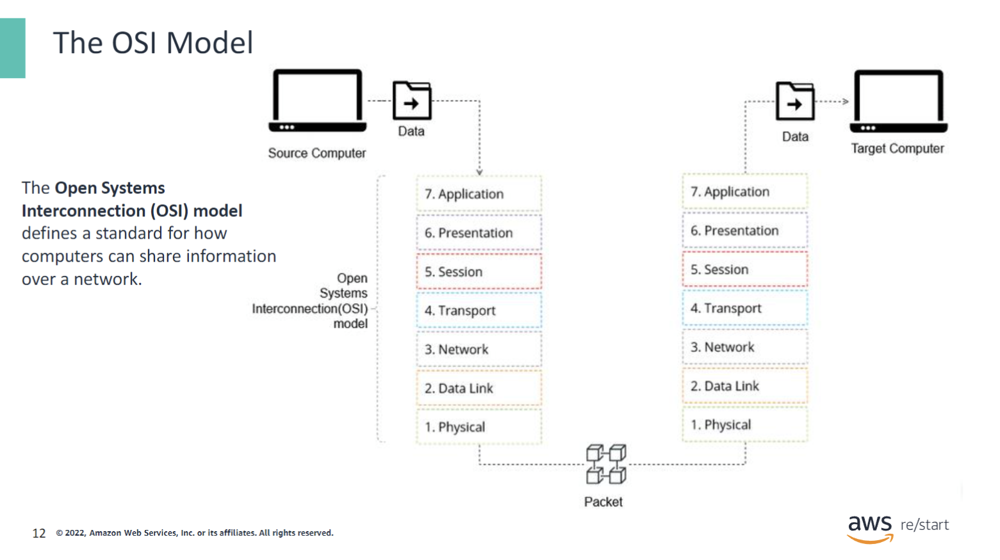

The OSI model is the main model used in networking today. The diagram illustrates how data flows in an OSI-compliant network from a source computer to a target computer.

1. Data starts from the source computer. The source computer sends data to the target computer. As the data leaves the source computer, it is processed and transformed by the different functions in the OSI layers, from layer 7 down to layer 1. During transmission of data, it can also be encrypted, and additional transmission-related information, which are called headers, are added to it.
2. Next, the data travels to the application layer (layer 7). This layer provides the interface that enables applications to access the network services.
3. Next is the presentation layer (layer 6). This layer ensures that the data is in a usable format and handles encryption and decryption.
4. The data moves to the session layer (layer 5). This layer maintains the distinction between the data of separate applications.
5. Next is the transport layer (layer 4). This establishes a logical connection between the source and destination. It also specifies the transmission protocol to use, such as Transmission Control Protocol (TCP).
6. The network layer (layer 3) decides which physical path the data will take.
7. The data link layer (layer 2) defines the format of the data on the network.
8. Finally, the data travels to the physical layer (layer 1), which transmits the raw bitstream over the physical network.
9. After the data has been transformed through the OSI layers, it is in a package format that is ready to be transmitted over the physical network.
10. Once the target computer receives the data package, it unpacks the data through the OSI layers, but in reverse, from layer 1 (physical) through 7 (application).

### Data at Layer 2 and 3 in the OSI

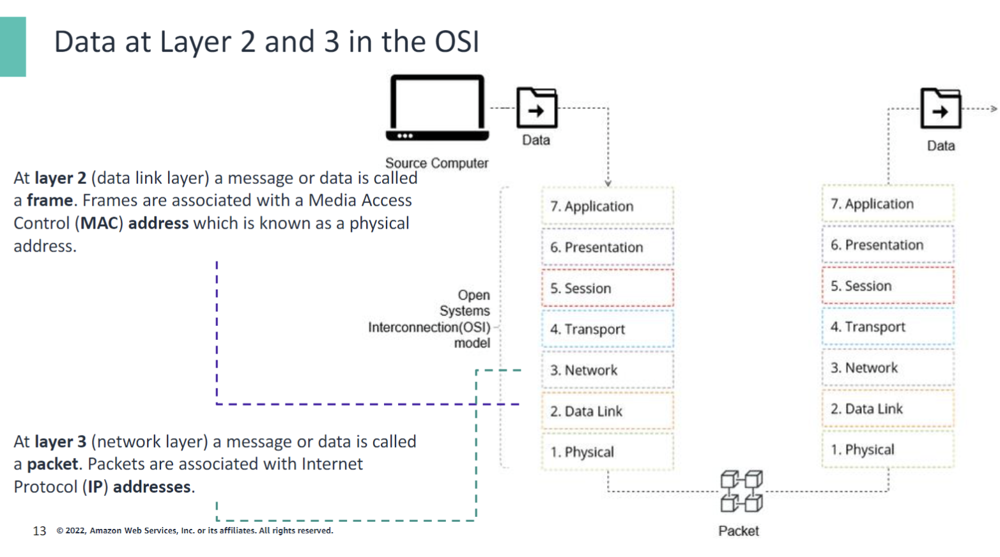

At **layer 2** (the data link layer) a message or data is called a **frame**. Frames are associated with a Media Access Control **(MAC) address** which is known as a physical address.

At **layer 3** (network layer) a message or data is called a **packet**. Packets are associated with Internet Protocol **(IP) addresses**.

## Networking components

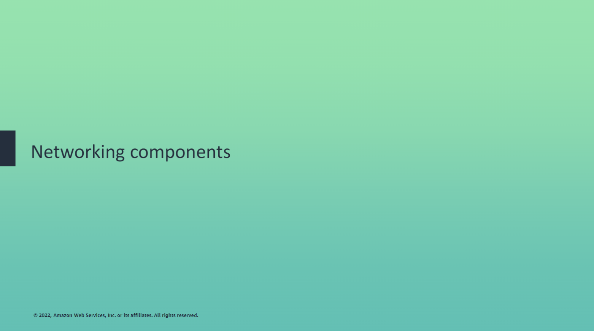

In this section, you will review the networking components that are used within a network.

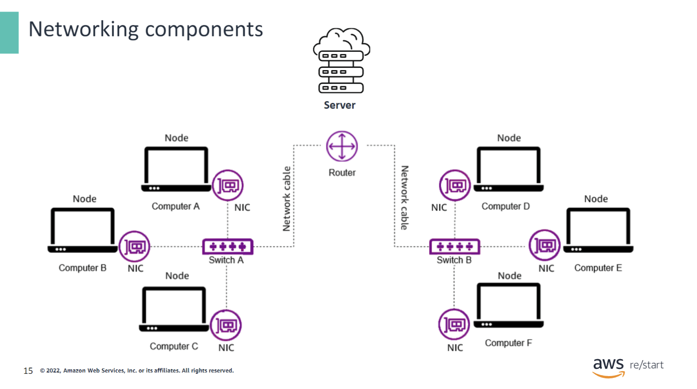

This section will cover the following networking components:

- Client
- Server
- NIC
- Network cables
- Switch
- Router

The picture above shows how the networking components work together to create a working network.

### Client

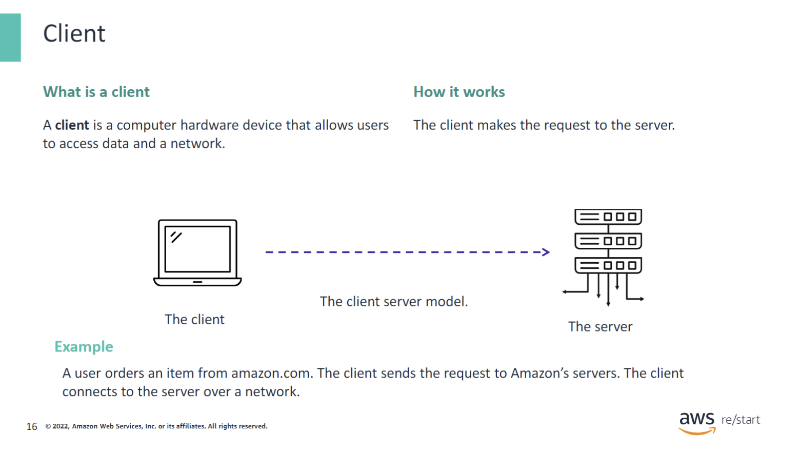

The client connects to the server over a network.

A client is also a computer hardware device that accesses the data or a service that is managed by another computer hardware device, which is also called a server.

A client can also refer to software on the accessing device. For example, a web browser is a client for accessing content from a web server.

### Server

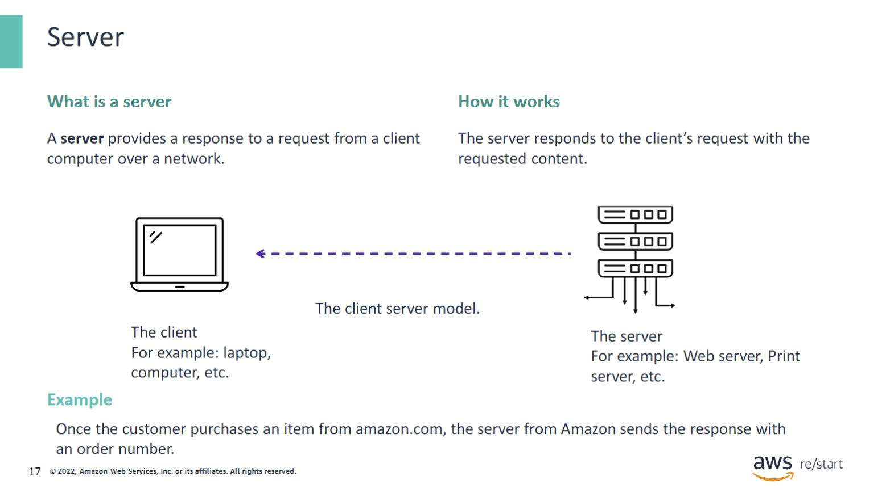

- The server has a specific job to respond to a request. When the client sends a request, the server will respond with the appropriate content the client is requesting.
- Other examples of a server are:
  - Web server
  - Database server
  - File server
  - Mail server
  - Print server

## Network interface card (NIC)

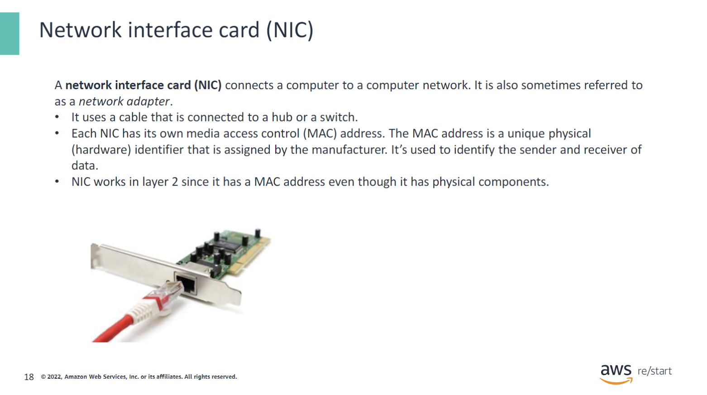

A NIC:

- Connects a computer to a computer network.
- Can be wired or wireless.
- Is sometimes referred to as a network adapter.
- Has its own MAC address, a unique physical identifier to each device. This MAC address is used to identify the sender and receiver of data. The NIC and MAC address are used in layer 2 of the OSI layer.

### Network cables

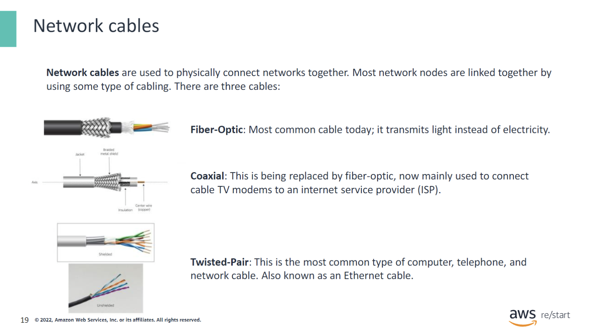

- Fiber-Optic: It's faster since it transmits light instead of electricity. This cable is a good choice for areas that have high levels of electromagnetic interference (EMI) and can transmit data over distances of several kilometers.
- Coaxial: This is being replaced by fiber-optic. This cable is mainly used to connect a cable TV modem to an ISP, and to connect TVs to cable boxes. It has a copper wire in the middle with a metal braided shield.
- Twisted-Pair: This is the most common type of computer, telephone, and network cable. It is also known as the ethernet cable. It has color coded pairs which can come shielded (STP) or unshielded (UTP). STP will prevent electromagnetic interference.

### Switch

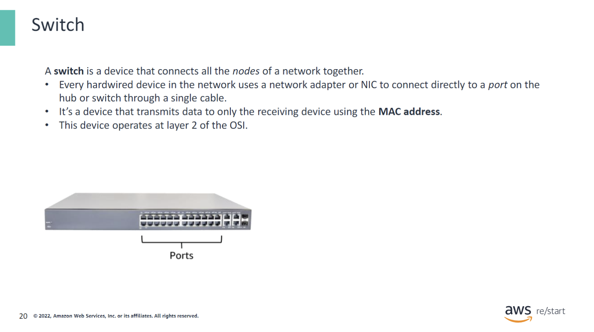

A switch:

- Operates at layer 2 of the OSI model, which means it deals with data as frames.
- Transmits data only to the receiving device. It makes a direct link using MAC addresses between the transmitting device and the receiving device.
- A hub operates on the same layer as the switch; however, it transmits data that it receives on one port to all other ports on the hub, while the switch transmits data only to the receiving device. While all the ports/nodes receive the data from the hub, only the recipient actually listens to it. In this case, a switch is better because it saves a lot of bandwidth by sending the data to the intended receiver.

### Router

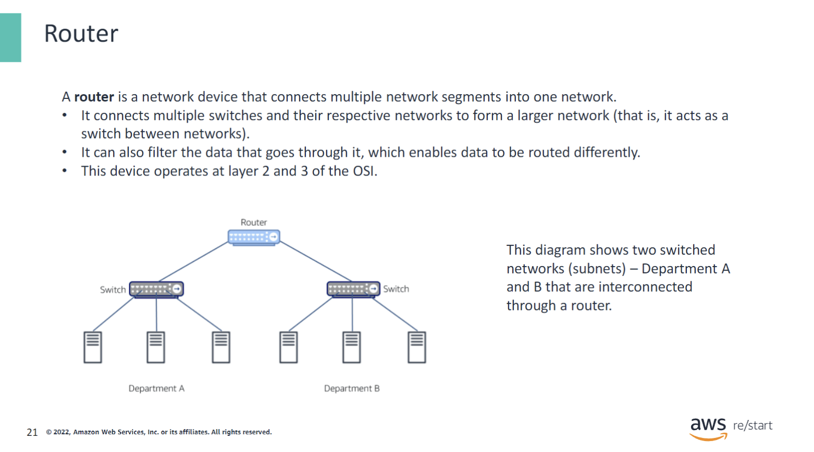

A router:

- Operates at layer 2 and 3 of the OSI model, which means it deals with data as frames and packets.
- Connects multiple switches and their respective networks to form a larger network. This creates subnets, and the router then becomes a switch itself.
- Is different from a switch because it can filter data. Since the router operates at layer 3, it uses Internet Protocol (IP) to filter and route traffic.

### Modem

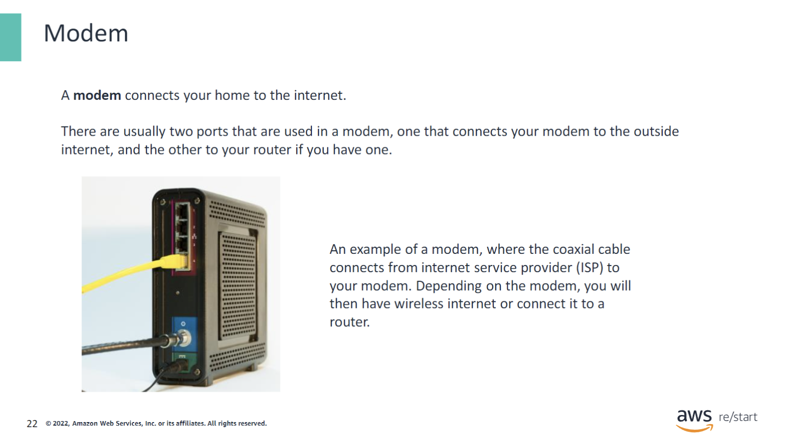

A modem connects your home to the internet from the ISP. A coaxial cable is used and, depending on your modem, it will then provide a wireless connection to your devices, or you can connect an additional router by connecting it to a port behind the modem.

## Checkpoint Questions

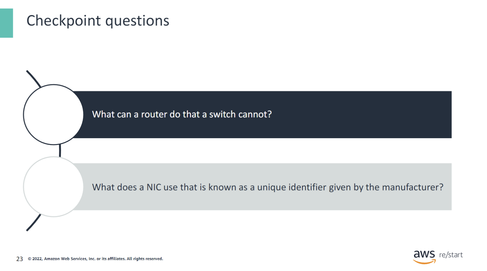

What can a router do that a switch cannot?

**A router can filter traffic, while a switch can only switch traffic.**

What does a network interface card (NIC) use that is known as a unique physical identifier given by the manufacturer?

**A media access control (MAC) address.**

## Key Takeaways

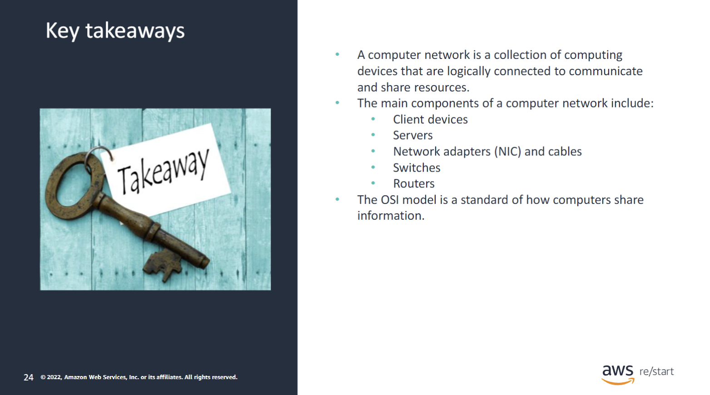

Some key takeaways from this lesson include the following:

- A computer network is a collection of computing devices that are logically connected to communicate and share resources.
- The main components of a computer network include:
  - Client devices
  - Servers
  - Network adapters (NIC) and cables
  - Switches
  - Routers
- The OSI model is a standard of how computers share information.
