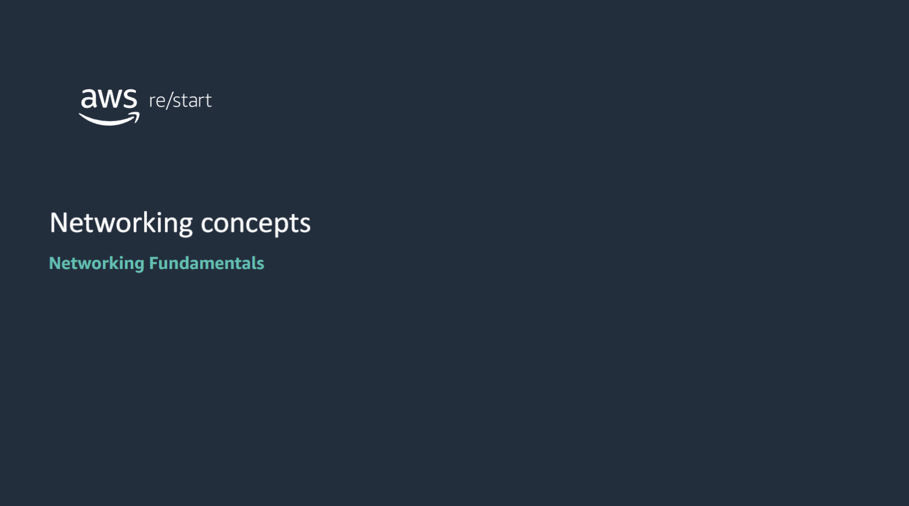
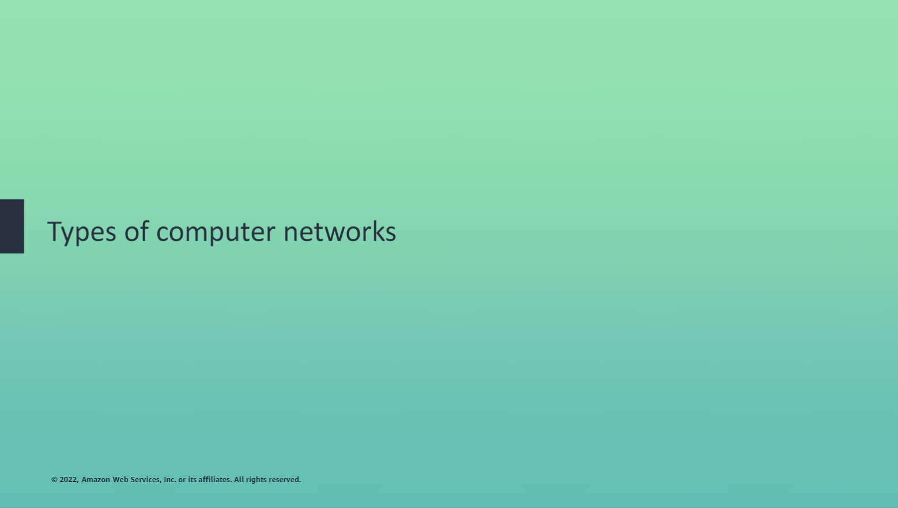
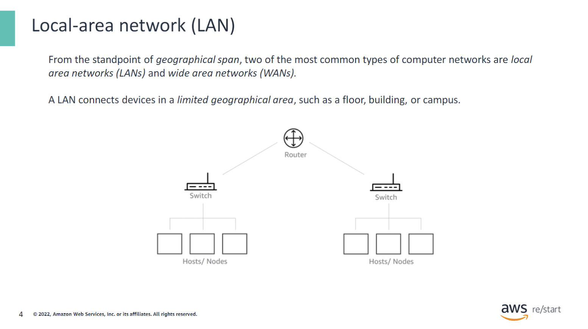
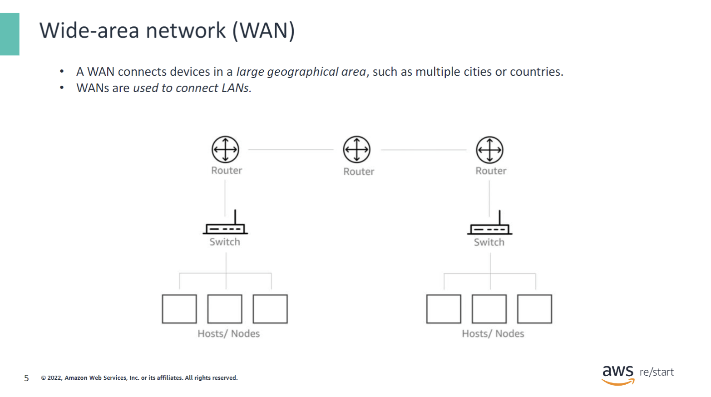
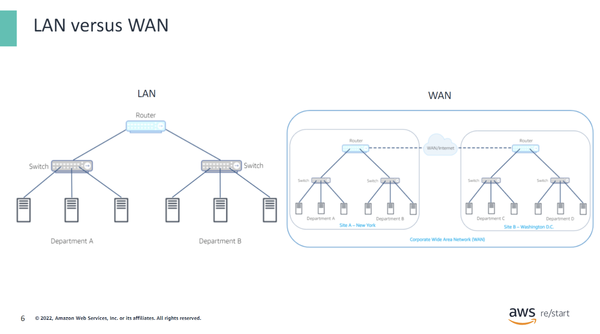
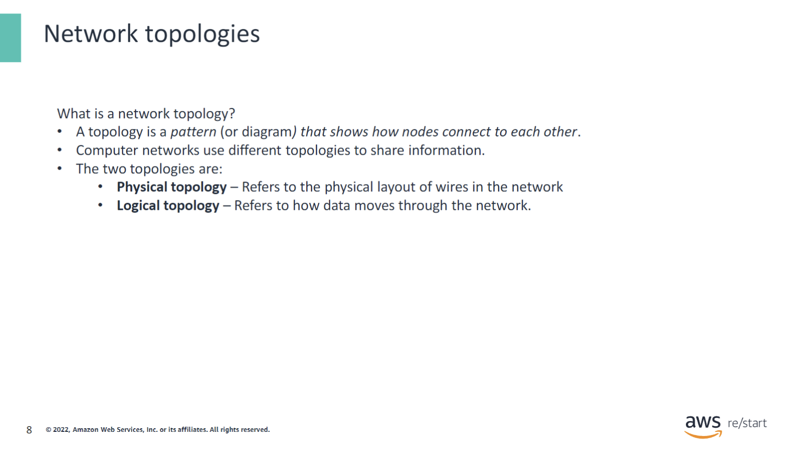
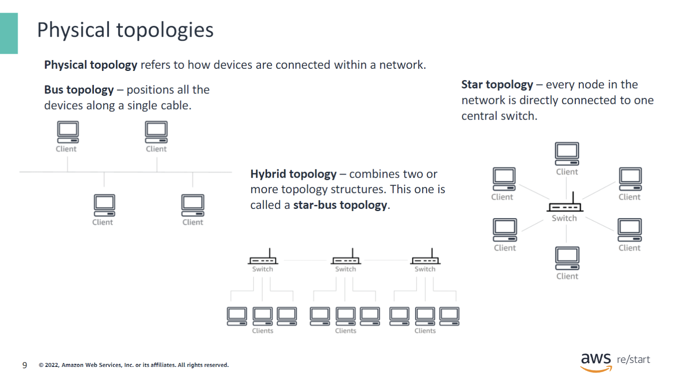
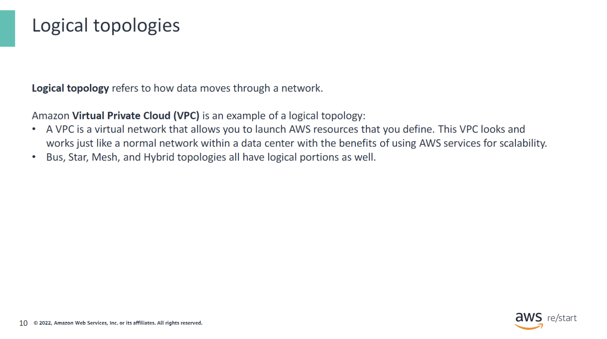

You will learn how to:

- Distinguish between different types of networks
- Describe common network management models and network topologies
- List different types of network protocols

## Types of computer networks

In this section, you will understand basic computer networks.

### Local-area network (LAN)

- In the example above, a LAN with one router, two switches, and three nodes under each switch. Each switch or subnet can represent an office floor or building within the same corporate office or school.
- LANs commonly use the Ethernet standard for connecting devices, and they usually have a high data-transfer rate.
- Wireless technology is also commonly used for a LAN.

### Wide-area network (WAN)

- In the example above, a WAN with three routers, two switches and three nodes under each switch. Examples of WANs are two corporate offices located across the United States connected by a WAN (the internet).
- WANs use technologies such as fiber-optic cables and satellites to transmit data which are used to connect LANs.
- The internet is considered to be the largest WAN.

### LAN vs. WAN

- LAN:
  - Within the same building or floor.

- WAN:
  - Can be geographically different locations; however, they are connected by a corporate WAN.

## Network topologies

In this section, you will understand basic network topologies (physical and logical).

### What is a network topology

It's important to understand network management models because they define the roles and relationships of the devices in your network.

- Examples of network topologies include:
  - Bus
  - Star
  - Mesh
  - Hybrid

#### Physical topologies

What is a physical topology?

- Refers to how a network is connected.
- Examples of network topologies include: **Bus, Star, Mesh, and Hybrid**.

**Bus** topology:

- The physical topology positions all the devices on a network along a single cable. They run in a single direction from one end of the network to the other.
- Also called a line topology or backbone topology.
- Simple to configure, but only allows one computer to send a signal at a time, which can cause network collisions that will bring down the network.

**Star** topology:

- Every node in the network is directly connected to one central switch by using coaxial, twisted-pair, or fiber-optic cables.

**Mesh** topology:

- A complex structure of connections similar to peer-to-peer, where the nodes are interconnected.
- Can be full mesh or partial mesh.
- In a partial-mesh topology, all devices are connected to at least two other devices.
- In a full-mesh topology, all nodes are interconnected, providing full redundancy for the network.
- Full-mesh is expensive and usually found in WANs.

**Hybrid** topology:

- Combines two or more different topology structures.
- Usually found in large organizations where separate departments have personalized network topologies.
- The star-bus topology is the most common hybrid topology today.

#### Logical topologies

What is a logical topology?

- Refers to how data moves through a network.
- Examples of logical topologies include: **Bus, Star, Mesh, Hybrid, and VPC.**

**Bus** topology:

- Data flow on the network follows the route of the cable, moving in one direction.
- Simple to configure, but only allows one computer to send a signal at a time, which can cause network collisions that will bring down the network.

**Star** topology:

- Central switch manages data transmission.
- Data sent from any node must pass through the central switch to reach its destination.
- The central switch can also function as a repeater to prevent data loss.

**Mesh** topology:

- Complex structure of connections similar to peer-to-peer, where nodes are interconnected.
- Can be full mesh or partial mesh.
- In a partial-mesh topology, all devices are connected to at least two other devices.
- In a full-mesh topology, all nodes are interconnected, providing full redundancy.
- Full-mesh is expensive and usually found in WANs.

**Hybrid** topology:

- Combines two or more different topology structures.
- Usually found in large organizations with personalized network topologies for different departments.
- The star-bus topology is the most common hybrid topology today.

**VPC** topology:

- A virtual network that allows you to launch AWS resources that you define.
- It's a logical network.
