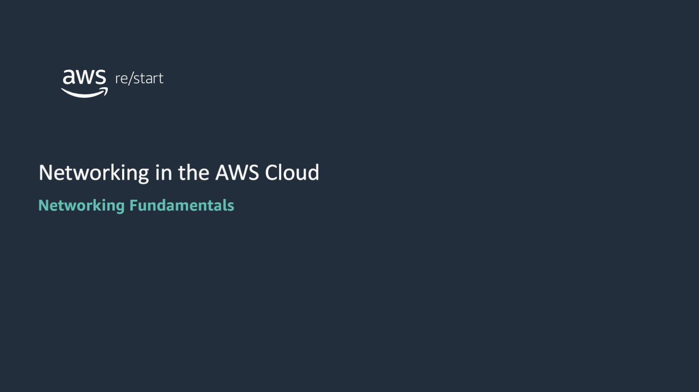

You will learn how to:

- **Explain networking in the cloud**
- **Explain virtual networking in the cloud with Amazon Virtual Private Cloud (Amazon VPC)**
- **Describe the key components of a virtual private cloud (VPC)**
- **Relate subnetting and Classless Inter-Domain Routing (CIDR) block addressing to Amazon VPC features**

## Networking in the cloud

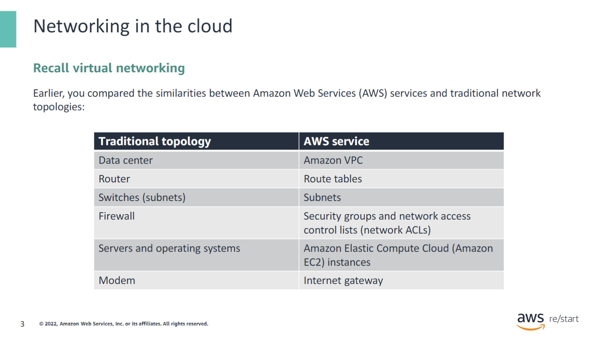

As described earlier, networking in the cloud is similar to regular networking in a data center:

- **Data Center vs. VPC**: A data center most closely resembles the function of a VPC. In a VPC, you can launch multiple AWS services to create a working, scalable network. However, within a VPC, no maintenance is required, and you can create an isolated architecture within minutes.

- **Components**: A data center involves multiple components, such as the internet, servers, firewalls, and switches. Similarly, a VPC requires these same services to operate.

- **Routers and Route Tables**: In a traditional environment, a router has functions like filtering packets, routing traffic, and storing them in a route table. In AWS, the service that most closely resembles a router is the route table, where the owner inputs routes within the VPC.

- **Switches and Subnets**: A switch acts as a subnet and switches data as it comes in. AWS uses subnets in every architecture. Every node (EC2 instance) belongs to a subnet. While the functions of a switch and an AWS subnet do not match exactly, subnets are used to logically isolate groups of IP addresses.

- **Firewalls and Security Groups**: Firewalls block traffic based on a set of rules. AWS has security groups that block traffic at the node (Amazon EC2 level) and network ACLs that block traffic at the subnet level. These security groups also use a set of rules to block traffic.

- **Servers**: A data center has servers and operating systems. In AWS, you can use an EC2 instance to launch an array of servers or operating systems.

- **Internet Connection**: Everything in a data center must be connected to the internet through an ISP. In AWS, a VPC and its services receive internet access through an internet gateway, similar to how a modem connects your home to the internet.

## What is Amazon VPC

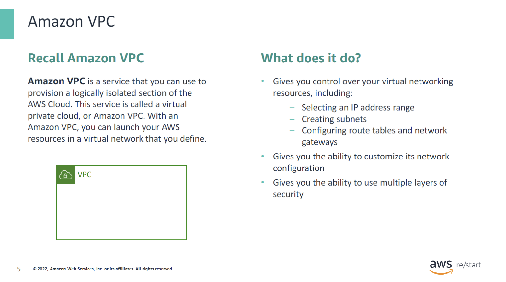

The Amazon VPC service offers the following benefits:

- **Private Network Creation**: You can use Amazon VPC to create a private network in the AWS Cloud, leveraging many of the same concepts and constructs as an on-premises network.

- **IP Address Management**: Similar to an on-premises network, you can select IP address ranges and allocate them by creating subnets within Amazon VPC.

- **Virtual Environment**: All physical components of an on-premises network become virtual in Amazon VPC. Instead of plugging in devices, you attach resources to build your network.

- **Quick Provisioning**: You can create and provision a fully functional Amazon VPC in your AWS account within minutes, offering redundancy and high availability that surpass traditional data centers.

- **Cost Efficiency**: Operating within a cloud environment like AWS incurs fewer costs compared to maintaining a traditional data center, as there is no need for physical upkeep.

### Why use an Amazon VPC

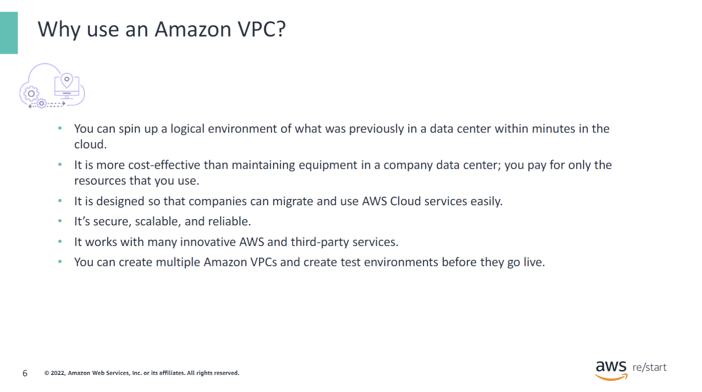

An Amazon VPC offers the following benefits:

- It is more secure, scalable, reliable, cost-effective, and easy to use than a traditional data center.

- It replaces the need for your own data center.

- You can create multiple Amazon VPCs for testing, owning customer accounts, and more.

- It works with many other services through AWS Marketplace (third-party software that is approved through AWS).

- Step-by-step guides are available on how to use an Amazon VPC; everything is well documented.

### Amazon VPC features

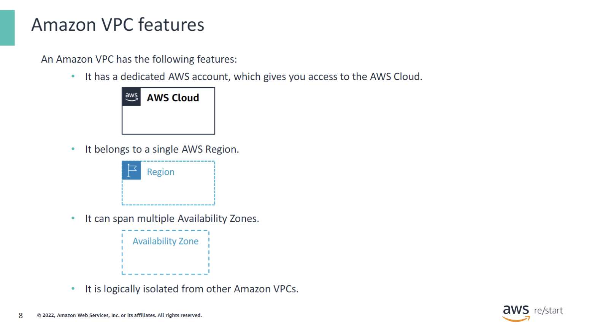

An Amazon VPC includes the following features:

- It is dedicated to an AWS account.
- It belongs to a single AWS Region.
- It can span multiple Availability Zones.
- It is logically isolated from other Amazon VPCs.

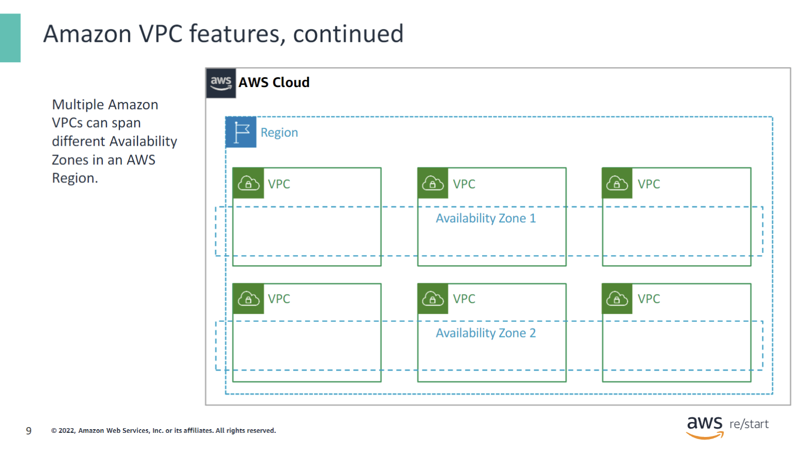

Amazon VPC features offer the following benefits:

- You can create multiple Amazon VPCs in an AWS account to separate networking environments.
- You can create subnets in a VPC; however, fewer subnets are recommended to reduce the complexity of the network topology.

## IP addressing in Amazon VPC

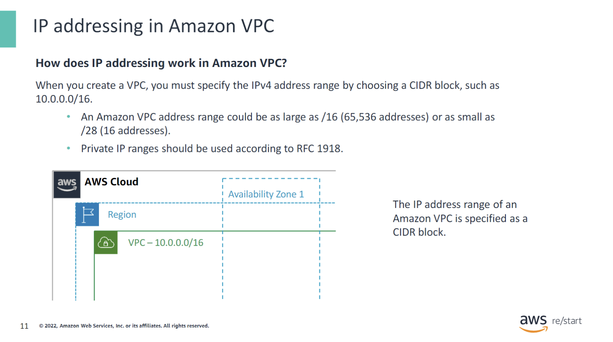

IP addressing in Amazon VPC has the following rules:

- Private IP ranges should be used according to RFC 1918 ([RFC 1918](https://datatracker.ietf.org/doc/html/rfc1918)). If private IP ranges are not used, resources within the VPC that have public IPs can get replies back from the internet that do not belong to the Amazon VPC.
- IP addresses should not overlap with the addresses of other networks to which an Amazon VPC is connected.
- The address range of the Amazon VPC cannot be changed after the VPC is created; however, a secondary VPC CIDR can be assigned to the VPC.

### Private IP address range

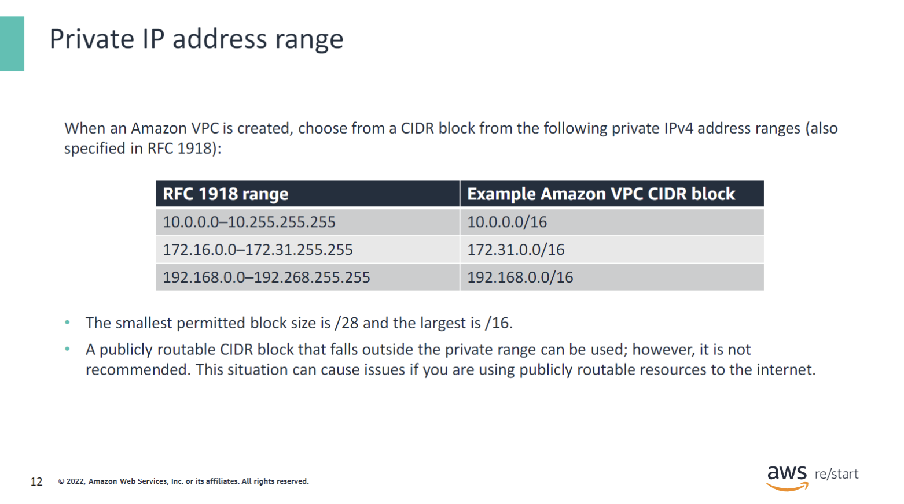

Why is this information important?

- **RFC 1918** ([RFC 1918](https://datatracker.ietf.org/doc/html/rfc1918)) defines the private address space and its use case within enterprise environments. When a public IP address is enabled or an Elastic IP address is assigned, it provides a routable public IP address to the instance, allowing it to be accessed over the internet regardless of its private address. This public IP address is unique and comes from the Amazon pool of IP addresses.
  
- It is recommended to use the private IPv4 address range to avoid potential issues. Using addresses outside the private range could lead to receiving replies from unrelated sources on the internet.

- Some third-party tools can assist in calculating and creating IPv4 subnets and CIDR blocks. Search for “subnet calculator” or “CIDR calculator” for these tools.

- Within each subnet CIDR block, AWS reserves the following IP addresses:
  - `10.0.0.0` – Network address
  - `10.0.0.1` – VPC router
  - `10.0.0.2` – Domain Name System (DNS) server
  - `10.0.0.3` – Reserved for future use
  - `10.0.0.255` – Network broadcast, not supported in the VPC but still reserved

- You can add a secondary CIDR block to an Amazon VPC. For more information, see [VPC Subnets](https://docs.aws.amazon.com/vpc/latest/userguide/VPC_Subnets.html#vpc-sizing-ipv4).

## Amazon VPC components

### What is Amazon VPC?

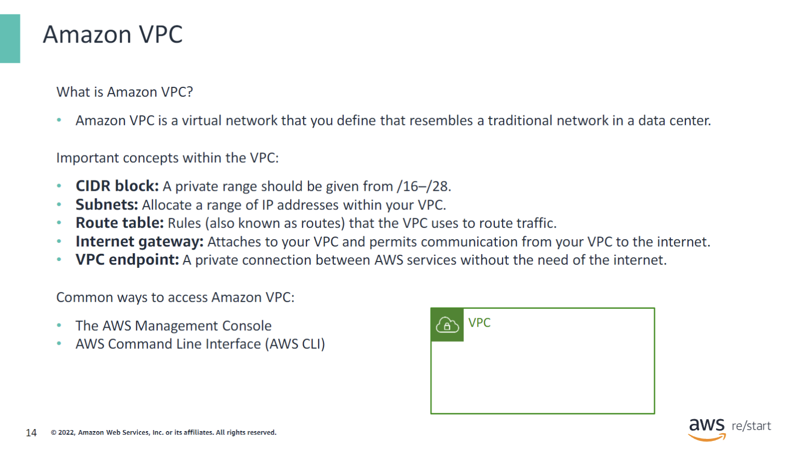

- **Amazon VPC** (Virtual Private Cloud) is a virtual network that you define, resembling a traditional network in a data center.
- For more information, see [What is Amazon VPC?](https://docs.aws.amazon.com/vpc/latest/userguide/what-is-amazon-vpc.html).

#### The following concepts are important within the VPC:

- **CIDR Block**:
  - A private range should be given in the range `/16–/28`.
  - To determine the private IP address range allocation, you can use [RFC 1918](https://datatracker.ietf.org/doc/html/rfc1918).
  - Various third-party tools are available to determine how many IP addresses can fit into each CIDR range.

- **Subnets**:
  - Subnets allocate a range of IP addresses within your VPC.
  - These subnets are either public or private. Public subnets have a route table with the internet gateway associated with them, whereas private subnets do not.
  - Like the VPC CIDR block, subnets need a range. Third-party tools can assist with this as well.

- **Route Table**:
  - A route table contains rules (also known as routes) that the VPC uses to route traffic.
  - Targets are services like the internet gateway, VPC endpoint, or NAT gateway.
  - Routes specify the destination for traffic and the target it should go to. For example, for the internet gateway, the route will be `0.0.0.0/0` because it routes to the internet, and the target will be `IGW-xxxxxxxx`.

- **Internet Gateway**:
  - An internet gateway attaches to your VPC and allows communication between the VPC and the internet.
  - This service must be created and attached to the VPC. Once attached, it must be added to the route table of the public subnet to allow resources to access the internet.

- **VPC Endpoint**:
  - A VPC endpoint is a private connection between AWS services without needing the internet.

#### Common ways to access Amazon VPC include

- **AWS Management Console**
- **AWS Command Line Interface (CLI)**

### Amazon VPC Components

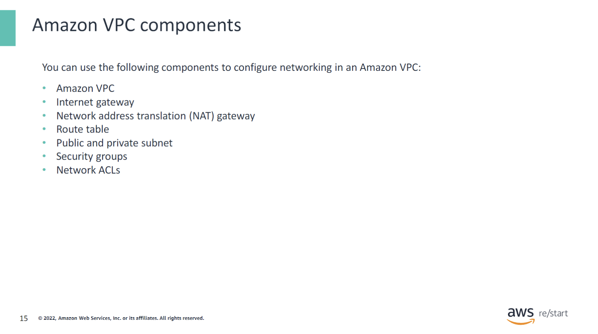

Amazon VPC components are used to configure networking in a VPC:

- **Amazon VPC**:
  - A logically isolated environment for your resources within the cloud. You can choose a Region here.

- **Internet Gateway**:
  - Provides internet connectivity to the Amazon VPC.

- **Network Address Translation (NAT) Gateway**:
  - Attached to the private subnet, it provides network address translation so that the private subnet can reach out to the internet.

- **Route Table**:
  - Holds the route and target information required to route traffic within the Amazon VPC.

- **Public Subnet**:
  - Associated with a route table that has a route to an internet gateway. You can choose Availability Zones here.

- **Private Subnet**:
  - Does not have an internet gateway on the route table associated with it. However, a NAT gateway can be a route on this route table. Like public subnets, Availability Zones can be chosen here.

- **Security Groups**:
  - Act as firewalls at the EC2 instance level. They are stateful by nature.

- **Network ACLs**:
  - Act as firewalls for subnets. They are stateless by nature.

### Internet gateway

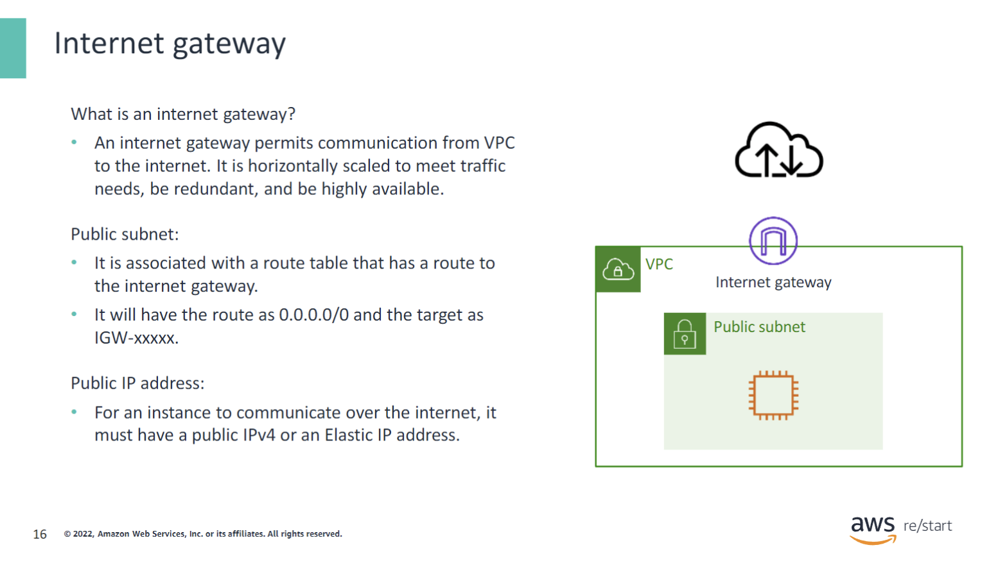

#### How to Enable Internet Access in Amazon VPC

1. **Create the Internet Gateway**:
   - Create an internet gateway and attach it to the VPC.

2. **Update the Route Table**:
   - Identify the route table associated with the subnet that you want your resources to use to communicate with the internet.
   - Add a route with `0.0.0.0/0` and set the target to the internet gateway.

3. **Assign Public IP Addresses**:
   - Ensure that resources in the public subnet have a public IP address or an Elastic IP address.

4. **Update Security Groups and Network ACLs**:
   - Ensure that security groups around the instances and network ACLs around the subnets allow traffic to and from the instance and subnet.

#### Why is This Information Important?

When troubleshooting, forgetting any of these steps can break internet or network connectivity. Checking the attachment, routes, public IP addresses, and security settings is crucial when setting up, maintaining, or testing network configurations within the VPC.

#### What is an Internet Gateway?

- **Function**: Allows communication from VPC to the internet. It is horizontally scaled to meet traffic needs, be redundant, and be highly available.
- **Importance**: Without an internet gateway, you will not be able to reach the internet.

#### Public Subnet

- **Association**: A public subnet is associated with a route table that includes a route to the internet gateway.
- **Route**: The route will be `0.0.0.0/0` and the target will be `IGW-xxxxx`.

#### IP Address

- **Requirement**: For an instance to communicate over the internet, it must have a public IPv4 address (Elastic IP or dynamic).

For more information, see [Amazon VPC Internet Gateway Documentation](https://docs.aws.amazon.com/vpc/latest/userguide/VPC_Internet_Gateway.html).

### NAT gateway

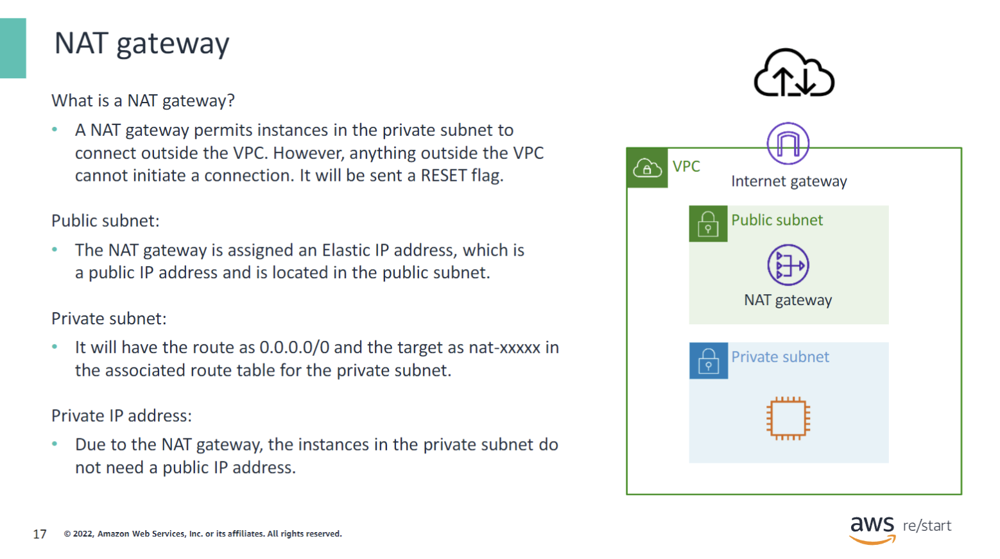

#### How to Provide Internet Access to a Private Subnet

1. **Create the NAT Gateway**:
   - Create the NAT gateway and select the public subnet in which to place the NAT gateway.

2. **Connectivity Types**:
   - **Public**: For instances within the private subnet to connect to resources outside the VPC.
   - **Private**: For connections only within the VPC.

3. **Allocate an Elastic IP Address** (if using public connectivity):
   - Allocate an Elastic IP address for the NAT gateway.

4. **Update the Route Table**:
   - Identify the route table associated with the private subnet that you want your resources to use to communicate with the internet.
   - Add a route with `0.0.0.0/0` and set the target to the NAT gateway.

5. **Update Security Groups and Network ACLs**:
   - Ensure that security groups around the instances and network ACLs around the subnets allow traffic to and from the instance and subnet.

#### Why is This Information Important?

When troubleshooting, forgetting any of these steps can break internet or network connectivity. Checking NAT gateway placement, routes, correct Elastic IP addresses, and security settings is crucial when setting up, maintaining, or testing network configurations within the VPC.

For more information, see [Amazon VPC NAT Gateway Documentation](https://docs.aws.amazon.com/vpc/latest/userguide/vpc-nat-gateway.html).

### Route tables

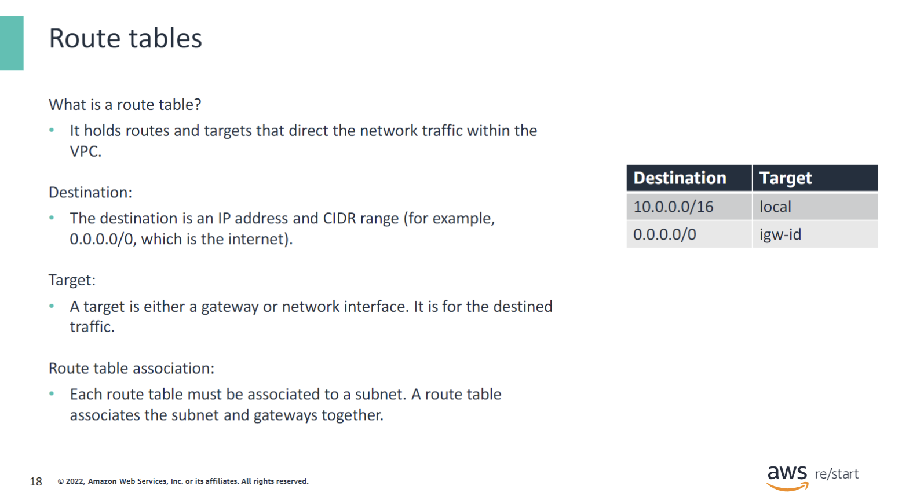

#### Important Things to Keep in Mind When Working with Route Tables in the AWS Console

- **Associating Public Route Tables**:
  - Associating public route tables with public subnets and naming them consistently can help with organization when attaching and associating services.

- **Destinations and Targets**:
  - **Destinations**: Hold IP addresses and ranges.
  - **Targets**: Hold a service to which traffic is routed (e.g., an internet gateway or NAT gateway).

- **Public Subnets**:
  - A route table with an internet gateway is associated with a subnet that requires internet access, making it a public subnet.

#### Why is This Information Important?

When troubleshooting, forgetting any of these steps can break internet or network connectivity. Ensuring correct association of route tables to subnets, proper configuration of destinations and targets, and accurate routing is essential for network functionality within and outside the VPC.

A subnet can be associated with only one route table; however, a route table can be associated with multiple subnets.

For more information, see [Amazon VPC Route Tables Documentation](https://docs.aws.amazon.com/vpc/latest/userguide/VPC_Route_Tables.html).

### Public and private subnet

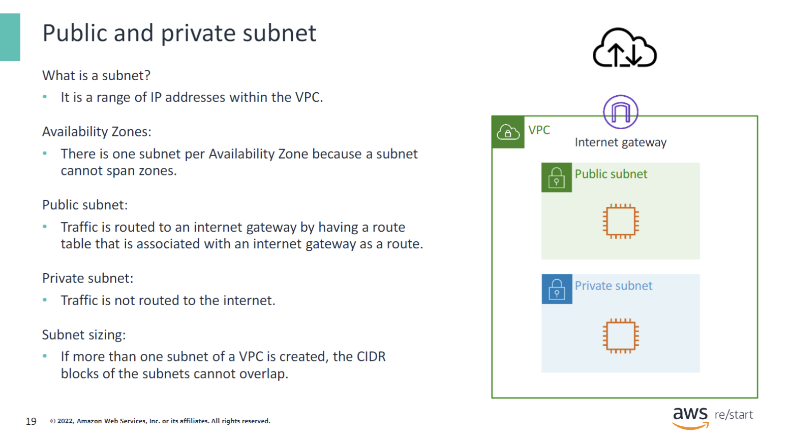

#### Significant Information About Subnets

- **Availability Zone**:
  - Each subnet is associated with one Availability Zone.

- **Public Subnet**:
  - Has an internet gateway.
  - Accessible from both the internet and within the VPC.

- **Private Subnet**:
  - Does not route traffic directly to an internet gateway.
  - Can route traffic to a NAT gateway for internet access.
  - Without a NAT gateway, it can only access VPC traffic.
  - With a NAT gateway, it can obtain updates from the internet.

- **Reserved IP Addresses**:
  - AWS reserves the first four IP addresses and the last IP address of every subnet for internal purposes.

For more information, see [Amazon VPC Subnets Documentation](https://docs.aws.amazon.com/vpc/latest/userguide/VPC_Subnets.html#subnet-basics).

### Security group

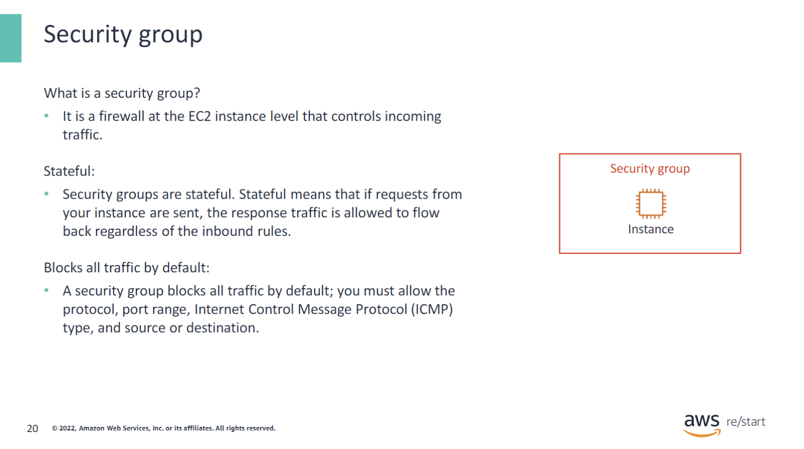

#### Creating a Security Group Requires Specific Items

1. **Protocol**:
   - Choose from Transmission Control Protocol (TCP), User Datagram Protocol (UDP), or Internet Control Message Protocol (ICMP).

2. **Port Range**:
   - Specify a single port (e.g., port 22 for Secure Shell (SSH)) or a range of ports (e.g., 0–65,535).

3. **ICMP Type and Code**:
   - Typically, you can keep the default settings.

4. **Source or Destination**:
   - This can be a specific IP address, a range of IP addresses, or anywhere (0.0.0.0/0).

#### Why Is This Information Important?

When troubleshooting, security groups can often be a significant issue. They may block ports or specific IP addresses, which can be easily overlooked during configuration. If everything seems correct but you encounter a “connection refused” error, it is likely related to security group settings.

You can associate multiple security groups with an instance and modify these rules at any time. However, be cautious with changes as they can have unexpected consequences. Documenting each change in detail can help save time and avoid issues.

For more information, see [Amazon EC2 Security Group Rules Documentation](https://docs.aws.amazon.com/AWSEC2/latest/UserGuide/security-group-rules.html).

### Network ACL

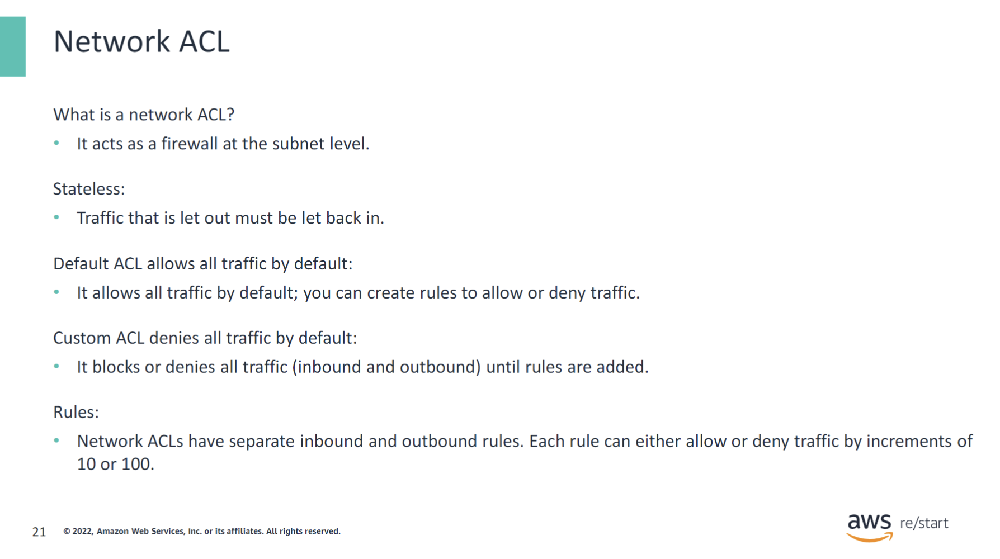

#### Creating a Network ACL Requires Specific Items

1. **Rule Number**:
   - Evaluated with the lowest number first. If a rule matches the traffic, it is applied.

2. **Type**:
   - Options include SSH, a range, or all traffic.

3. **Protocol**:
   - Specify the protocol, such as ICMP.

4. **Port Range**:
   - For example, 443 for HTTPS traffic.

5. **Source**:
   - Required for inbound rules. Specify the source IP range and CIDR.

6. **Destination**:
   - Required for outbound rules. Specify the destination IP range and CIDR.

7. **Allow or Deny**:
   - Define whether to allow or deny the traffic specified in the rules.

### Why Is This Information Important?

When troubleshooting, network ACLs, like security groups, can often block traffic and cause connectivity issues. Checking the deny or allow rules, as well as the rule numbers, can help resolve issues with network ACLs.

For more information, see [Amazon VPC Network ACLs Documentation](https://docs.aws.amazon.com/vpc/latest/userguide/vpc-network-acls.html).

#### Example of an Amazon VPC

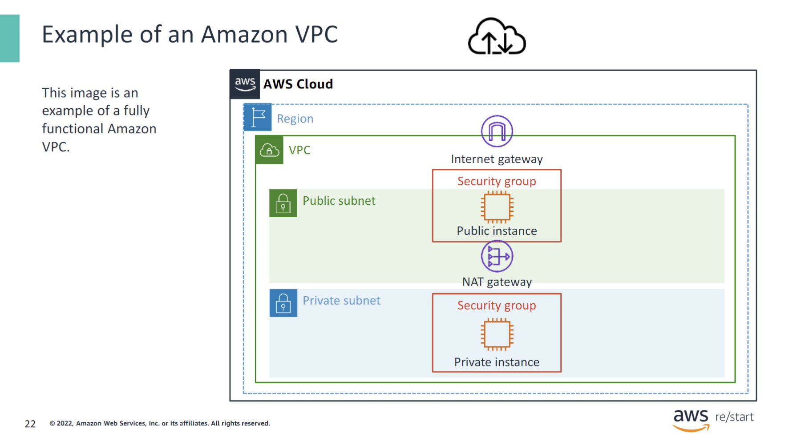

The Slide Shows an Example of a Fully Functioning Amazon VPC.
Starting from the outside and working inward, you have the following components:

- **The AWS Cloud Environment**:
  - This is the account in which you create your Amazon VPC resources.

- **The Region**:
  - Choose where your logically isolated environment will be provisioned within one of the many Regions in data centers across the US and the world. For a list of Regions, see [AWS Regions and Availability Zones](https://docs.aws.amazon.com/AWSEC2/latest/UserGuide/using-regions-availability-zones.html#concepts-available-regions).

- **Amazon VPC**:
  - This is your logical data center, where resources are provisioned and networked together to reach the outside world.

- **Public and Private Subnet**:
  - These are allocated IP ranges for your resources. Public subnets have an internet gateway attached to the route table. Private subnets do not have an internet gateway or public routable address.

- **Security Groups and Network ACLs**:
  - These options act as a firewall for your instances and subnets.

- **Instances**:
  - Instances are operating systems and servers.

- **Resources**:
  - An internet gateway and NAT gateway are examples of resources that are provisioned within the VPC to enable routing outside the VPC.

## Using other AWS services with Amazon VPC

### What can be used with Amazon VPC?

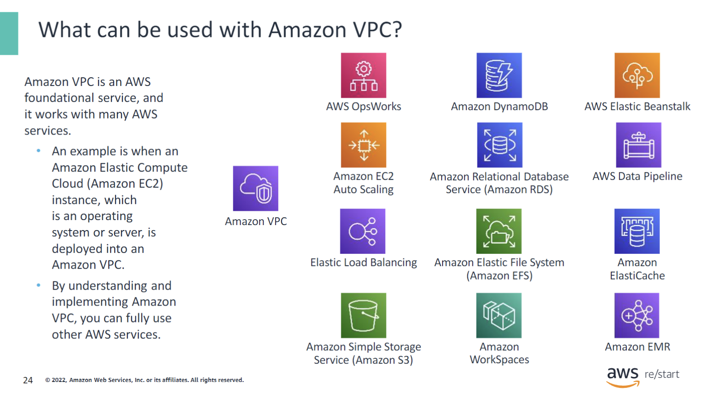

#### What are some example services that can be used with Amazon VPC?

- **Amazon EC2 Auto Scaling** ([Documentation](https://docs.aws.amazon.com/autoscaling/ec2/userguide/what-is-amazon-ec2-auto-scaling.html)):
  - Amazon EC2 Auto Scaling offers scaling to a desired capacity, ensuring the correct number of EC2 instances to handle the load or traffic for your application.
  - EC2 instances are grouped into Auto Scaling groups where parameters are set.
  - With a scaling policy, Amazon EC2 Auto Scaling can launch or terminate instances on demand, helping businesses manage large amounts of traffic and preventing application crashes.

- **Elastic Load Balancing (ELB)** ([Documentation](https://docs.aws.amazon.com/elasticloadbalancing/latest/userguide/what-is-load-balancing.html)):
  - ELB provides fault tolerance by distributing traffic across multiple targets (EC2 instances, IP addresses, or containers) in multiple Availability Zones.
  - It scales with traffic, is fault tolerant, and monitors the health of registered targets, sending traffic only to healthy ones.
  - Types of ELB balancers include Classic Load Balancer, Application Load Balancer, and Network Load Balancer. For a comparison of benefits, see [ELB Product Comparisons](https://aws.amazon.com/elasticloadbalancing/features/#Product_comparisons).

- **Amazon Simple Storage Service (Amazon S3)**:
  - Amazon S3 is a scalable, secure, and highly available object storage service. For information about different Amazon S3 storage classes, see [S3 Storage Class Comparison](https://docs.aws.amazon.com/AmazonS3/latest/userguide/storage-class-intro.html#sc-compare).

- **Amazon DynamoDB** ([Documentation](https://docs.aws.amazon.com/amazondynamodb/latest/developerguide/Introduction.html)):
  - DynamoDB is a fully managed NoSQL database service offering fast, predictable performance, security, and scalability.

- **Amazon Relational Database Service (Amazon RDS)** ([Documentation](https://docs.aws.amazon.com/AmazonRDS/latest/UserGuide/Welcome.html)):
  - Amazon RDS is a web service that provides the operation and scalability of a relational database in the AWS Cloud.

- **Amazon WorkSpaces** ([Documentation](https://docs.aws.amazon.com/workspaces/latest/adminguide/amazon-workspaces.html)):
  - Amazon WorkSpaces allows you to provision virtual desktops (Microsoft Windows or Amazon Linux) for users.

## Checkpoint questions

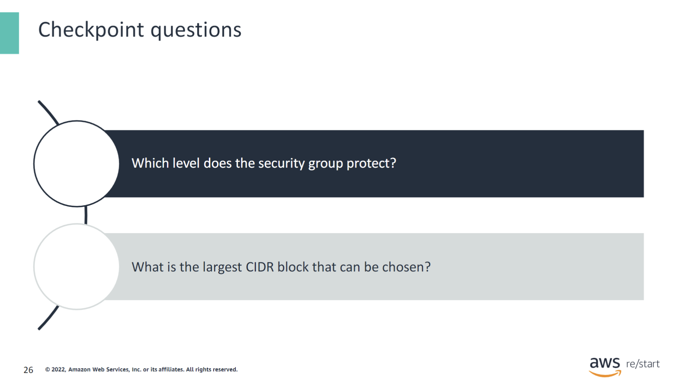

Q1: Which level does the security group protect?  
**Answer:** Instance level  

Q2: What is the largest CIDR block that can be chosen?  
**Answer:** /16  

## Key takeaways

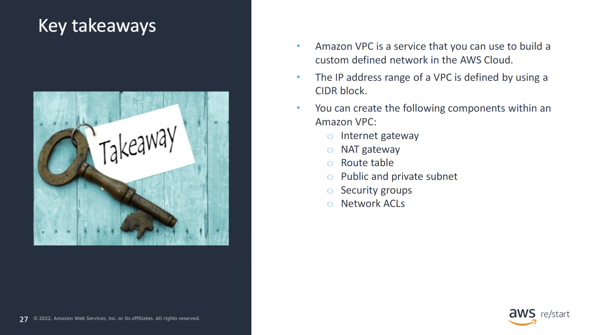
:::tip[Recap]

- Amazon VPC is a service that you can use to build a custom defined network in the AWS Cloud.
- The IP address range of a VPC is defined by using a CIDR block.
- You can create the following components within an Amazon VPC:
  - Internet gateway
  - NAT gateway
  - Route table
  - Public and private subnet
  - Security groups
  - Network ACLs

:::
