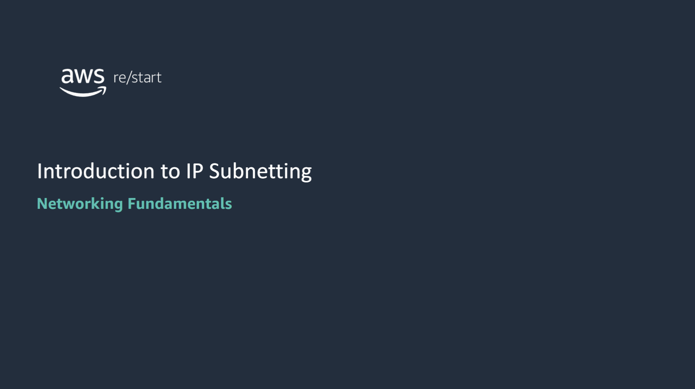
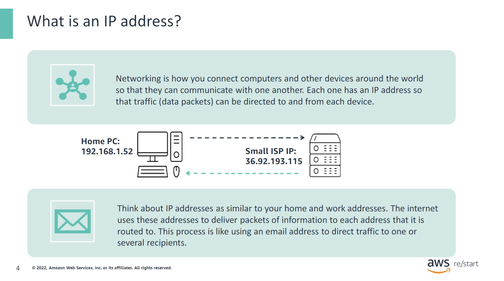
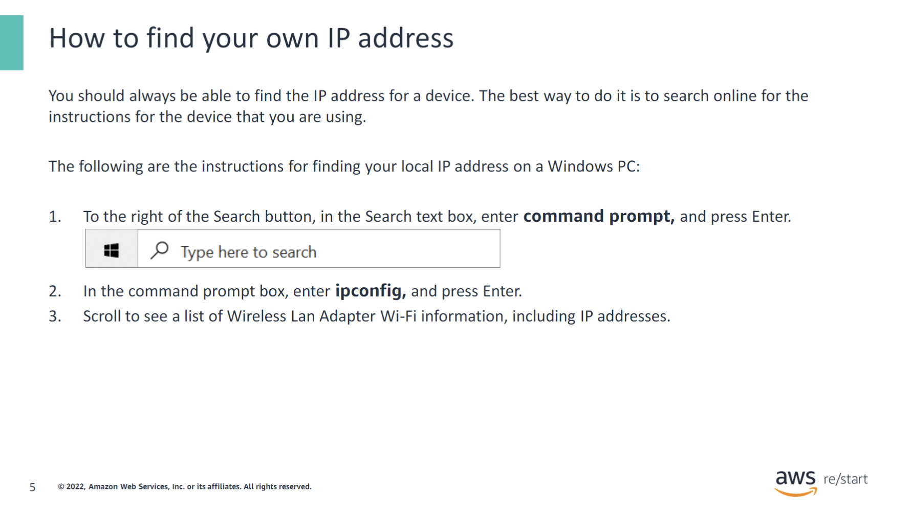
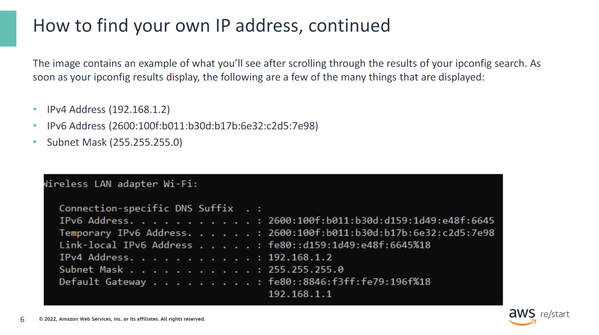
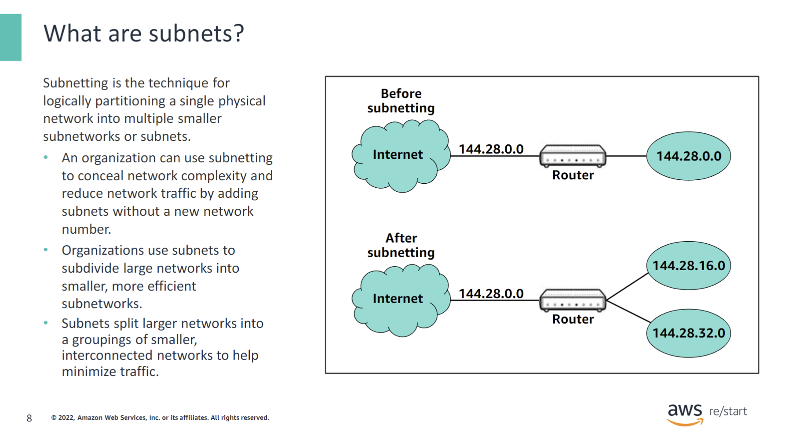
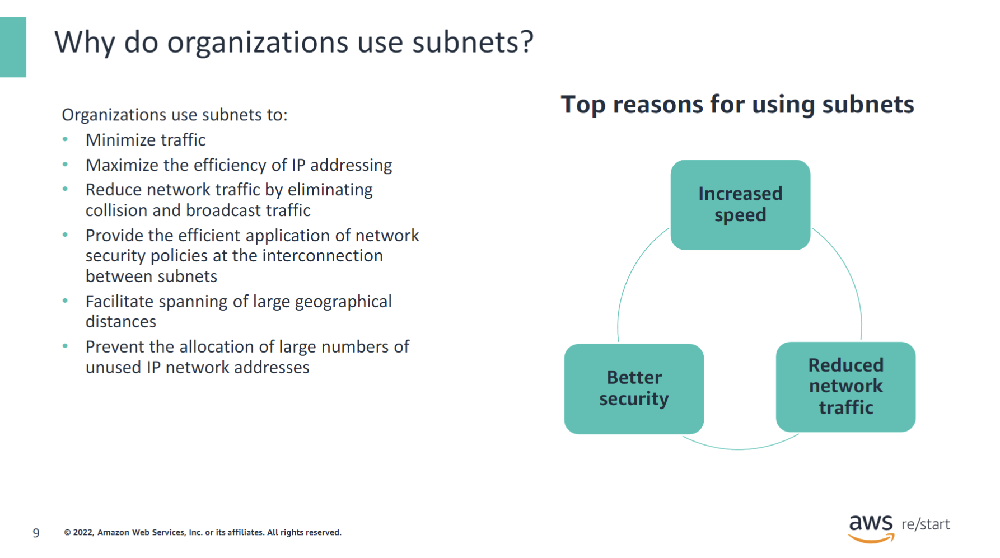

In this lesson, you will learn how to:

- Define a subnet, its parts, and its purpose
- Describe the purpose of IP subnetting
- Use the Classless Inter-Domain Routing (CIDR) notation to specify subnet address ranges
- Describe the use of subnet masks

## What is an IP address?

What is an IP address?

Networking is how you connect computers and other devices around the world so that they can communicate with one another. Each one has an IP address so that traffic (data packets) can be directed to and from each device.

Think about IP addresses as similar to your home and work addresses. The internet uses these addresses to deliver a packet of information to each address it is routed to. This process is like using an email address to direct traffic to one or several recipients.

### How to find your own IP address

You should always be able to find the IP address for a device. The best way to do it is to search online for the instructions for the device that you are using. The following are the instructions for finding your local IP address on a Windows PC:

1. To the right of the Search button, in the Search text box, enter `command prompt`, and press Enter.
2. In the Command Prompt box, enter `ipconfig`, and press Enter.
3. Scroll down to see a list of Wireless LAN Adapter Wi-Fi information, including IP addresses.

This slide shows an example of what you’ll see after scrolling through the results of your `ipconfig` search.

Notice that you can see:

- **IPv4 address** (192.168.1.2)
- **IPv6 address** (2600:100f:b011:b30d:b17b:6e32:c2d5:7e98)
- **Subnet** (255.255.255.0)

## Subnets

### What are subnets

Subnetting is the technique for logically partitioning a single physical network into multiple smaller subnetworks or subnets. An organization can use subnetting to conceal network complexity and reduce network traffic by adding subnets without a new network number. When a single network number must be used across many segments of a local area network (LAN), subnetting is essential.

- **A subnet** is used to split a network into two or more smaller, more efficient networks.
- **A subnet** is a segmented piece of a larger network and is often thought of as a subnetwork.
- **Subnets** split larger networks into groupings of smaller, interconnected networks to help minimize traffic.

In the example shown, after subnetting, the IP address has been changed from 144.28.0.0 (external) to 144.28.16.0 and 144.28.32.0. The changed numbers are multiples of 16.

### Why do organizations use subnets

Why do organizations use subnets?

Organizations use subnets to:

- **Minimize Traffic**: Subnets allow traffic to take the most efficient routes, thereby increasing network speeds.
- **Maximize IP Address Efficiency**: Subnetting helps in efficiently utilizing IP address space.
- **Reduce Network Traffic**: By eliminating collision and broadcast traffic within smaller network segments.
- **Apply Network Security Policies**: Subnets facilitate the implementation of security policies at the interconnection points between different subnets.
- **Facilitate Geographical Spanning**: Especially useful for cloud environments like AWS, enabling efficient management of large geographical distances.
- **Prevent Unused IP Allocation**: Reduces the allocation of large numbers of unused IP network addresses.
