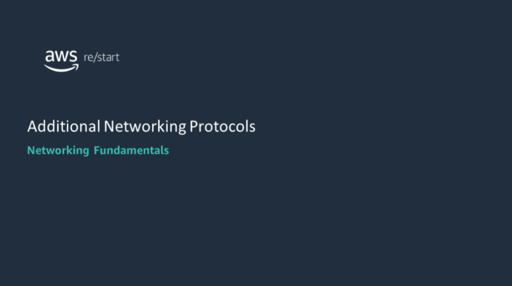

You will learn how to:

- Identify other types of communication protocols
- Describe common transport, application, and network management protocols
- Use tools to discover information about network communications

## Transport, application, management and support protocols

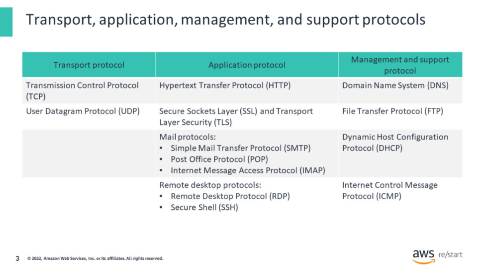

### Communication Protocols

A communication protocol is a system of rules. These rules permit two or more entities of a communications system to transmit information through any variation of a physical quantity.

The different types of communication protocols include:

- Transport protocols
- Application protocols
- Management protocols
- Support protocols

### Transport Protocols

Transport protocols run over the best-effort IP layer to provide a mechanism for applications to communicate with each other. The two general types of transport protocols are:

- Connectionless protocol (User Datagram Protocol)
- Connection-oriented protocol (Transmission Control Protocol)

### Application Protocols

Application protocols govern various processes, from downloading a webpage to sending an email. Examples include:

- HTTP
- SSL
- TLS
- Mail protocols (SMTP, POP, and IMAP)
- Remote desktop protocols (RDP and SSH)

### Management Protocols

Management protocols are used to configure and maintain network equipment.

### Support Protocols

Support protocols facilitate and improve network communications.

## The OSI model

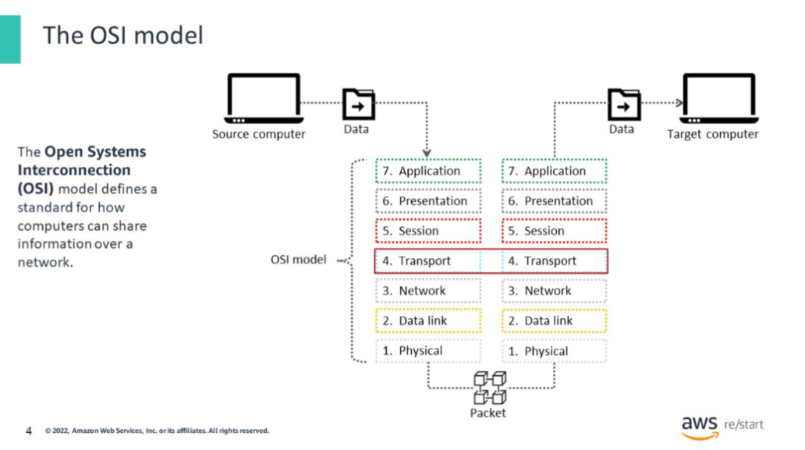

You might recall the mention of Open Systems Interconnection (OSI) in your previous
learning. The OSI model defines a standard for how computers can share information
over a network regardless of the hardware or software that they use. The model
divides the processing of data that is sent over a network into seven layers.
The diagram illustrates how data flows in an OSI-compliant network from a source
computer to a target computer.

In the OSI model, the protocol layer above the internet layer is the transport layer.
The two most important protocols in the transport layer are TCP and UDP. TCP
provides reliable data delivery service with end-to-end error detection and
correction, and UDP provides low-overhead, connectionless datagram delivery
service. Both protocols deliver data between the application layer and the internet
layer.

Why is this information important for issues and troubleshooting?
Because TCP and UDP use ports for communication, most layer 4 transport problems
revolve around ports being blocked. When troubleshooting layer 4 communications
issues, first make sure that no access lists or firewalls are blocking TCP/UPD ports.
Remember that the transport layer controls the reliability of any given link through
flow control, segmentation and desegmentation, and error control. Some protocols
can keep track of the segments and retransmit the ones that fail. The transport layer
acknowledges successful data transmission and sends the next data if no errors have
occurred. The transport layer creates packets from the data that it receives from the
upper layers.

## Transport protocols

### TCP

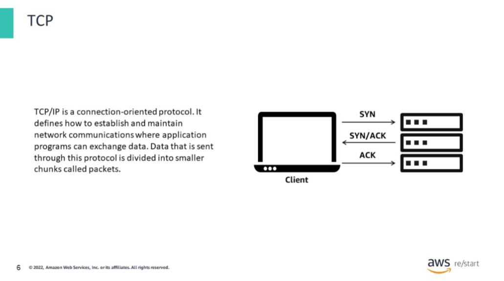

Recall that you first learned about TCP/IP earlier in this module. When TCP combines
with Internet Protocol (IP), they form the TCP/IP protocol suite, a set of protocols
that the internet runs on.

TCP/IP is a connection-oriented protocol. It defines how to establish and maintain
network communications where application programs can exchange data. Data that
is sent through this protocol is divided into smaller chunks called packets.

The goal of TCP/IP was to support an interconnection of networks, which was
referred to as an internetwork, or internet. The internet comprises the groups of
networks that communicate over this protocol.

In terms of the OSI model, TCP is a transport-layer protocol. It provides reliable
virtual-circuit connection between applications; that is, a connection is established
before data transmission begins. Data is sent without errors or duplication and is
received in the same order as it is sent. No boundaries are imposed on the data; TCP
treats the data as a stream of bytes.

### UDP

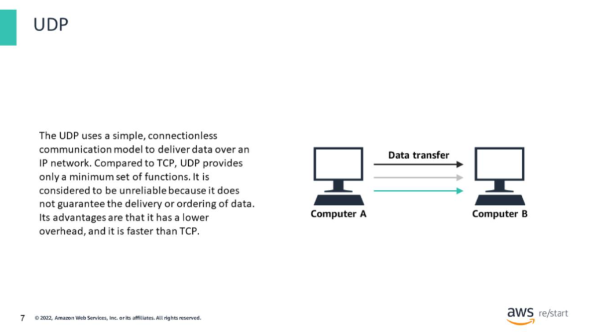

The UDP uses a simple, connectionless communication model to deliver data over an
IP network. Compared to TCP, UDP provides only a minimum set of functions. It is
considered to be unreliable because it does not guarantee the delivery or ordering of
data. Its advantages are that it has a lower overhead, and it is faster than TCP.

Applications that value speed over guaranteed delivery use UDP. Examples include
video chat and video streaming. A missed packet might cause a short pause in the
video, but the video will still be mostly understandable. However, if the users must
wait for all packets to be confirmed and ordered correctly, the delays can severely
affect the quality of their experience.

In terms of the OSI model, UDP is also a transport-layer protocol and is an alternative
to TCP. It provides an unreliable datagram connection between applications. Data is
transmitted link by link; there is no end-to-end connection. The service provides no
guarantees. Data can be lost or duplicated, and datagrams can arrive out of order.

### TCP vs. UDP

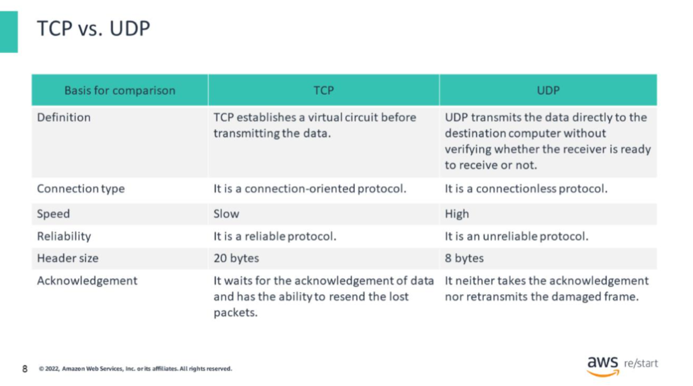

In comparison, TCP is a connection-oriented protocol, which requires that hosts
establish a logical connection with each other before communication can occur. This
connection is sometimes called a virtual circuit, although the actual data flow uses a
packet-switching network.

UDP is a connectionless protocol that treats each datagram as independent from all
others. Each datagram must contain all the information that is required for its
delivery.

### Network protocols

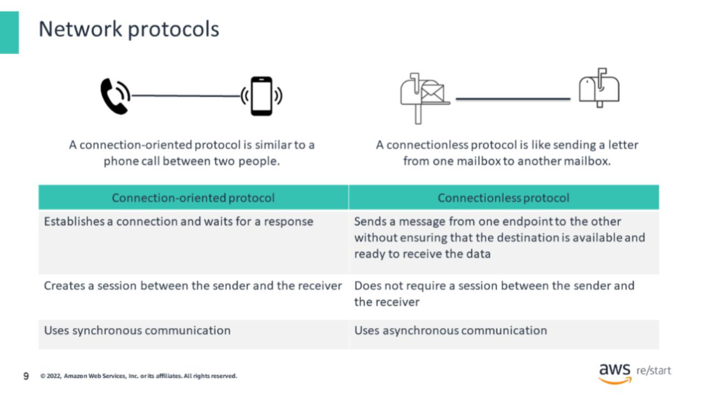

A network protocol defines therules for formatting and transmitting databetween devices on a network. It typically operates at layer 3 (network) or layer 4 (transport) of the OSI model.

Network protocols fall into two general categories:connection-orientedprotocols orconnectionlessprotocols.

### TCP handshake

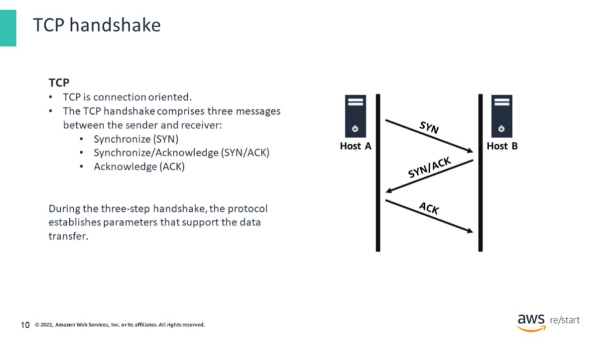

TCP is great for transferring important files because connection is guaranteed even
though it has a larger overhead (time). It is connection oriented.

TCP has something that is called the TCP handshake. This handshake comprises three
messages:

- Synchronize (SYN)
- Synchronize/Acknowledge (SYN/ACK)
- Acknowledge (ACK)

During this handshake, the protocol establishes parameters that support the data
transfer between two hosts. For example:

- Host A sends a SYN packet to Host B.
- Host B sends the SYN with an ACK attached to acknowledge that they received it
 with the message back to Host A.
- Host A sends the last message with ACK to Host B informing them that they
 received the SYN/ACK message.

Another process gracefully closes the communication between the sender and
receiver (similar to saying goodbye to someone) with three messages:

- Finish (FIN)
- Finish/Acknowledge (FIN/ACK)
- Acknowledge (ACK)

There are also flags called reset (RST) flags when a connection closes abruptly and
causes an error.

## Application protocols

### HTTP

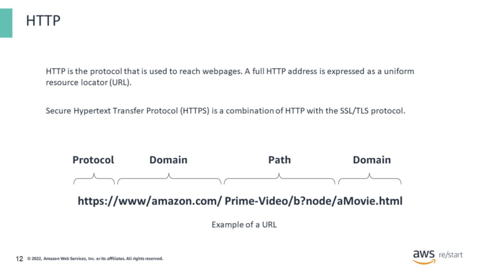

HTTP is the protocol that is used to reach webpages. A full HTTP address is expressed as a uniform resource locator (URL).

Secure Hypertext Transfer Protocol (HTTPS) is a combination of HTTP with the SSL/TLS protocol.

### SSL and TLS

SSL is a standard for securing and safeguarding communications between two
systems by using encryption. TLS is an updated version of SSL that is more secure.
Many security and standards organizations—such as Payment Card Industry Security
Standards Council (PCI SSC)—require organizations to use TLS version 1.2 to retain
certification.

A TLS handshake is the process that initiates a communication session that uses TLS
encryption. During a TLS handshake, the two communicating sides exchange
messages to acknowledge each other and verify each other. They establish the
encryption algorithms that they will use, and agree on session keys. TLS handshakes
are a foundational part of how HTTPS works.

SSL/TLS creates a secure channel between a user's computer and other devices as
they exchange information over the internet. They using three main concepts—
encryption, authentication, and integrity—to accomplish this result. Encryption hides
data that is being transferred from any third parties. Without SSL/TLS, data gets sent
as plain text, and malicious actors can eavesdrop or alter this data. SSL/TLS offers
point-to-point protection to ensure that the data is secure during transport.

To provision, manage, and deploy public and private SSL/TLS certificates for use with
AWS services and internal connected resources, you need AWS Certificate Manager
(ACM).

### Mail protocols (SMTP, POP & IMAP)

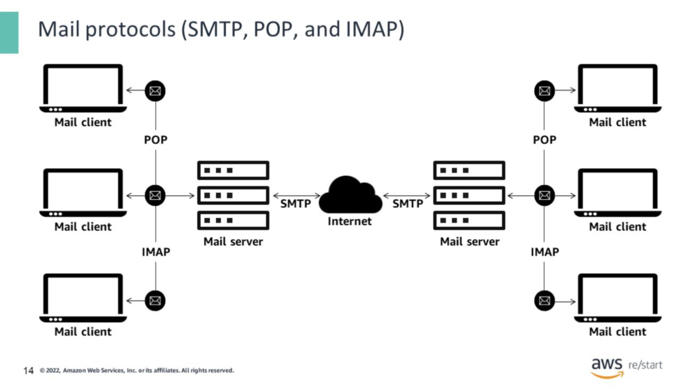

SMTP is used to transfer email messages between mail servers.

Email clients use POP and IMAP to retrieve email messages from the mail server.

### Remote desktop protocols (RDP and SSH)

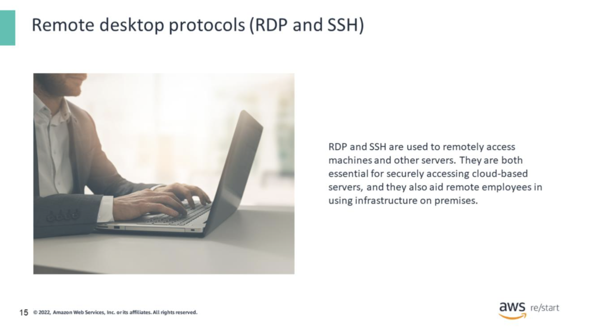

RDP is a protocol that is used to access the desktop of a remote Microsoft Windows
computer. Use port 3389 with clients that are available on different operating
systems.

SSH is a protocol that opens a secure command line interface (CLI) on a remote Linux
or Unix computer. The standard TCP port for SSH is 22. SSH is generally used to
access Unix-like operating systems, but it can also be used on Microsoft Windows.
Windows 10 uses OpenSSH as its default SSH client and SSH server.

RDP and SSH are both used to remotely access machines and other servers. They're
both essential for securely accessing cloud-based servers, and they also aid remote
employees in using infrastructure on premises.

### Application protocol port numbers

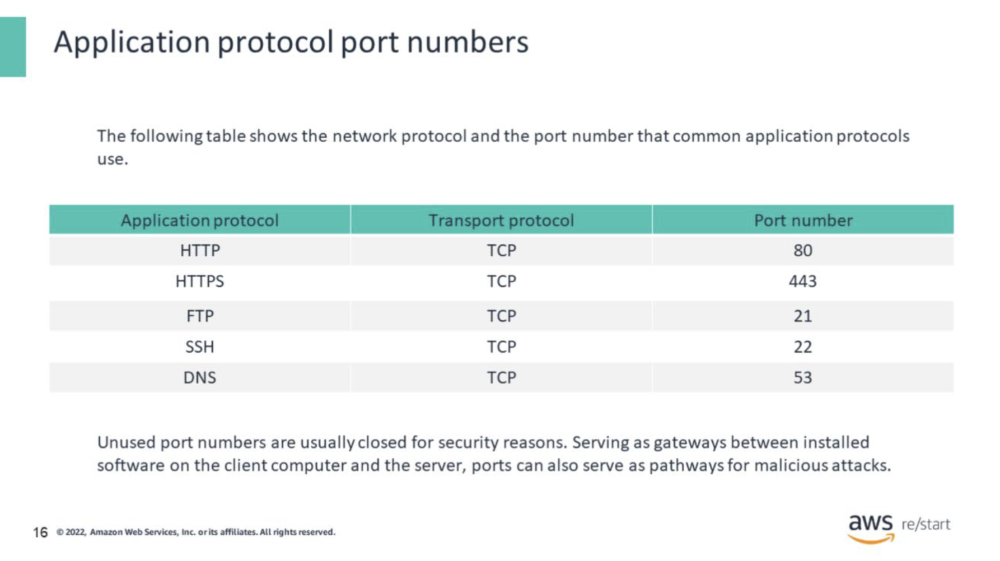

Application protocols, such as HTTP and FTP, have assigned port numbers. The next
section will discuss FTP and DNS in more detail.

These numbers are data endpoints. The ports provide devices with a way to
understand what to do with the data that they receive. For example, a computer
might download a file over FTP. The computer connects to the server and downloads
the data over port 21. The computer knows how to handle that data because of the
port that it used. Thus, the computer is able to complete the download.

Unused port numbers are usually closed for security reasons. Serving as gateways
between installed software on the client computer and the server, ports can also
serve as pathways for malicious attacks.

Most of the application protocols fall under the application layer (layer 7) of the OSI
model. A few examples of application layer protocols are HTTP, FTP, POP, SMTP, and
DNS.

## Management and support protocols

### Examples of management and support protocols

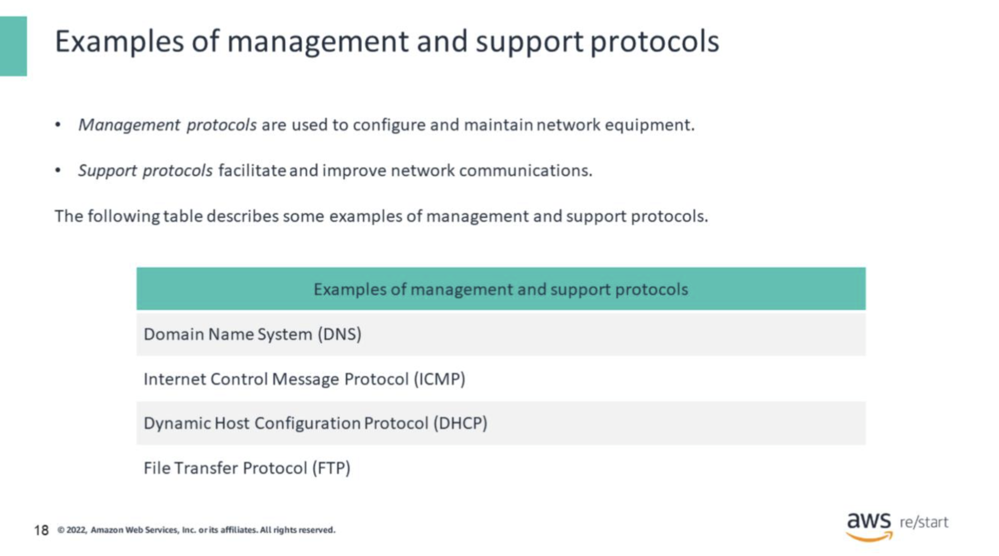

Management protocols are used to configure and maintain network equipment.
Support protocols enable and improve network communications.

Here are the examples of management and support protocols:

- DNS
- ICMP
- DHCP
- FTP

### DNS

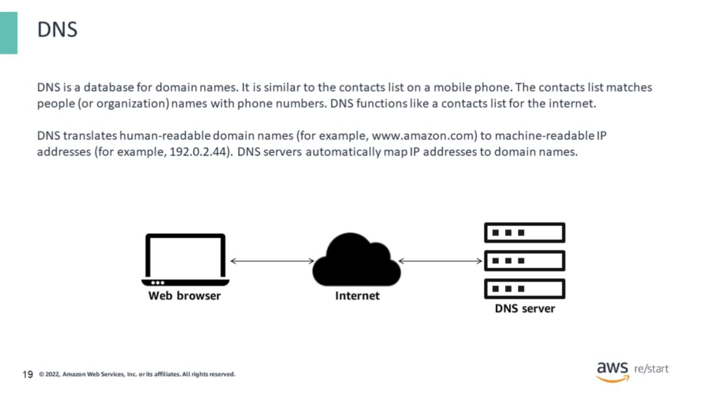

DNS is a database for domain names. It is similar to the contacts list on a mobile phone. The contacts list matches people’s (or organization’s) names with phone numbers. DNS functions like a contacts list for the internet.

DNS translates human-readable domain names (for example, [www.amazon.com](www.amazon.com)) to machine-readable IP addresses (for example, 192.0.2.44). DNS servers automatically map IP addresses to domain names.

### ICMP

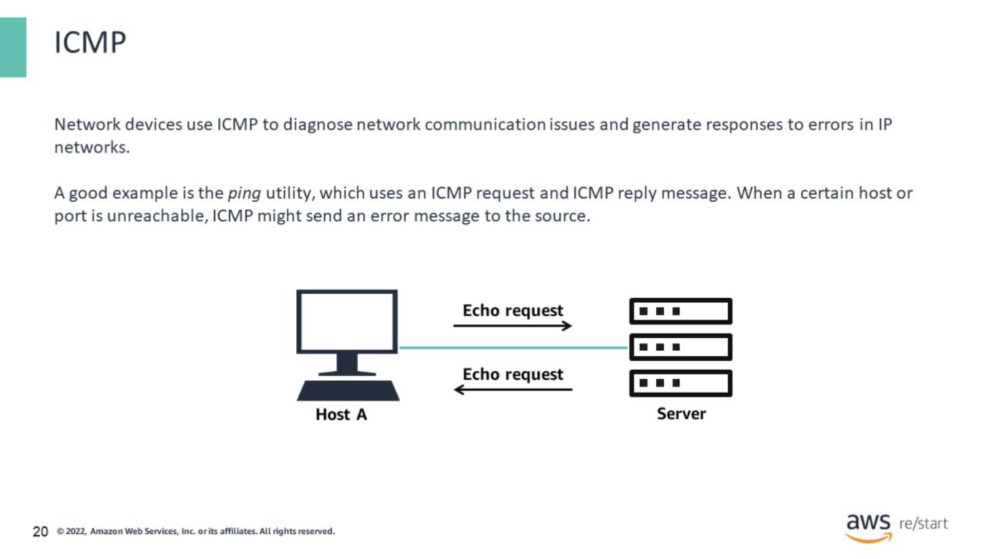

Network devices use ICMP to diagnose network communication issues and generate
responses to errors in IP networks.

A good example is the ping utility, which uses an ICMP request and ICMP reply
message. When a certain host or port is unreachable, ICMP might send an error
message to the source.

### DHCP

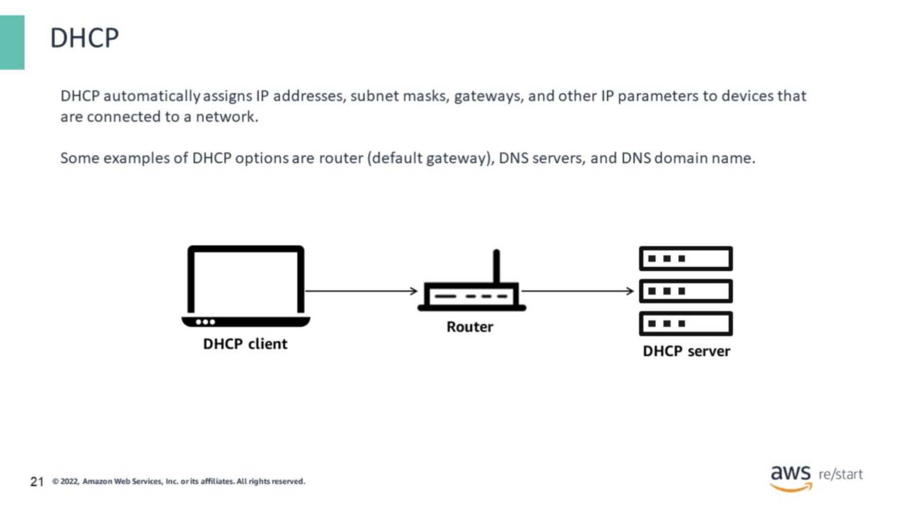

DHCP automatically assigns IP addresses, subnet masks, gateways, and other IP parameters to devices that are connected to a network.

Some examples of DHCP options are router (default gateway), DNS servers, and DNS domain name.

### FTP

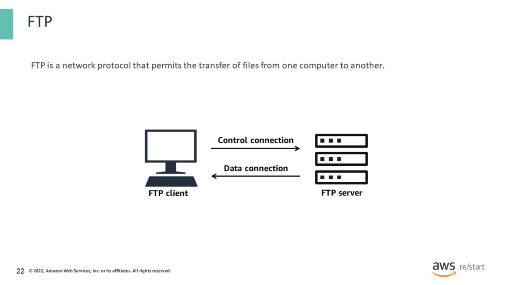

FTP is a network protocol that authorizes the transfer of files from one computer to another. FTP performs two basic functions: PUT and GET. If you have downloaded something such as an image or a file, then you probably used an FTP server.

### Common network utilities

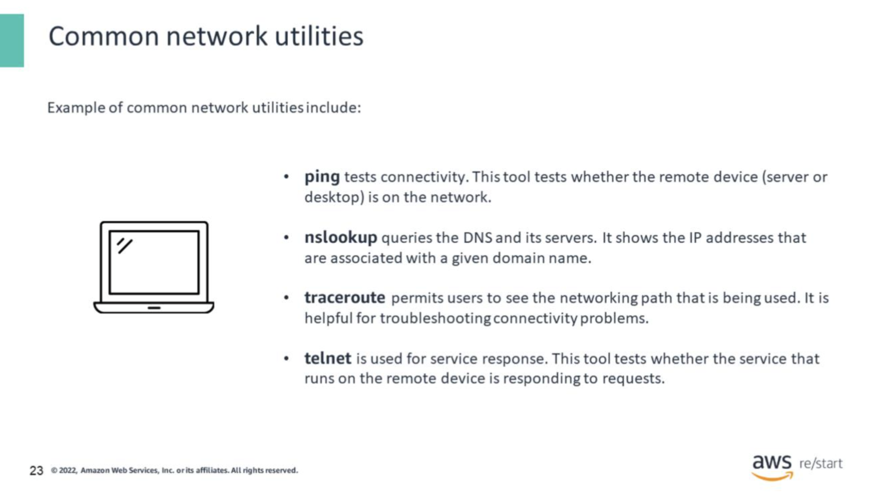

When you work with networks, it is important to check network performance,
bandwidth usage, and network configurations. The following list contains a few
common network utilities that you can use to quickly troubleshoot network issues.
These tools can help ensure uninterrupted service and prevent long delays.

Example of common network utilities include:

- **ping** tests connectivity. This tool tests whether the remote device (server or
 desktop) is on the network.
- **nslookup** queries the DNS and its servers. It shows the IP addresses that are
 associated with a given domain name.
- **traceroute** permits users to see the networking path that is used. It is helpful
 for troubleshooting connectivity problems.
- **telnet** is used for service response. This tool tests whether the service that runs
 on the remote device is responding to requests.
 
### hping3

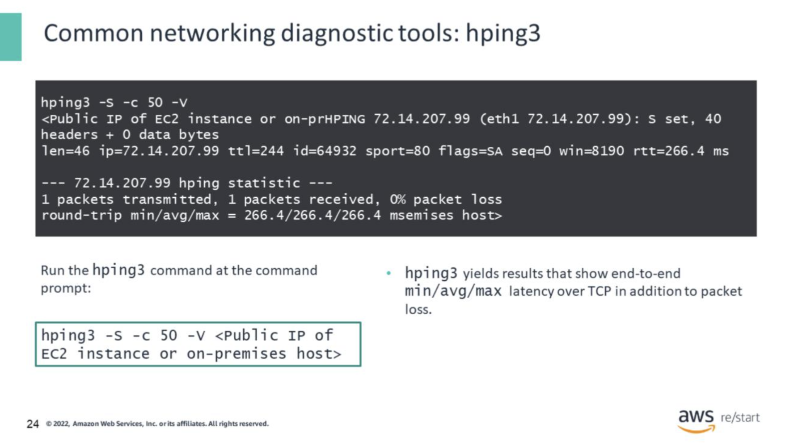

You might need to troubleshoot network performance issues such as packet loss or
latency issues in your running instance of your VPC. When doing so, it is best to use a
networking diagnostic utility that will help you identify the trouble spots in the
network. The next few slides contain commands that you will type into your Linux
command prompt.

Before you begin, be sure that you have enabled **enhanced networking** on your
instance.

hping3 is a command line-oriented TCP/IP packet assembler and analyzer that
measures end-to-end packet loss and latency over a TCP connection.

This command will scan port 80 on Google. As you can see from the output, the
returned packet from Google has SYN and ACK flags set, which indicates an open
port.

### traceroute

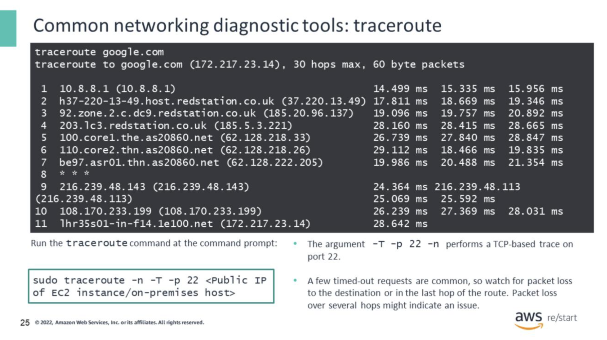

The Linux traceroute utility identifies the path that is taken from a client node to the
destination node. The utility records the time in milliseconds for each router to
respond to the request. To troubleshoot network connectivity by using traceroute,
run the command from the client to the server and from the server back to the client.

The output shows a number of results:

- The first line shows the hostname and the IP address that is to be reached. It also
 displays the maximum number of hops to the host that traceroute will attempt
 and the size of the byte packets to be sent.
- Then, each line lists a hop to get to the destination. The hostname is given
 followed by the IP address of the hostname. Next is the roundtrip time that it
 takes for a packet to get to the host and back to the initiating computer.

### mtr

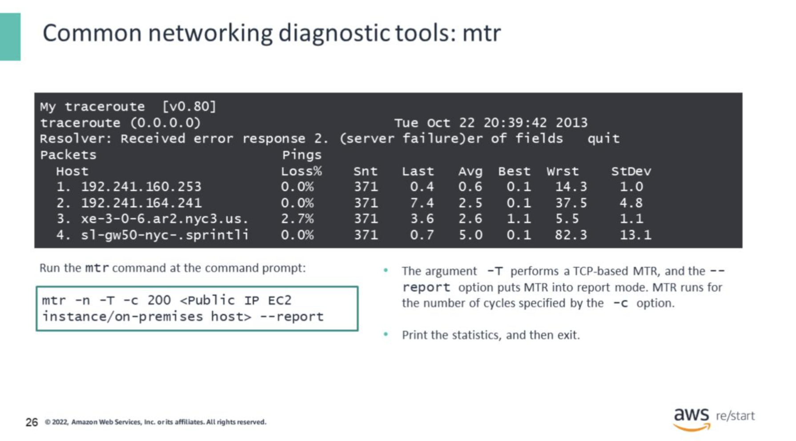

Linux mtr is a command that you type into the command prompt that provides
continual, updated output, which you can use to analyze network performance.

You run the command and review the results to identify any packet loss. If you notice
sustained packet loss, it might indicate a problem.

Though the output might look similar to the traceroute results, the advantage over
traceroute is that the output is constantly updated. With these continual updates,
you can track the trends and averages, and you can also see how the network
performance varies over time.

### Telnet

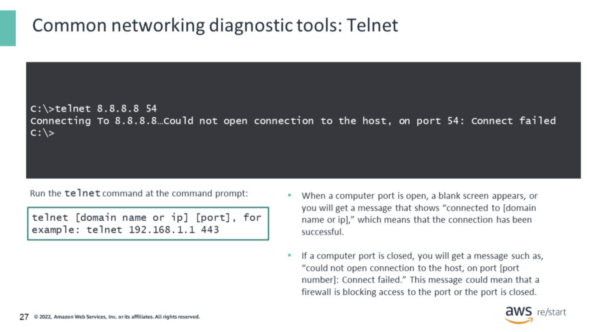

You can use telnet to test individual ports and see whether they are open or not.

### nslookup

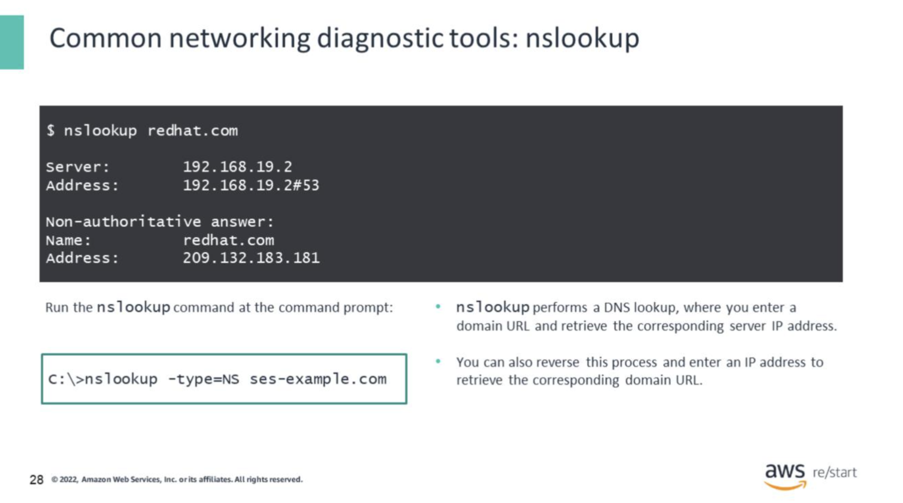

**nslookup** is a network administration command-line tool for querying the DNS to obtain the mapping between domain name and IP address, or other DNS records.

#### Conclusion

With **hping3**, **traceroute**, **mtr**, **telnet**, and **nslookup**, you can diagnose in real time which servers’ domain or addresses are causing issues on your network. This information can be useful when troubleshooting an internal network when you are experiencing network problems.

## Key Takeaways

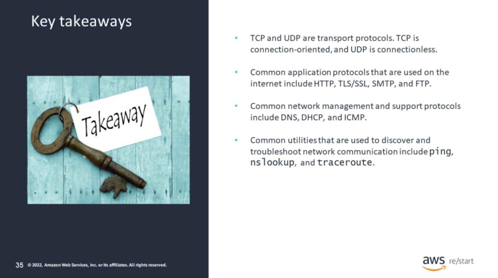
:::tip[Recap]

- **TCP and UDP** are transport protocols. TCP is connection-oriented, and UDP is connectionless.
- Common application protocols that are used on the internet include **HTTP**, **TLS/SSL**, **SMTP**, and **FTP**.
- Common network management and support protocols include **DNS**, **DHCP**, and **ICMP**.
- Common utilities that are used to discover and troubleshoot network communication include **ping**, **nslookup**, and **traceroute**.

:::
