You will learn how to:

- List wireless technologies and their characteristics
- Identify the primary goal of the Internet of Things (IoT)
- Define bring your own device (BYOD) and mobile device management (MDM)

## Wireless technologies

### What are wireless technologies

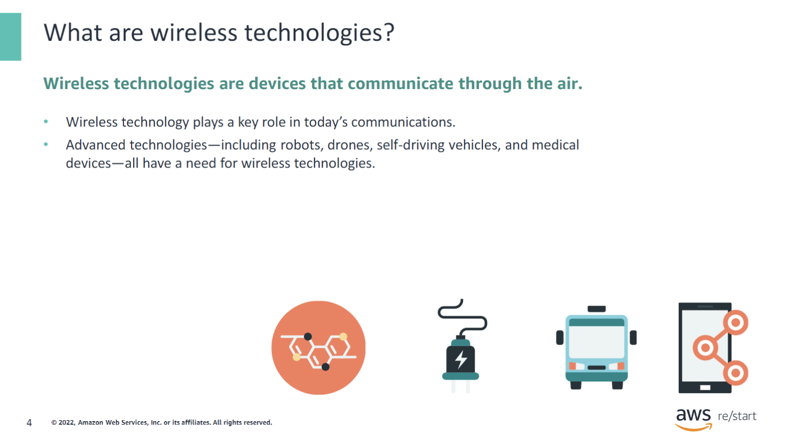

Wireless technologies communicate without the need of a traditional cord attached to them. From landline phones to wireless phones, desktop computers to laptops, and even traditional game consoles, devices have evolved to on-the-go virtual reality (VR). The world has been going wireless with the advancement of technology.

### Examples of wireless technologies

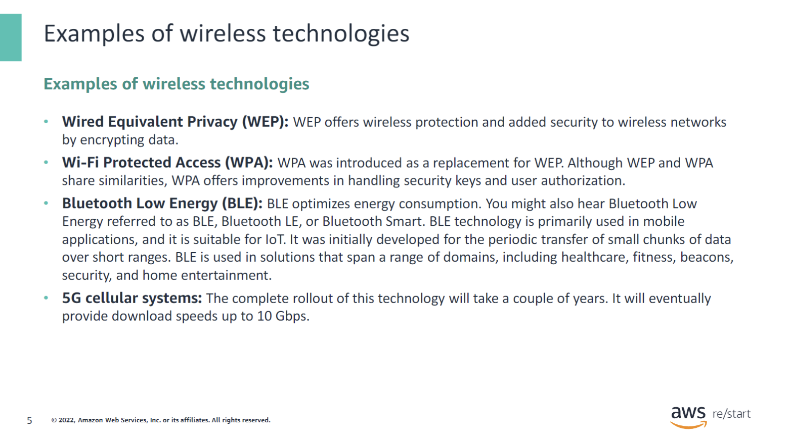

## IoT

### Internet of Things (IoT)

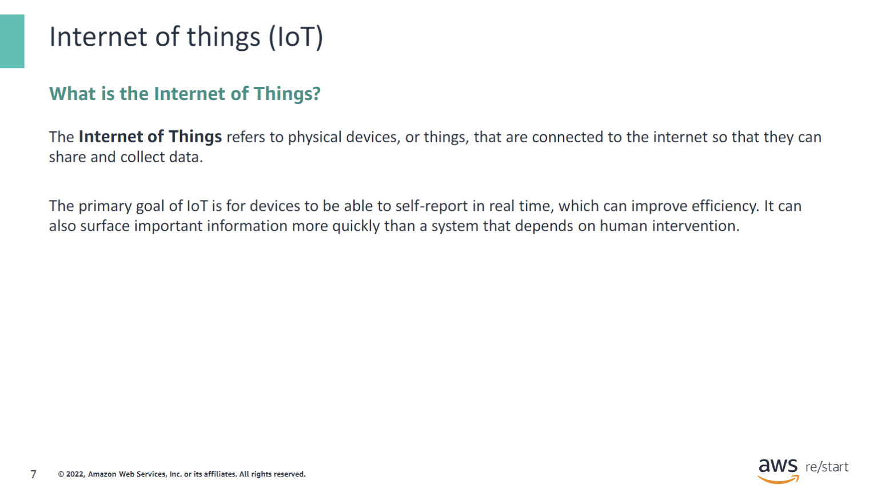

The **Internet of Things** (IoT) refers to physical devices, or things, that are connected to the internet so that they can share and collect data. The primary goal of IoT is for devices to self-report in real time, which can improve efficiency. It can also surface important information more quickly than a system that depends on human intervention.

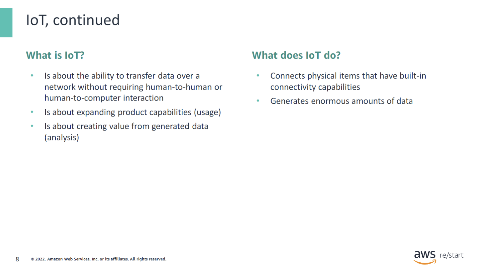

People even use the term Internet of Everything. Things can be thought of as devices or sensors that have the capability to communicate. Many devices are in homes, factories, oil wells, hospitals, cars, and other places that must be connected. Data from these devices can be collected, stored, and analyzed to design better solutions or products. IoT devices include consumer applications (such as thermostats) and commercial applications (such as industrial sensors, smart watches, and smart toasters). They also include devices in the Internet of Medical Things (IoMT), such as health monitors.

### Some IoT devices that you use every day

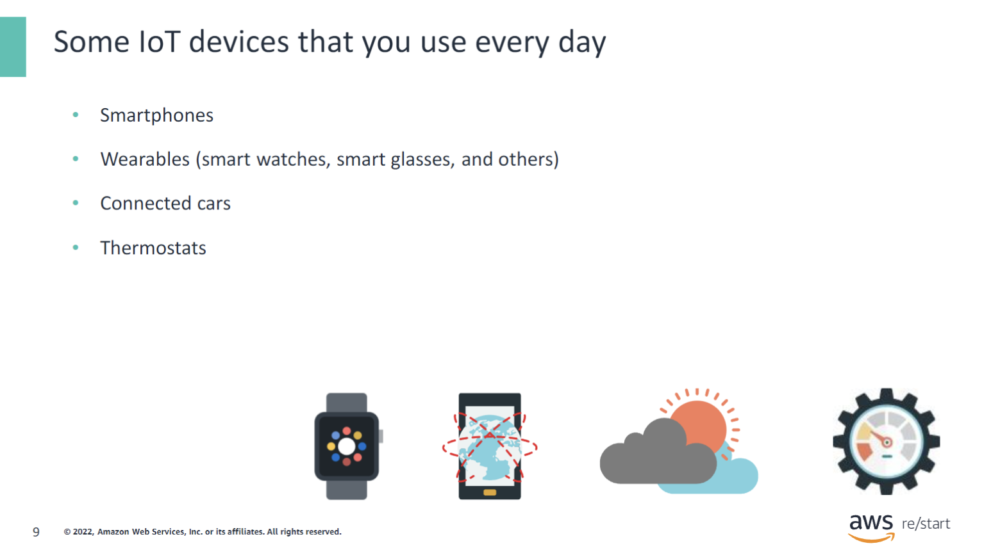

Smartphones are probably the most widely used IoT devices in the world. These devices transfer a large amount of data. Smart watches, like Fitbits and Apple Watches, capture vital health information, which is analyzed to provide key insights into a person’s health.

Today, people are living in the age of self-driven cars and connected cars. These cars come with the intelligence of how to react or what to do when an event occurs. 

Smart meters and thermostats are popular. These devices help residents reduce electric bills by optimizing the control of the temperature at homes and businesses. For example, you can use a smartphone to set the temperature to 72 degrees before you reach home from your office.

### Enterprise IoT devices

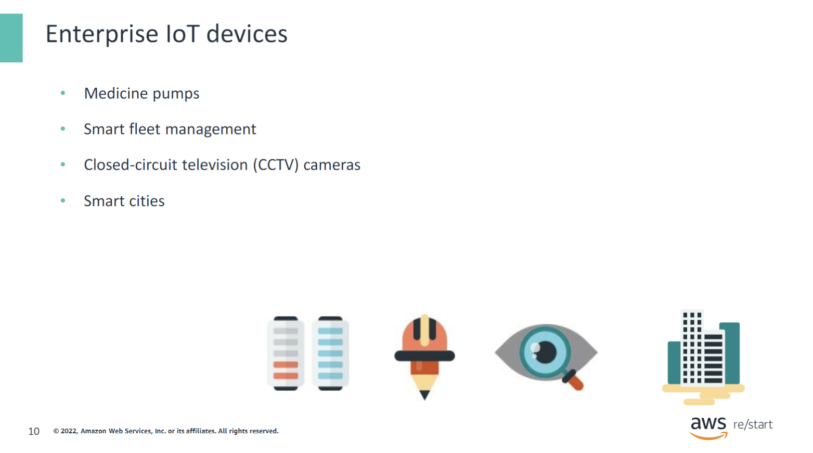

Medicinal pumps and pacemakers have been a huge success in the healthcare space. You can control the dosage and schedule of a medicine and automate the process to eliminate the scope for human error or accidental overdose.

Industries now have a better overview of how their fleets are doing. They can find out whether the drivers are still going to make the scheduled deliveries by remotely tracking the trucks. This information gives them better control over the planning and coordination of tasks.

CCTV cameras have been a popular enterprise-level IoT device that ensures physical security monitoring.

Many countries have started to invest aggressively in the smart cities and smart nations campaigns to make the citizens’ daily activities less cumbersome.

### How IoT devices communicate

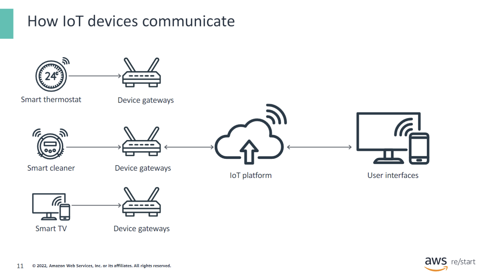

A device can be thought of as a combination of sensors and actuators that gather vast amounts of information from its environment. An example is a temperature sensor that captures the temperature-related details from a living room (which is its environment). These devices are purpose-built and do not come with many compute abilities. For these devices to communicate, they use lightweight protocols such as MQ Telemetry Transport (MQTT), which do not have a big footprint on the device.

The data from the device is typically sent to a device gateway, which then pushes this data onto the cloud-based platform by using the internet (HTTPS). As soon as the data gets to the cloud, software performs some kind of processing on it.

This processing could be very simple, such as checking that the temperature reading is within an acceptable range. It could also be complex, such as using computer vision on video to identify objects (such as intruders in your house).

This data is processed in the platform, and actions are run in a rule-based fashion. Among many other offerings, the platform mainly provides services for data management, analytics, support enhancements of the IoT application, and a user interface.

The user interface, typically a mobile device or a computer, is your window to the IoT world. For example, a user might receive a text alert when the temperature is too high in the company’s cold storage. Also, users might have an interface that they can use to proactively check the system. For example, a user might want to check the video feeds in their house by using a phone app or a web browser.

## AWS IoT Core

### AWS IoT Core communication

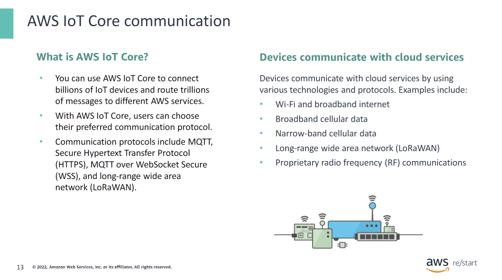

You can use AWS IoT Core to connect billions of IoT devices and route trillions of messages to different AWS services. With AWS IoT Core, users can choose their preferred communication protocol. Communication protocols include MQTT, Secure Hypertext Transfer Protocol Secure (HTTPS), MQTT over WSS, and long-range wide area network (LoRaWAN).

- **MQTT** is a lightweight and widely adopted messaging protocol that is designed for constrained devices.
- **HTTPS** is a protocol that you should recall from previous modules. Clients can publish messages by making requests to the Representational State Transfer (REST) API by using the HTTP 1.0 protocol or the HTTP 1.1 protocol.
- **LoRaWAN** protocol is a low-power, long-range wide area network protocol. AWS IoT Core for LoRaWAN is a fully managed LoRaWAN network server (LNS). With AWS IoT Core for LoRaWAN, users can connect wireless devices that use the LoRaWAN protocol.

## Enterprise mobility

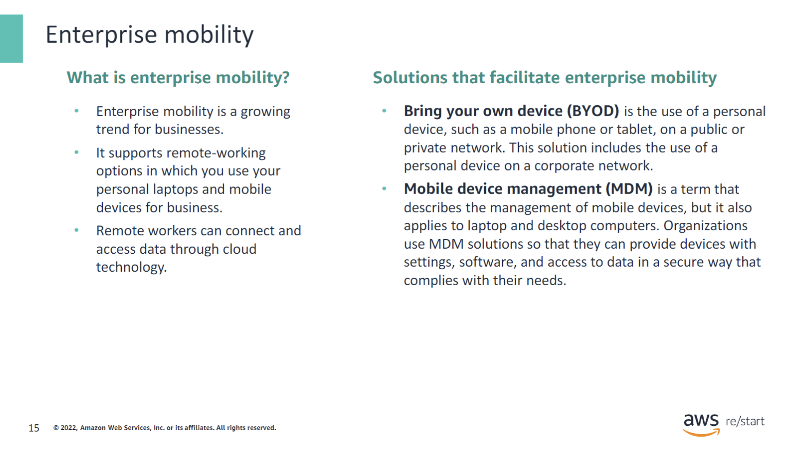

Enterprise mobility is a growing trend for businesses. This approach supports remote-working options, which use personal laptops and mobile devices for business. Remote workers can connect and access data through cloud technology. Two specific solutions enable enterprise mobility:

- **Bring Your Own Device (BYOD)** is the use of a personal device, such as a mobile phone or tablet, on a public or private network. This solution includes the use of a personal device on a corporate network.

- **Mobile Device Management (MDM)** is a term that describes the management of mobile devices, but it also applies to laptop and desktop computers. Organizations use MDM to provide devices with settings, software, and access to data in a secure way that complies with their needs.

### Amazon WorkSpaces

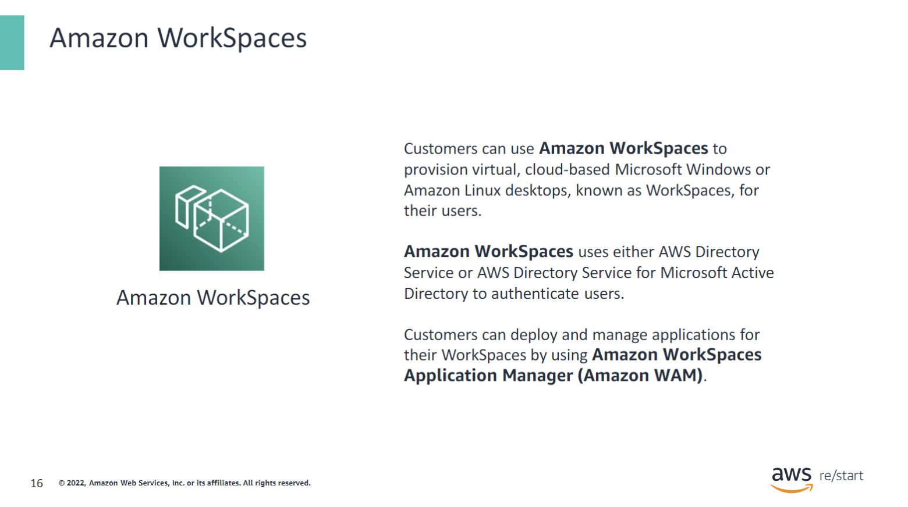

Customers can use **Amazon WorkSpaces** to provision virtual, cloud-based Microsoft Windows or Amazon Linux desktops, known as WorkSpaces, for their users. Amazon WorkSpaces eliminates the need to procure and deploy hardware or install complex software. Customers can quickly add or remove users as their needs change. Users can access their virtual desktops from multiple devices or web browsers.

**Amazon WorkSpaces is:**

- **Simple to manage:** Customers can deploy and manage applications for their WorkSpaces using Amazon WorkSpaces Application Manager (Amazon WAM). They can also use the same tools to manage WorkSpaces that they use to manage on-premises desktops.

- **Secure:** Amazon WorkSpaces uses either AWS Directory Service or AWS Managed Microsoft AD to authenticate users. Customers can add multi-factor authentication (MFA) for additional security. They can use AWS Key Management Service (AWS KMS) to encrypt data at rest, disk I/O, and volume snapshots. Customers can also control the IP addresses of users that are allowed to access their WorkSpaces.

- **Scale consistently:** Customers can increase the size of the root and user volumes for a WorkSpace, up to 1000 GB each. They can expand these volumes whether they are encrypted or unencrypted. Customers can request a volume expansion once in a 6-hour period. To ensure data preservation, customers cannot decrease the size of the root or user volumes after they launch a WorkSpace.

Different bundles are available. For example, a user can switch a WorkSpace between the Value, Standard, Performance, Power, and PowerPro bundles. When they request a bundle change, Amazon WorkSpaces restarts the WorkSpace using the new bundle while preserving the operating system, applications, data, and storage settings for the WorkSpace.

Amazon WorkSpaces provides monthly or hourly billing options. With monthly billing, customers pay a fixed fee for unlimited usage, which is best for users who use their WorkSpaces full time. With hourly billing, customers pay a small fixed monthly fee per WorkSpace plus a low hourly rate for each hour that the WorkSpace is running.

#### WorkSpaces use cases

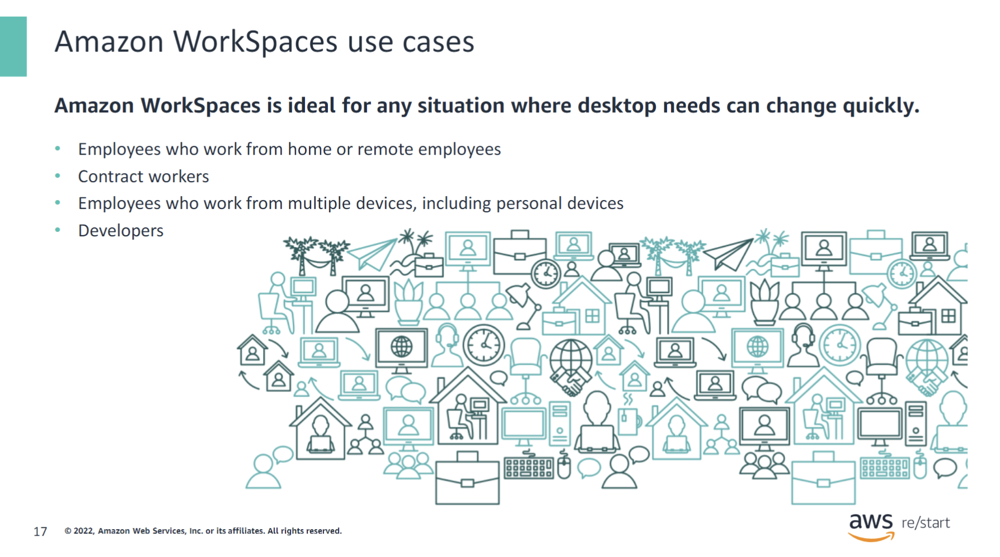

### Who should use Amazon WorkSpaces?

Amazon WorkSpaces is an ideal solution for any organization whose desktop needs change quickly. The use cases for Amazon WorkSpaces are nearly endless, but some of the most common use cases include:

- Employees who work from home or remote employees
- Contract workers
- Employees who work from multiple devices, including personal devices
- Developers after a merger and acquisition

AWS offers a variety of Amazon WorkSpaces bundles with different hardware and software configurations.

## Checkpoint questions

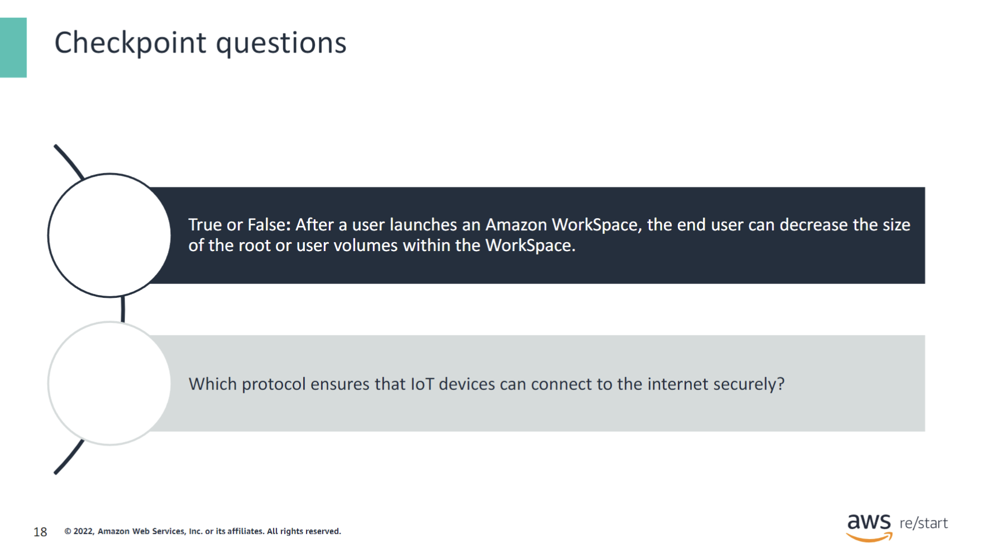

**True or False:** After a user launches an Amazon WorkSpace, the end user can decrease the size of the root or user volumes within the WorkSpace.  
**False.** After a user launches an Amazon WorkSpace, the end user cannot decrease the size of the root or user volumes within the WorkSpace.

**Which protocol ensures that IoT devices can connect to the internet securely?**  
**HTTPS**

## Key takeaways

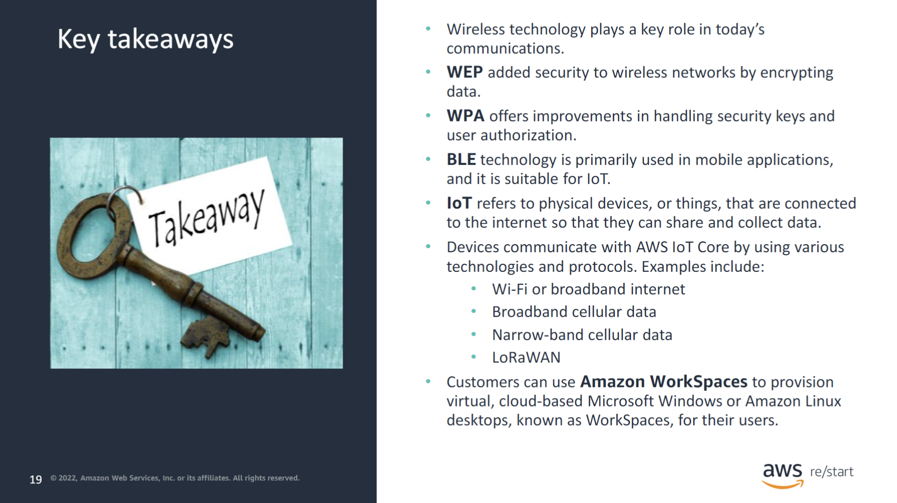

:::tip[Recap]

- Wireless technology plays a key role in today’s communications.
- WEP added security to wireless networks by encrypting data.
- WPA offers improvements in handling security keys and user authorization.
- BLE technology is primarily used in mobile applications and is suitable for IoT.
- IoT refers to physical devices, or things, that are connected to the internet so that they can share and collect data.
- Devices communicate with AWS IoT Core by using various technologies and protocols. Examples include:
  - Wi-Fi or broadband internet
  - Broadband cellular data
  - Narrow-band cellular data
  - LoRaWAN
- Customers can use Amazon WorkSpaces to provision virtual, cloud-based Microsoft Windows or Amazon Linux desktops, known as WorkSpaces, for their users.

:::
