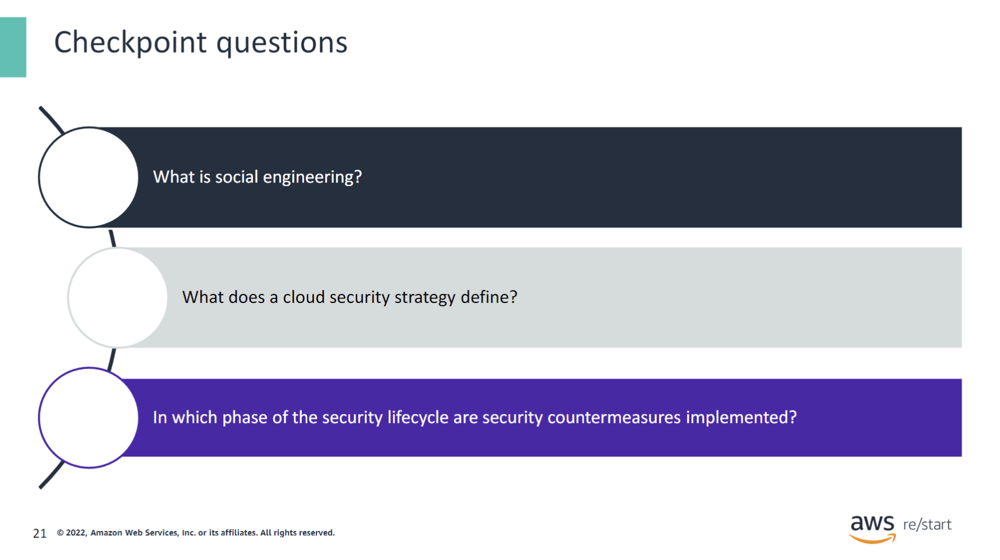

:::tip[In this lesson, you will learn how to:]

- Define key security terms
- Identify different types of security threats
- Identify the components that comprise a security strategy
- List the types of security controls
- Name the stages of the security lifecycle

:::

## What is security

Security can be generally defined as the practice of protecting valuable assets. These assets can be physical, such as people, computers, and buildings, or digital, such as software applications and user data. Security attempts to ensure that only authorized personnel are allowed access to these assets and protects these assets from malicious modification, theft, or destruction so that they can be used according to their intended purpose.

Cybersecurity is particularly concerned with the protection of networks, computers, and systems to ensure the confidentiality, integrity, and availability (CIA) of the digital information that they contain.

### Confidentiality, integrity, and availability (CIA)

The confidentiality, integrity, and availability (CIA) triad represents three important security aspects that must be considered when protecting information. They are defined as follows:

- **Confidentiality** protects the privacy of the information by preventing unauthorized access to it. A common method to ensure confidentiality, for example, is to first ask users to identify themselves before they are allowed to use a system. This process is known as authentication.

- **Integrity** ensures that the information is always accurate and correct where it is stored and whenever it is moved. The data cannot be altered by unauthorized users as it moves inside and outside its containing system or when it reaches its final storage location. Hashing is an example of a technique that can be used to ensure that data has not been tampered with during transit.

- **Availability** ensures that the information is accessible to users when they need it. Businesses typically address availability requirements by creating plans such as a business continuity plan (BCP) and a disaster recovery plan (DRP). These plans define processes and procedures to maintain or quickly restore the availability of the systems containing the information in the event of failure or disruption.

You will learn more about the methods for ensuring the confidentiality, integrity, and availability of information in the upcoming modules.

### Basic security terms

The following scenario explains the basic security terms that this slide lists:

1. **Attacker**: An entity that wants to maliciously affect a system.

2. **Vulnerability**: The attacker searches for a vulnerability in the system that they can exploit. A vulnerability is a weakness that exists usually due to an oversight, flaw, or error in the system.

3. **Threat**: When the attacker finds a vulnerability, they create an event that is capable of causing a negative impact on the system through the vulnerability. This is called a threat.

4. **Breach or Incident**: If the threat is successful and the system is compromised, a breach or incident has occurred.

5. **Control**: When the breach is detected, the owner of the system implements a control to eliminate the vulnerability that attackers used to carry out the breach.

### Why is security important?

Security has become crucial for everyone because computers and related technologies are integrated into our work environments and personal lives more each day. As more valued information is put on systems, the types and number of threats continue to increase. It is commonplace today to hear reports in the news of government agencies, financial companies, and other businesses with an internet presence being hacked (that is, breached).

To quantify the magnitude of the problem, a study conducted by Verizon estimates that 13,256 data breach incidents were recorded in North America alone in 2020.

*Source:* Verizon. 2021. 2021 Data Breach Investigations Report (DBIR). Accessed November 23, 2021. [Verizon 2021 Data Breach Investigations Report](https://enterprise.verizon.com/business/resources/reports/2021-data-breach-investigations-report.pdf).

The consequences of a breach can affect both individuals and businesses. For example, identity theft is an event that targets an individual’s personally identifiable information (PII), such as their name, date of birth, and passwords. It can result in the individual losing control of their bank and credit card accounts. Similarly, an attacker might steal confidential company data or intellectual property. The attacker may then try to sell the data or exact a ransom to give it back to the company. 

In addition, a business may experience damage to its reputation as a result of a security breach. Customers may lose confidence in the company’s ability to protect information, leading to more monetary loss for the company. 

In summary, security breaches are costly. Consider the following additional research data statistics:

- The average time it takes to identify and contain a data breach is 287 days.*
- The cost of recovering from the loss of one PII record is $180.*
- The total cost of a data breach has increased by 10 percent from 2020 to 2021.*

*Sources:*

Ponemon Institute. 2021. Cost of a Data Breach Report 2021. Accessed November 23, 2021. [Cost of a Data Breach Report 2021](https://www.ibm.com/account/reg/us-en/signup?formid=urx-50915).

### Security breach example

The impact and reach of this data breach example emphasize the importance of security in today’s connected digital world.

*Source:*

- Reuters. 2020. U.S. Homeland Security, thousands of businesses scramble after suspected Russian hack. Accessed November 23, 2021. [U.S. Homeland Security, thousands of businesses scramble after suspected Russian hack](https://www.reuters.com/article/global-cyber-idUSKBN28O1Z3).

### Types of threats

This table lists common types of threats and identifies the areas of the CIA triad that they affect. The types of threats listed in the first part of the table are malware, ransomware, and denial of service (DoS) attack.

Some examples of malware include the following:

- **Virus:** A program that can corrupt or delete data and propagate itself from one system to another.
- **Spyware:** Code that secretly gathers information on a system and reports it to the attacker.
- **Worm:** A program that spreads itself and consumes resources destructively on a computer.
- **Remote access Trojan (RAT):** A software tool used to gain unauthorized access to a computer in order to control it.

Note that a distributed denial of service (DDoS) is a variation of a DoS threat. A DDoS attack uses multiple machines to flood a target system with multiple requests to prevent the system’s normal use.

The types of threats listed in the second part of the table are man-in-the-middle (MitM) attack, phishing, and social engineering.

According to a Verizon study, *social engineering was among the top techniques used in data breaches in 2021 and accounted for over 30 percent of attacks. In a social engineering attack, an attacker uses psychological manipulation to convince an individual to take an action that compromises security.

Source: [*Verizon. 2021. 2021 Data Breach Investigations Report (DBIR). Accessed November 23, 2021](https://enterprise.verizon.com/business/resources/reports/2021-data-breach-investigations-report.pdfx)

## Security strategy

### What is a security strategy

Businesses need a security strategy to prevent threats, eliminate vulnerabilities, and recover from breaches. At a minimum, a security strategy defines the following:

- **What security measures to implement:** This is achieved through security controls.
- **When to implement security measures:** This is defined in a security lifecycle.

### Security strategy for the cloud

For a cloud environment, the security strategy should also define who is responsible for implementing the different security measures.

### AWS Cloud security shared responsibility model

In the AWS Cloud, the shared responsibility model indicates who is responsible for implementing security measures. In this model, AWS is responsible for security **OF** the cloud, and the customer is responsible for security **IN** the cloud.

AWS handles the security of the physical infrastructure that hosts your resources, which includes the following:

- **Data centers:** These centers are secured with controlled, need-based access and are located in nondescript facilities. In addition, security guards protect them 24 hours a day, 7 days a week.
- **Network infrastructure:** This infrastructure includes routers, switches, load balancers, firewalls, and cabling. It is protected with nearly continuous network monitoring at external boundaries, secure access points, redundant infrastructure, and intrusion detection.
- **Virtualization infrastructure:** Each compute instance is isolated from other instances.

Customers are responsible for the security of everything they put in the cloud. In particular, the customer is responsible for managing the security of their data, including the following:

- Which country that data is stored in
- Whether or not the data is encrypted
- Who has access to the data, and how those access rights are granted, managed, and revoked

### What are security controls

Security controls are measures that protect against threats and eliminate vulnerabilities. There are three types of security controls: preventive, detective, and corrective. For each type of control, you can implement physical, technical, and administrative security measures to ensure information confidentiality, integrity, and availability.

- **Preventative security control:** Protects a system from security threats before they can happen.
- **Detective security control:** Helps find a vulnerability early or quickly alert when a breach has happened.
- **Corrective security control:** Remediates a security breach.

Each type of control provides protection in three different security areas: physical, administrative, and technical.

- **Physical control:** A device or object, such as a security camera.
- **Administrative control:** A policy or a procedure that must be followed.
- **Technical control:** Software that provides security functions.

Note that each type of security control represents three stages of a security lifecycle. In the next lessons, you will learn about specific security controls that you can implement in each phase of the security lifecycle.

### Security control type examples

This table provides some examples of preventative, detective, and corrective security controls. Each example is further categorized as a physical, administrative, or technical control.

For the preventative security control type, a card reader device that allows access to a building is an example of a physical control. To complement this control, a corporate policy should exist requiring that all persons who access the building swipe their individual cards to enter and exit. This is an example of a administrative preventative control. Finally, a software application that collects and monitors the data from the card readers is as an example of a technical preventative security control.

Typically, when implementing a security control, start by controlling the physical access to the resource if possible and applicable. Then, establish policies and procedures that describe how to define, set up, and manage the security of the resource. Finally, use a technical control to enforce secure access and usage of the resource.

### Security lifecycle

An effective security strategy addresses security in stages of a lifecycle. These stages consist of prevention, detection, response, and analysis. Note that the first three stages correspond to the three types of security controls.

In the prevention stage, you identify the assets to be protected, assess their vulnerabilities, and implement measures to remove any discovered vulnerability.

In the detection stage, you implement monitoring solutions to quickly identify and generate alerts if a breach is detected.

In the response (or corrective) stage, you perform the corrective tasks to eliminate the breach and restore normal operations.

Finally, in the analysis stage, you review the steps used to resolve the issue and identify any lessons learned. If necessary, you update your security policies and procedures to make adjustments based on the result of the analysis.

In the next lessons, you will examine the details of each phase of the security lifecycle, including the security controls that each one uses.

## Checkpoint questions

1. Social engineering is a type of security threat where an attacker uses human interaction to manipulate a person into revealing sensitive information.

Answer

2. A cloud security strategy defines:
    - What security measures to implement (security controls)
    - When to implement security measures (security lifecycle)
    - Who is responsible to implement security measures (security responsibility)

Answer

3. Security countermeasures are implemented in the Prevention phase of the security lifecycle.

Answer

## Key Takeaways

:::tip[Recap]
Key takeaways from this lesson include the following:

- Security is the practice of protecting valuable assets.
- Confidentiality, integrity, and availability are three important perspectives when addressing information security.
- Common types of security issues include malware, phishing, and social engineering.
- An effective security strategy implements security controls throughout a security lifecycle. A cloud security strategy also defines security responsibilities.
- Security controls can be physical, administrative, or technical.
- The phases of the security lifecycle are prevention, detection, response, and analysis.

:::
