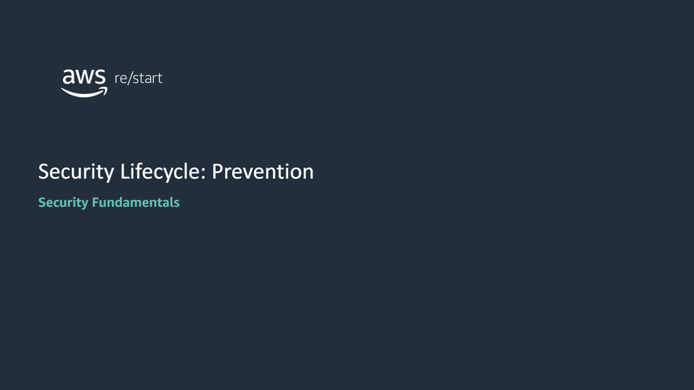
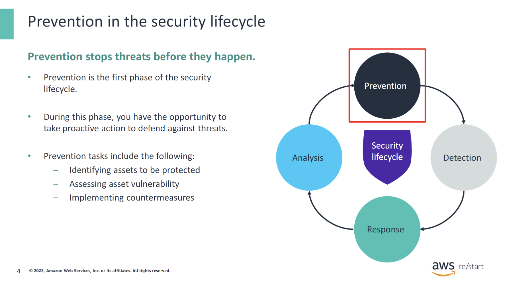
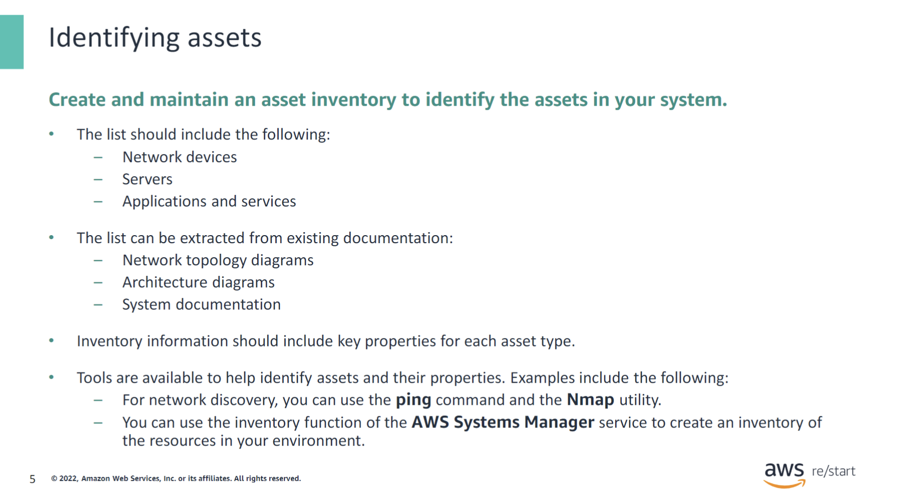
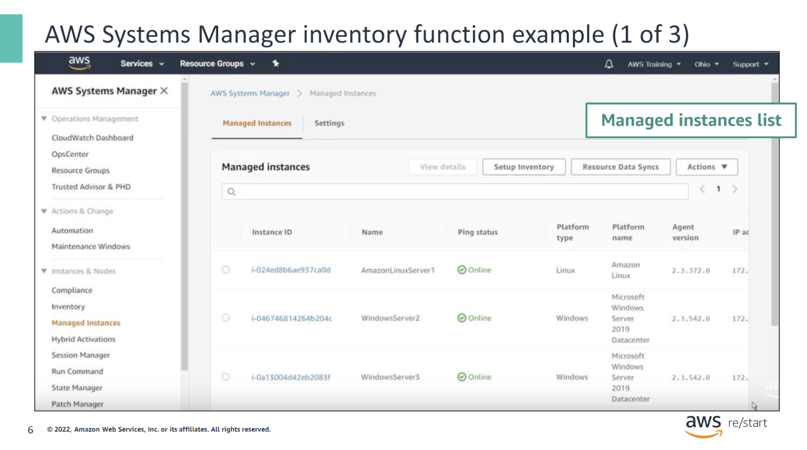
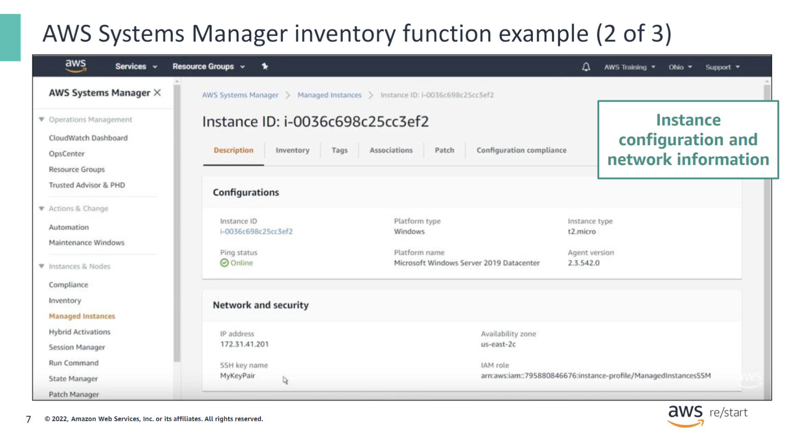
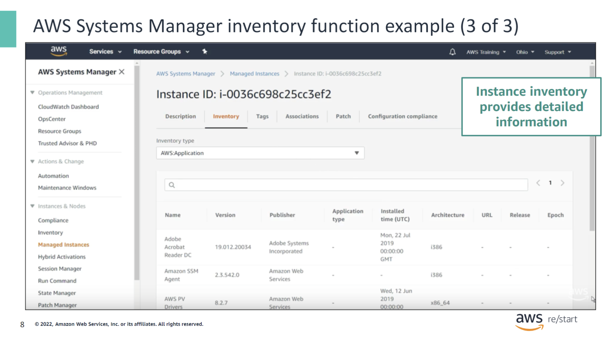
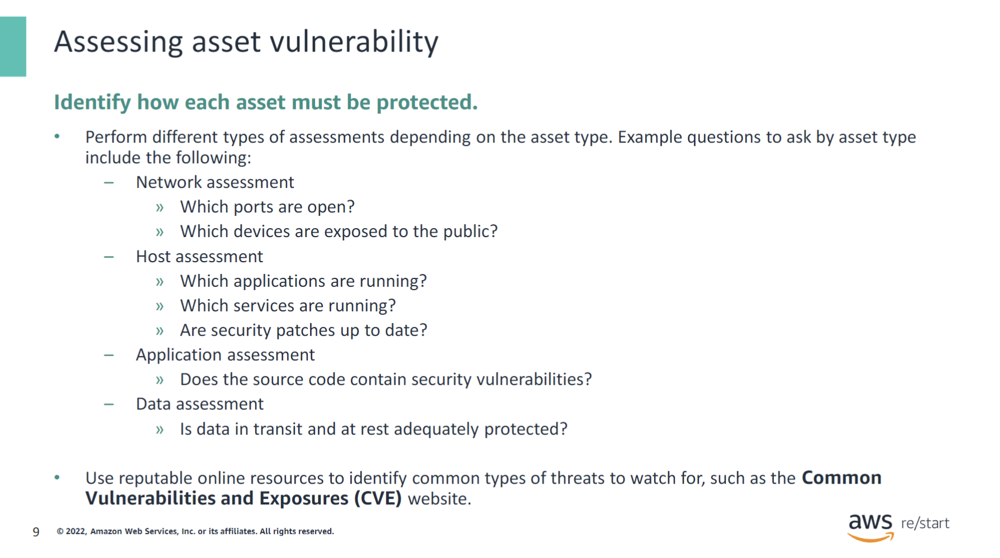
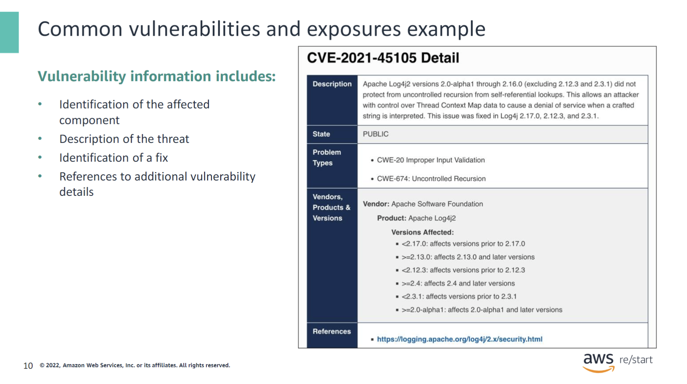
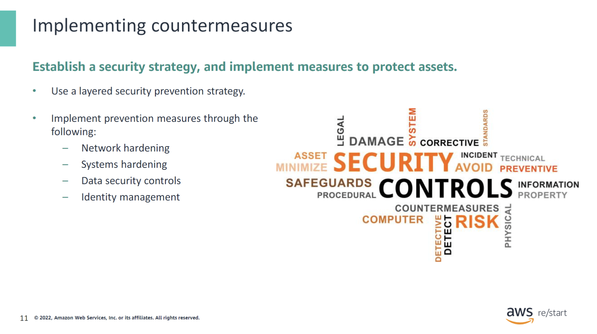
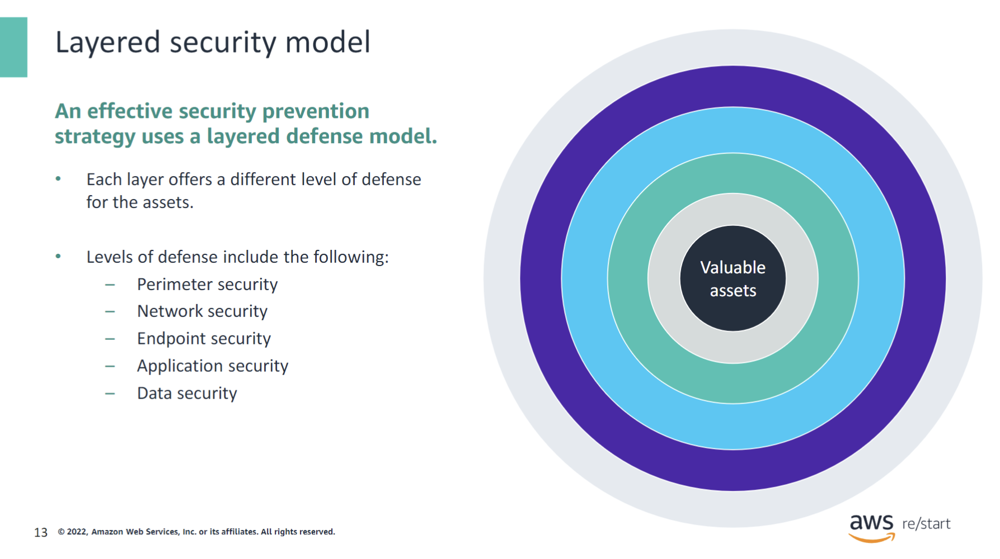

:::tip[In this lesson, you will learn how to:]

- Describe the importance of prevention in the security lifecycle
- Describe security prevention tasks
- Use a layered model to build a security prevention strategy
- List different types of prevention measures

:::

## Introduction to prevention

### Prevention in the security lifecycle

Prevention is the first and arguably the most important phase of the security lifecycle. It offers the opportunity to proactively stop threats from becoming breaches through the implementation of security controls. In the prevention stage, you:

- **Identify the assets to be protected:** You build an inventory of the networking devices, computers, applications, and other physical and digital resources that you must protect.
- **Assess asset vulnerability:** You examine each asset in the inventory and determine the type and level of protection that the asset needs.
- **Implement countermeasures:** For each asset to be protected, you implement security controls to prevent attacks against the asset from being successful.

The next slides examine these tasks in more detail.

### Identifying assets

You must know what resources are in your computing environment so that you can protect them. Therefore, the first step in prevention is to create an inventory of your computing assets. This inventory can be extracted from existing design documents, such as network topology diagrams, architecture diagrams, and other system documentation. The list should provide a clear understanding of what components are in your environment. It also should convey what their key properties are (for example, the IP address of network devices) and how they relate to each other.

Various tools can help you in this task. For example, for network discovery:

- You can use the ping command to determine the IP address of hosts in your environment and their reachability.
- You can use the open-source Nmap utility to discover the available hosts on a network and gather important information such as the services that they’re running.

In the AWS Cloud, the AWS Systems Manager service provides an inventory function that you can use to list the managed instances in your account. For each instance, the service can identify key information, such as the instance’s IP address and operating system and the applications installed on the instance.

### AWS Systems Manager Inventory

The next three slides show example screen captures of the AWS Systems Manager console. These screen captures illustrate the information that the Systems Manager inventory function provides. The screen capture on this slide shows the **Managed Instances** tab of the Systems Manager console. This tab displays a list of all of the managed Amazon Elastic Compute Cloud (Amazon EC2) instances in the user’s AWS account.

The information displayed for each instance includes its ID, name, ping status (which reflects the instance’s state), platform type, and IP address.

When you select an instance from the **Managed Instances** list, the console shows additional information about the instance through several tabs.

On the **Description** tab, you see more configuration details, including the **Availability Zone** where the instance is running. It also displays security information, such as the **key pair** that is used to remotely log in to the instance. You will learn more about EC2 instance key pairs later in the course.

On the **Inventory** tab for a selected EC2 instance, you can see the various types of detailed inventory information that AWS Systems Manager captures. This information includes the following:

- **Installed applications**: Names, version, and publisher
- **Installed AWS components**: Drivers, such as EC2 drivers, and agents, such as the Systems Manager agent
- **Files**: Name, size, version, creation date, modification, and last accessed times
- **Network configuration**: IP address, media access control (MAC) address, subnet mask, and Domain Name System (DNS) servers
- **Windows updates**: Hotfix ID, installed by, and installed date
- **Services**: Name, status, dependent services, service type, and start type
- **Instance details**: System name, operating systems (OS) name, OS version, and OS architecture

The screen capture on this slide shows the list of installed applications on the selected EC2 instance.

### Assessing asset vulnerability

As soon as you have identified your list of assets, you can perform a vulnerability assessment on each one of them. The goal of vulnerability assessment is to search for security weaknesses or potential exposures so that you can implement countermeasures against them. It involves analyzing the asset’s security posture by asking questions relevant to the asset type, its intended use, and its desired level of protection.

Some example questions to evaluate the security posture of an asset are shown in this slide by asset type. In general, its functions include the following:

- **The host assessment** evaluates how vulnerable servers are to attacks.
- **The network assessment** evaluates the accessibility of networks and network devices.
- **The data assessment** examines the level of protection for data traveling through the system (data in transit) and data stored in the system (data at rest). It protects this data from the perspective of the confidentiality, integrity, and availability (CIA) triad.
- **The application assessment** evaluates the security vulnerability in an application’s source code.

As you analyze the security vulnerability of an asset, you should consider the potential threats. It is often useful to know the common types of threats that have been identified in the industry for the asset’s type. One resource that provides such information is the [Common Vulnerabilities and Exposures (CVE) website](https://cve.mitre.org/). The CVE website is an online resource that lists publicly disclosed cybersecurity vulnerabilities. The United States government’s Cyber Security and Infrastructure Agency (CISA) sponsors this website.

Automated tools, such as database scanners and application scanners, are available to help identify both existing and potential security vulnerabilities. When they detect a known vulnerability, some of the scanning tools point to the corresponding CVE entry.

### Common vulnerabilities and exposures example

This slide shows an example of a vulnerability that was recorded in the CVE website. It identifies the vulnerability as affecting the **Apache Log4j2** software and describes the threat as potentially causing a **denial of service** attack. It also indicates **that a later version of the software includes a fix**.

### Implementing countermeasures

After you have analyzed and determined the security requirements of your assets, establish a security strategy, and implement security controls to protect your assets.

A best practice is to implement a security strategy that uses multiple layers of security. Each layer provides a specific type of protection, including protecting networks, systems, data, and user identity.

You will explore how to design a security strategy and identify different types of prevention measures in more detail in the next sections.

## Prevention strategy

In this section, you will learn the value of using a layered model to build a prevention security strategy.

### Layered security model

An effective security prevention strategy protects valuable assets by using a layered defense model. By implementing multiple layers of security, an attacker would have to penetrate all of the layers in order to gain access to the protected asset. Some examples of security layers include the following:

- **Perimeter security**: Secures the perimeter networks by using controls such as firewalls or an intrusion prevention system (IPS).
- **Network security**: Prevents unauthorized network access by using network access control lists (network ACLs), for example.
- **Endpoint security**: Uses software such as an antivirus program to protect a host.
- **Application security**: Protects applications with specialized firewalls, and monitoring and scanning tools.
- **Data security**: Protects access to data through identity and access management.

You will learn more about these layers and the tools that they use in the next modules.
