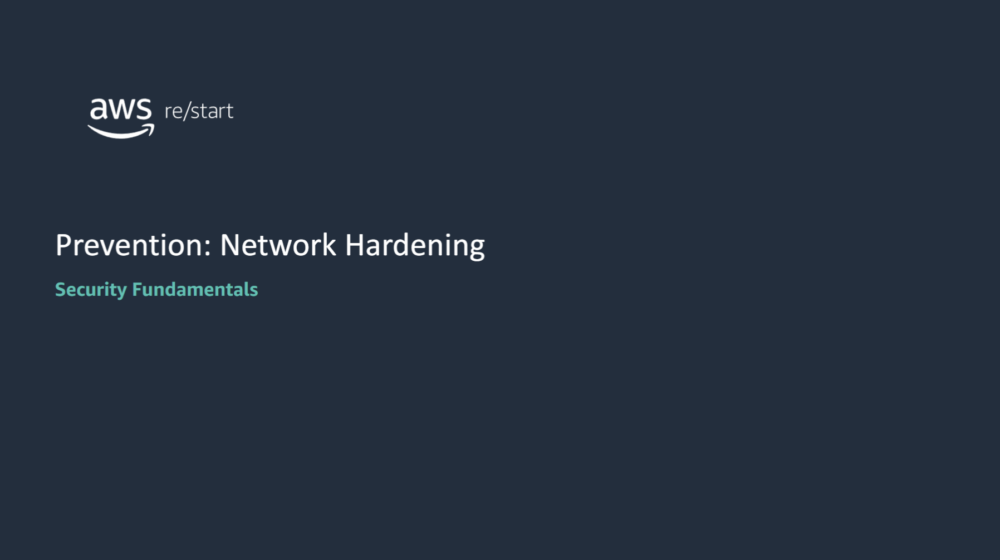

:::tip[In this lesson, you will learn how to:]

- Identify network security vulnerabilities
- List network discovery protection mechanisms
- Describe network architecture hardening practices

:::

## What is network hardening?

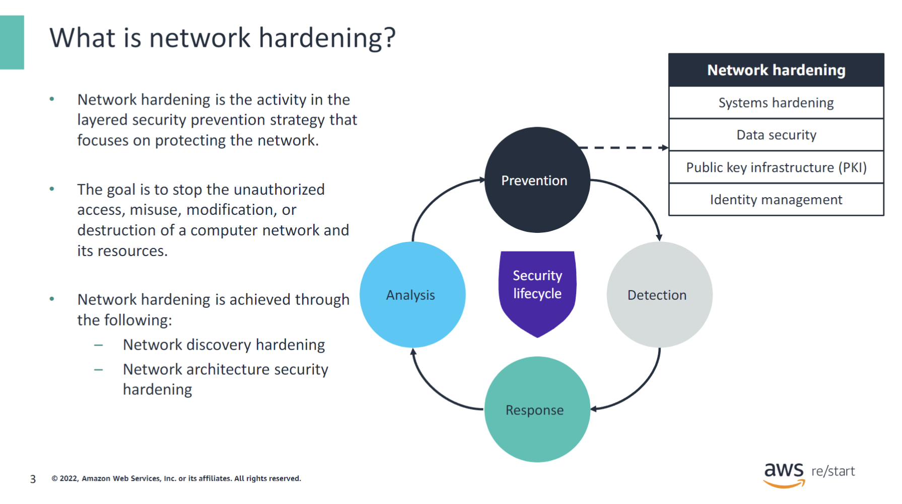

The prevention phase of the security lifecycle provides the opportunity to implement a layered security prevention strategy.

The first layer of that strategy, network hardening, concerns the protection of a computer network and its resources from unauthorized access, misuse, modification, or destruction. It is designed to preserve the usability and integrity of a network and the data that flows through the network. Network hardening combines policies and procedures with hardware and software solutions to achieve this goal.

Network hardening is typically achieved through two primary preventive actions:

- Network discovery hardening
- Network architecture security hardening

You will learn more about these actions in the subsequent sections.

## Network security vulnerabilities

Before exploring the different network hardening techniques, it is important to first understand the types of vulnerabilities that can compromise the security of a network. This section identifies the main types of threats that a network can be exposed to.

### Network security threats

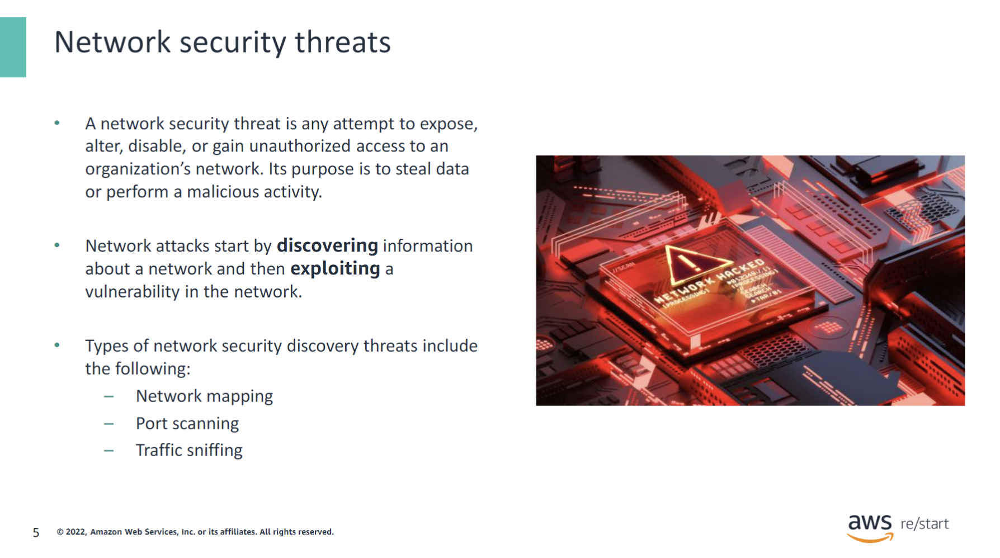

Network attacks are actions that seek to negatively affect the normal operation of a system at the network level. They occur when an attacker **discovers** the layout and resources on a network and exploits a vulnerability. As soon as an attacker gains access to the network, they can, for example, install malware on unprotected devices. They can disable a server or flood the network with so many requests that it becomes unusable (a denial of service [DoS] attack).

Therefore, identifying vulnerabilities that expose the network to a discovery or exploration attack is critical. These attacks include:

- Network mapping
- Port scanning
- Traffic sniffing

### Network mapping

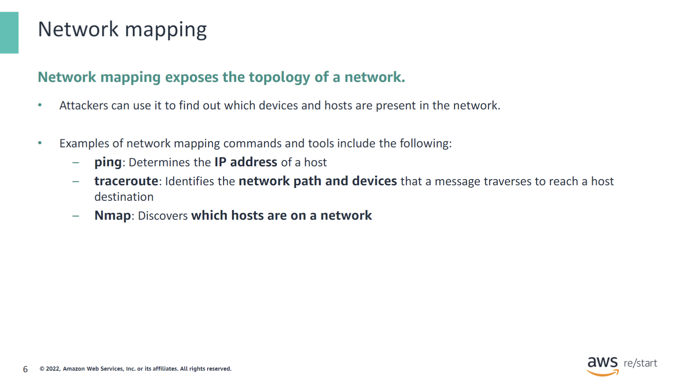

Network mapping is a technique that attackers use to discover the topology of a network. By using network discovery commands and tools, they can collect valuable information. This information can include the devices and hosts on the network and the paths that can be used to reach them. In the end, attackers can create a map of your network environment.

Attackers typically use the same tools that are available to network administrators to identify and map resources on a network. These tools include:

- The `ping` command
- The `traceroute` command
- The open-source `Nmap` network exploration and security auditing utility

#### Network mapping tools example: Ping and traceroute

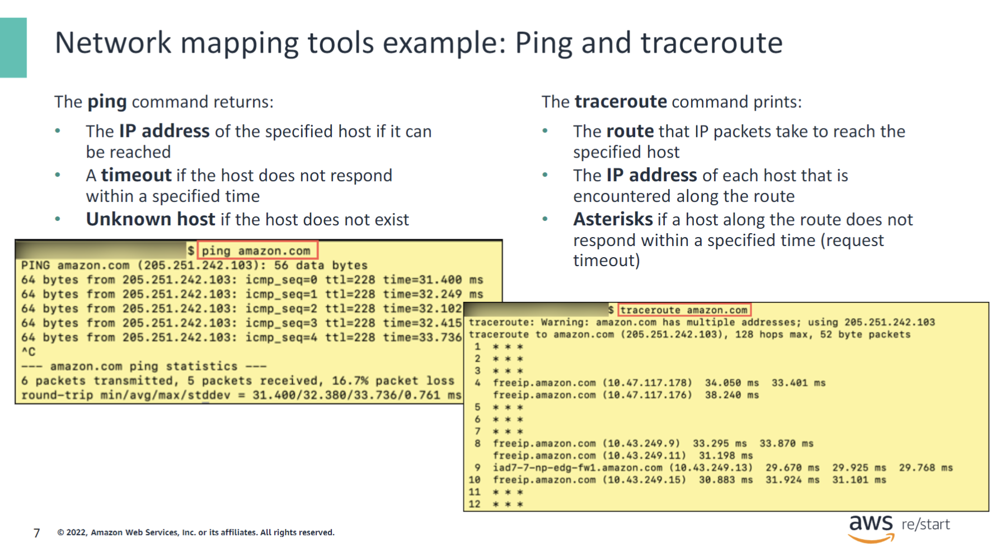

This slide shows examples of the output of a `ping` and `traceroute` of amazon.com. 

In the `ping` example:

- The IP address of the amazon.com host is identified as `205.251.242.103`.
- The output also displays the time that the host took to respond to each ping request.

In the `traceroute` example, note the following:

- The IP address of amazon.com is identified as `205.251.242.103`.
- There are 12 lines that are displayed (called hops) to indicate that the request passed through 12 different network devices. The host name and IP address are displayed for each device. If the device does not respond within the expected timeout window, a line with asterisks is printed. This list of hops provides the network path to the destination host.
- The response time of each hop is displayed.

By issuing additional `ping` commands or by using other network mapping tools, you can build a fairly detailed blueprint of a network.

### Port scanning

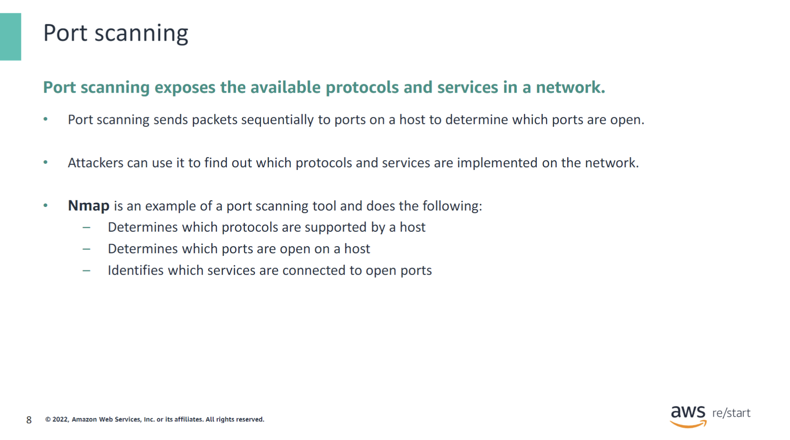

Port scanning is a method that attackers use to determine which protocols and services are available on a host. It tries to sequentially establish a connection to each port on a host to find open ports and identify which services are running.

The Nmap utility is an example of a tool that you can use to perform port scanning. It supports different types of port scanning techniques, including Transmission Control Protocol (TCP) and User Datagram Protocol (UDP) scans. It can also return valuable information about the target host, such as its operating system (OS) type and version.

#### Port scanning tool example: Nmap

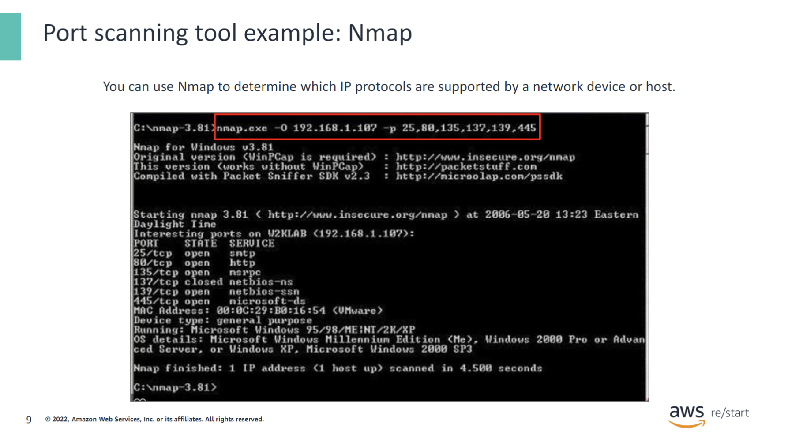

In the example shown here, Nmap is used to perform an IP protocol scan (`-0` option) on the host with an IP address of `192.168.1.107`. The command further specifies a list of port numbers (25, 80, 135, 137, 139, and 445) to scan for. The intent is to determine whether any of those port numbers are open on the target host.

The command returns information about the state of each port and the name of the service that is listening on that port. In the results shown, port 80 is open, and its service name is `http`. This indicates that a Hypertext Transfer Protocol (HTTP) service is running and listening on port 80. The command also identifies the OS type of the target host as Microsoft Windows.

### Traffic sniffing

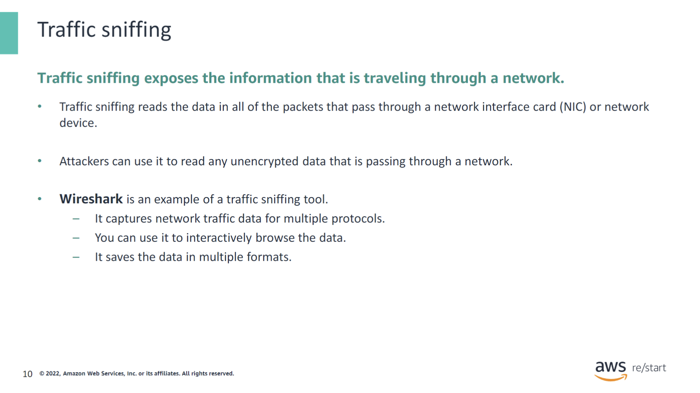

Traffic sniffing, also known as packet sniffing, is a technique that attackers use to see the data flowing through a network. They watch the packets that pass through a network interface card (NIC) or network device. Any sensitive data that is not encrypted (such as clear text passwords) will be visible and can be collected for malicious use. For example, traffic sniffing can be used for man-in-the-middle attacks.

Protocol analyzer tools are typically used for traffic sniffing because you can use them to watch and store all traffic that goes through a network. Wireshark is an example of an open-source network protocol analyzer. You can use it to capture the traffic on a network and browse it interactively. Wireshark also supports many different network protocols and can store the data in multiple formats.

#### Traffic sniffing tool example: Wireshark

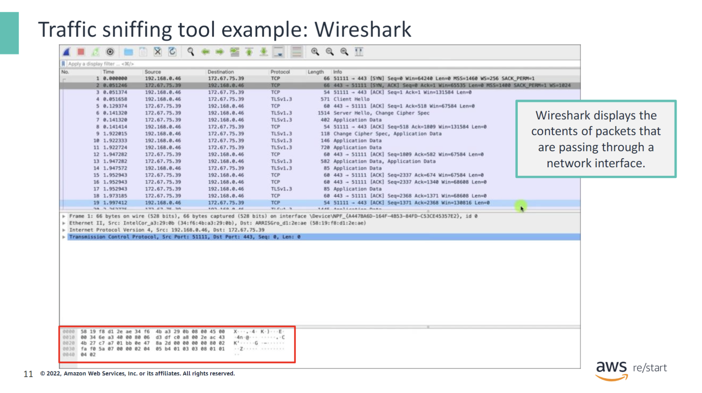

This slide shows an example screen capture of Wireshark’s user interface main window. It consists of three parts, which are used as follows:

- **The top part** lists all the packets that are flowing through the selected network interface.
- **When you select a packet** in the top part, the middle part shows the packet’s detailed properties. These properties include its size, source and destination Media Access Control (MAC) addresses, and protocol.
- **The bottom part** displays the packet’s content in hexadecimal and text format.

## Network discovery hardening

### Preventing network discovery

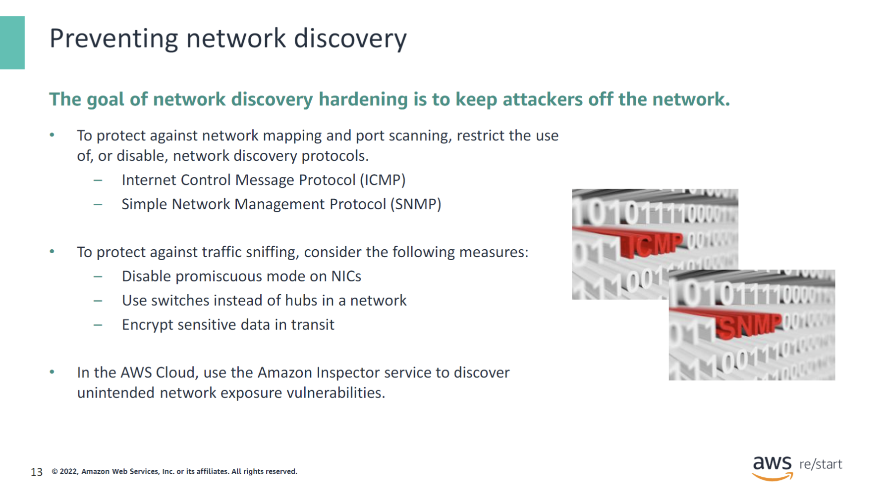

It is important to protect networks from discovery tools and mechanisms because of the security risks that these tools present. One of the most effective ways to do so is to block or restrict the use of the discovery protocols that these tools use. The most common network discovery tools use the Internet Control Message Protocol (ICMP). For example, the ping and traceroute commands and the Nmap utility use ICMP. Tools that use the Simple Network Management Protocol (SNMP) can also expose detailed network data. Network operators typically use them to monitor and manage the devices on a network. If the use of SNMP tools is not securely controlled, attackers can exploit them. By restricting the use of or disabling network discovery protocols, you can prevent attackers from getting crucial information about your network.

In addition, to protect against traffic sniffing, consider the following measures:

- **Disable promiscuous mode on NICs:** When a NIC is configured to run in promiscuous mode, it reads all packets that pass through the network. All packets are read, regardless of whether the NIC was the packet’s intended destination or not. If an attacker is able to sniff the traffic on that NIC, they would be able to see all the traffic on the network.
- **Use switches instead of hubs in a network:** A switch can mitigate sniffing attacks because it will forward packets to only the intended destination port. This port is identified in the packet. A hub broadcasts all incoming packets to all of the destination ports connected to it. For this reason, today (in 2022), the use of hubs in networks is extremely rare.
- **Encrypt sensitive data in transit:** A hardware device or software can be used to encrypt the data that flows through your network. You will learn more about protecting data in a subsequent module.

To help network discovery hardening in the AWS Cloud, you can use the Amazon Inspector service. This service provides functions to discover network exposure vulnerabilities.

### Amazon Inspector: Network reachability assessment

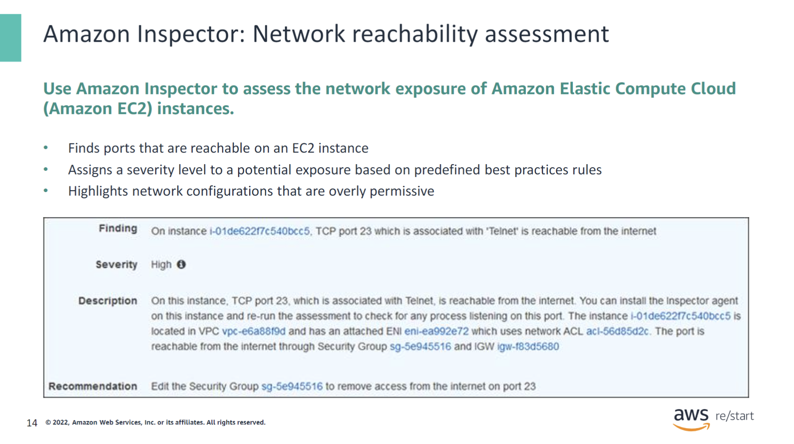

Amazon Inspector scans Amazon Elastic Compute Cloud (Amazon EC2) instances for open network paths and other network reachability issues and provides guidance about restricting access that is not secure. You can use Amazon Inspector to analyze the accessibility of critical ports and generate findings about the exposure of each port. These findings highlight network configurations that might be overly permissive or that might allow for potentially malicious access. Amazon Inspector also attaches a severity level for each finding that it reports. The severity of a network reachability vulnerability is determined by the service, ports, and protocols that are exposed and by the type of open path.

In the example report provided in the screen capture on this slide, note the following:

- The finding indicates that TCP port 23 is open on the identified instance.
- The severity of this vulnerability is high because an internet user can remotely connect to the instance by using the Telnet protocol.
- The recommendation is to change the instance’s security configuration to close port 23.

For more information about the network reachability feature of Amazon Inspector, see the [Amazon Inspector User Guide](https://docs.aws.amazon.com/inspector/v1/userguide/inspector_network-reachability.html).

### Other network discovery countermeasures

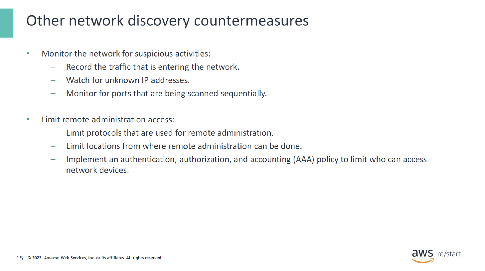

Another way to prevent the discovery of a network is to monitor for symptoms that point to such an activity. For example, if an unknown IP address appears on the network, it can indicate that an attacker has successfully connected to the network. You can use your inventory of the allowed hosts of a network to perform this check. Likewise, if you detect that ports are being scanned sequentially, it can mean that an unauthorized port scan is in progress. You can use an intrusion prevention system (IPS) to monitor such conditions and alert you when they arise. You will learn more about an IPS in the next section.

You should also limit remote administration access. Specifically, you should limit the following:

- Who is permitted to have administrative access
- How the devices are accessed (for example, which protocols can be used)
- Where the devices are accessed (for example, remote administration from the internet is strictly prohibited)

Finally, implement an administrative policy that defines authentication, authorization, and accounting (AAA) rules to protect the access to network devices. This policy should include rules for the following:

- To assign different levels of access permission to different administrative roles
- To log access, commands, and changes to network devices
- To enforce change control procedures

## Network architecture hardening

### What is network architecture hardening?

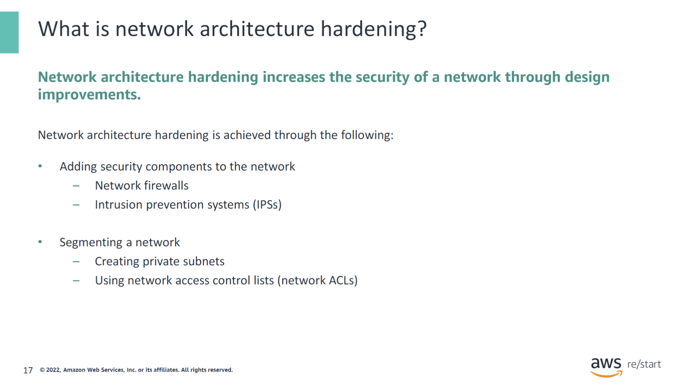

The goal of network architecture hardening is to modify the design of a network to improve its security. Network design plays an important role in the security of a network. You should carefully choose the types of components and devices in a network and judiciously place them in the right place in the network’s topology. In this way, you can decrease its vulnerability and increase its ability to withstand attacks.

Network architecture hardening can be achieved through adding security components to the network and segmenting the network.

In the next slides, you will learn more about these measures.

### Network firewall

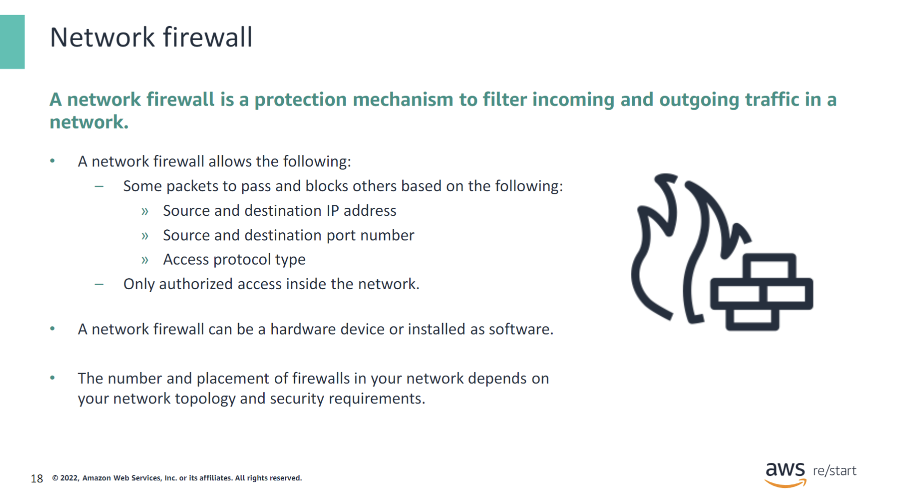

A network firewall is a hardware or software component that filters incoming and outgoing traffic in a network to prevent unauthorized access. It allows or blocks data packets into the network based on rules that you specify. These rules use the information in the packet to determine whether to allow the packet to pass. This information includes the packet’s source IP address, destination IP address, source port number, destination port number, and port type (protocol).

Network firewalls are essential elements of a security architecture. Make sure to have them in place at the appropriate locations in your architecture. The number and placement of firewalls depend on your network topology and security requirements. They will be influenced by factors such as the number of devices, type of devices, access requirements, and vulnerability risk.

#### Network firewall example

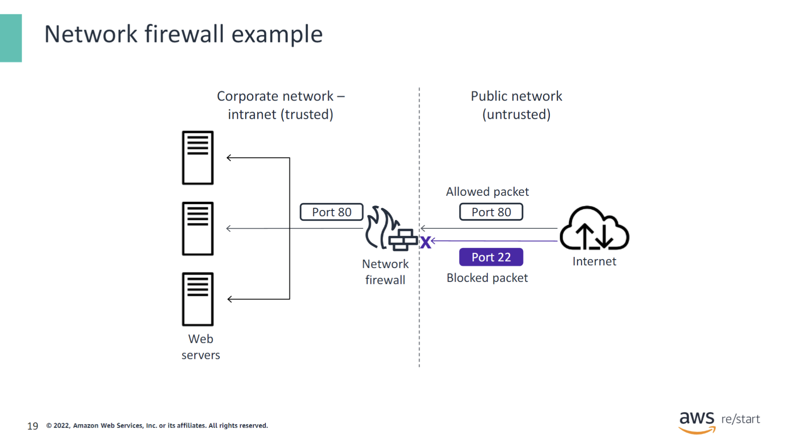

In this example, a network firewall protects the access and traffic to servers in a corporate network from the internet. The firewall allows only packets destined for port 80 (HTTP port), the port on which the corporate web servers are expecting traffic. A packet that targets port 22 (Secure Shell – SSH port) is blocked and not allowed to enter the network.

The network firewall is placed in front of the web servers and at the entry point of traffic into the corporate network. In this way, you can protect assets in the intranet, the trusted internal network, from requests that come from the untrusted public internet.

### Network firewall best practices

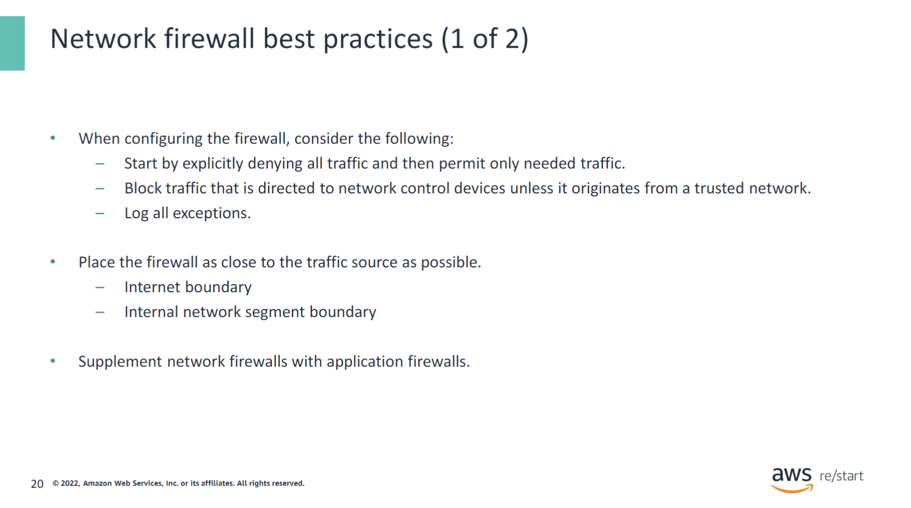

The next two slides list some network firewall best practices, including the following:

- Block all traffic first, and then gradually permit authorized traffic. In this way, you apply the best practice principle of least privilege.
- Log all exceptions. By recording all filtering decisions, including packet rejections, you can capture data that can be analyzed later to detect possible patterns of attack.
- Position firewalls at the junction points of the network as close to the traffic source as possible. In this way, you can identify and stop bad traffic before it reaches deep into your network.
- Supplement network firewalls with application firewalls. An application firewall filters the communication into and out of an application and provides an additional layer of access protection.

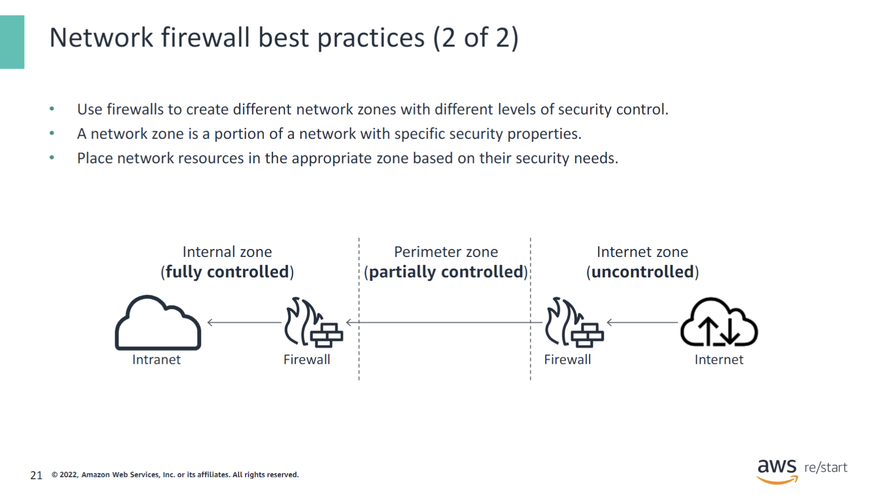

Another network firewall best practice is to use firewalls to create different network zones in your environment. Each zone provides a different level of network security based on the number and type of firewalls that protect them. In this way, you can place a network resource in the zone that best meets its security needs.

The diagram in this slide shows an example of three typical network zones:

- The **internet zone** represents an uncontrolled area because it is unsecure.
- The **perimeter zone** is secured by one firewall and is considered partially controlled. It serves as a buffer between two zones with different trust levels.
- The **internal**, or **intranet**, zone is considered fully controlled because it is secured by two firewalls.

### AWS security groups

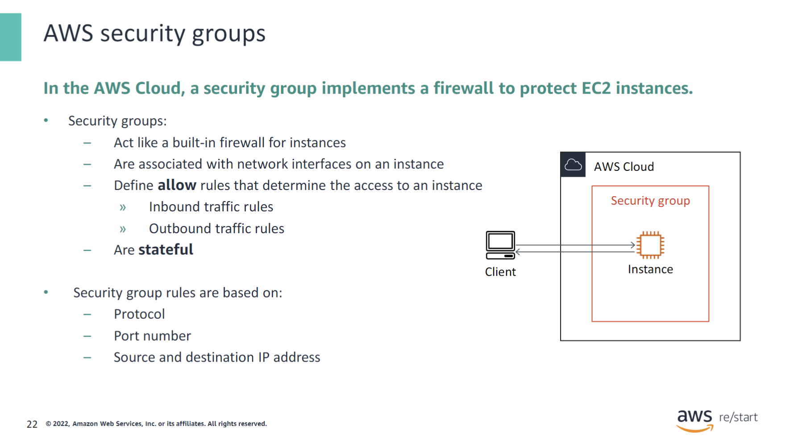

In the AWS Cloud, security groups act like a built-in firewall for virtual servers (EC2 instances). By filtering traffic to an instance, a security group provides control over which traffic to **allow** into an instance. Security groups are associated with the network interfaces on an instance.

To control the access to an instance, you configure a security group rule. You can define rules that **allow** inbound or outbound traffic. **You cannot define deny rules**. Rules are based on the protocol, port number, and source or destination IP address of the traffic.

Security groups are stateful: if you allow a certain type of traffic into an instance, the same type of traffic is allowed out of the instance. This rule applies regardless of any outbound rules. Conversely, if a particular type of traffic is allowed out of an instance, it is also allowed into the instance regardless of any inbound rules.

The diagram in this slide shows an instance protected by a security group. The security group filters all traffic that is coming into and out of the instance.

#### AWS security group example

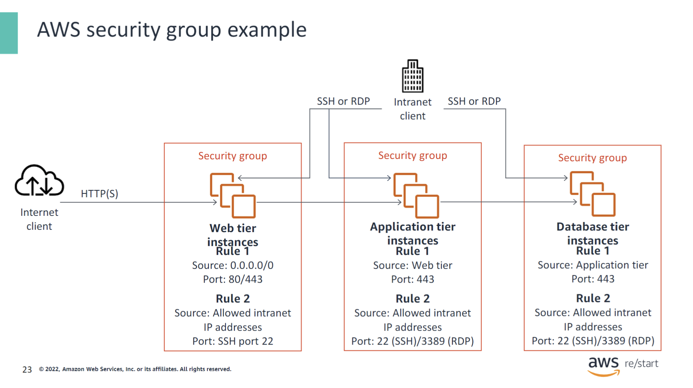

This diagram is an example of an AWS security group design applied to a classic three-tier web application architecture. Different security group rules were created to accommodate this multi-tiered web architecture.

Starting at the web tier, a defined rule accepts traffic from anywhere on the internet on port **80/443** (HTTP and HTTPS port numbers). It does so by selecting the source IP address of **0.0.0.0/0**.

At the application tier, a security group accepts traffic from only the web tier on the secure **HTTPS port (443)**. Similarly, the database tier can accept traffic from only the **application tier** on **port 443**.

Finally, a rule was created in all tiers to provide remote administration from **allowed IP addresses**. These IP addresses can only be in the **corporate network (intranet)** and connect over **Secure Shell (SSH) port 22** or **Remote Desktop Protocol (RDP) port 3389**.

### Intrusion prevention system (IPS)

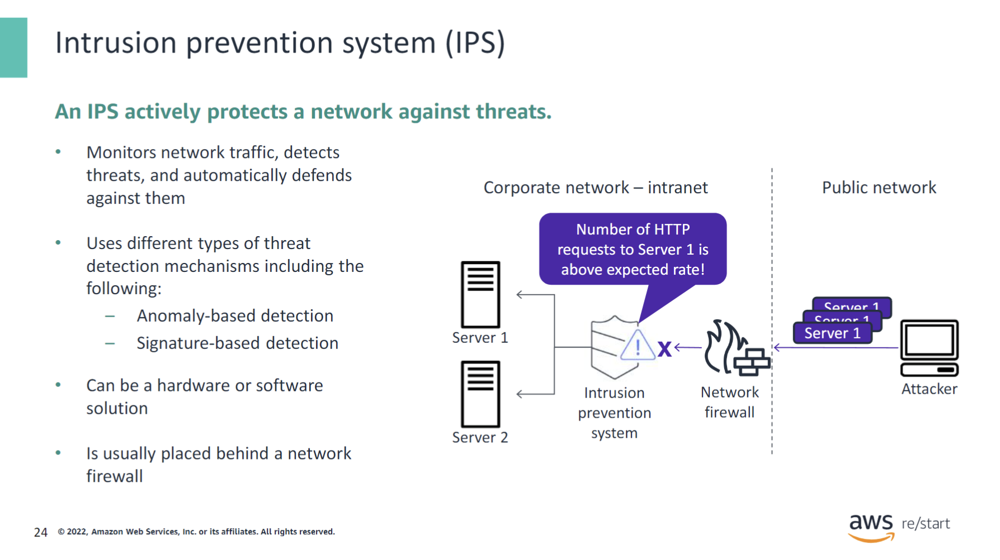

An IPS is a network security component that identifies and prevents threats. An IPS prevents threats by analyzing packets and blocking or changing them. It monitors the network for malicious incidents and acts to prevent these malicious threats from affecting the system.

An IPS can detect an attack by using different mechanisms, including the following:

- **Anomaly-based detection**: The IPS compares the current traffic pattern against established baselines for any deviation.
- **Signature-based detection**: The IPS monitors and analyzes the traffic for known patterns of attack.

In the example on this slide, an IPS is placed behind a network firewall on the corporate network. It detects multiple HTTP requests that are going to Server 1, many more than what the server normally receives. Furthermore, it sees that the requests are all coming from the same source. Because this pattern matches a denial of service (DoS) attack, the IPS blocks all requests from that source to protect the network and the server.

#### IPS example: AWS Network Firewall

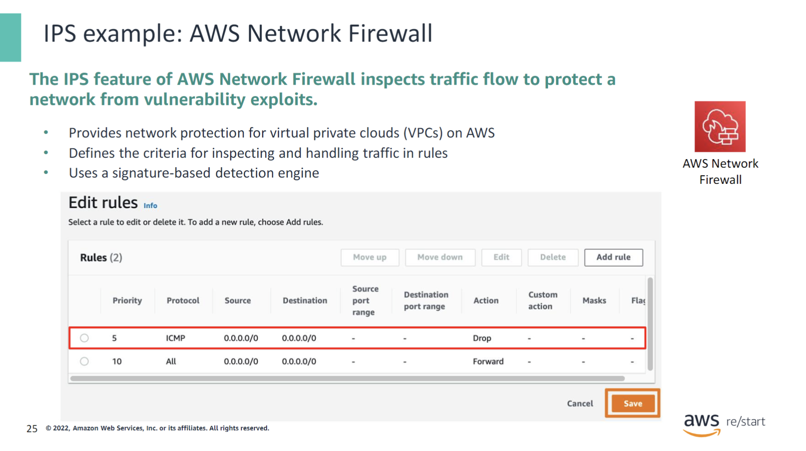

AWS Network Firewall is a service that facilitates the deployment of essential network protections to virtual private clouds (VPCs) on AWS. Its IPS provides active traffic flow inspection with real-time network and application layer protections against vulnerability exploits and brute force attacks. Network Firewall uses a signature-based detection engine that matches network traffic patterns to known threat signatures. Its criteria for matching include packet anomalies and packet attributes such as byte sequences.

You use rules to define the criteria used for inspecting traffic and for handling packets and traffic flows that match the inspection criteria. For example, you can choose to drop or pass a packet or all packets in a traffic flow based on the inspection criteria.

This slide shows an example screen capture of how to edit a rule in the Amazon Virtual Private Cloud (Amazon VPC) management console. Notice how a rule was created to drop all ICMP traffic in the VPC.

For more information about the IPS feature of AWS Network Firewall, see the [AWS Network Firewall Developer Guide](https://docs.aws.amazon.com/network-firewall/latest/developerguide/stateful-rule-groups-ips.html).

### Segmenting a network

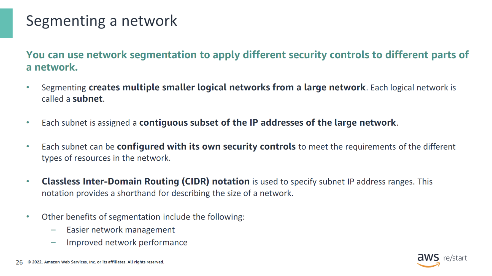

Network segmentation, also called subnetting, is another technique for enhancing the security of a network. Subnetting is the process of taking a large network and dividing it into smaller networks. Each smaller network is called a subnet and is assigned a contiguous subset of the IP address range of the large network. Each subnet can then be secured to meet the specific needs of the resources that it will host. For example, in an organization with multiple office locations, each location might provide a different service and have different security requirements. Therefore, the organization might want to create individual subnets for each location so that they can apply different levels of security to the different subnets.

A network’s address range is typically specified by using the Classless Inter-Domain Routing (CIDR) notation. This notation also facilitates the expression of the IP address range for a subnet. For example, the CIDR notation of `192.168.0.0/16` represents an IP address range of `192.168.0.0` to `192.168.255.255`.

Other benefits of subnetting include the following:

- **Easier network management:** Each subnet represents a smaller unit that can be managed and configured independently and without affecting other subnets.
- **Improved network performance:** Having multiple subnets relieves the traffic congestion in a network. Traffic is routed more efficiently because traffic destined for a device within a subnet stays in that subnet.

#### Subnetting example

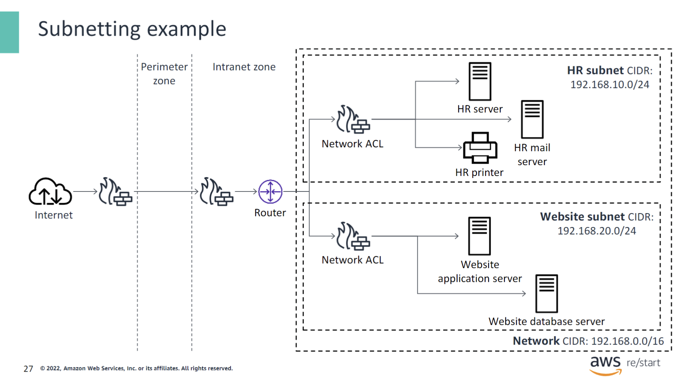

In this example, a company wants to divide its network into two parts. One part will host the servers and printer that their internal human resources (HR) department uses. The other part will host the application server and database server that runs their public website. They want to divide the network because each part has different security requirements. The HR network resources are to be used by internal employees only. The website resources are accessible to customers on the internet and to internal employees.

To support these requirements, the company’s network administrator performs the following modifications:

1. **Split the network into two subnets:** an HR subnet and a website subnet.
2. **Assign a contiguous subset of the network’s IP address range to the HR subnet.** In this case, the CIDR address assigned to the subnet is `192.168.10.0/24`, which provides an IP address range of `192.168.10.0` to `192.168.10.255`.
3. **Assign a contiguous subset of the network’s IP address range to the website subnet.** In this example, the CIDR address assigned to the subnet is `192.168.20.0/24`, which provides an IP address range of `192.168.20.0` to `192.168.20.255`.
4. **Put the network resources for the HR department in the HR subnet.**
5. **Put the network resources for the website in the website subnet.**
6. **Configure a network access control list (network ACL) in front of the HR subnet** to only allow traffic from inside the subnet.
7. **Configure a network ACL in front of the website subnet** to allow traffic from the internet and the HR subnet.

A network ACL acts like a firewall by filtering incoming and outgoing traffic.

The diagram on this slide illustrates the resulting network architecture.

### Network access control list (network ACL)

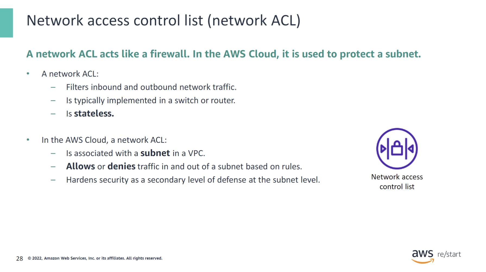

A network ACL acts as a firewall to control inbound and outbound traffic. It is typically implemented on a switch or a router and controls the traffic based on rules that you define. A network ACL is **stateless**, which means that the inbound and outbound rules are independent of each other.

If a type of request traffic is allowed inbound, you must explicitly define an outbound rule for the same type to allow the response traffic.

In the AWS Cloud, a network ACL is used to protect a **subnet** inside a VPC. You can define **allow** or **deny** rules based on the protocol, port number, and source or destination IP address of the traffic.

### Layered security model for a VPC on AWS

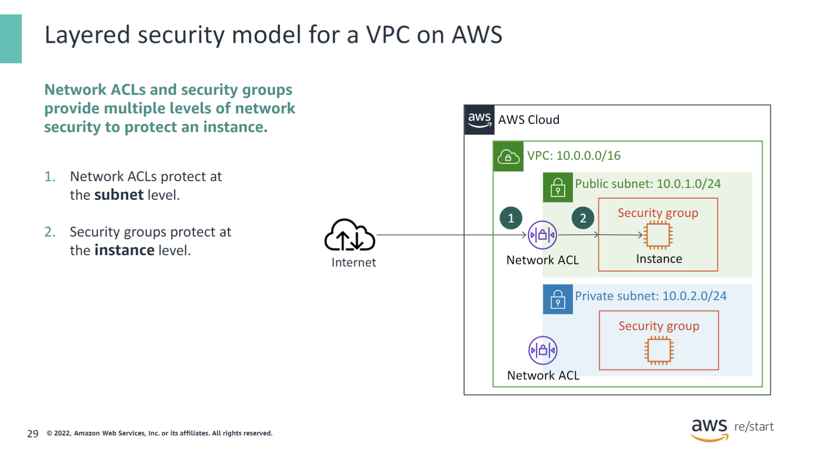

This slide summarizes the two levels of network security that protect an instance in a VPC. A request coming into an instance is first filtered by a network ACL at the subnet level. Then, a security group filters it again at the instance level.

The diagram on the slide also illustrates an example of segmenting a network into a public subnet and a private subnet. The instance in the public subnet is accessible from the internet, but the instance in the private subnet is not.

## Checkpoint Questions

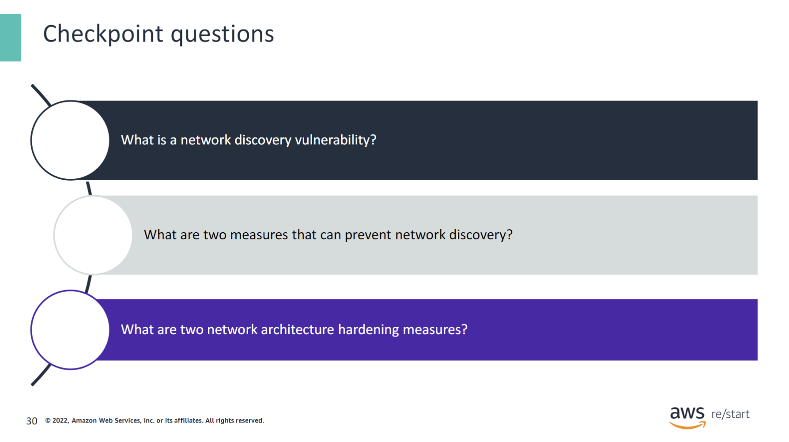

1. What is a network discovery vulnerability?

A network discovery vulnerability is a security exposure that lets an attacker discover information about a network environment, including its devices, hosts, services, and applications. The attacker can then use this information to maliciously affect the network and its resources.

2. What are two measures that can prevent network discovery?

- Disable or restrict the use of network discovery protocols.
- Limit remote administration access.

3. What are two network architecture hardening measures?

- Use network firewalls.
- Segment a network.

## Key Takeaways

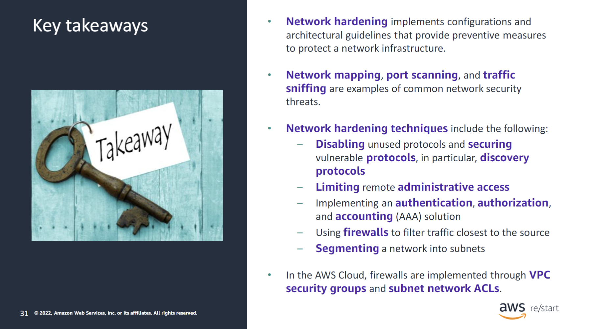

:::tip[The following list contains some keytakeaways from this lesson:]

- Network hardening implements configurations and architectural guidelines that provide preventive measures to protect a network infrastructure.
- Network mapping, port scanning, and traffic sniffing are examples of common network security threats.
- Network hardening techniques include the following:
  - Disabling unused protocols and securing vulnerable protocols, in particular, discovery protocols
  - Limiting remote administrative access
  - Implementing an authentication, authorization, and accounting (AAA) solution
  - Using firewalls to filter traffic closest to the source
  - Segmenting a network into subnets
- In the AWS Cloud, firewalls are implemented through VPC security groups and subnet network ACLs.

:::
