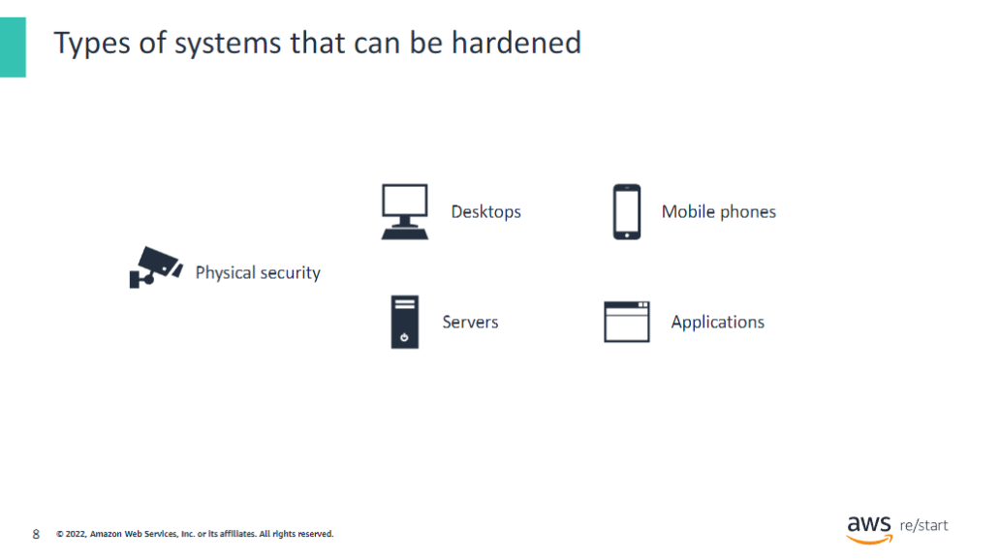

:::tip[You will learn how to:]

- Explain the principle of systems hardening and how it is applied to computer security
- Describe baselines and explain why they are important
- Describe how to harden different systems and the techniques that are used
- Identify the tools that are used to detect and show common security configuration problems

:::

## Introduction to systems hardening

You’ll begin by defining systems hardening.

### What is systems hardening?

For many businesses around the world, cyberattacks are a constant threat that they attempt to avoid at all costs. Businesses must be hyper-vigilant about how they secure their endpoints, which include workstations and servers.

To decrease vulnerabilities, you must secure your systems. The hardening process includes reducing the number of running services on a system. Having fewer running services decreases the potential of a security event.

Systems hardening can be a bigger challenge now as more devices move outside secure office environments. Logging in to sensitive corporate assets through unsecured devices can lead to higher risks.

Some companies often fail to find the right balance between security and productivity because security can diminish productivity. For example, it can make working remotely more challenging. You must balance hardening with the usability of the system.

### Security lifecycle: Prevention –systems hardening

Recall that the phases of the security lifecycle consist of:

- **Prevention**: Is the first line of defense
- **Detection**: Occurs when prevention fails
- **Response**: Describes what you do when you detect a security threat
- **Analysis**: Completes the cycle as you identify lessons learned and implement new measures to prevent the issue from occurring again in the future

In this lesson, you will learn the concept of **systems hardening** as part of the prevention phase.

### Authentication, authorization, and accounting

A comprehensive solution for systems hardening should also consider these three security facets:

- **Authentication**: Validates that you are who you say you are
- **Authorization**: Verifies that you have permission to access the requested resource
- **Accounting**: Gathers usage and other information that is used for auditing and, optionally, billing

### Physical security

Physical security also contributes to systems hardening. Remember that the vulnerability is at the human level in most cases. Examples of physical security include closed-circuit surveillance cameras, motion or thermal alarm systems, security guards, picture IDs, and locked and dead-bolted steel doors. Another example of physical security is biometrics, which includes fingerprint, voice, face, iris, handwriting, and other automated methods that are used to recognize individuals.

### Types of systems that can be hardened

You can harden all kinds of systems for security, including desktops, servers, mobile phones, and applications.

Hardening systems eliminates or lessens attacks by patching vulnerabilities. It works by turning off nonessential services, configuring the system with security controls such as password management and file permissions, and deactivating unused network ports.

One example is server hardening, which aims to reduce the attack surface of the server. It secures the data, ports, components, functions, and permissions of a server by using advanced security measures at the hardware, firmware, and software layers.

Another example is software application hardening, which focuses on securing the applications that are running on a server. Examples of such applications might include a web application, database, or other custom software.

### Security baselines

A security baseline defines the expected conditions of a system. It defines what is an acceptable state or operation of the system so that you can quickly detect anomalies.

For example, suppose that you establish the following baseline for a system. The system displays a Welcome page when it is idle. If you have four idle computers, and three of them display a Welcome page, but the fourth one shows a different page, something is wrong. You can identify the problem computer and determine that it is in an unacceptable state because you have established the baseline.

Supporting a small number of baselines makes it easier to spot the one system that is not hardened properly. However, if you have no baseline, you cannot determine whether a suspicious event occurred because you have no way to identify security deviations. You can derive baselines from system documentation if the documentation is available and has been accurately maintained.

## How to harden systems

Next, you’ll discuss how you can harden systems.

### Common ways to harden systems

Ways to harden a system include the following:

- Turning off services that are not needed:
  - Computer break-ins are a result of people taking advantage of security holes or problems with these programs. The more services that are running on your computer, the more opportunities there are for others to break into or take control of your computer through them.
  - For example, an open recursive Domain Name System (DNS) server is one that permits recursive DNS queries to be issued from off campus. Attackers can use open recursive DNS to flood a target system with DNS response traffic. This attack is a type of distributed denial of service (DDoS).

- Implementing corporate policies and restrictions:
  - Group policies provide a method of centralizing configuration settings and management of operating systems, computer settings, and user settings.
  - For example, you can assign regular users one set of settings and administrators another set, or you can give one specific user a particular combination of settings.

- Regularly applying security updates and patches:
  - Always download the security and critical updates to operating systems released by software companies to protect against malware and security exploits.
  - For example, security breaches are regularly discovered in Microsoft Windows ActiveX and .Net Framework. By installing security updates, you avoid damage to software, data loss, and identity theft. It's important to install updates quickly because malware can spread within hours after of introduction.

### Linux processes

Systems are not pre-hardened by default, so you must take action to secure your systems.

Users might find various programs running in both foreground and background that they are not aware of and can easily remove or turn off these programs.

By activating only necessary services, protocols, and applications, a business reduces the risk of an attacker compromising a vulnerability to get into a system.

The image on this slide is a sample running processes in Linux. It helps you visualize which processes are currently running on the system.

### Patching

Another way to harden a system is to apply patches regularly through a centralized process. Patches can affect firmware, the operating system, applications, and other software.

Patch Manager, a capability of AWS Systems Manager, automates the process of patching managed nodes with both security-related and other types of updates. You can use Patch Manager to apply patches for both operating systems and applications.

### Common systems hardening recommendations

The purpose of implementing systems-hardening techniques and practices is to minimize the number of potential entryways that an attacker can use to access your system. Common recommendations include deleting or deactivating system applications and establishing a system security plan. Important measures include patching and updating the operating system (OS), permissions, ports, and user accounts and configuring user authentication, resource controls, and other features.

### Software application hardening

Software application hardening, or just application hardening, involves updating or implementing extra security measures to protect both standard and third-party applications installed on your server.

The table lists several examples of software application hardening.

One example of application hardening is to use CPUs that support Intel Software Guard Extensions (SGX). SGX gives developers the ability to split a computer's memory into what are called enclaves. Enclaves are private, predefined areas in memory that can better protect users' sensitive information.

Amazon Web Services (AWS) offers well-architected best practices that can help you build securely in the cloud. These practices include security groups, AWS Identity and Access Management (IAM), least privilege, and access control lists.

The next modules discuss this topic in more detail.

### Server hardening

The first and second tables list hardening guidelines specific to various servers. Included are a File Transfer Protocol (FTP) server, directory services server, Dynamic Host Configuration Protocol (DHCP) server, and Domain Name System (DNS) server.

For the FTP server, you can deactivate anonymous mode, use IP filtering, and maintain quotas by limiting data that users can upload to your server. At the same time, you can implement strong authentication, monitor events, and activate permission restriction in the directory services server.

For the DHCP server, you can activate port security, monitor, and isolate roles. One of the steps to harden the DNS server is to fix writable cache problems to protect against pharming events. (Pharming is a form of online fraud that involves malicious code and fraudulent websites.)

SSH File Transfer Protocol or Secure File Transfer Protocol (SFTP) is a separate protocol. It is packaged with SSH, which works in a similar way to FTP but over a secure connection.

In almost all cases, SFTP is preferable to FTP because of its underlying security features and its ability to use an existing SSH connection. FTP is an insecure protocol that should be used only in limited cases or on networks that you trust.

### Mobile device management (MDM)

For securing mobile devices, use a mobile device management (MDM) solution. Use MDM to enforce corporate and security policies regarding the use of devices. Companies that permit bring your own device (BYOD) should implement MDM.

AWS has services that are specifically equivalent to each MDM solution indicated here. One example installing patches by using the AWS System Manager. Another example is AWS Config, which you can use to assess, audit, and evaluate the configurations of your AWS resources. AWS supports security standards with data protection services that help you protect your data, accounts, and workloads from unauthorized access.

### Training and education

Training, education, and policies are key:

- Train employees on policies, and then enforce the policies.
- Policies always come first.
- Get management on board.
- Enforce consequences for noncompliance. Enforcing a penalty for noncompliance is a deterrent to ignoring policies.

Social engineering is any attempt to circumvent administrative, technical, or physical controls by conning individuals. Social engineering takes advantage of the following circumstances:

- Bad or lazy habits that break normal security procedures
- Lack of financial or other penalties for giving up information
- Inability to trace a security leak back to a specific employee
- Short-timer attitude among employees (I won't be here when they investigate)
- Lack of enforcement of existing policies or other controls
- Lack of maturity in training or tools to combat social engineering

## Systems hardening tools

AWS has tools that help harden systems.

### AWS Tools

AWS provides many different security tools to help customers keep their AWS accounts and applications secure. Some of the AWS tools include AWS Trusted Advisor, Amazon GuardDuty, AWS Shield, and AWS CloudTrail.

Trusted Advisor provides recommendations that help you follow AWS best practices. Trusted Advisor evaluates your account by using checks.

GuardDuty is a threat detection service. GuardDuty continuously monitors your AWS accounts and workloads for malicious activity and delivers detailed security findings for visibility and remediation.

Shield is a managed DDoS protection service that safeguards applications that run on AWS.

CloudTrail offers auditing, security monitoring, and operational troubleshooting by tracking user activity and API usage.

### Amazon GuardDuty

To further explain, GuardDuty is a continuous security monitoring service that analyzes and processes various data sources. These sources might include VPC Flow Logs, CloudTrail management event logs, CloudTrail stored Amazon Simple Storage Service (Amazon S3) data event logs, and DNS logs.

It uses threat intelligence feeds, such as lists of malicious IP addresses and domains, and machine learning to monitor your AWS environment. Its goal is to identify unexpected, potentially unauthorized and malicious activity within that environment.

The example incorporates automated response (investigatory workflow). The investigatory workflow includes a response to provide in-depth defense, and it also uses services that support a more in-depth investigation of the incident.

CloudTrail logs are monitored for undesired activities. GuardDuty detects these activities and retrieves additional data points about the source IP that runs the API call. One common example of those additional data points in GuardDuty findings includes whether the API call came from an IP address on a threat list. Another example might concern whether the API call came from a network not commonly used in your AWS account.

## Checkpoint questions

Q1: What are the common ways to harden systems?

Answer

- Turning off services that are not needed
- Implementing corporate policies and restrictions
- Regularly applying security updates and patches

Q2: What is the purpose of patching systems?

Answer

- The purpose of patching system is to repair a vulnerability or a flaw that is identified after the release of an application or a software.

Q3: Which AWS tool uses threat intelligence feeds, such as lists of malicious IP addresses and domains, to identify unexpected and potentially unauthorized activity within your AWS environment?

Answer

- Amazon GuardDuty

## Key Takeaways

:::tip[The following are key takeaways from this lesson:]

- The goal of systems hardening is to reduce the set of vulnerabilities that a system exposes in order to minimize security risks.
- Effective techniques to harden a system include establishing a security baseline, turning off unnecessary services, and applying patches regularly.
- Systems hardening must balance restrictions with the usability of the system

:::
