:::tip[In this lesson, you will learn how to:]

- **Explain encryption techniques that help protect data confidentiality**
- **Describe hashing as a method to ensure data integrity**
- **Distinguish between discretionary and role-based access control**

:::

## Security lifecycle: Prevention – Data security

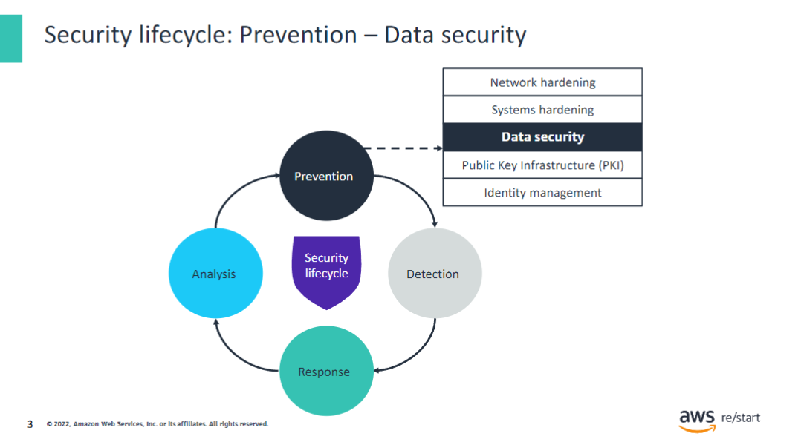

Recall that the phases of the security lifecycle consist of the following:

- **Prevention** – Is the first line of defense
- **Detection** – Occurs when prevention fails
- **Response** – Describes what you do when you detect a security threat
- **Analysis** – Completes the cycle as you identify lessons learned and implement new measures to prevent the issue from occurring again in the future

In this lesson, you will learn about data security concepts and methods that can be used in the prevention phase.

## Confidentiality, integrity, and availability (CIA)

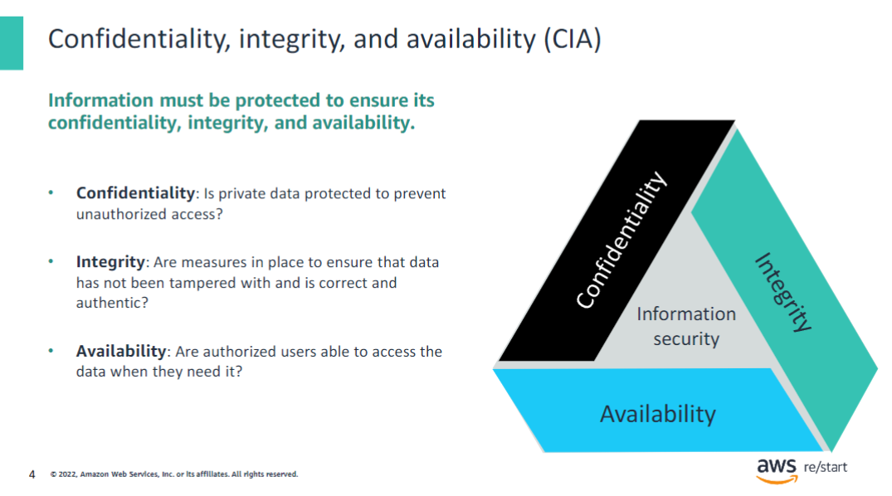

This module introduces concepts that are linked to the integrity and confidentiality aspects of the CIA triad.

## Data in motion compared to data at rest

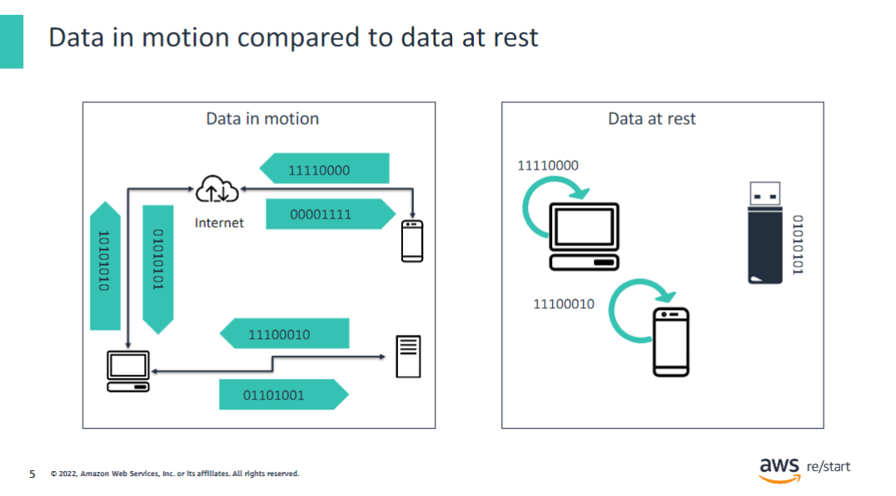

It is important to secure sensitive data while it travels through networks and systems (**data in motion**). It is also important to secure this data when it is stored on a device (**data at rest**).

The diagram illustrates the following:

- **Data in motion** travels from and to the internet; from and to devices such as smartphones, servers, personal computers; or directly between these devices.
- **Data at rest** stays inside devices, such as smartphones, servers, USB keys, and hard drives.

You should use cryptographic techniques, encryption, and controls to secure data based on whether it is in motion or at rest.

## Cryptography

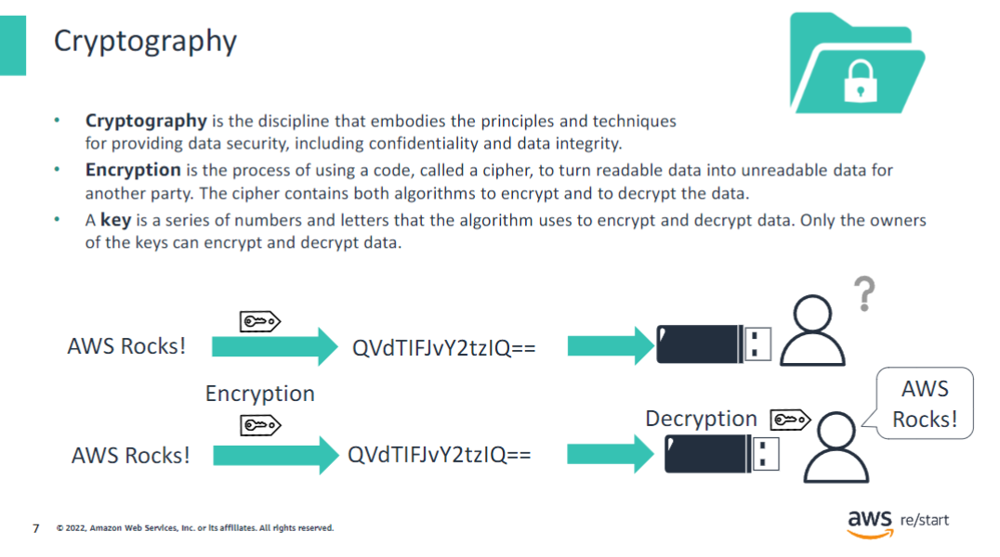

People have been using codes throughout history to keep information from others. Spies, governments, and others have used codes and other methods to ensure that only certain people can read messages. 

**Cryptography** is the discipline that embodies the principles and techniques for providing data security, including confidentiality and data integrity. It is a collection of practices that take advantage of modern computing techniques. It provides a level of confidentiality and integrity of the information to secure and maintain access to sensitive information. Cryptography is not encryption; encryption is a piece of it.

**Encryption** is key to ensuring data confidentiality. Imagine that you want to carry a document on a simple USB key (note that this method is not the safest way to share a document):

- If you lose the key and did not encode the document, your data is at risk of being stolen, read, and used.
- If you encrypted the document with a key, your document is secured. Only those users who have the key to decrypt the document can read it.

### Practical uses

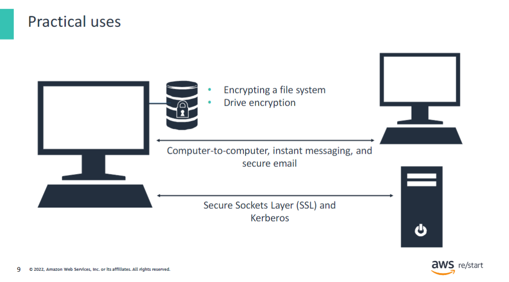

The following examples explain data encryption:

**Data at rest encryption:**

- **File system encryption:** Using Windows New Technology File System (NTFS), you can encrypt a single file or an entire set of files.
- **Drive encryption:** Encrypt an entire drive and its contents. Examples include BitLocker and VeraCrypt. VeraCrypt is a free solution for open-source drive encryption.

**Data in motion encryption:**

- **Secure Sockets Layer (SSL)/Transport Layer Security (TLS):** These protocols are used to secure data that is being transmitted across the wire. When you go to a secure website with `https` at the beginning of the URL, the `s` signifies SSL. TLS is the successor to SSL.
- **Kerberos:** Kerberos is an encryption technology that is used to encrypt all communications between two devices.
- **IP Security (IPsec):** This protocol was introduced as an integral component of the Internet Protocol version 6 (IPv6) and borrowed for use with Internet Protocol version 4 (IPv4). Both IPs provide the logical connection between network devices by providing identification for each device. The IPsec is used to secure virtual private networks (VPNs).
- **Instant messaging or secure email:** In addition to using TLS to secure the communication between a client and a server, you might also want to secure the message itself. Secure/Multipurpose Internet Mail Extensions (S/MIME) and Pretty Good Privacy (PGP) are two protocols that are used for this purpose.

## Encryption

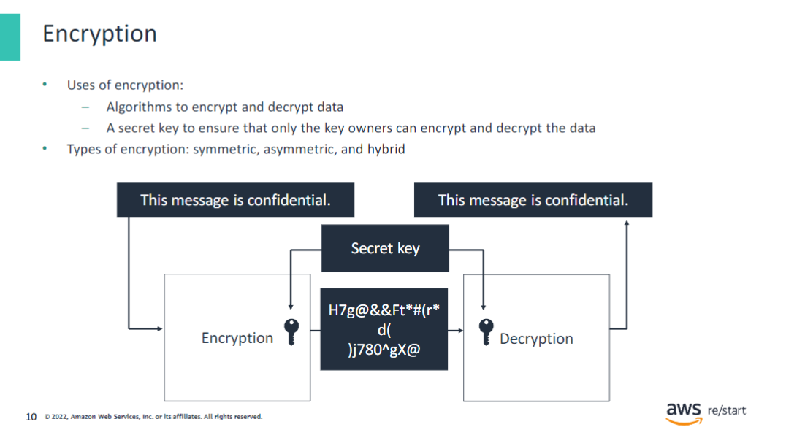

The goal of encryption is to achieve data confidentiality. In the diagram that is on the slide, you can see that the message “This message is confidential” is encrypted with a key. After it is encrypted, the only way to read the message is to use the same key to decrypt the message. The three types of encryption are symmetric, asymmetric, and hybrid, which the following slides explain further.

### Symmetric encryption

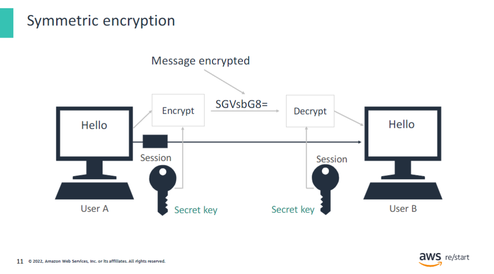

Symmetric encryption uses the same key to encrypt and decrypt the data. The key is a shared secret between the sender and the receiver. Symmetric encryption is fast and reliable and is used for bulk data. Symmetric encryption is used for payment applications, to encrypt databases, and to verify the identity of the sender of a message in messaging applications.

In the diagram that is on the slide, you can see that the message “Hello” is encrypted with a secret key. After it is encrypted, the only way to read the message is to use the same secret key to decrypt the message. Security standards that use symmetric encryption include the following:

- **Advanced Encryption Standard (AES)** – The US National Institute of Standards and Technology (NIST) established this standard. It replaces the previous Triple Data Encryption Algorithm (3DES) standard. The AES has three fixed 128-bit block ciphers with cryptographic key sizes of 128 bits, 192 bits, and 256 bits. A block cipher is a key and algorithm that are applied to a block of data immediately. With AES, the key size is unlimited whereas the block size maximum is 256 bits. For example, Amazon Elastic File System (Amazon EFS) uses an AES-256 encryption algorithm to encrypt data at rest.
- **International Data Encryption Algorithm (IDEA)** – This standard was created and patented in Switzerland and is free for noncommercial use. It uses a block cipher with a 128-bit key.
- **Twofish** – This public domain encryption algorithm is slower than AES.
- **TLS and SSL** – These protocols use symmetric encryption for data exchange.

### Asymmetric encryption

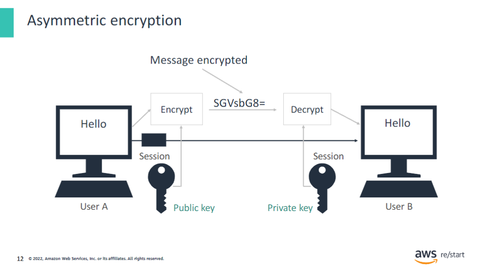

Asymmetric encryption uses both a private key and a public key (a key pair) to encrypt and decrypt the data. Every user in the conversation has a key pair. Asymmetric encryption is more complex and much slower than symmetric encryption. However, it provides more capabilities in the way that keys are managed. Asymmetric encryption is used to encrypt emails or create digital signatures.

In the diagram that is shown on the slide, you can see that the message “Hello” is encrypted with a public key. After it’s encrypted, the only way to read the message is to use the private key associated with this public key to decrypt the message. Security standards that use asymmetric encryption include the following:

- **Rivest-Shamir-Adleman (RSA)** – This method employs an algorithm based on prime number factorization. Thus, deducing an RSA key takes a significant amount of time and processing power. This encryption method is the standard for important data, especially data that is transmitted over the internet.
- **Diffie-Hellman (DH)** – DH is a key exchange method of cryptographic keys over a public channel. This method uses numbers that are raised to specific powers to produce encryption keys.
- **ElGamal** – This method uses an algorithm based on the DH method.
- **TLS, SSL, and Secure Shell (SSH)** – These protocols use asymmetric encryption to establish the connection and create the session, and symmetric encryption for data exchange.

### Comparison of encryption methods

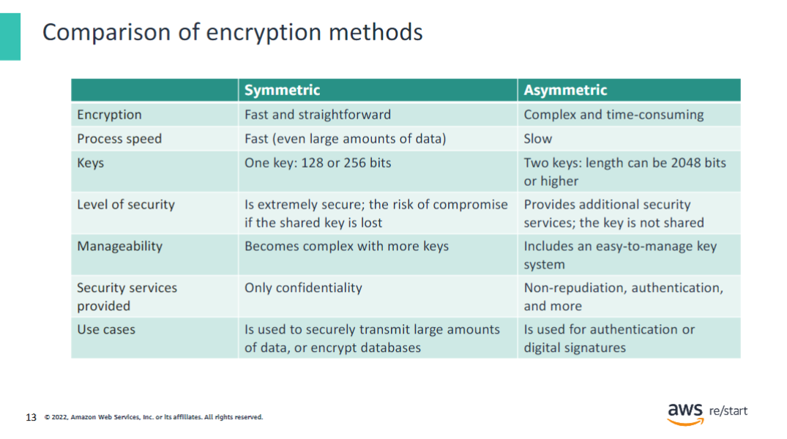

The algorithms that are used for symmetric encryption are less complex than the ones for asymmetric encryption. Therefore, symmetric encryption is used when speed matters, such as when transmitting data in bulk. The downside is that the secret key that is used for encryption must be shared between senders and recipients. This method poses a security risk if one of the parties were to lose the key.

Asymmetric encryption is newer and is considered to be more secure than symmetric encryption because different keys are used for the encryption and decryption processes. The private key is not shared; only the recipient possesses it. However, it is more complex to process.

### Hybrid encryption

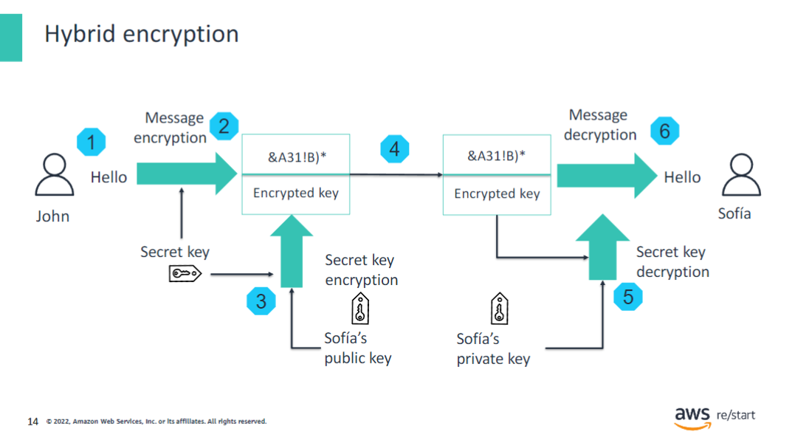

Hybrid approaches are often used for encryption. Examples include:

- The TLS protocol or messaging applications that you use on your phone use both symmetric and asymmetric encryption.
- The session is created by using asymmetric encryption, and symmetric encryption is used for the duration of the session.

A hybrid encryption approach uses both symmetric encryption and asymmetric encryption to protect the data further. To apply the hybrid encryption method, follow the steps in this example:

1. John wants to send the message *Hello* securely to Sofía.
2. John uses the secret key to encrypt the message into `&A31!B)*`. This part is symmetric encryption.
3. John then uses Sofía’s public key to encrypt the secret key. This part is asymmetric encryption, and the message is now fully encrypted.
4. The encrypted message and encrypted secret key are sent to Sofía.
5. Sofía uses her private key to decrypt the encrypted secret key. This part is asymmetric decryption.
6. Sofía uses the decrypted secret key to complete the decryption of the message into *Hello*. This part is symmetric decryption.

A protocol that uses hybrid encryption is TLS, which is also known as SSL.

## AWS CloudHSM and AWS KMS

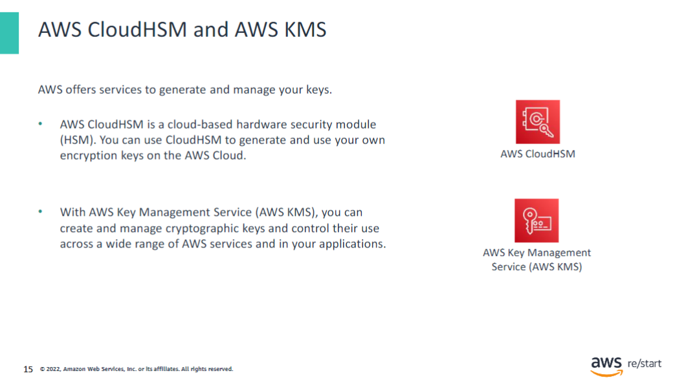

A hardware security module (HSM) is a special hardened and tamper-resistant device used to create and manage keys. They must meet specific, highly secure standards such as FIPS-140-2.

Legal obligations can require customers to use an HSM.

- **AWS CloudHSM:**
  - Is a service that is primarily intended to support customer-managed applications that are specifically designed to use HSMs for compliance obligations.
  - Is fully managed.
  - Offers the possibility to export keys to other available HSMs.

- **AWS Key Management Service (AWS KMS):**
  - Is fully managed.
  - Is integrated with AWS services to simplify the process of using your keys to encrypt data across your AWS workloads.
  - Can store keys in the default key store or connect to AWS CloudHSM to store keys in its key store. This technique helps satisfy compliance obligations to use HSMs while providing the AWS service integrations of AWS KMS.

## Hashing

### What is data integrity?

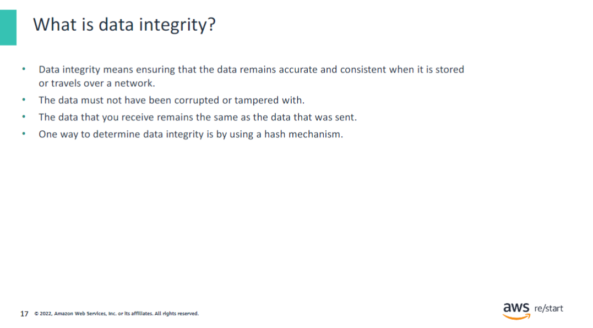

In general, hashes are used to verify the integrity of files that are downloaded from a website. Hashing and encryption are two very different processes:

- **Encoding** is a two-way process. An encoded file can be decoded by a third party that has the right key.

- **Hashing** is a one-way encryption to create a signature of the file.

### Ensuring data integrity with hashing

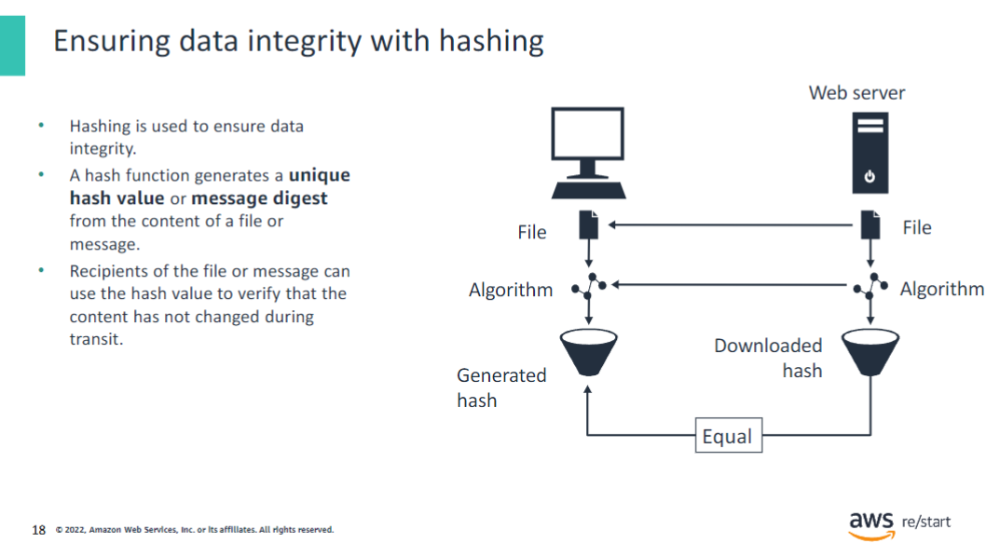

Hashing is a technique that is used to ensure **data integrity**.

Hashing uses a function that reads the data in a message or file and generates a unique text string value from the data. This text string value is known as a hash value or message digest. If you hash copies of the same file with the same hashing function, it will always produce the same hash value. In this way, you can verify that the content of the file has not changed (for example, after it has been transmitted through a network). Hashing functions typically employ standard algorithms such as Secure Hash Algorithm version 1 (SHA1) and Message Digest version 5 (MD5).

In general, hashes are used to verify the integrity of files that are downloaded from a website. The diagram illustrates a typical flow, which involves the following steps:

1. A user finds a file with its hash online.
2. The user downloads the file.
3. The user runs a local tool against the downloaded data to generate the hash.
4. The user downloads the online hash value and compares it to the locally generated hash.
5. If both hashes are the same, integrity was maintained, and the file has not changed since it was digitally signed. If the hashes do not match, the integrity of the file has been compromised, and the file should not be trusted.

## Permissions

### Principles of permissions

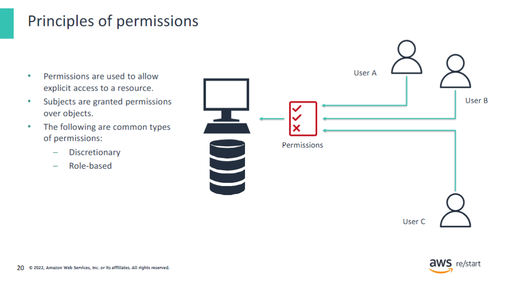

A permission grants a specific type of access to a resource (for example, write access to a file). Permissions are classified into two types: discretionary (based on identity or other criteria) and role-based (based on an assigned role).

A permission is assigned to a subject (a person, device, or system) to give the subject the resource access ability defined by the permission. The diagram in this slide illustrates how permissions give access to a server and a database to User A and User B. However, it forbids access to User C.

### Discretionary access control

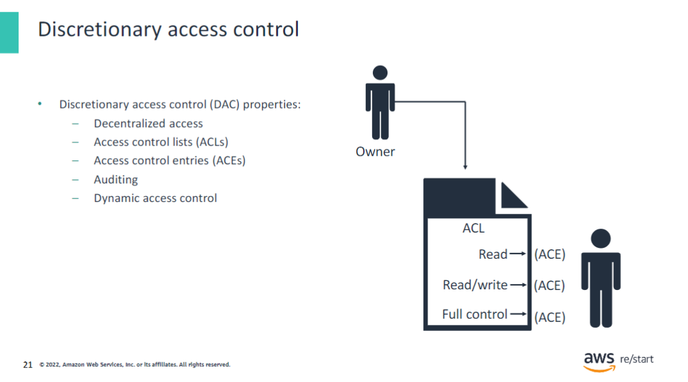

In a discretionary access control (DAC) type, individuals are assigned a level of access to a resource. The level of access information is stored in an access control list (ACL). DAC controls the access to resources based on the identity of individuals or groups of individuals.

For instance, a database administrator will have full control over databases and the database server. However, other employees will be granted only read or read/write access to the tables that they work with.

An ACL is made of a list of permissions: it tells which users have access to which resources and which operations they are allowed.

AWS Identity and Access Management (IAM), the AWS service that helps you securely control access to AWS resources, uses ACL to control access to resources.

### Role-based access control

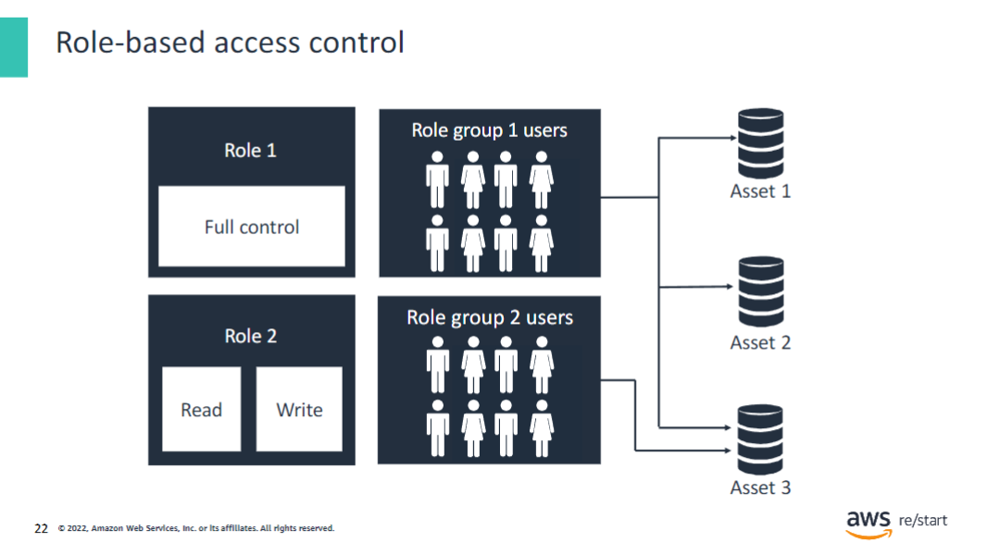

In a role-based access control type, a level of access to a resource is assigned to a role. That is, permissions are distributed based on role. Individuals are then assigned to different roles as they need access to resources.

Role-based permissions are a key feature of IAM and have the following properties:

- Include a modern permissions approach that does not require a high level of interaction every time a change is needed
- Are efficient when dealing with high staff turnovers and hires for shorter-term projects and tasks
- Are very customizable
- Are used extensively in the commercial sector
- Are expanding in use because they provide a good level of granularity

For example, a company might decide to define permissions based on job role. When someone new is hired, they automatically receive all the permissions that come with the role by being placed into the appropriate role group.

In the diagram on the slide, you can see that two roles are defined:

- **Role 1** gives full control to databases Asset 1, Asset 2, and Asset 3.
- **Role 2** gives read and write access to Asset 3.

Two groups of users—Group 1 and Group 2—are respectively assigned Role 1 and Role 2.

Consequently, the groups are granted permissions as follows:

- Users of Group 1 have full control to databases Asset 1, Asset 2, and Asset 3.
- Users of Group 2 have read and write access to Asset 3.

## Checkpoint questions

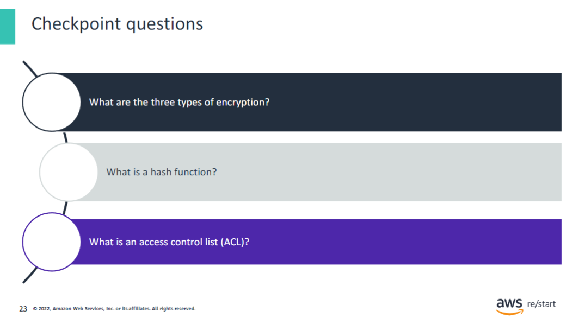

1. What are the three types of encryption?

Symmetric, asymmetric, and hybrid

2. What is a hash function?

A hash is an algorithm that takes a file as an input and creates a unique digital signature as an output.

3. What is an access control list (ACL)?

A document that defines a list of accesses or restrictions, or both, to resources for individuals or groups of individuals.

## Key Takeaways

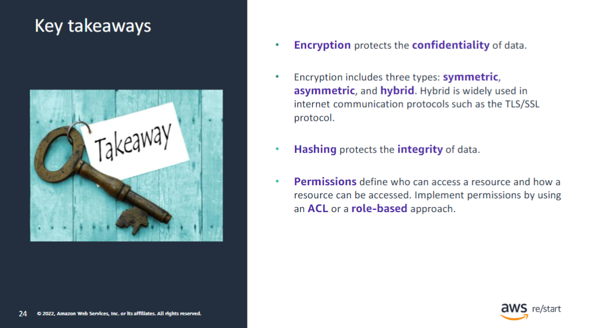

:::tip[This module includes the following key takeaways:]

- Encryption protects the confidentiality of data.
- Encryption includes three types: symmetric, asymmetric, and hybrid. Hybrid is widely used in internet communication protocols, such as the TLS/SSL protocol.
- Hashing protects the integrity of data.
- Permissions define who and how a resource can be accessed. Implement permissions by using an ACL or a role-based approach.

:::
