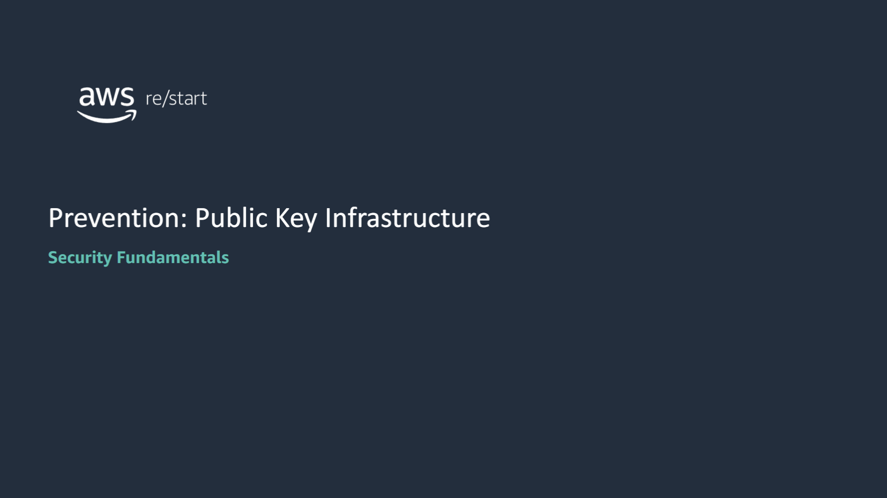

:::tip[In this lesson, you will learn how to:]

- Explain how the public key infrastructure (PKI) works and describe its major components
- Explain how certificates work and how they can be used to secure information
- Describe certification authorities and their common configurations

:::

## Public key infrastructure

### Security lifecycle: Prevention

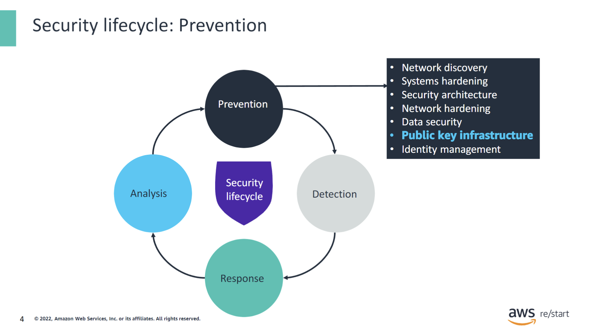

As a review, the phases of the security lifecycle consist of:

- **Prevention**: Serves as the first line of defense
- **Detection**: Occurs when prevention fails
- **Response**: Describes what you do when you detect a security threat
- **Analysis**: Completes the cycle as you implement new measures to prevent the incident from occurring again in the future

In this lesson, you will learn about how you can apply public key infrastructure (PKI) concepts and methods in the prevention phase.

#### Discussion

PKI relies on trust to operate. All components must have a relationship configured in some form of an entity or server role.

Suppose that you are trying to connect to your bank account through the bank website. The website wants to be sure that you have the right to access that data. You will be asked to log in by using a username and a password. By correctly completing the login, you can see the funds. If you want to perform a transaction, the website might look for a more secure way of authentication. For example, it could use two-factor authentication by sending a code to your smartphone in addition to requiring your password. This extra step helps the website trust you and confirm that you are the person who is allowed to perform the transaction.

As PKI applies to technology, an entity accesses a server to retrieve information in a secure way. The server is secured with a certificate. Does the entity trust the server that it is connecting to?

### Public key infrastucture

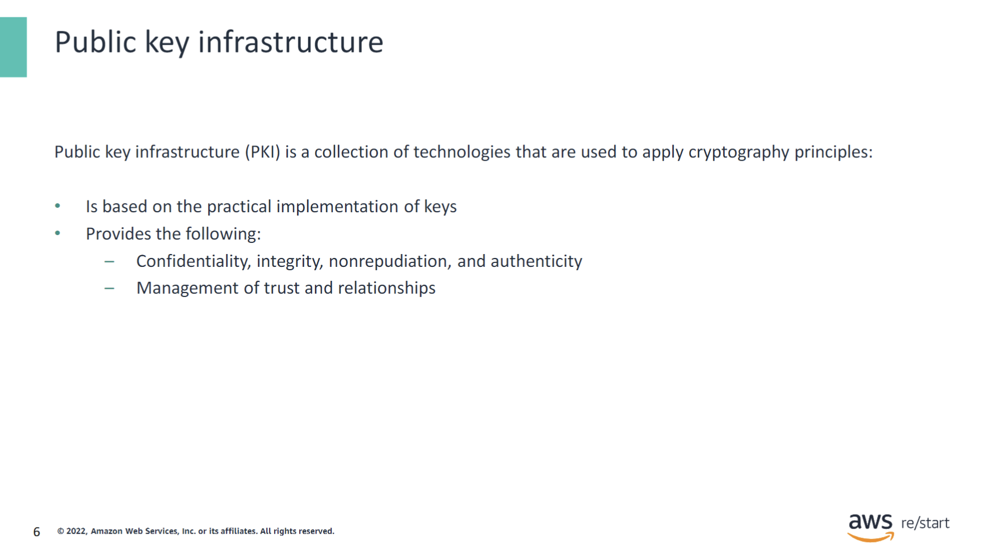

Public key infrastructure (PKI) is a collection of technologies that are used to apply cryptography principles to transfer information securely between two entities. It is based on a practical distribution and implementation of keys, with a set of tools to achieve confidentiality, integrity, non-repudiation, and authenticity.

PKIs are used to implement the encryption of public keys but also to manage public-key-associated certificates. Certificates are digital documents that are used in PKI to prove the ownership of a public key. Certificates contain information about the entity that provided and verified the certificate, the entity to which the certificate belongs, and the public key.

The entity that issues the certificate is called the issuer or the certificate authority. The entity that receives the certificate is called the subject.

### Enabling trust

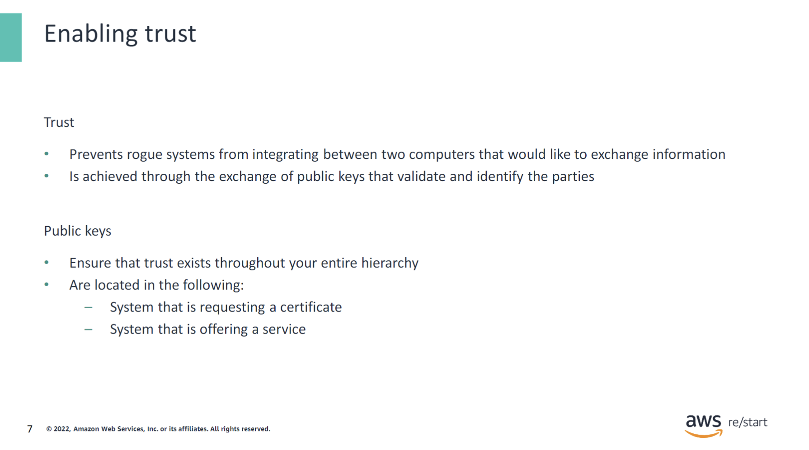

Trust is achieved through the exchange of public keys that validate and identify the parties. Public keys are attached to the certificate that a certificate authority (CA) issues.

### PKI components

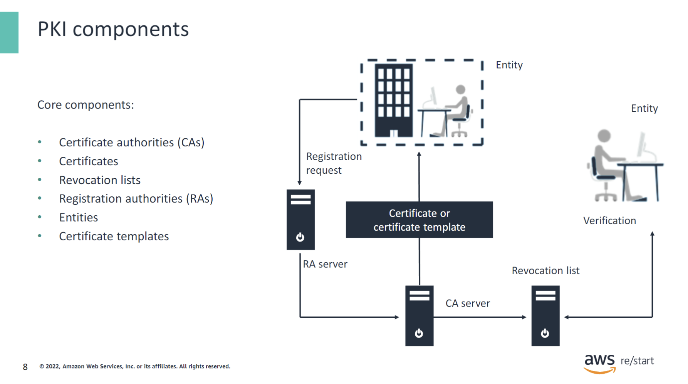

This diagram illustrates a public key infrastructure from end to end, highlighting the main components.

- **Certificate Authority**: The entity that delivers the certificate.
- **Certificates**: Documents that contain information about the certificate issuer, the entity that receives the certificate (subject), and the public key.
- **Revocation Lists**: Lists that contain certificates that have been invalidated, meaning these certificates cannot be trusted anymore.
- **Registration Authorities**: Entities (organizations or companies) that verify requests for certificates. If a request is valid, they tell the certificate authority to provide a certificate.
- **Entities**: Organizations or companies that are asking for certificates or verifying that the certificate is not on a revocation list.
- **Certificate Templates**: Models that are used for the certificates.

In this diagram, a user submits a registration request to the registration authority server. The request is transmitted to the certificate authority server. A verification is performed with a revocation list to verify that the certificate is still valid and is not on the revocation list. After the certificate is verified, the certificate authority server sends the certificate to the entity that requested the registration.

## Certificate authorities

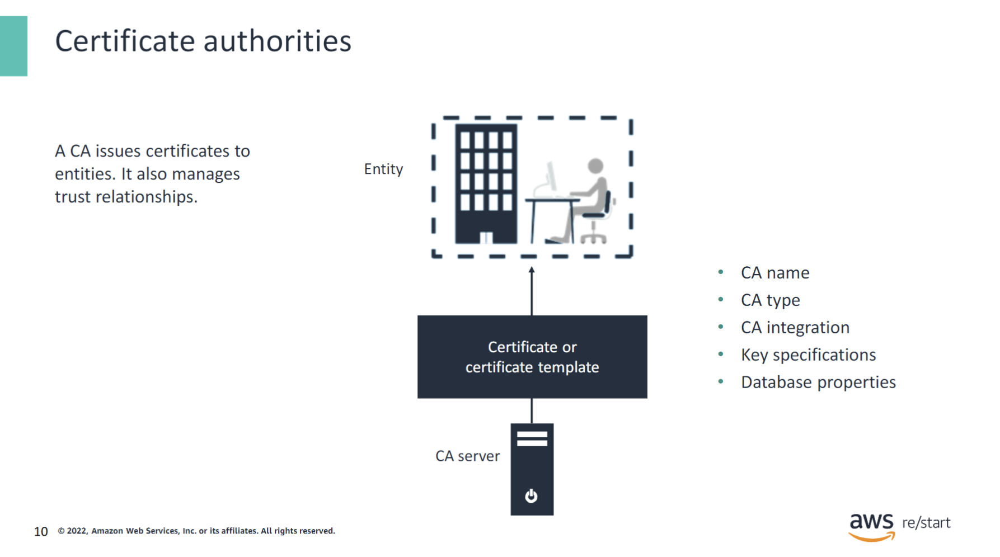

CAs are entities that deliver digital certificates, which ensure that a website is secure. An example of a certificate authority is Google Trust Services (GTS). CAs issue other types of documents, including the following:

- **Certificate practices statement (CPS)**: A CPS defines practices, standards, and algorithms that the CA uses. A CA might publish this document on their website. You can use the information to compare services that CAs offer.
- **Certificate policy**: The certificate policy defines the rules that customers of a CA must follow. The rules include payment requirements, permissible practices (for example, whether you can use it for gambling content), and revocable offenses. Examples of revocable offenses include committing criminal activities or failing to inform the CA of changes that you made to your identity.

### Root CAs and subordinate CAs

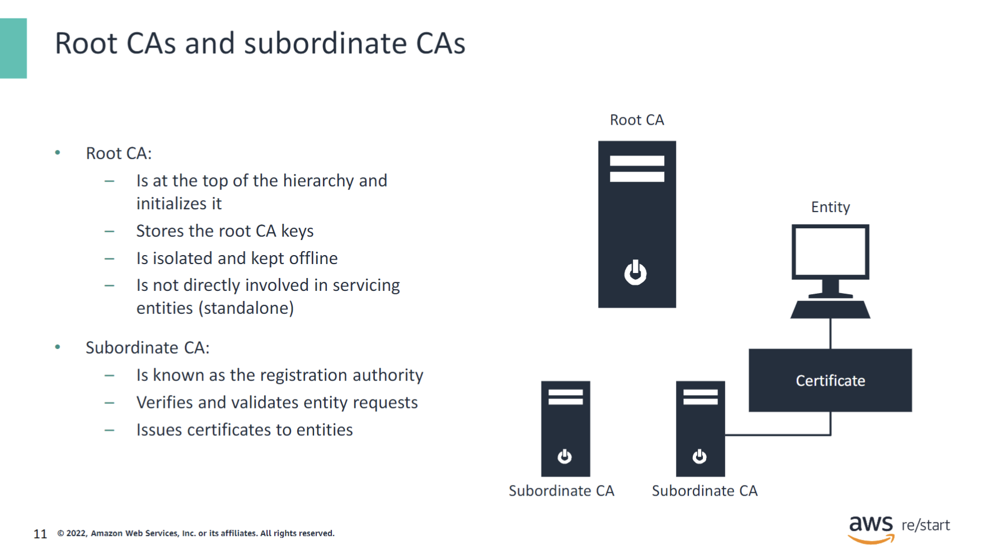

A subordinate CA is not required in a smaller environment. However, it provides greater flexibility to expand the PKI environment.

### Internal CAs vs. external CAs

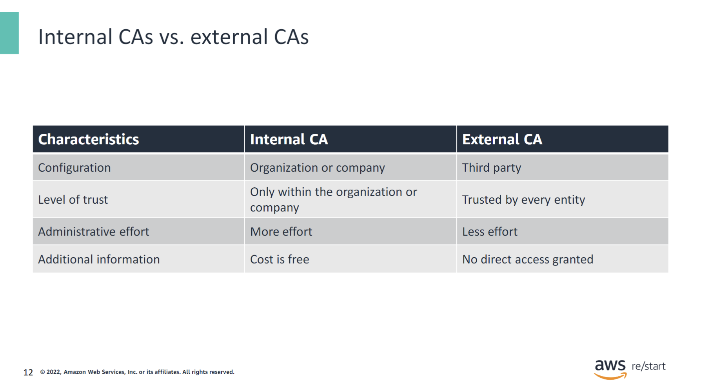

If the protected resource is not published externally, an internal CA can be used.

## Certificates

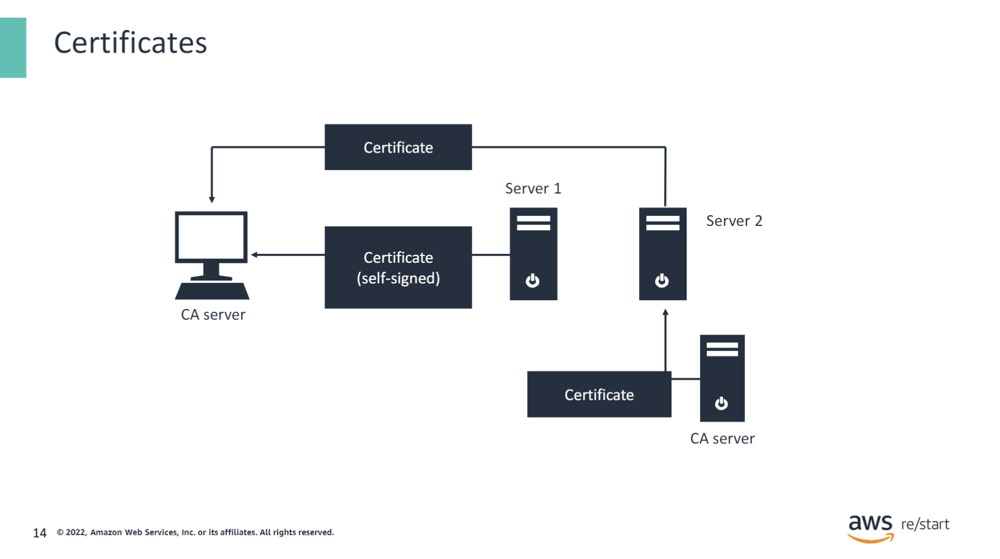

Digital certificates are electronic credentials that are used to **represent online identities** of individuals, computers, and other entities on a network. Digital certificates are like personal identification cards.

Two types of certificates are available: **certificates signed by a CA** and **self-signed certificates**.

A certificate with a **public key** and corresponding **private key** can be used for **encryption** and **decryption**. When only the public key is used, the certificate establishes trust and performs encryption.

### Certificate use cases

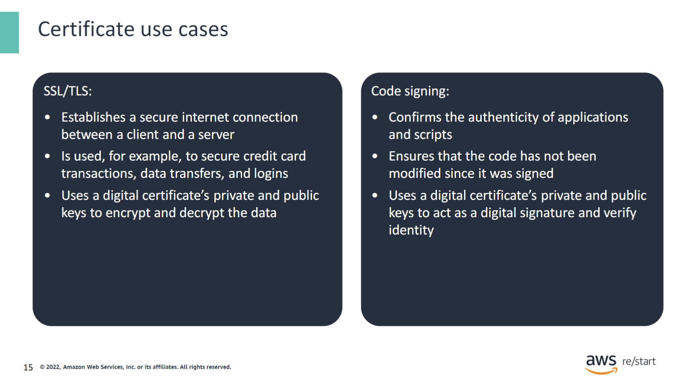

Uses cases for digital certificates include the following:

- **Secure Sockets Layer (SSL)/ Transport Layer Security (TLS)**: SSL/TLS certificates are used to establish a secure connection between a client and a server on the internet. A certificate authority issues an SSL certificate. This certificate is associated with a key pair (a public key and a private key) that is unique to the organization that requested the certificate.

- **Code signing**: Code signing uses digital certificates to authenticate the publisher of software and guarantee that the code has not been modified since it was signed. The software author signs the code by using the certificate’s private key. The software user verifies the author’s identity by using the certificate’s public key.

For example, consider an individual who is buying something on a website. The customer cart page is secured by TLS. Then, the customer is redirected to the payment page through a payment solution provider that is also using a secure TLS connection. Credit card data is submitted to the payment solution provider to authorize the transaction with a TLS connection. Then, the payment solution provider sends back the result of the transaction to the merchant ecommerce website, which in turn confirms the order.

### Obtaining a certificate

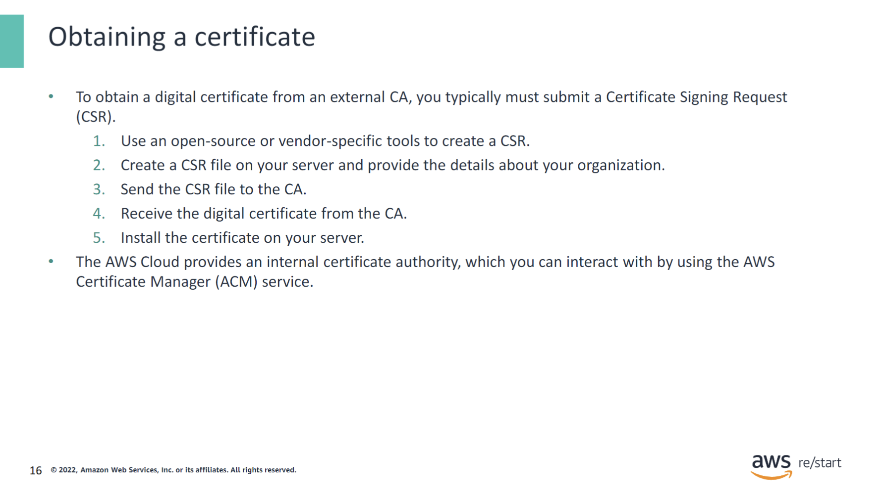

To obtain a digital certificate from an external CA, you must typically submit a certificate signing request (CSR). Using an open-source or vendor-specific tool, you create the CSR on your server and send the CSR file to the CA. After you receive the digital certificate, you install it on your server.

In the AWS Cloud, you can use the AWS Certificate Manager (ACM) service to obtain certificates from the internal ACM Private Certificate Authority.

### Certificate expiration and revocation

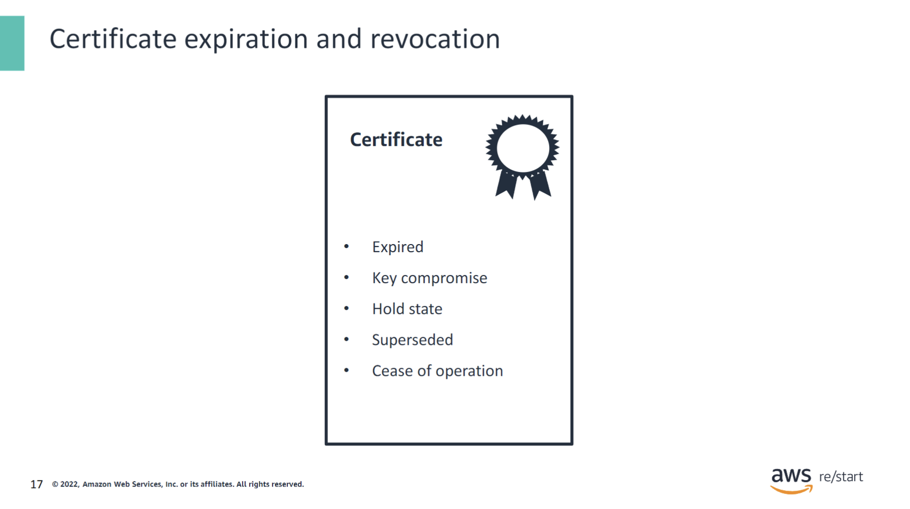

A certificate has an expiration date and can be revoked. An expired or revoked certificate cannot be used because it is added to the certificate revocation list (CRL), which the issuing certificate authority maintains. This list is checked when a resource tries to use the certificate.

### Certificate revocation list

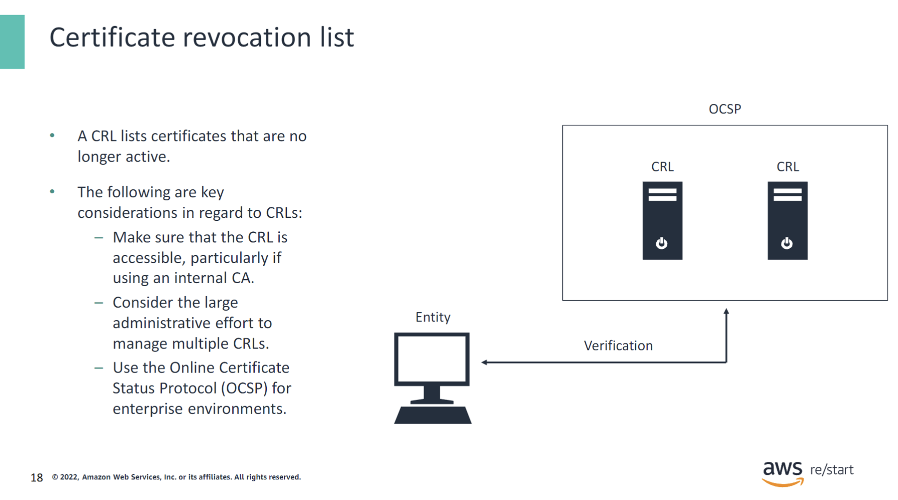

The CRL must be published and accessible at all times, especially if an internal CA issues the certificate.

The Online Certificate Status Protocol (OCSP) is an internet protocol. It is used to retrieve the revocation status of a certificate. It is used in enterprise environments.

### Certificate storage

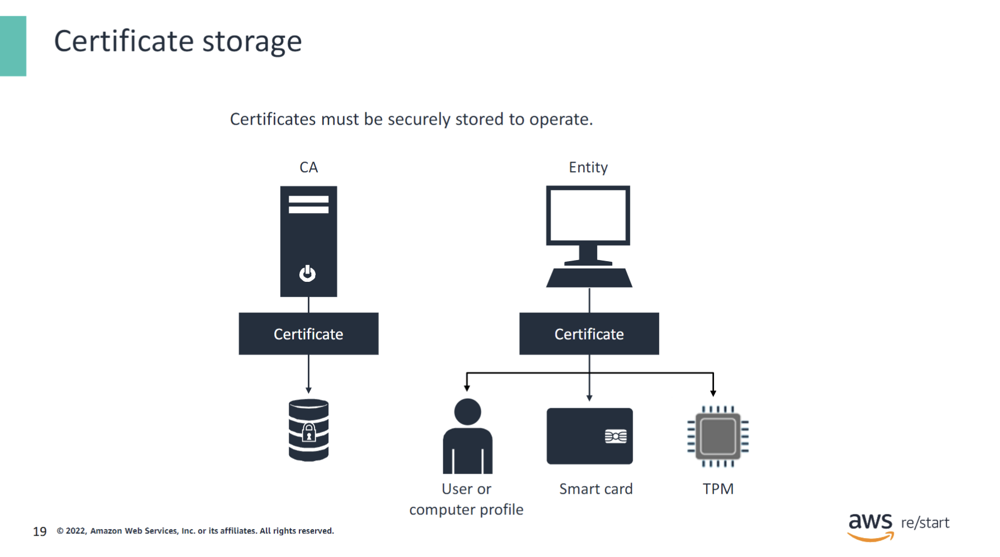

By default, certificates are stored locally on the computer. They can also be stored on smart cards or trusted platform module (TPM) chips.

### ACM

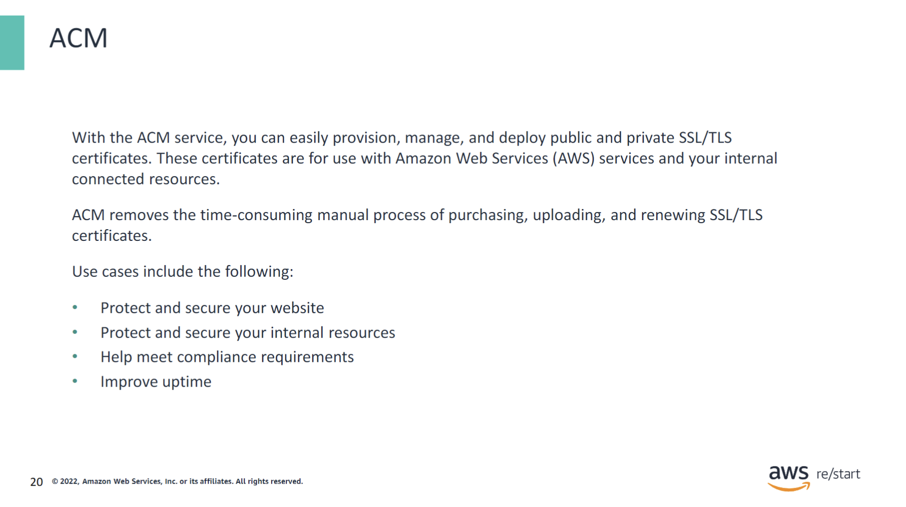

For more information about ACM, see [AWS Certificate Manager](https://aws.amazon.com/certificate-manager/).

## Key Takeaways

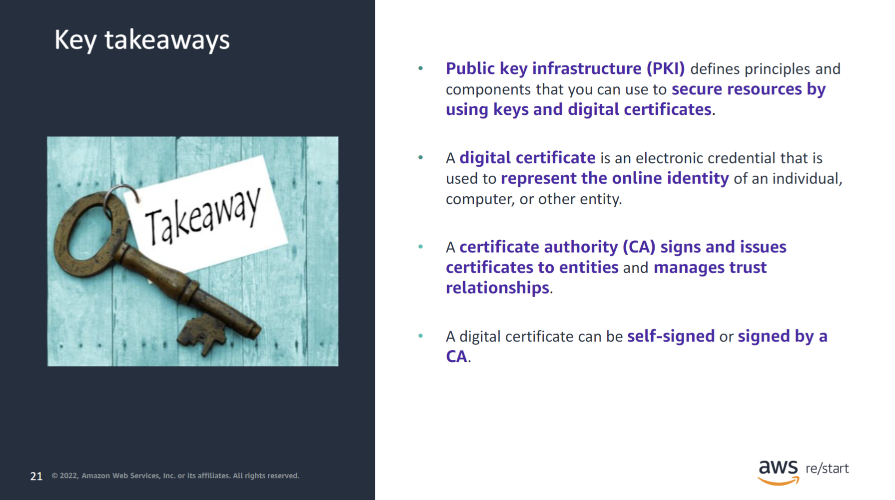

:::tip[Keytakeaways from this lesson include:]

- **Public key infrastructure (PKI)** defines principles and components that you can use to secure resources by using keys and digital certificates.
- **A digital certificate** is an electronic credential that is used to represent the online identity of an individual, computer, or other entity.
- **A certificate authority (CA)** signs and issues certificates to entities and manages trust relationships.
- **A digital certificate** can be self-signed, or a CA can sign it.

:::
