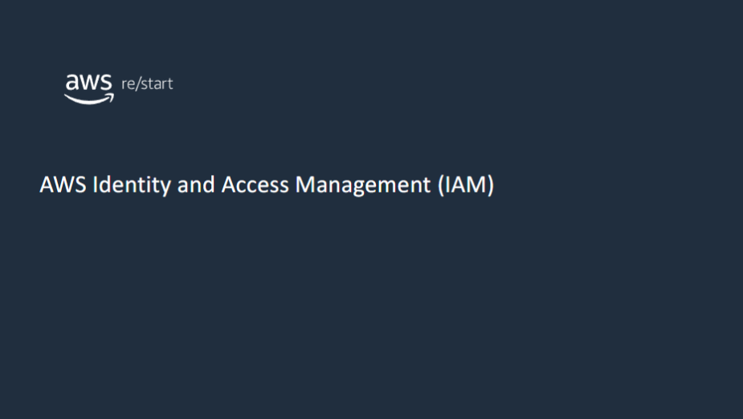

:::tip[What you will learn:]

In this module, you will learn about AWS Identity and Access Management (IAM) users, groups, and roles. You will also learn about the different types of security credentials.

:::

## IAM

### What is IAM?

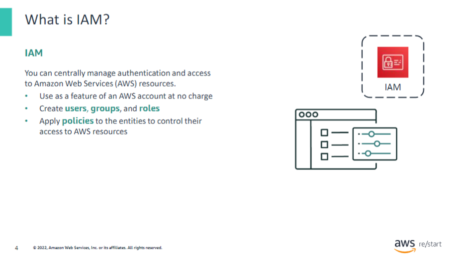

**IAM** is a service that helps securely control access to AWS resources. You can use it to manage access to AWS services and resources securely. Using IAM, you can create and manage AWS users and groups (to support authentication). You can also use IAM for permissions to allow or deny their access to AWS resources (to support authorization).

IAM uses access control concepts that you already know—such as users, groups, and permissions—so that you can specify which users can access specific services.

#### Authentication

Use IAM to configure authentication, which is the first step because it controls who can access AWS resources. IAM is used for user authentication, and applications and other AWS services also use it for access.

#### Authorization

IAM is used to configure authorization based on the user. Authorization determines which resources users can access and what they can do to or with those resources. Authorization is defined through the use of policies. A policy is an object in AWS that, when associated with an identity or resource, defines their permissions.

IAM reduces the need to share passwords or access keys when granting access rights to other people or systems. It also makes it easy to enable or disable a user’s access. Use IAM to centrally manage access regarding who can launch, configure, manage, and delete resources. It provides granular control over access permissions for users, systems, or other applications that might make programmatic calls to other AWS resources.

Use IAM to perform the following tasks:

- Manage the resources that can be accessed and the actions that can be performed on the resources. For example, who has permissions to terminate Amazon Elastic Compute Cloud (Amazon EC2) instances?
- Define required credentials based on context, such as the following questions:
  - Who can access which AWS service?
  - What is the user or system allowed to do with the service?

### IAM features

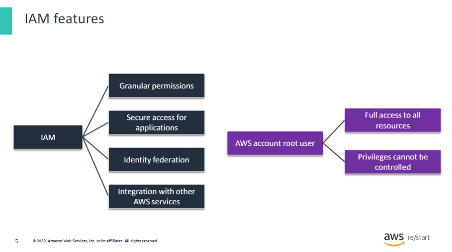

#### IAM User

An **IAM user** is an entity that you create in AWS to represent a person or application that interacts with AWS resources. A user in AWS consists of a name and credentials.

#### IAM Account Root User

When you first create an AWS account, you begin with a single sign-in identity. This entity has complete access to all AWS services and resources in the account and is called the **AWS account root user**. You access the account root user by signing in with the email address and password that you used to create the account. AWS account root users have full access to all resources in the account. You cannot control the permissions of the AWS account root user credentials. Therefore, AWS strongly recommends that you not use AWS account root user credentials for daily interactions with AWS.

#### IAM

Use IAM to create additional users and assign permissions to these users following the principle of least privilege. With IAM, you can securely control access to AWS services and resources for users in your AWS account. For example, if you require administrator-level permissions, you can:

1. Create an IAM user
2. Grant that user full access
3. Use those credentials to interact with AWS

#### Identity Federation

Identity federation is a system of trust between two parties. Its purpose is to authenticate users and convey the information needed to authorize their access to resources. In this system, an identity provider (IdP) is responsible for user authentication. A service provider (SP), such as a service or an application, controls access to resources.

Later, if you need to revoke or modify your permissions, you can delete or modify any policies that are associated with that IAM user. Additionally, you might have multiple users that require access to your AWS account. You can create unique credentials for each user and define who has access to which resources. In other words, you don't need to share credentials. For example, you can create IAM users with read-only access to resources in your AWS account. Then, distribute those credentials to users who require read access.

## Security credentials

### Types of security credentials

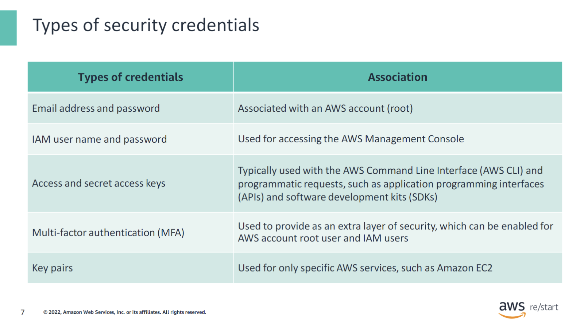

Here is a summary of the different types of AWS security credentials.

Each AWS account has an assigned account root user. This account root user has an assigned email address for the purposes of account recovery and communication. However, AWS recommends that you do not use the account root user for everyday tasks, even administrative ones. Instead, follow the best practice of using the account root user only to create an IAM user first. Then, securely lock away the account root user credentials. Use them only when you must perform the few account and service management tasks that cannot be accomplished in other ways.

As mentioned earlier, the IAM user name and password security credentials are used to access the AWS Management Console, also known as the console. Access keys can be used for programmatic access when they are generated for a user.

For added security, AWS recommends that you apply multi-factor authentication (MFA) on the AWS account root user and on any defined IAM users.

### IAM: Authorization

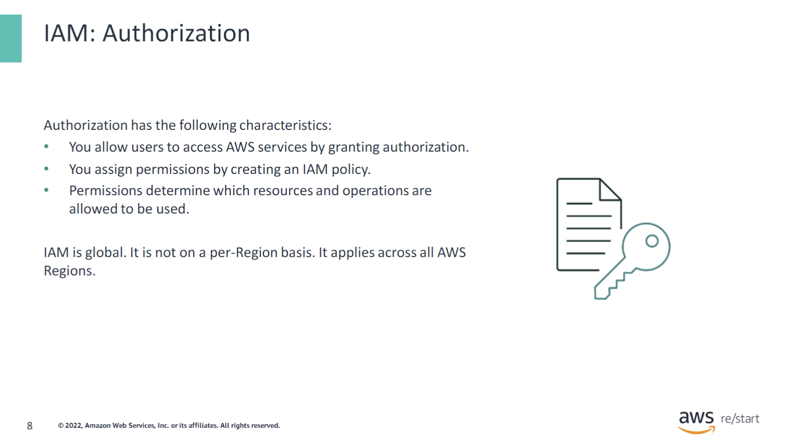

After users have been authenticated, they must then be authorized to access an AWS service. To assign permissions to a user, group, or role, you must create an IAM policy. A policy is a document that explicitly lists permissions. There are no default permissions. All actions are denied by default (implicit deny) unless they are explicitly allowed. Any actions that you did not explicitly allow are denied. Any actions that you explicitly deny are always denied.

IAM is global. It is not on a per-Region basis. It applies across all AWS Regions.

### MFA
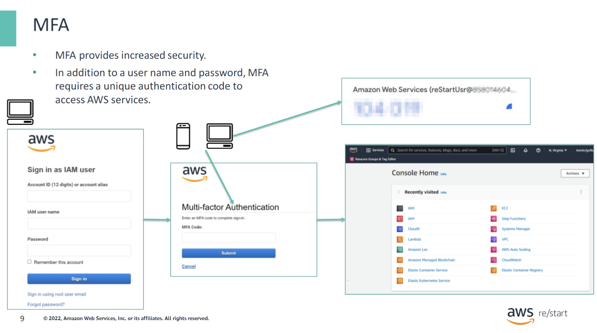

In the example:

- The user authenticated with
  - The account ID
  - The IAM user name
  - The password
- After the user is authenticated, an MFA code that is linked to this user is requested.
- The user gets the MFA code from a device such as a smartphone. The code can also be sent to an email address.
- Login is successful only if the MFA code is correct.

You can access AWS services and resources by using the following tools:

- AWS Management Console
- AWS Command Line Interface (AWS CLI)
- Software development kits (SDKs) and application programming interfaces (APIs) from various supported environments

For increased security, AWS recommends enabling MFA. With MFA, users and systems must be authenticated before they can access AWS services and resources. Two options are provided for authentication devices: hardware devices and virtual MFA-compliant applications (Google Authenticator or Authy two-factor authentication). Short Message Service (SMS) is another authentication alternative that sends an SMS message with an MFA code to your mobile device.

You can also use AWS Security Token Service (AWS STS) to request temporary, limited-permission credentials for IAM users or for users that you authenticate. For more information, see [Using multi-factor authentication (MFA) in AWS](https://docs.aws.amazon.com/IAM/latest/UserGuide/id_credentials_mfa.html).

## IAM implementation

### IAM users

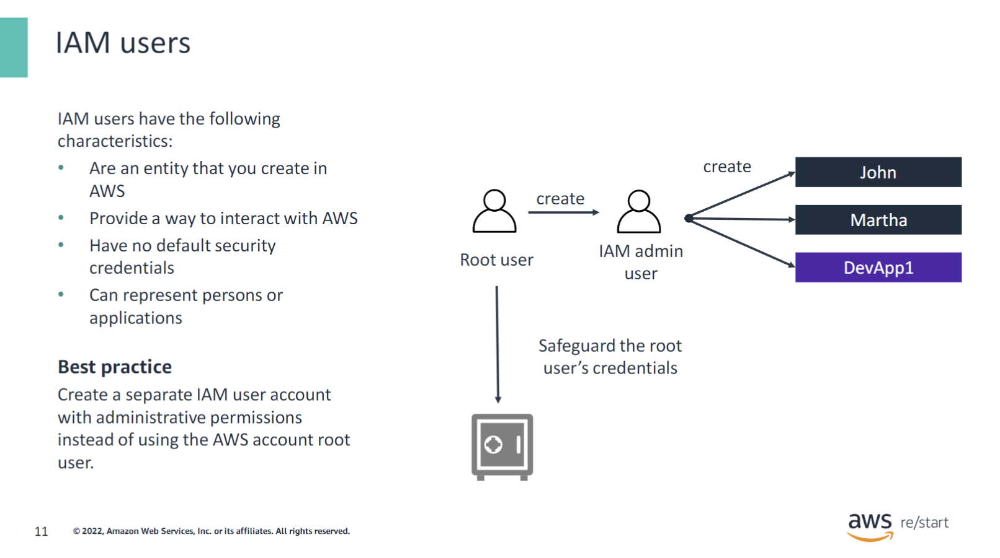

An IAM user is an entity that you create in AWS that provides a way to interact with AWS. An IAM user primarily gives individuals identities that they can use to sign in to the console and make requests to AWS services. Newly created IAM users have no default credentials that they can use to authenticate themselves and access AWS resources. First, you assign security credentials to users for authentication. Then, attach permissions that authorize the users to perform any AWS actions or to access any AWS resources. The credentials that you create for users are what they use to uniquely identify themselves to AWS.

An IAM user is only an identity with associated permissions. You might create an IAM user to represent an application that must have credentials to make requests to AWS. An application can have its own identity in your account and its own set of permissions. This technique is similar to the way that processes have their own identities and permissions in an operating system, such as Microsoft Windows or Linux.

A best practice is to create a separate IAM user account with administrative permission instead of using the account root user.

### IAM groups

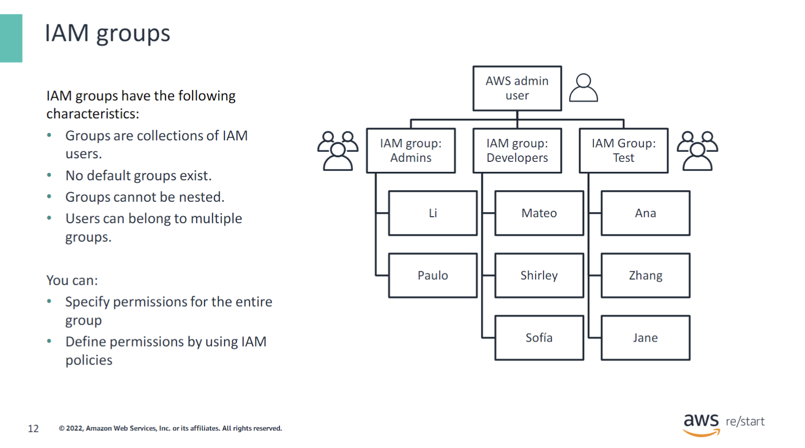

A group is a collection of IAM users. You can use groups to specify permissions for a collection of users, which can make it easier to manage the permissions for those users. For example, you could have a group named `Developers` and give that group the types of permissions that developers typically need. Any user in that group automatically has the permissions that are assigned to the group. If a new user joins your organization and should have developer permissions, add that user to the `Developers` group. Doing so automatically gives these users the appropriate permissions. Similarly, suppose that a person changes jobs in your organization. Instead of editing that user's permissions, you can remove the user from the earlier group and add them to the new group.

Important characteristics of groups include the following:

- A group can contain many users, and a user can belong to multiple groups.
- Groups cannot be nested. They can contain only users, not other groups.
- No default group exists that automatically includes all users in the AWS account. If you want to have a default group, you must create it and assign each new user to it.

### IAM roles

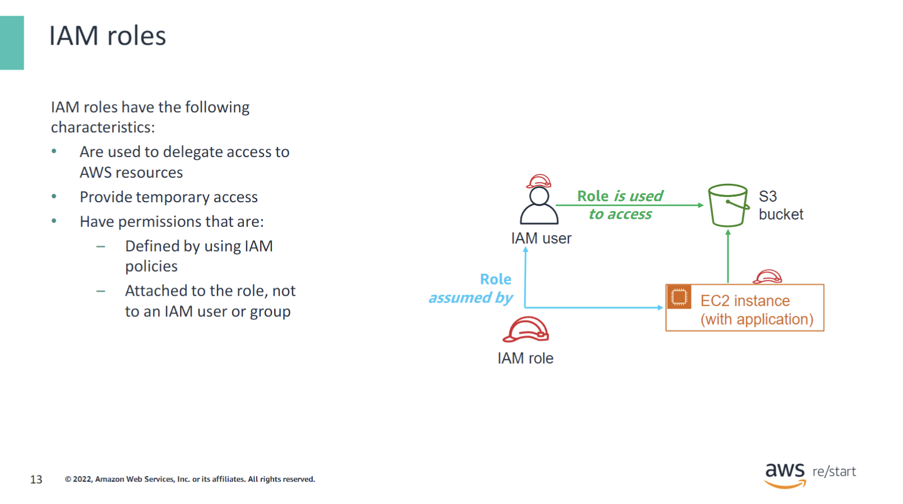

A role is a tool for giving temporary access to AWS resources in your AWS account. Permissions are not attached to an IAM user or group. Instead, at runtime, applications or AWS services can programmatically assume a role. When a role is assumed, AWS returns temporary security credentials that the user or application can use to make programmatic requests to AWS. Consequently, you do not need to share long-term security credentials—for example, by creating an IAM user—for each entity that requires access to a resource.

**Use cases**
A use case for using roles is with federated users. A federated user does not have a permanent identity in an AWS account the way that an IAM user does. To assign permissions to a federated user, you can create a role entity.

In the diagram, a role is temporarily given to a user and an application. The purpose of this temporary role is to access the storage in the Amazon Simple Storage Service (Amazon S3) bucket.

**Creating roles**
You create a role in the AWS account that contains the resources that you want to allow access to. When you create the role, specify two policies:

- The trust policy specifies who is allowed to assume the role, such as the trusted entity or principal.
- The access (or permissions) policy defines which actions and resources the principal is allowed access to.

The principal can be any of the following:

- AWS account
- AWS service, such as Amazon EC2
- Security Assertion Markup Language (SAML) provider
- IdP that can include Login with Amazon, Facebook, or Google

The principal can also be an IAM user, group, or role from other AWS accounts, including ones that you do not own.

### IAM permissions

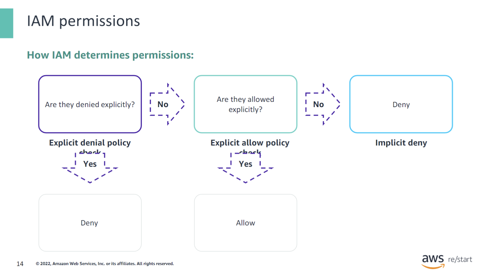

Using policies, you can fine-tune permissions that are granted to IAM users, groups, and roles. Because policies are stored in JavaScript Object Notation (JSON) format, you can use them with a version control system. It is a best practice to define least privileged access to each user, group, or role. In that way, you can customize access to specific resources by using an authorization policy.

When you determine whether permissions are allowed, IAM first checks for an **explicit deny policy**. If one does not exist, it then checks for an **explicit allow policy**. If neither an explicit deny policy nor an explicit allow policy exists, IAM reverts to the default: **implicit deny**.

### IAM policies

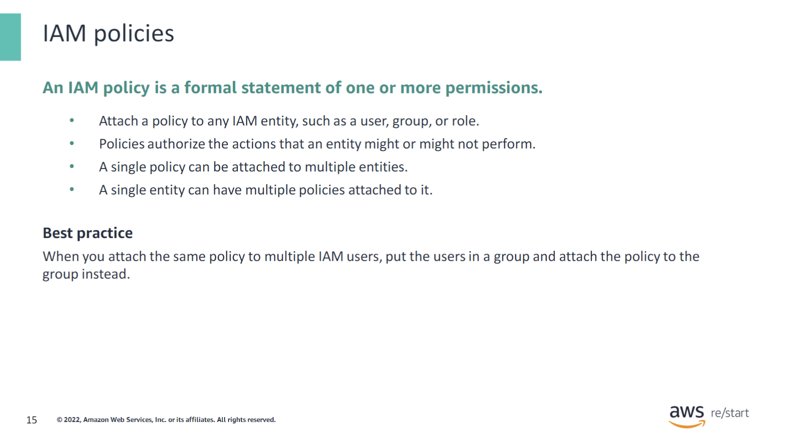

An IAM policy is a formal statement of one or more permissions. Policies can be attached to any IAM entity, which includes a user, group, role, or resource. For example, you can attach a policy to your AWS resources to block all requests that do not come from an approved IP address range. Policies specify which actions are allowed, which resources are granted those actions, and the resulting effect when the user requests access to the resources.

The order in which the policies are evaluated has no effect on the outcome of the evaluation. All policies are evaluated, and the result is always that the request is either allowed or denied. When a conflict occurs, the most restrictive policy wins.

The following are types of IAM policies:

- **Identity-based policies** are permissions policies that you can attach to a principal or identity, such as an IAM user, role, or group. These policies control which actions that identity can perform, on which resources, and under what conditions. Identity-based policies can be further categorized as:
  - **Managed policies**: Standalone identity-based policies that you can attach to multiple users, groups, and roles in your AWS account
  - **Inline policies**: Policies that you create and manage, which are embedded directly into a single user, group, or role

- **Resource-based policies** are JSON policy documents that you attach to a resource, such as an S3 bucket. These policies control which actions a specified principal can perform on that resource and under which conditions. Resource-based policies are inline policies. There are no managed resource-based policies.

For more information, see [Policies and permissions in IAM](https://docs.aws.amazon.com/IAM/latest/UserGuide/access_policies.html) in the AWS Identity and Access Management User Guide.

When you attach the same policy to multiple IAM users, put the users in a group and attach the policy to the group instead. Additionally, you can use the IAM policy simulator to test and troubleshoot IAM and resource-based policies. For more information, see [Testing IAM policies with the IAM policy simulator](https://docs.aws.amazon.com/IAM/latest/UserGuide/access_policies_testing-policies.html) in the AWS Identity and Access Management User Guide.

#### Example: IAM policy

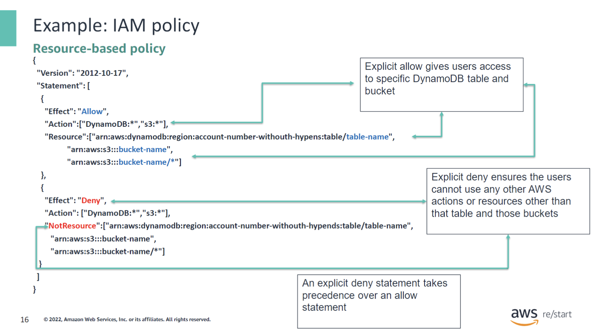

The example policy gives users access to only the following resources:

- **Amazon DynamoDB table**, whose name is represented by `table-name`
- **Corporate S3 bucket** for the AWS account, whose name is represented by `bucket-name`, and all the objects that it contains

The policy includes an explicit deny (`"Effect":"Deny"`) element with the `NotResource` element. This explicit deny helps to ensure that users cannot perform any AWS actions or use resources except the ones that were specified in the policy. This restriction applies even if permissions were granted in another policy. An explicit deny statement takes precedence over an allow statement.

### IAM: Policy assignment

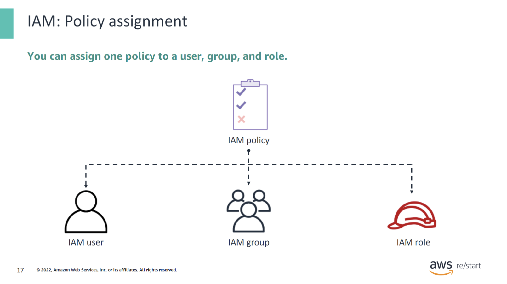

You can assign the same policy to a user, group, and role. This practice makes reuse available and reduces the need to recreate the same policy for different identities.

## Checkpoint questions

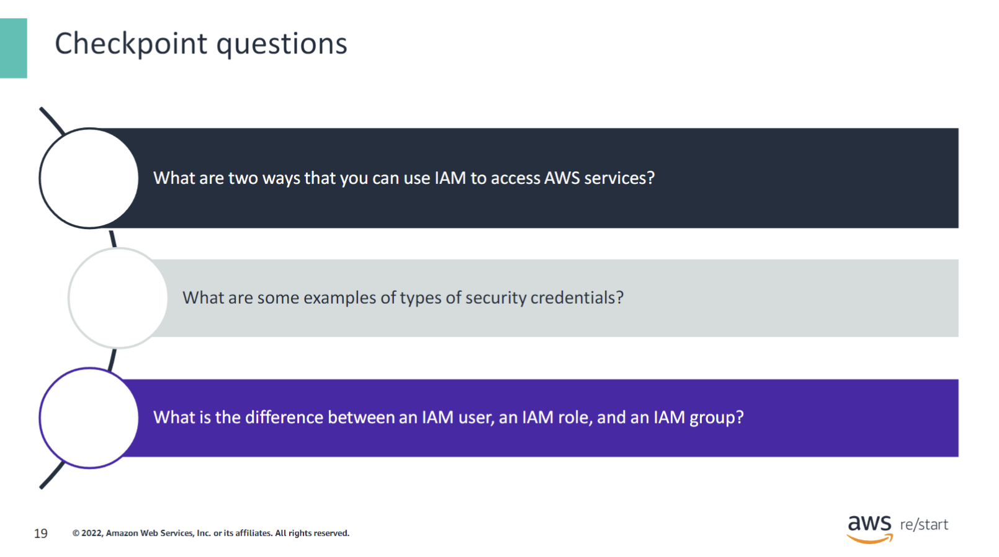

1. What are two ways that you can use IAM to access AWS services? 

You can use IAM to access AWS services through programmatic access or through the AWS Management Console.

2. What are some examples of types of security credentials?

Types of security credentials include email address and password, IAM user name and password, access and secret access keys, multi-factor authentication, and key pairs.

3. What is the difference between an IAM user, an IAM role, and an IAM group?

An IAM user is an entity that you create in AWS that provides a way to interact with AWS. An IAM role specifies permissionsthat define which actions can be taken against a given resource. A groupis a collection of IAM users.

## Key takeaways

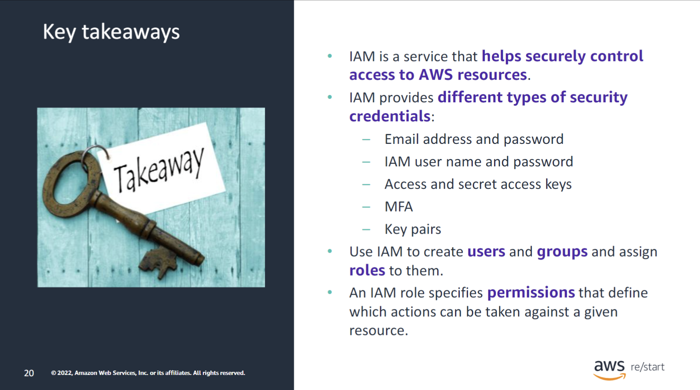

:::tip[Key takeaways from this lesson include:]

- IAM is a service that helps securely control access to AWS resources.
- IAM provides different types of security credentials:
  - Email address and password
  - IAM user name and password
  - Access and secret access keys
  - MFA
  - Key pairs
- Use IAM to create users and groups and assign roles to them.
- An IAM role specifies permissions that define which actions can be taken against a given resource.

:::
