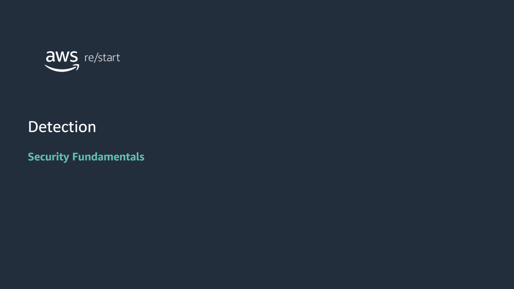
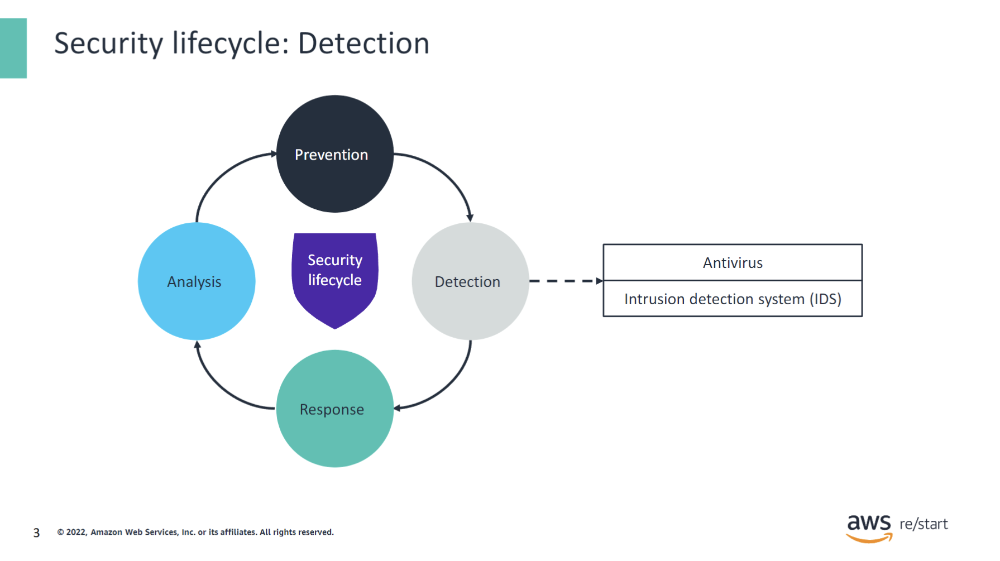
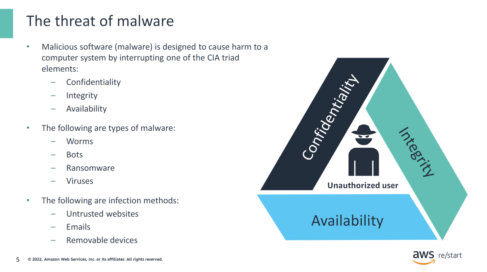
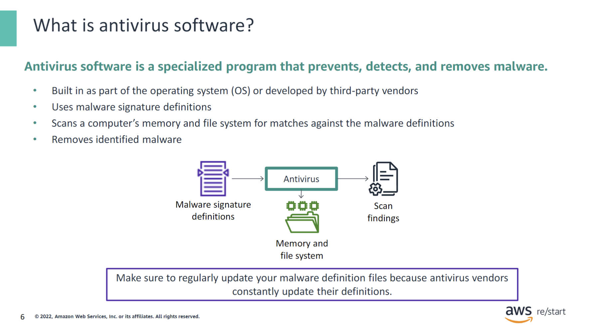
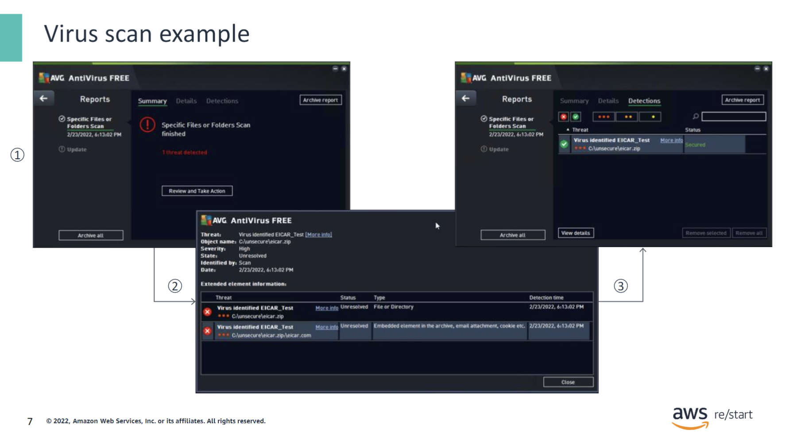
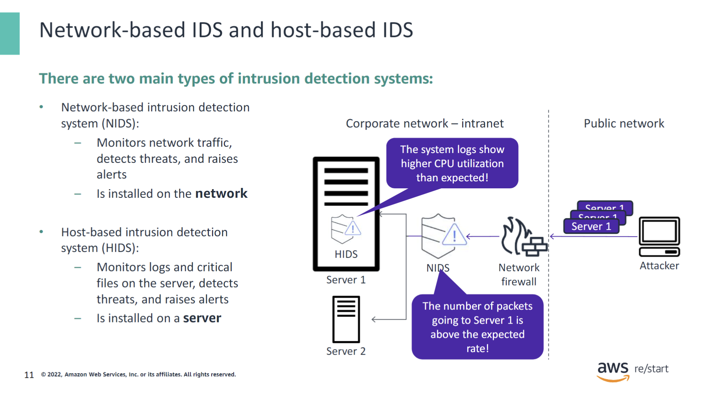
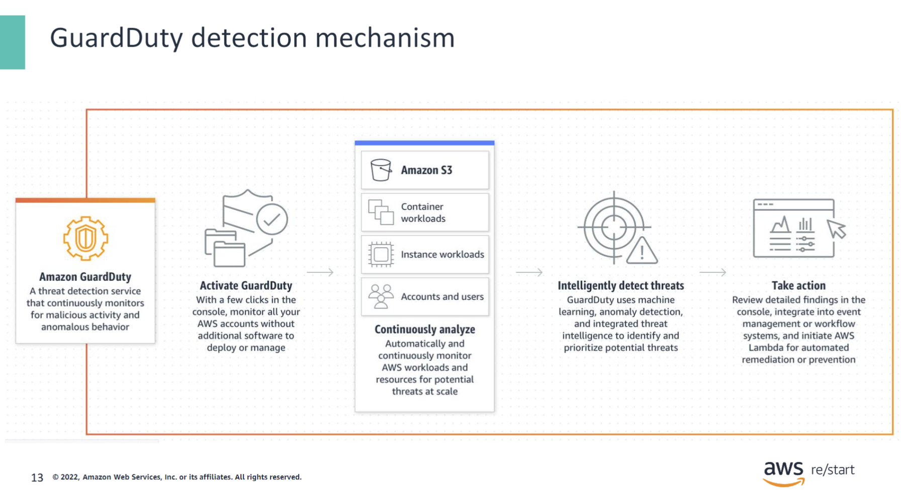
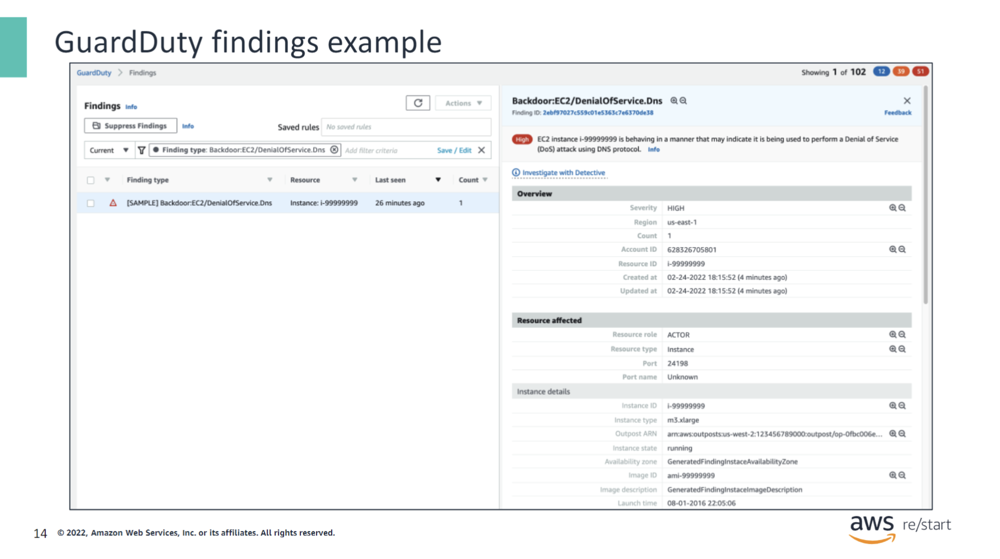
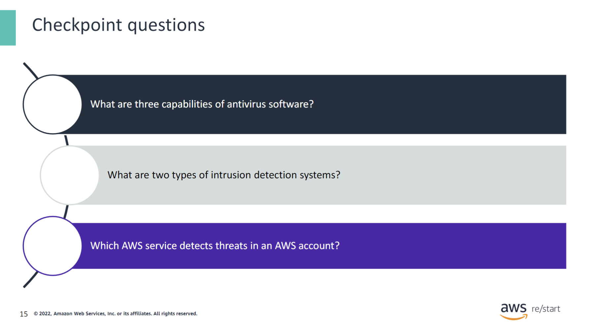
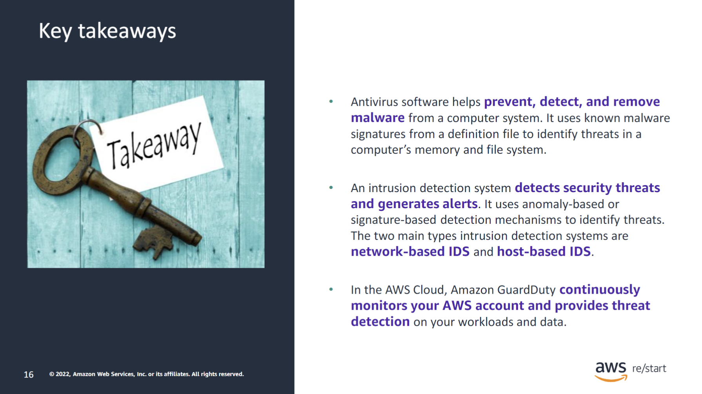

:::tip[In this lesson, you will learn how to:]

- Describe how antivirus software is used to detect threats
- Define the benefits of an intrusion detection system (IDS)
- Identify how Amazon GuardDuty detects threats

:::

As a review, the phases of the security lifecycle consist of the following:

- **Prevention** – Is the first line of defense
- **Detection** – Occurs when prevention fails
- **Response** – Describes what you do when you detect a security threat
- **Analysis** – Completes the cycle as you identify lessons learned and implement new measures to prevent the issue from occurring again in the future

In this lesson, you will learn about the detection phase of the security lifecycle. The topics cover monitoring and detecting an attack that gets past the security controls that are implemented as part of the prevention phase.

## Antivirus software

### The threat of malware

Malware is an application that causes harm to a computer system. It interrupts one or many of the CIA triad elements: confidentiality, integrity, or availability. Knowledge of malware, how to avoid infection, and how to respond to corrupted systems are key elements of security management.

The following are types of malware:

- **Viruses**–Viruses are programs that can corrupt or delete data and propagate themselves from one system to another.
- **Worms**–Worms are programs that spread themselves and consume resources destructively on a computer. They have no executable file and rely on application weaknesses to deploy themselves. The author of a worm can control the infected computer remotely. Worms can be difficult to isolate because they spread quickly. Examples include MyDoom, Sobig, and Stuxnet.
- **Bots**–Bots are used to control computers or launch distributed denial of service (DDoS) attacks against vulnerable systems. An example is Poison Ivy.
- **Backdoors**–A backdoor (also known as a Trojan horse) is often a secret server that steals information from the victim’s system. It allows an intruder into a system. You can know about the backdoor if you scan the system and the network to find patterns of traffic. Examples include Sub7, GirlFriend, and Zeus.
- **Rootkits**–A rootkit cloaks itself by replacing system files that can reveal its presence. It is used to retrieve information. It is difficult to identify and remove because it can become part of the operating system. Removal often requires a system reformat. An example is Hacker Defender.
- **Spyware**–Spyware jeopardizes privacy and typically comes embedded into applications that look free and interesting to use. As people are doing more finance and other personal activities online, these activities can be detected and revealed, and information can be stolen. An example is Real-time spy.
- **Adware**–Adware deploys advertising content and monitors user activity, such as visited websites. It is similar to spyware, but it focuses on ads and what a user clicks. Adware is often embedded in shareware applications. An example is Fireball.
- **Ransomware**–Ransomware locks systems or makes data unavailable until the user pays a ransom.

Malware infects a system through different methods, including the following:

- **Untrusted websites**–Untrusted websites are websites whose identity can’t be identified and might have malicious intent.
- **Removable devices**–These devices can be used to infect a system. For example, a USB device is mailed to you. You open it, and it contains a backdoor that gives remote access to your system to an unauthorized user.
- **Emails**–An email can have attachments with viruses or malware.

### What is antivirus software?

#### Virus scan example

This slide shows an example of running a virus scan on a Windows computer and removing a detected virus. The antivirus software that is used in this example is a free program called AVG.

The scan and removal steps are described as follows:

1. The antivirus program scans a specified folder in the file system and reports that one threat is detected.
2. When you view the details of the threat, you see the names of the identified virus and infected file. In this case, the name of the virus is EICAR_Test, and it was found in the file named eicar.com in the archive file named eicar.zip.
3. You can then choose to remove the virus and restore the security of the folder in your file system.

## Intrusion detection system

### Intrusion detection system (IDS)

An intrusion detection system (IDS) is a hardware or software solution that monitors a network or a computer system to detect intrusions or malicious activity. When this kind of activity happens, the IDS generates alerts to notify security personnel.

An IDS can detect an attack by using different mechanisms, including the following:

- **Anomaly-based detection** – The IDS compares the current traffic pattern or system activity against established baselines for any deviation.
- **Signature-based detection** – The IDS monitors and analyzes the traffic for known patterns of attack.

There are several types of intrusion detection systems, and the type is based on where the IDS is installed in the computing environment. The next slide describes two of the main types.

### Network-based IDS and host-based IDS

An IDS usually is either a network-based intrusion detection system (NIDS) or a host-based intrusion detection system (HIDS):

- **A NIDS** monitors for attacks on the network. Therefore, it is installed on the network and inspects and analyzes all the data that travels through the network.
- **A HIDS** is installed on a server and monitors logs and critical files on the server, watching for signs of an attack.

In this example, a NIDS is placed behind a network firewall on the corporate network, and an HIDS is installed on Server 1. An attacker attempts to send multiple requests to Server 1, possibly to carry out a denial of service (DoS) attack. The NIDS detects an anomaly at the network level by noticing that the number of packets going to Server 1 is higher than the expected rate. Consequently, the NIDS generates an alert that indicates this situation. Likewise, the HIDS installed on Server 1 detects that the CPU utilization has become unusually high by analyzing the system logs. The NIDS then also generates an alert. With this combination of NIDS and HIDS, possible attacks to Server 1 are detected and reported quickly.

## Amazon GuardDuty

### GuardDuty detection mechanism

GuardDuty is a threat detection service that continuously monitors your AWS accounts and workloads for malicious activity. It delivers detailed security findings for visibility and remediation.

When you activate GuardDuty and configure it to monitor your account, GuardDuty automatically detects threats by using anomaly detection and machine learning techniques. You can view the security findings that GuardDuty produces in the GuardDuty console or through Amazon CloudWatch Events.

GuardDuty detects unauthorized and unexpected activity in your AWS environment by analyzing and processing data from different AWS service logs. These logs include the following:

- AWS CloudTrail event logs
- Virtual private cloud (VPC) flow logs
- Domain Name System (DNS) logs

GuardDuty extracts various fields from these logs and uses them for profiling and anomaly detection.

#### GuardDuty findings example

This slide shows a screen capture of the GuardDuty console, which shows an example of threat finding. In this case, the threat has been detected on an Amazon Elastic Compute Cloud (Amazon EC2) instance. It is identified as a possible DoS attack by using the DNS protocol. GuardDuty identifies the threat as a high-severity security risk and provides the details of the affected instance, including its ID, type, and state.

The left side of the Findings page provides a summary of basic information about the finding, including the following:

- Finding type – A formatted string that represents the type of suspicious activity that generated the finding
- Resource ID – The ID of the AWS resource against which the activity took place that prompted GuardDuty to generate this finding
- Last seen – The last time that this finding was updated with new activity that matched the pattern that prompted GuardDuty to generate this finding
- Count – The number of times that GuardDuty has aggregated an activity that matched this pattern to this finding

## Checkpoint questions

1. What are three capabilities of antivirus software?

- Prevent malware
- Detect malware
- Remove malware

2. What are two types of intrusion detection systems?

- Network-based IDS
- Host-based IDS

3. Which AWS service detects threats in an AWS account?

Amazon GuardDuty

## Key Takeaways

:::tip[This module includes the following key takeaways:]

- Antivirus software helps to prevent, detect, and remove malware from a computer system. It uses known malware signatures from a definition file to identify threats in a computer’s memory and file system.
- An intrusion detection detects security threats and generates alerts. It uses anomaly-based or signature-based detection mechanisms to identify threats. The two main types of IDS are network-based IDS and host-based IDS.
- In the AWS Cloud, Amazon GuardDuty continuously monitors your AWS account and provides threat detection on your workloads and data.

:::
