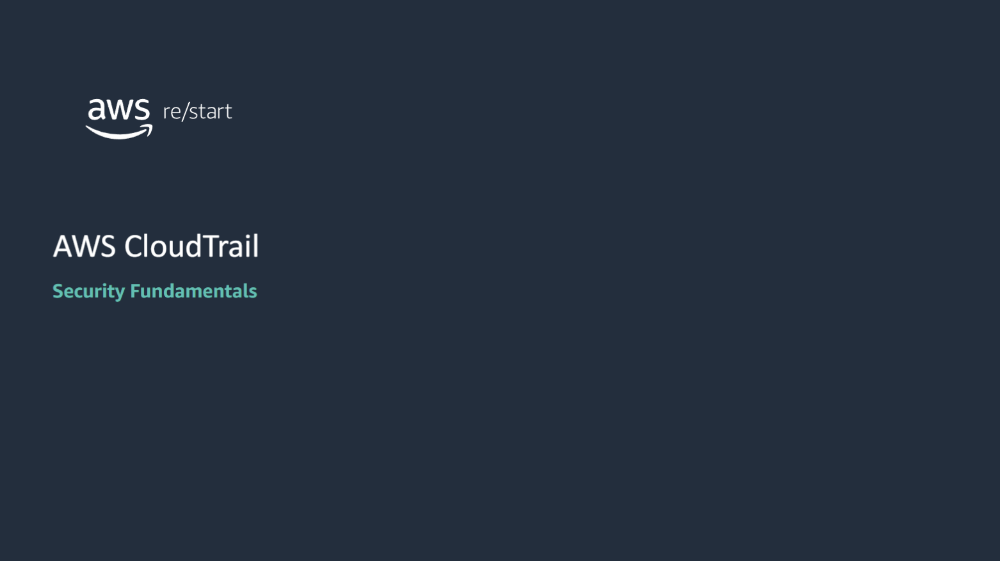
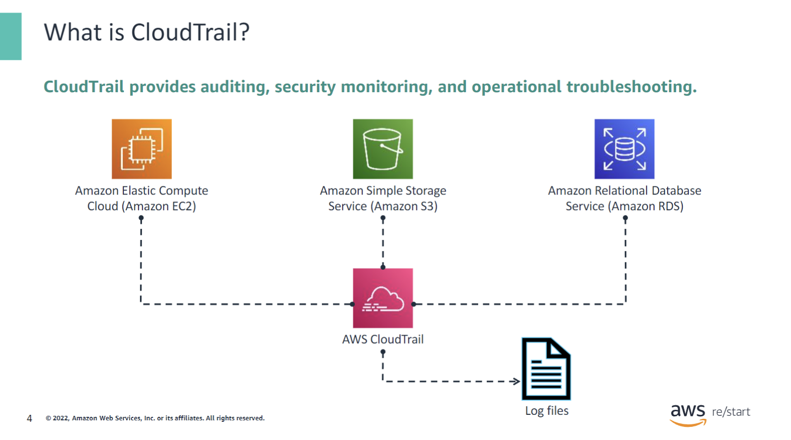
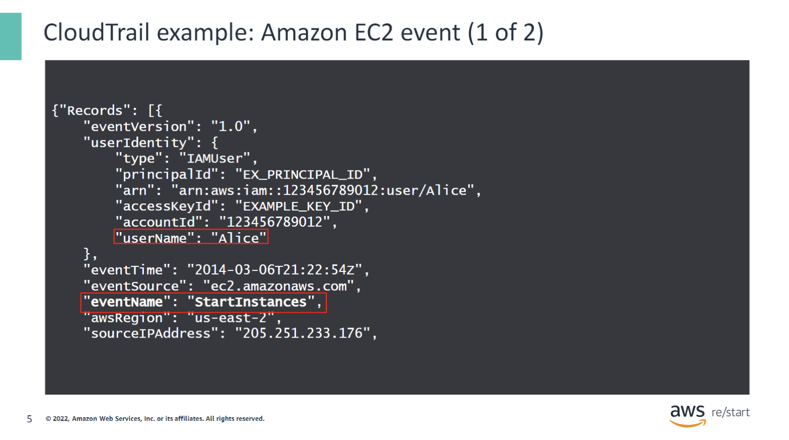
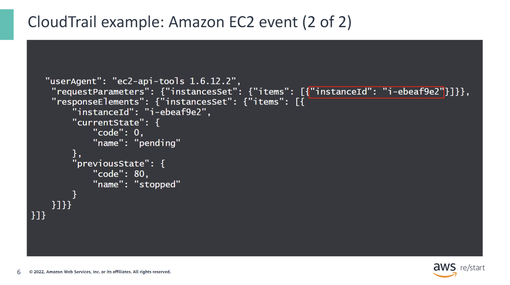
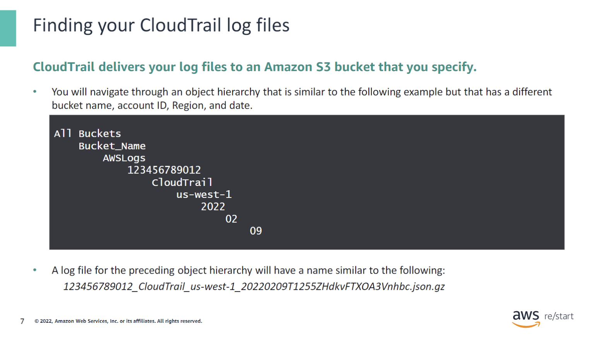
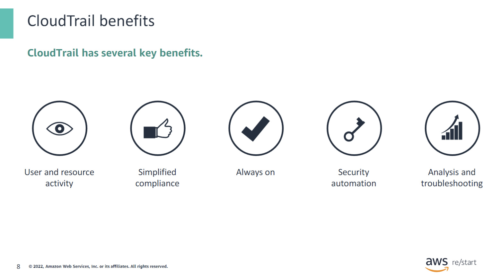
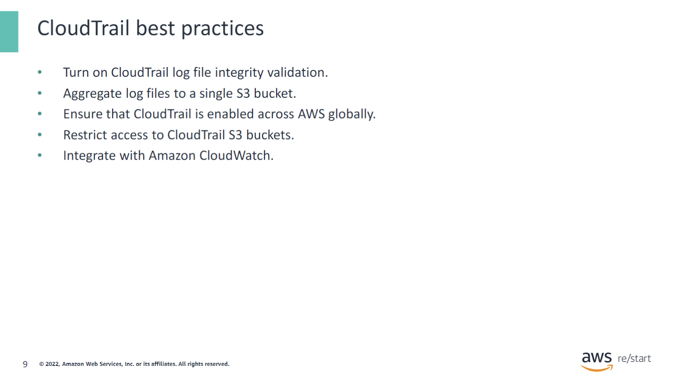
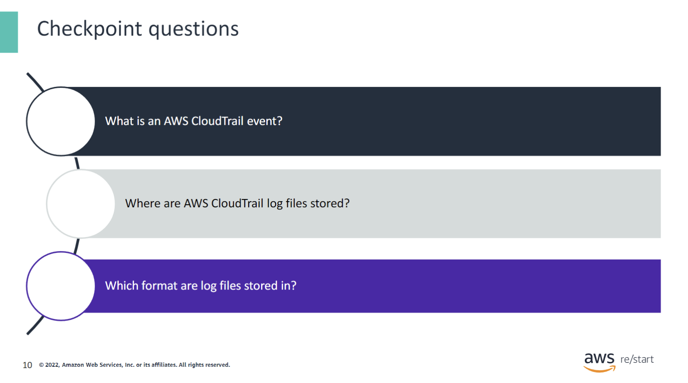
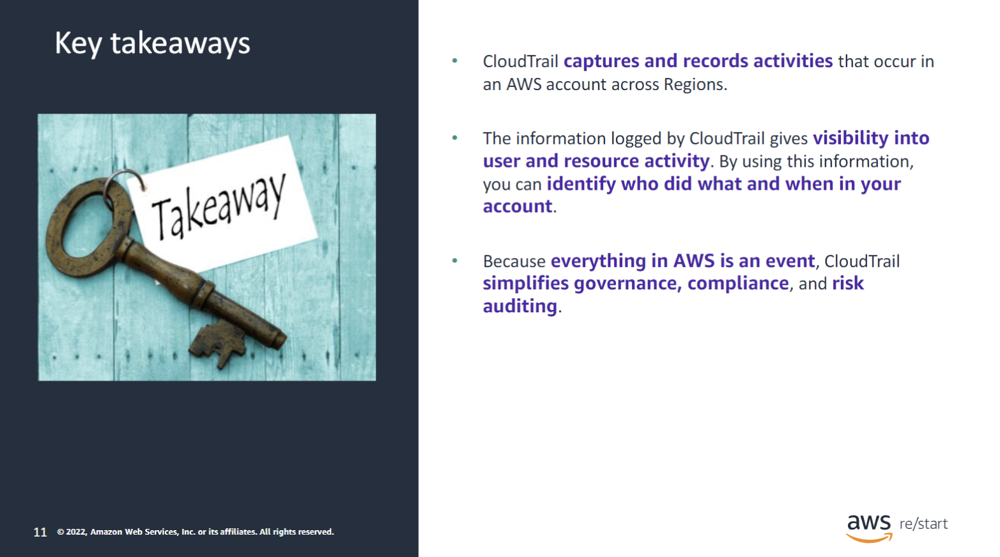

:::tip[What you'll learn]

This module will describe AWS CloudTrail, a service that helps you monitor requests to the Amazon Web Services (AWS) services that you use.2

:::

## Introduction to CloudTrail

### What is CloudTrail?

By definition, CloudTrail is an auditing, compliance monitoring, and governance tool from AWS. It is classified as a Management and Governance tool in the AWS Management Console.

CloudTrail logs, continuously monitors, and retains account activity related to actions across your AWS infrastructure, which gives you control over storage, analysis, and remediation actions.

How does CloudTrail work?

1. An activity happens in your account.
2. CloudTrail captures and records that activity, which is referred to as a CloudTrail event. The event contains details about the following:
   - Who performed the request
   - When the event occurred (that is, the date and time of the request)
   - What the source Internet Protocol (IP) address was
   - How the request was made
   - Which actions were performed
   - Where the action occurred (that is, in which Region)
   - What the response was

### CloudTrail example

The log file contains one or more records. This slide includes an example of a CloudTrail log entry that shows the records for an action that started an EC2 instance.

The example shows that an AWS Identity and Access Management (IAM) user named Alice used the AWS Command Line Interface (AWS CLI). Alice used the AWS CLI to call the Amazon EC2StartInstancesaction to start the instance with an instanceID ofi-ebeaf9e2.

The log file contains one or more records. This slide includes an example of a CloudTrail log entry that shows the records for an action that started an EC2 instance.

The example shows that an AWS Identity and Access Management (IAM) user named Alice used the AWS Command Line Interface (AWS CLI). Alice used the AWS CLI to call the Amazon EC2StartInstancesaction to start the instance with an instanceID ofi-ebeaf9e2.

### Finding your CloudTrail log files

Follow these steps to find your log files:

1. Open the Amazon S3 console.
2. Choose the bucket that you specified when you created the trail.
3. Navigate through the object hierarchy until you find the log file that you want.

All log files are stored as compressed files with a .gz extension.

CloudTrail typically delivers logs within an average of about 15 minutes of an event.

### CloudTrail benefits

CloudTrail has several key benefits:

- It increases your visibility into user and resource activity. With this visibility, you can identify who did what and when in your AWS account.

- Compliance audits are simplified because activities are automatically recorded and stored in event logs. Because CloudTrail logs activities, you can search through log data, identify actions that are noncompliant, accelerate investigations into incidents, and then expedite a response.

- Because you are able to capture a comprehensive history of changes that are made in your account, you can analyze and troubleshoot operational issues in your account.

- CloudTrail helps discover changes made to an AWS account that have the potential of putting the data or the account at heightened security risk. At the same time, it expedites AWS audit request fulfillment. This action helps to simplify auditing requirements, troubleshooting, and compliance.

The body of the CloudTrail record contains fields that help you determine the requested action and also when and where the request was made. For example, by using the field awsRegion, you can keep a close watch if adverse behavior occurs in a Region that you don't normally use. You can create alerts for your common Regions and alerts for anything that is happening outside your primary Region. Be sure to enable CloudTrail in all of your Regions.

### CloudTrail best practices

To harden your security and auditing processes, turn on CloudTrail log file integrity validation. This feature helps you to determine whether a CloudTrail log file was unchanged, deleted, or modified since CloudTrail delivered it to the specified S3 bucket.

When you configure CloudTrail, you can aggregate all log files to a single S3 bucket. By aggregating all files to a single bucket, you can store the files in a single location and define permissions to protect their access. It is also good practice to run multi-factor authentication (MFA) to delete a CloudTrail bucket.

Additionally, a configuration that applies to all Regions means that your settings are applied consistently across all existing and newly launched Regions.

You can integrate CloudTrail with Amazon CloudWatch to define actions to run when CloudTrail logs specific events. CloudWatch is a monitoring service for AWS Cloud resources. You can use the service to collect and track metrics, collect and monitor log files, set alarms, and automatically react to AWS resource changes. Integrating CloudTrail with CloudWatch also provides a comprehensive, secure, and searchable event history of activities. These activities can originate from the console, AWS Software Development Kits (SDKs), command line tools, and other AWS services.

Ensure that CloudTrail is enabled for all AWS Regions to increase the visibility into the activities in your AWS account for security and management purposes.

## Checkpoint questions

1. Q1: What is an AWS CloudTrail event?

An AWS CloudTrail event is an activity that occurs in an AWS account. Technically, events are triggered by application programming interface (API) calls that are made to services and resources in an AWS account.

2. Where are AWS CloudTrail log files stored?

AWS CloudTrail log files are stored in Amazon S3.

3. Which format are log files stored in?

Log files are stored in a compressed format with a .gz extension.

## Key takeaways

:::tip[This lesson includes the following keytakeaways:]

- CloudTrail captures and records activities in an AWS account across Regions.
- The information logged by CloudTrail gives visibility into user and resource activity. By using this information, you can identify who did what and when in your account.
- Because everything in AWS is an event, CloudTrail simplifies governance, compliance, and risk auditing.

:::
