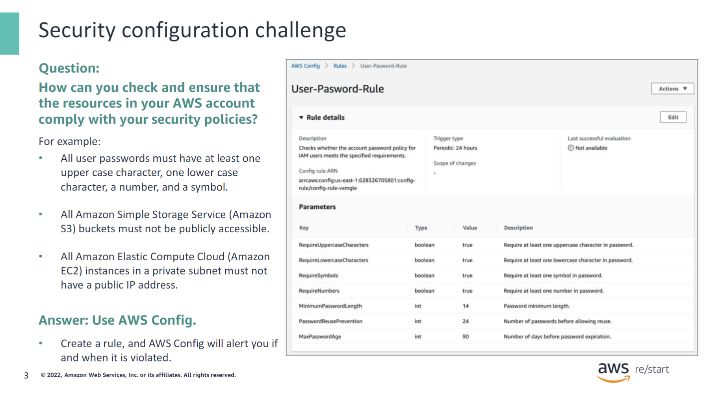
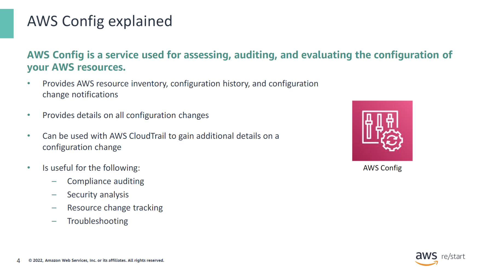
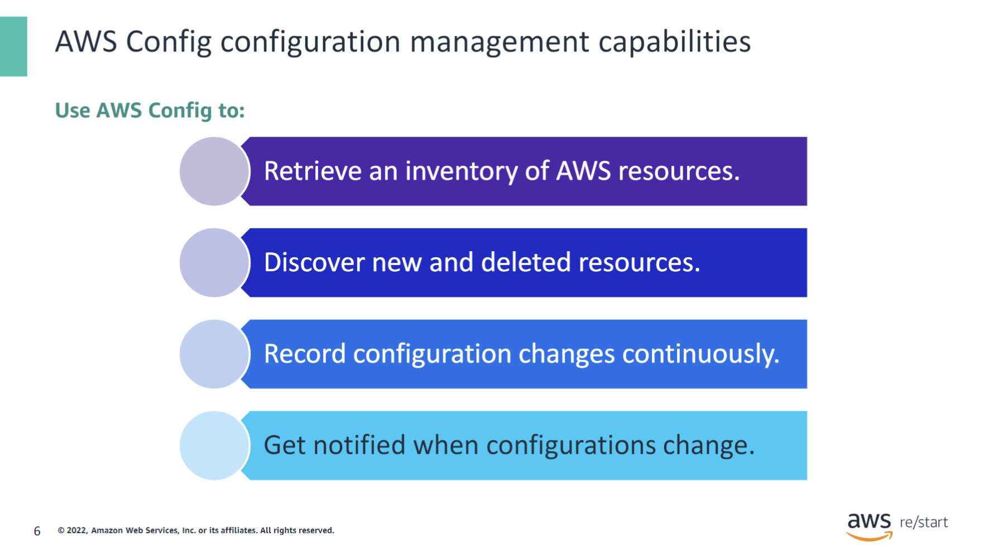
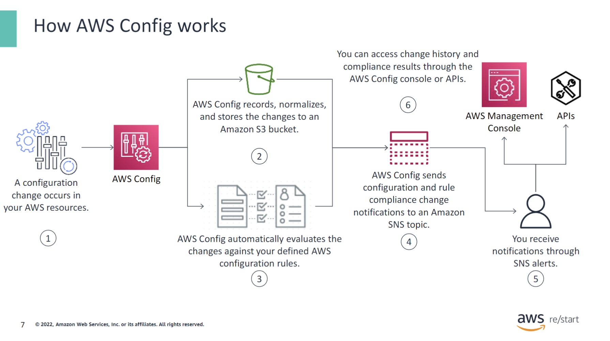
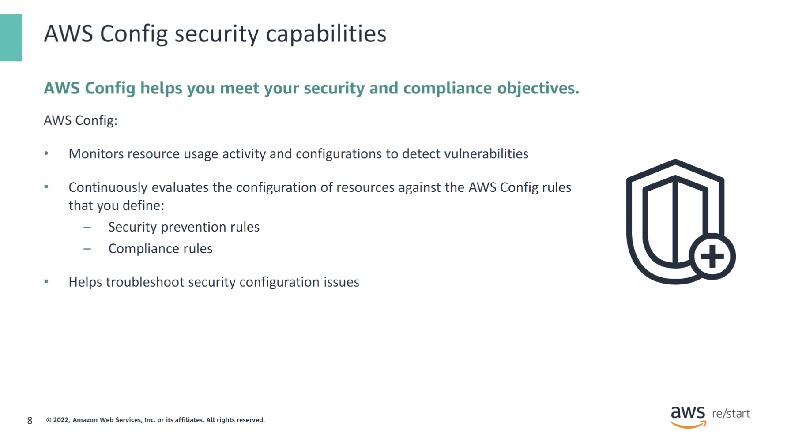
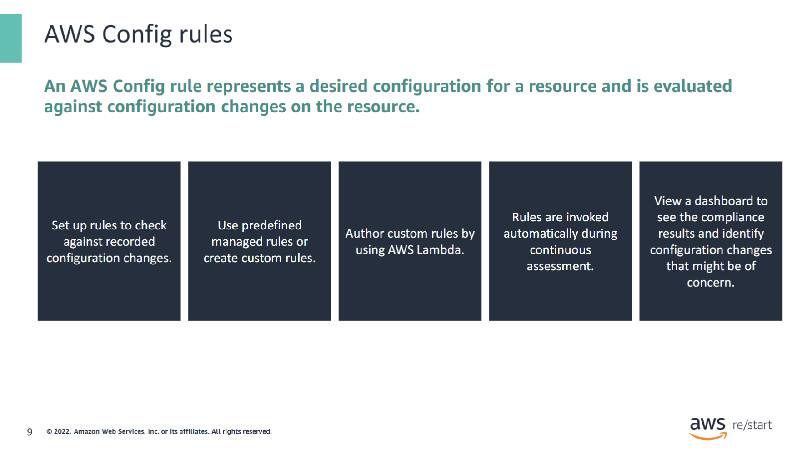
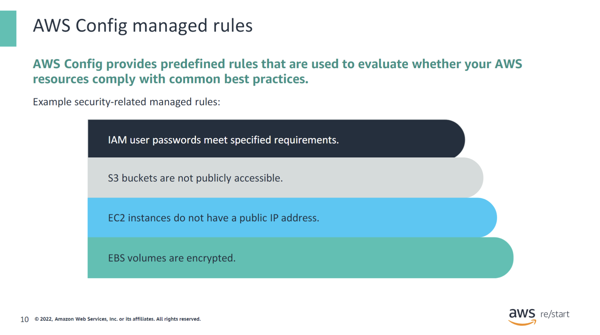
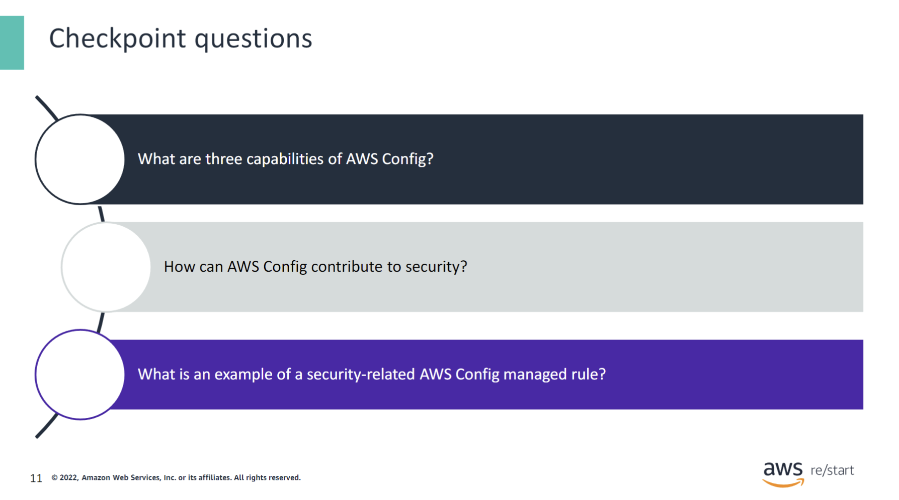
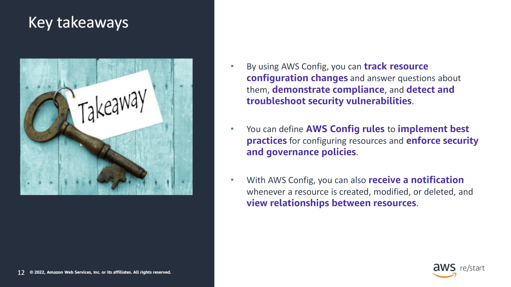

:::tip[What you will learn]

- Highlight the features of AWS Config
- Describe how AWS Config helps improve security configuration and compliance

:::

## Security configuration challenge

The number and type of resources that you will have in your Amazon Web Services (AWS) account will most likely be high. It is typical, for example, for a customer to run hundreds, even thousands, of Amazon Elastic Compute Cloud (Amazon EC2) instances in their accounts. Other resources, such as Amazon Simple Storage Service (Amazon S3) buckets, might also exist in large numbers. Being able to manage the configuration of all these resources presents a challenge. In particular, one challenge that you face when dealing with security configuration is how to check and ensure that all the resources in your AWS account comply with your security policies. For example, you might want to verify that all passwords in your account comply with a password policy that requires them to conform to a specific format.

The AWS Config service presents the solution to this challenge. Create a rule that defines your security requirements, and AWS Config will notify you if and when it is violated.

This slide shows an example screen capture of the details and parameters for a user password rule in the AWS Config console. The rule specifies the following details for passwords:

- Include at least one uppercase character
- Include at least one lowercase character
- Include at least one symbol
- Include at least one number
- Have a minimum length of 14 characters
- Can be reused after 24 password changes
- Expire in 90 days

As a result of this rule, when a password is created or changed, AWS Config checks whether the action violates any of the conditions in the rule. If the action violates the rule, AWS Config flags the password as noncompliant.

## AWS Config explained

AWS Config is a service used for assessing, auditing, and evaluating the configuration of your AWS resources. It continuously monitors and records your AWS resource configurations, and you can use it to automate the evaluation of recorded configurations against desired configurations.

With AWS Config, you can discover existing AWS resources and determine how a resource was configured at any point. It also provides configuration change notifications to facilitate security and governance. You can use AWS Config together with AWS CloudTrail to gain complete visibility into the details of a configuration change. AWS Config notifies you when the configuration of a resource has changed, and CloudTrail provides you with additional details, such as who made the change.

### AWS Config uses

AWS Config is useful for the following:

- **Compliance auditing:** You might be working with data that requires frequent audits to ensure compliance with internal policies and best practices. To demonstrate compliance, you need access to the historical configurations of your resources. AWS Config provides this information.

- **Security analysis:** To analyze potential security weaknesses, you need detailed historical information about your AWS resource configurations. Examples include the AWS Identity and Access Management (IAM) permissions that are granted to your users and the Amazon EC2 security group rules that control access to your instances.

- **Change management:** To detect resource misconfigurations, you need fine-grained visibility into what resources exist and how these resources are configured at any time. You can use AWS Config to notify you whenever resources are created, modified, or deleted. In addition, you can use AWS Config rules to evaluate the configuration settings of your AWS resources. When AWS Config detects that a resource violates the conditions in one of your rules, AWS Config flags the resource as noncompliant and sends a notification. AWS Config continuously evaluates your resources as they are created, changed, or deleted.

- **Operational troubleshooting:** When you use multiple AWS resources that depend on one another, a change in the configuration of one resource might have unintended consequences on related resources. With AWS Config, you can view how the resource you intend to modify is related to other resources and assess the impact of your change.

### AWS Config configuration management capabilities

With AWS Config, you can perform the following configuration management tasks:

- **Retrieve an inventory of AWS resources.**
- **Discover new and deleted resources.**
- **Record configuration changes continuously.** You can determine overall compliance against the configurations that your internal guidelines specify.
- **Get notified when configurations change and analyze detailed resource configuration histories.**

### How AWS Config works

This diagram illustrates how AWS Config works:

1. A change occurs in one of your AWS resources.
2. The AWS Config engine records and normalizes that change into a consistent format. It then stores the change in an Amazon S3 bucket that you define.
3. If an AWS Config rule was defined for the affected resource, AWS Config evaluates the rule to verify whether or not the change violates the rule.
4. AWS Config sends a notification of the change and the result of the rule evaluation to an Amazon Simple Notification Service (SNS) topic that you define.
5. You receive the notifications through SNS alerts.
6. You can then view the change history and rule compliance results in the AWS Config console. Alternatively, you can use AWS Config application programming interfaces (APIs) to access this information programmatically.

### AWS Config security capabilities

Security is the highest priority at AWS. AWS Config helps you meet your security and compliance objectives. With data from AWS Config, you can continuously monitor the configurations of your resources and evaluate these configurations for potential security weaknesses. Changes to your resource configurations can activate Amazon SNS notifications, which can be sent to your security team to review and take action. After a potential security event, you can use AWS Config to review the configuration history of your resources and examine your security posture.

In addition, AWS Config can help you troubleshoot security configuration issues. For example, you can use AWS Config to view the IAM policy that was assigned to an IAM user, group, or role at any time in which AWS Config was recording. This information can help you determine the permissions that belonged to a user at a specific time. You can also use AWS Config to view the configuration of your Amazon EC2 security groups, including the port rules that were open at a specific time. This information can help you determine whether a security group blocked incoming TCP traffic to a specific port.

### AWS Config rules

AWS Config provides a rule system. You can use existing rules provided by AWS or from AWS Partners. You can also define your own custom rules by using AWS Lambda. With the Lambda web service, you can run code without provisioning or managing servers. You can target rules at specific resources, specific types of resources, or resources that are tagged in a particular way. Rules are run when those resources are created or changed, and they can also be evaluated on a periodic basis (hourly, daily, and so forth).

AWS Config rules are invoked automatically as AWS Config continuously assesses configuration changes. AWS Config displays the results of rule evaluations in a dashboard in the AWS Config console. You can use the dashboard to visualize compliance and identify changes to your resources that might be of concern.

### AWS Config managed rules

AWS Config provides predefined rules, called managed rules, that are based on common best practices for different resource types. You can use a managed rule as it is defined, or customize it.

For the example, AWS Config provides the following security-related managed rules:

- **iam-password-policy** checks if the account password policy for IAM users meets the specified requirements.
- **s3-bucket-level-public-access-prohibited** checks if S3 buckets are publicly accessible. This rule helps enforce the best practice of blocking all public access to S3 buckets by default and defining specific permissions to authorized access (principle of least privilege).
- **ec2-instance-no-public-ip** checks whether EC2 instances have a public IP association. For example, this rule is useful for protecting instances in a private subnet from direct access from the internet.
- **ec2-ebs-encryption-by-default** checks that Amazon Elastic Block Store (Amazon EBS) encryption is activated by default. This rule helps protect the confidentiality of data at rest.

## Checkpoint Questions

1. What are three capabilities of AWS Config?

- Discover existing AWS resources.
- Determine how a resource was configured at any point.
- Notify if an AWS Config rule is violated when a resource’s configuration is changed.

2. How can AWS Config contribute to security?

You can use AWS Config to help enforce security policies through the use of AWS Config rules. It can also automate the assessment of your resource configurations and resource changes to ensure continuous compliance across your AWS infrastructure.

3. What is an example of a security-related AWS Config managed rule?

IAM user passwords meet specified requirements.

## Key Takeaways

:::tip[This module includes the following key takeaways:]

- By using AWS Config, you can track resource configuration changes and answer questions about them, demonstrate compliance, and detect and troubleshoot security vulnerabilities.
- You can define AWS Config rules to implement best practices for configuring resources and enforce security and governance policies.
- With AWS Config, you can also receive a notification whenever a resource is created, modified, or deleted, and view relationships between resources.

:::
