:::tip[In this lesson, you will learn how to:]

- List the typical steps in the incident investigation process
- Describe the purpose of a business continuity plan (BCP) and a disaster recovery plan (DRP)

:::

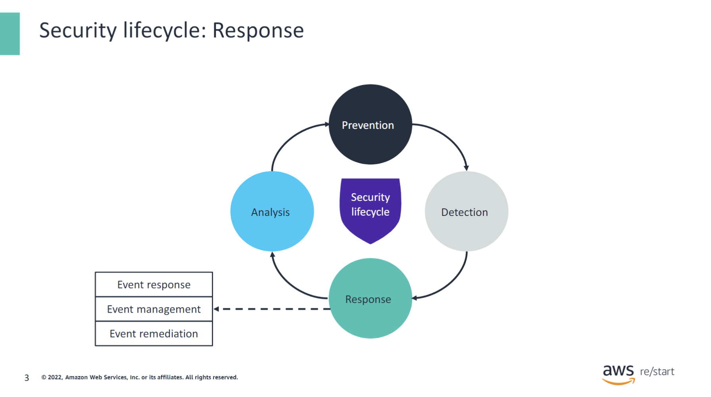

As a review, the phases of the security lifecycle consist of:

- **Prevention** – Is the first line of defense
- **Detection** – Occurs when prevention fails
- **Response** – Describes what you do when you detect a security threat
- **Analysis** – Completes the cycle as you identify lessons learned and implement new measures to prevent the issue from occurring again in the future

In this lesson, you will learn about the response phase of the security lifecycle. Specifically, you will discover methods and techniques related to how to manage, respond, and remediate security events.

## Event response analogy

### Event response

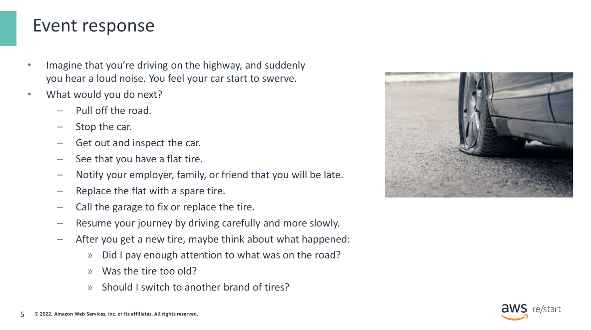

All of these steps represent your response to an incident. They are similar to steps that are used to respond to and investigate a security event:

- **What immediate action do you take?**
- **Whom do you notify?**
- **How do you ensure that the business can keep running in a reduced capacity?**
- **How can you ensure that this situation will not happen again or at least that it will be less likely to happen in the future?**
- **How do you get back to a normal situation?**

## Process and planning for event response

### Event investigation process

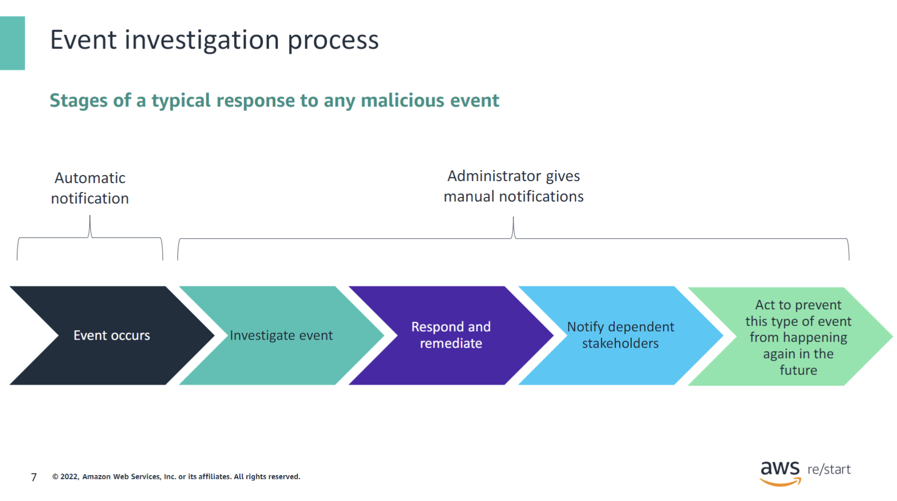

The figure shows the typical steps that are used to respond to and investigate a security event:

- **Verification**: When a security alert is activated, it must be verified because false positives can happen, especially with a system such as an automated intrusion detection system (IDS).
- **Investigation**: If the alert is verified, then the event must be investigated. Determine the scope of the attack.
- **Containment**: The first step to respond to the attack is to contain infected elements if there are any, such as hosts infected by a virus. Then, block access to network addresses.
- **Notification**: Notify the departments or teams that might be affected, as they might have limited access to the systems they use. Stakeholders might be customers who cannot use a website.
- **Recovery**: Recover to get back to business as soon as possible by adding security rules, rebuilding infected systems, recovering data, and taking other appropriate steps.
- **Improvement**: Finally, assess whether there is a way to strengthen the system to avoid another attack or recover faster. Implement new procedures for the team in case of an attack.

You cannot plan for every conceivable disaster. However, you can demonstrate due diligence by identifying and documenting the types of disasters that present a real threat to your business. The unexpected event can be a minor inconvenience, or it could result in the end of your organization. If you fail to plan for these potential events, you plan to fail. Tools such as training, systems, and policies can help you prepare for potential events.

## Understanding the business continuity plan (BCP) and disaster recovery plan (DRP)

### BCP and DRP

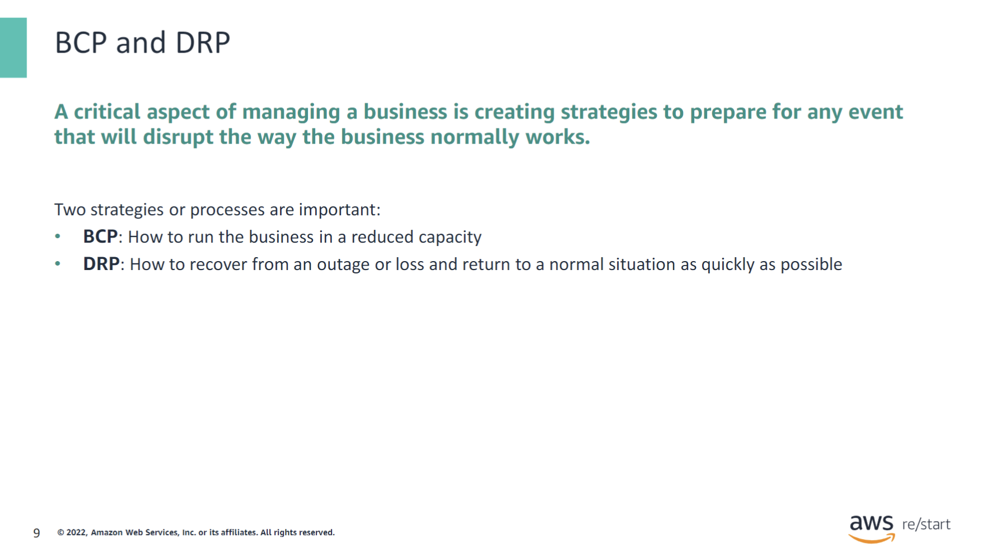

The purpose of these two plans is to do the following actions:

- **Help a business to continue supporting and offering critical services when a disruption occurs.**
- **Survive a disastrous interruption to activities.**

### Planning business continuity

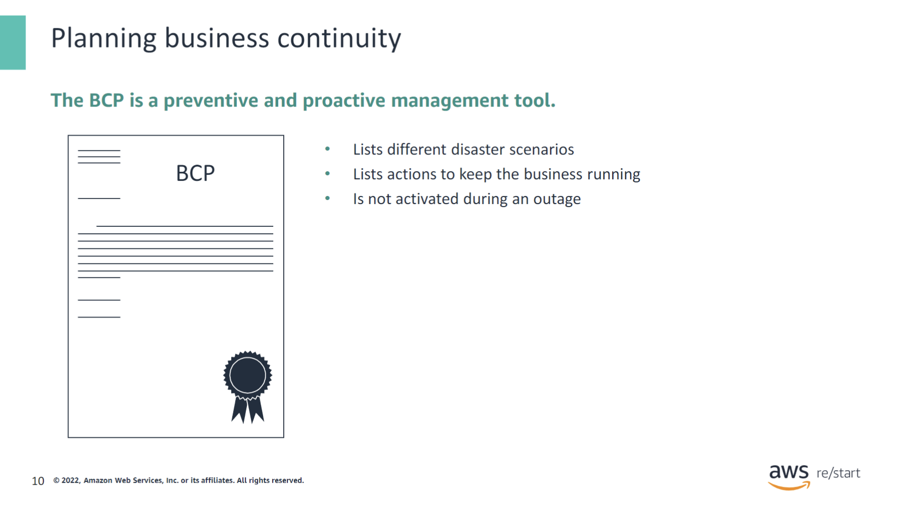

A BCP lists different disaster scenarios. It describes what the business will do to keep critical services and functions running when a disaster or disruption occurs. For example, it could be an interruption of service or destruction of hardware.

The BCP accomplishes the following actions:

- **Lists different disaster scenarios and what the business will do to keep business running as usual.** Example scenarios include a failed disk, failed server, failed database, bad communications line, fire, flood, or an earthquake that would make a data center unable to work normally. The disaster could also cause a power outage or require an evacuation of the premises in case of fire. Each of these scenarios could potentially become a security risk.
- **Keeps the business running in a reduced form over a period of time.** For example, what is the minimum number of online systems, phones, servers, network connections, network drives, and other resources that must continue to run? Which human resources are affected, and what is necessary to keep the business running? How is security affected, and what priority do secure systems, processes, and people have in this scenario?

The BCP is not activated during an outage.

### Planning disaster recovery

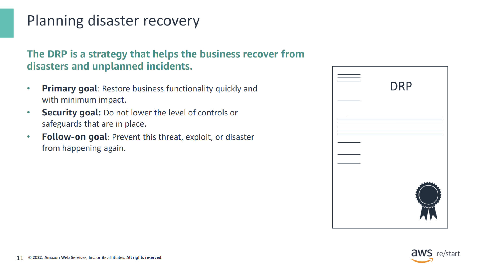

A DRP defines a strategy that helps the business recover from disasters and unplanned incidents, including cyber incidents. DRP uses two key parameters:

- **Recovery Time Objective (RTO):** How quickly does the business need to be back up?
- **Recovery Point Objective (RPO):** How much time and data can the business afford to lose?

As the values of these parameters decrease, backup strategies and other recovery mechanisms become more expensive or complex. However, RTO and RPO have decreased over time as technology has evolved.

The following are possible security goals:

- A business might implement different corrective measures for access control based on the impact of the disaster or disruption. However, the business should implement security access controls to the same level of restriction before the disruption.
- If access controls are not implemented to the same level, the business must not permit access or use of resources.

## Disaster recovery: Understanding recovery time objective (RTO) and recovery point objective (RPO)

Disaster recovery is the process of preparing for and recovering from a disaster. Examples include earthquakes or floods, technical failures such as power or network loss, and human actions such as inadvertent or unauthorized modifications. Minimizing the downtime of the systems involves two important objectives:

- **Recovery Time Objective (RTO):** The maximum acceptable delay between the interruption of service and restoration of service. The RTO determines an acceptable length of time for service downtime.

- **Recovery Point Objective (RPO):** The maximum acceptable amount of time since the last data recovery point. The RPO is directly linked to how much data will be lost and how much will be retrieved.

### RPO compared to RTO

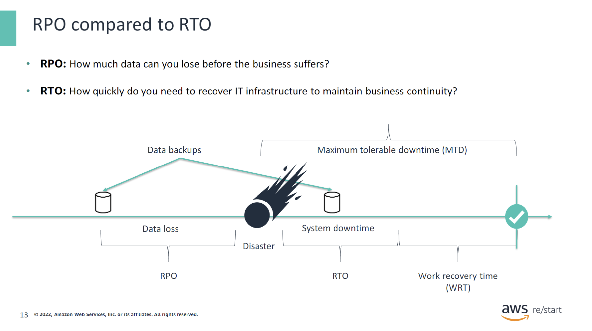

The main focus of RPO is on data. RPO represents the point in time, before disruption, when data can be recovered (given the most recent backup copy of the data) after the disruption. RPO is a factor of how much data loss the business can tolerate during the recovery process.

In short, RPO is concerned with the following questions:

- **How much data can the business lose before the business suffers?**
- **How much time between data backups can elapse without causing severe harm if a disaster occurs?**

This answer is based on fixed intervals of data backups. The more time that elapses, the more money the business loses. RPO is easier to implement than RTO because RPO affects only the data layer of your infrastructure.

RTO represents the time that the system can be down before a business can’t maintain business continuity and the business suffers. The sooner a business must get back online, the costlier it will be. Recovery involves the entire business infrastructure.

**Work Recovery Time (WRT)** involves recovering or restoring data, testing processes, and then making the system live for production. It corresponds to the time between systems and resource recovery, and the start of normal processing.

The **Maximum Tolerable Downtime (MTD)** is the sum of the RTO and the WRT. In other words, MTD = RTO + WRT. MTD is the total time that a business can be disrupted after a disaster without causing any unacceptable consequences from a break in business continuity. Include the MTD value as part of the BCP and DRP.

### Disaster recovery options

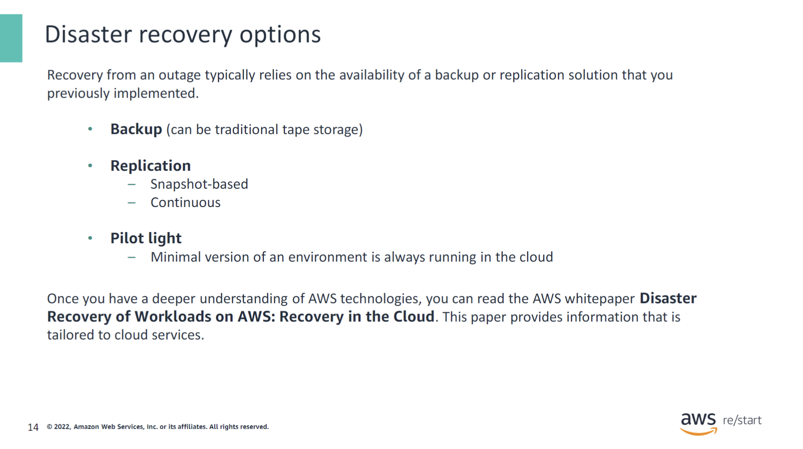

The following list contains different types of backup solutions:

- **Backup** (can be traditional tape storage)
  - Is used for the entire business infrastructure
  - Focuses on long-term data of the business
  - Is cost-effective but not time-effective

- **Replication**
  - **Snapshot-based:**
    - Writes only changed data since the last snapshot
  - **Continuous:**
    - Uses synchronous, asynchronous, or near-synchronous methods
    - Focuses on resuming to normal operations quickly
    - Offers more granular recovery points

- **Pilot light**
  - The minimal version of an environment is always running in the cloud.
  - Configure and run the most critical elements of your system.
  - When recovery is needed, rapidly provision a complete production environment around the critical core.
  - Infrastructure elements include database servers and other significant data.

For AWS related information, see the following resources:

- [Disaster Recovery (DR) Architecture on AWS, Part I: Strategies for Recovery in the Cloud](https://aws.amazon.com/blogs/architecture/disaster-recovery-dr-architecture-on-aws-part-i-strategies-for-recovery-in-the-cloud/)
- [Disaster Recovery of Workloads on AWS: Recovery in the Cloud](https://docs.aws.amazon.com/whitepapers/latest/disaster-recovery-workloads-on-aws/disaster-recovery-options-in-the-cloud.html)

### Cost balancing

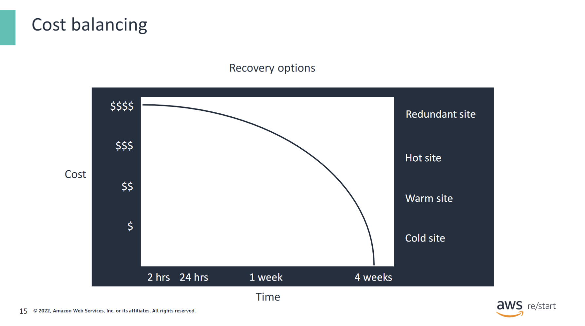

The longer a disruption is permitted to continue, the more costly it can be to the business and its operations. A tradeoff exists between speed of recovery and cost.

The answer is not the same for all systems. For example, an employee database can probably be down for a couple of days, but the ecommerce site can be down for only minutes.

Amazon Simple Storage Service (Amazon S3) is a cloud storage service that can back up data with different levels of restoration speed and cost. For more information about Amazon S3, see the [Amazon S3 product webpage](https://aws.amazon.com/s3/).

## Activity: Incident response

### Activity: Objectives

:::tip[In this activity, you will:]

- Identify an incident
- Determine key assets
- Implement an incident response plan
- Specify an eradication solution

:::

#### Lab Scenario

Your data center has experienced a denial of service (DoS) attack from an unknown attacker. Data network connectivity to the production logistics database is down, and voice communications are being disrupted intermittently. Someone who is taking responsibility for the attack has contacted management and is demanding payment to end the attack.

You are an IT security leader who must interface with the correct internal resources to identify any damage to critical assets.

You are tasked with coordinating measures to stop the attack, identify affected assets, and minimize further damage. You also must recommend controls to prevent this kind of attack from happening again.

In this activity, you will work as a team to document a basic response. Be prepared to suggest and discuss additional information that these documents should capture.

### Activity: Exercise 1

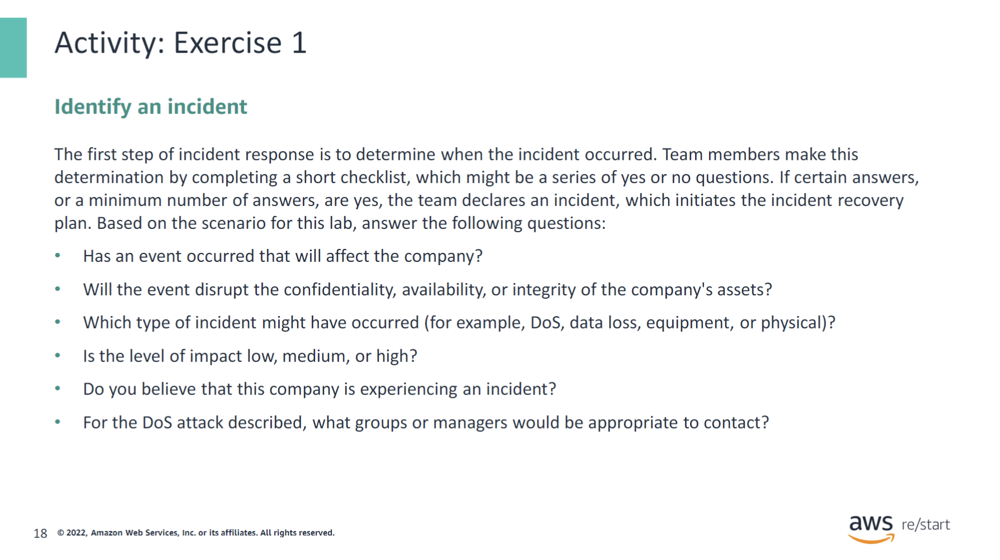

When an incident occurs, it is important to be able to reach needed employees. A good way to do this is to create a form that lists team members and support contacts.

You can get the name, phone, and email of the following persons:

- IT supervisor
- Primary management
- Secondary management
- Facilities management
- Physical security officers or management
- Customer

Most organizations do not have a dedicated incident response team. This list is a sample of appropriate contacts to respond to a particular incident.

### Activity: Exercise 2

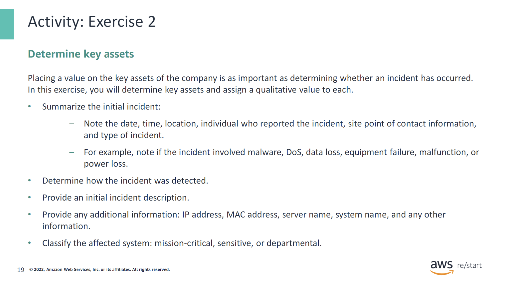

Collect and note this information to help determine the extent of the problem. Possible incident types include the following:

- Malware
- DoS
- Data loss
- Equipment failure
- Malfunction
- Power loss

### Activity: Exercise 3

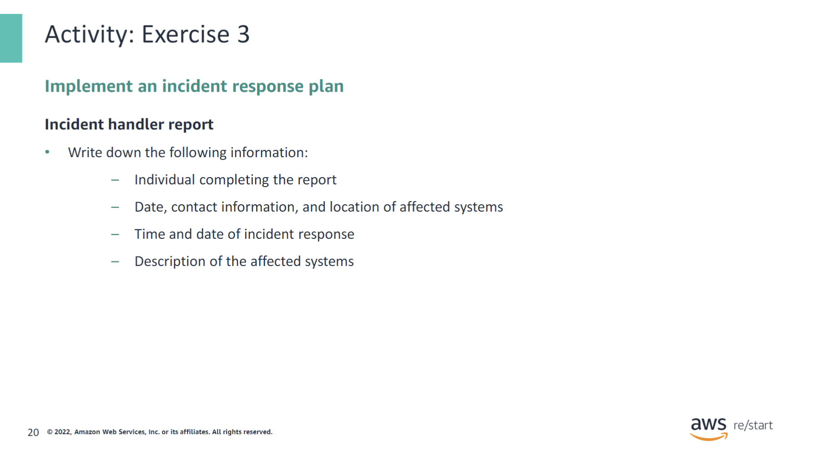

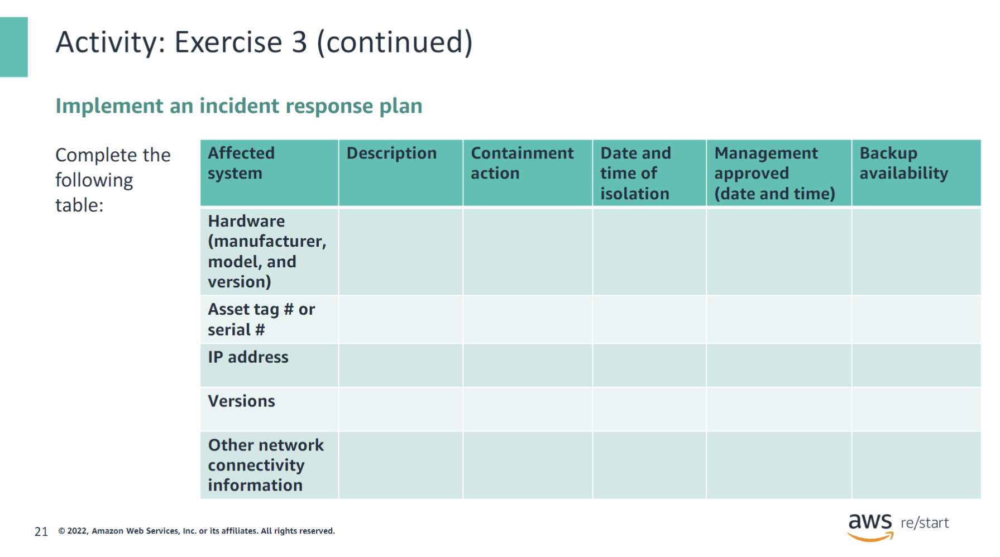

Versions can be the operating system (OS), software, or firmware versions, as appropriate. Other network connectivity information can be sample virtual local area network (VLAN), switch, and port.

Possible incident containment actions include the following:

- Isolate affected system
- Disconnect from network

Possible options for backup availability include the following:

- Verified
- Secured
- Date and time

### Activity: Exercise 4

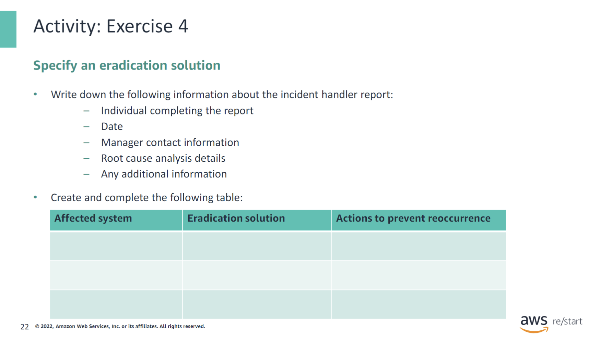

Possible eradication solutions include the following:

- Restore from a known good backup
- Reinstall the system
- Replace or repair equipment
- Remove malware
- Repair the facility
- Update the system
- Update the detection system
- Update the prevention system
- Report to human resources (HR)

### Activity: Debrief

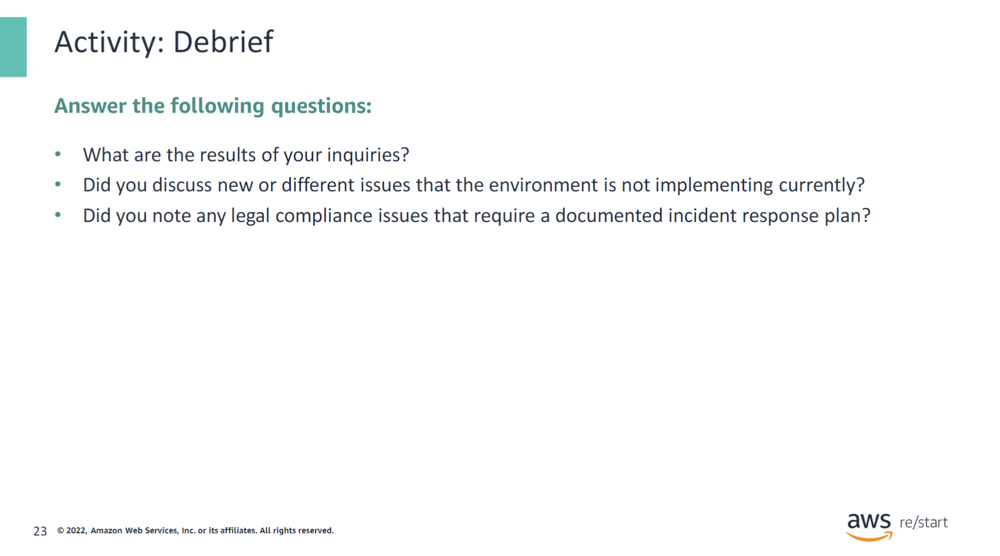

## Checkpoint questions

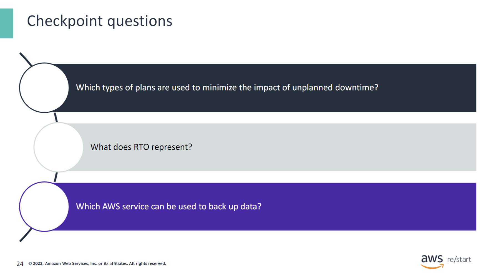

1. Which types of plans are used to minimize the impact of unplanned downtime?

Business continuity plan and disaster recovery plan

2. What does RTO represent?

RTO represents the time that the system can be down before a business can’t maintain business continuity and the business really suffers. The sooner a business must get back online, the more costly it will be. Recovery involves the entire business infrastructure.

3. Which AWS service be used to back up data?

Amazon S3 is a cloud storage service that can backup data with different levels of restoration speed and cost.

## Key Takeaways

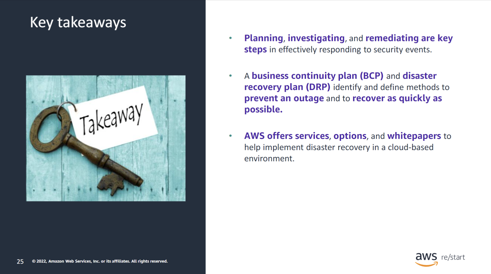

:::tip[This module includes the following key takeaways:]

- Planning, investigating, and remediating are key steps in effectively responding to security events.
- A business continuity plan (BCP) and disaster recovery plan (DRP) identify and define methods to prevent an outage and to recover as quickly as possible.
- AWS offers services, options, and whitepapers to help implement disaster recovery in a cloud-based environment.

:::
