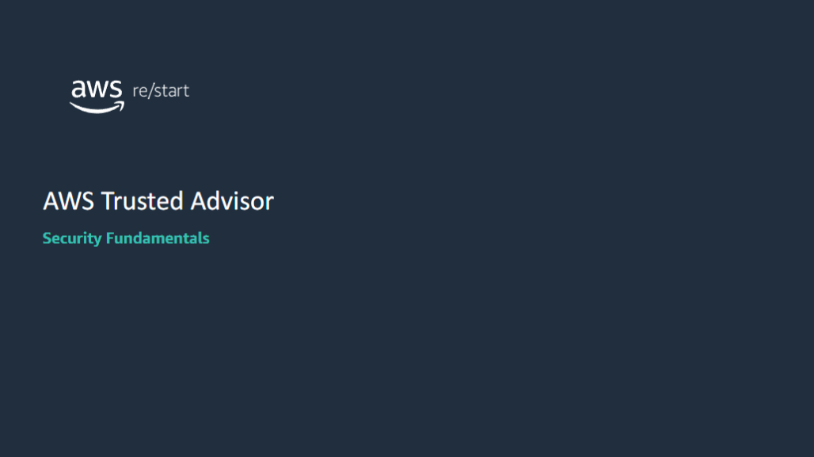

:::tip[You will learn how to:]

- Describe AWS Trusted Advisor
- Explore the five categories of recommendations that Trusted Advisor produces
- List the security features of Trusted Advisor
- Interpret Trusted Advisor recommendations

:::

## Trusted Advisor

### Introduction to Trusted Advisor

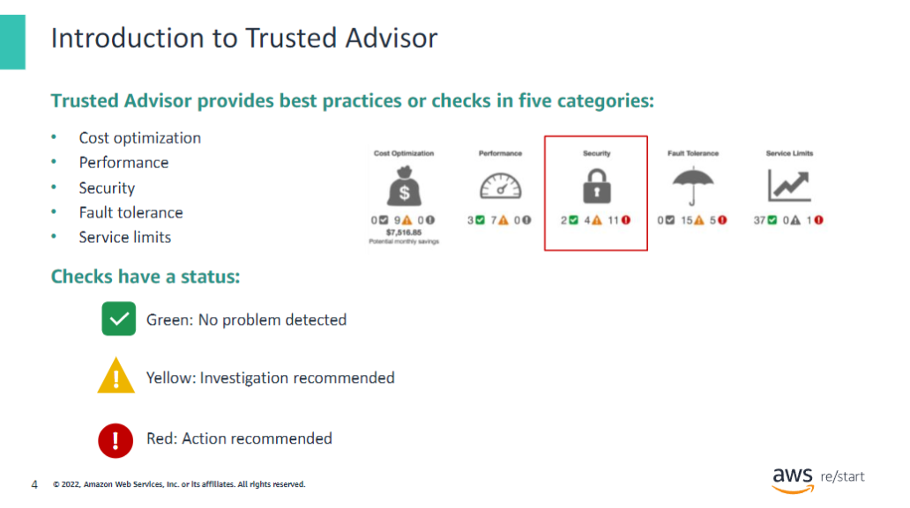

Trusted Advisor is an online resource designed to help you reduce cost, increase performance, and improve security by optimizing your AWS environment. It provides best practices (or checks) in five categories:

1. **Cost Optimization** – Save money on AWS by reducing unused and idle resources or making commitments to reserved capacity.

2. **Performance** – Improve the performance of your service by checking your service limits, ensuring that you take advantage of provisioned throughput, and monitoring for overutilized instances.

3. **Security** – Improve the security of your application by closing gaps, activating various AWS security features, and examining your permissions.

4. **Fault Tolerance** – Increase the availability and redundancy of your AWS application by taking advantage of automatic scaling, health checks, multiple Availability Zones, and backup capabilities.

5. **Service Limits** – Check for service usage that is more than 80 percent of the service limit.

The status of the check is shown by using color coding on the dashboard page:

- **Red (red exclamation mark)** – Action is recommended.
- **Yellow (yellow exclamation mark)** – Investigation is recommended.
- **Green (green checkmark)** – No problem has been detected.

### Trusted Advisor features

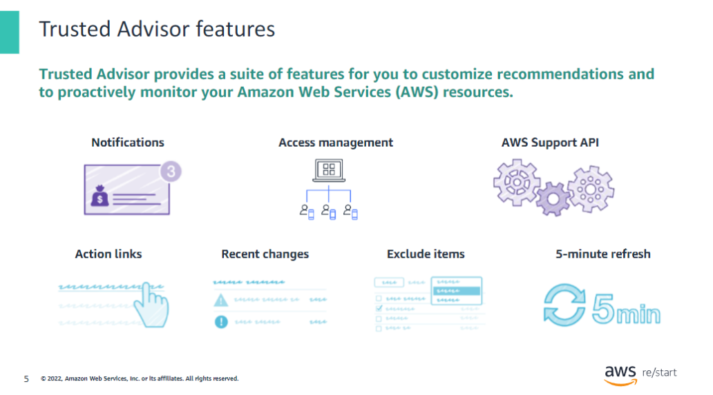

Trusted Advisor provides a suite of features so that you can customize recommendations and proactively monitor your Amazon Web Services (AWS) resources:

- **Trusted Advisor notifications** – Stay up to date with your AWS resource deployment. You will receive a weekly notification email message when you opt in for this service.

- **Access management** – Control access to specific checks or check categories.

- **AWS Support application programming interface (API)** – Retrieve and refresh Trusted Advisor results programmatically.

- **Action links** – Access items in a Trusted Advisor report from hyperlinks that take you directly to the console. From the console, you can implement the Trusted Advisor recommendations.

- **Recent changes** – Track recent changes of check status on the console dashboard. The most recent changes appear at the top of the list to bring them to your attention.

- **Exclude items** – Customize the Trusted Advisor report. You can exclude items from the check result if they are not relevant.

- **Refresh all** – Refresh individual checks or refresh all the checks at once by choosing Refresh All in the upper-right corner of the summary dashboard. A check is eligible for 5-Minute Refresh after it was last refreshed.

For more information about Trusted Advisor, see the [AWS Trusted Advisor product webpage](https://aws.amazon.com/premiumsupport/technology/trusted-advisor/).

## Trusted Advisor walkthrough

### How do I start using Trusted Advisor?

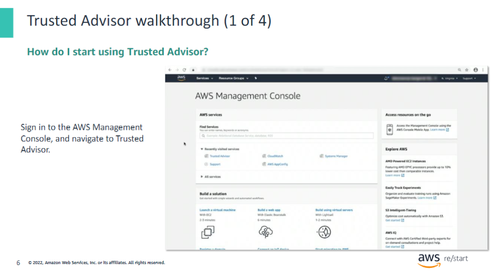

Sign in to the AWS Management Console, and navigate to Trusted Advisor. This action opens the Trusted Advisor Dashboard.

### Trusted Advisor Dashboard

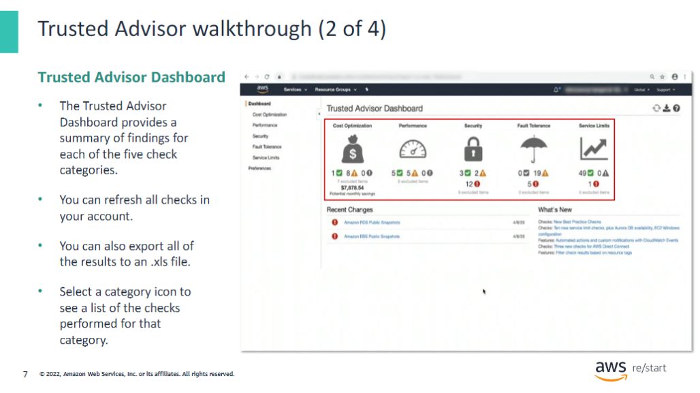

Trusted Advisor inspects your AWS infrastructure for opportunities to save money, improve system availability and performance, or help close security gaps. The checks are based on best practices identified by experts in each AWS service and on information from customers over time.

The results are summarized in the Trusted Advisor Dashboard for each of the five check categories. For each category, the count of recommendations is grouped by check status:

- **Red** – Action recommended
- **Yellow** – Investigation recommended
- **Green** – No problem detected

The dashboard displays a **What’s New** section that lists new and improved features of Trusted Advisor. It also displays a **Recent Changes** section that highlights recent check status changes.

You can choose a category icon to display the list of checks performed for that category.

### Category checklist

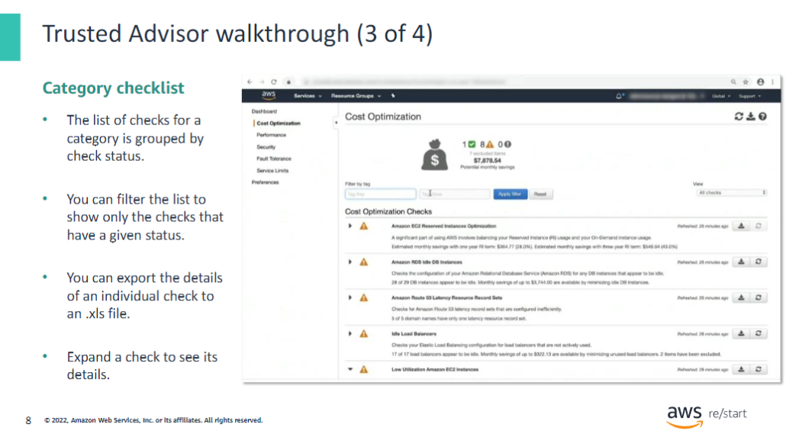

The list of checks for a category groups each check by status and provides a summarized description of the check. You can filter the list to show only the checks that have have a given status by using the Viewdropdown menu. You can also export the details of an individual check to an .xls file.

This slide shows an example of the list of checks for the Cost Optimization category. Expand a check to see its details.

### Check details

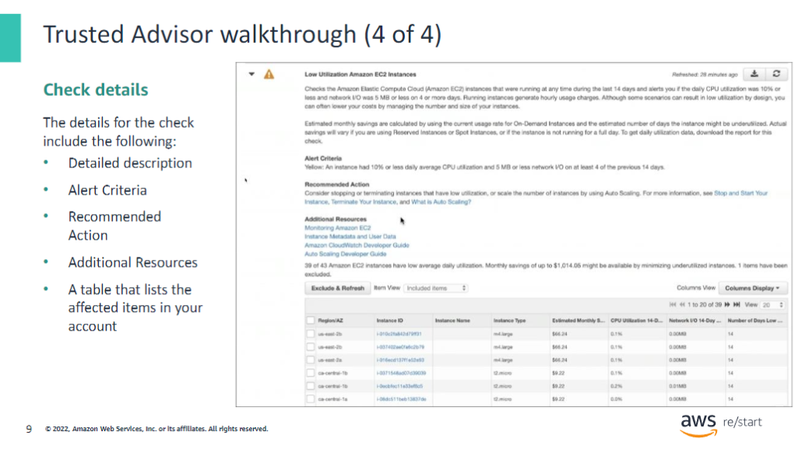

When you expand a check, you see the following details:

- **Detailed Description**
- **Alert Criteria** – Describes the status of the check and the threshold conditions that it evaluates.
- **Recommended Action** – Describes the recommended actions for the check.
- **Additional Resources** – Lists related AWS documentation.
- **A Table that Lists the Affected Items in Your Account** – You can include or exclude these items from check results.

This slide shows an example screen capture of the details for a Low Utilization Amazon EC2 Instances check. The table at the bottom lists the affected instances in the account. This check identifies 39 EC2 instances that have low usage and recommends that you stop or terminate the resources.

### Trusted Advisor security checks

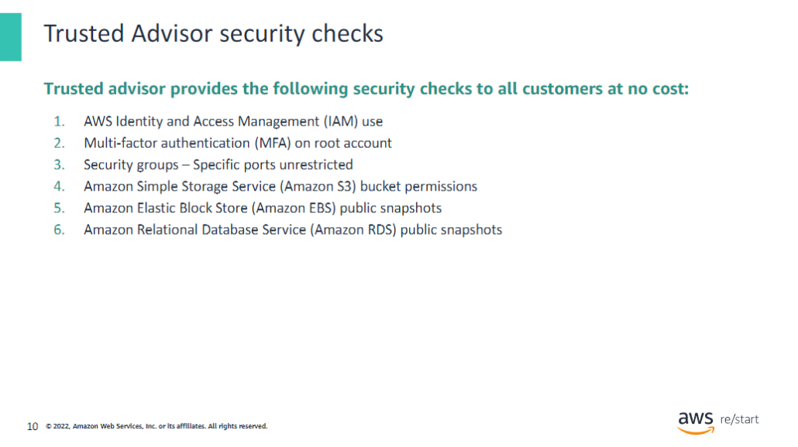

Trusted Advisor provides popular performance and security recommendations to all AWS customers. The following Trusted Advisor checks are available to all customers at no cost:

1. **AWS Identity and Access Management (IAM) use**: Checks for the existence of at least one IAM user to discourage the use of root access.

2. **Multi-factor authentication (MFA) on root account**: Checks the root account and warns you if MFA is not activated.

3. **Security groups – Specific ports unrestricted**: Checks security groups for rules that allow unrestricted access (0.0.0.0/0) to specific ports.

4. **Amazon Simple Storage Service (Amazon S3) bucket permissions**: Checks buckets in Amazon S3 that have open access permissions or that allow access to any authenticated AWS user.

5. **Amazon Elastic Block Store (Amazon EBS) public snapshots**: Checks the permission settings for your Amazon EBS volume snapshots and alerts you if any snapshots are marked as public.

6. **Amazon Relational Database Service (Amazon RDS) public snapshots**: Checks the permission settings for your Amazon RDS database (DB) snapshots and alerts you if any snapshots are marked as public.

## Activity

### Activity: Interpret Trusted Advisor recommendations

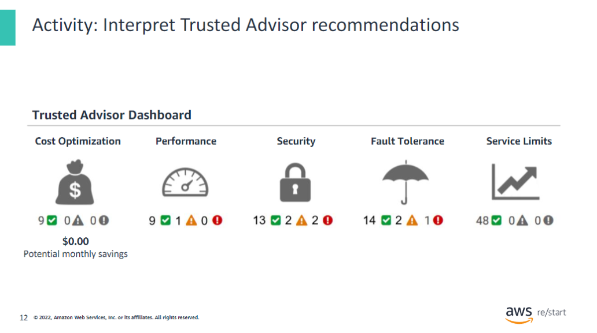

You have a friend who used Trusted Advisor for the first time. Your friend is trying to interpret its recommendations to improve their cloud environment and needs your help.

The dashboard shown on the slide is your friend’s dashboard. In the Security category, you notice that a few recommendations are indicated. You want to examine these recommendations to help your friend improve their security.

Help your friend interpret the following recommendations, which are on the next few slides.

#### Activity: Recommendation 1

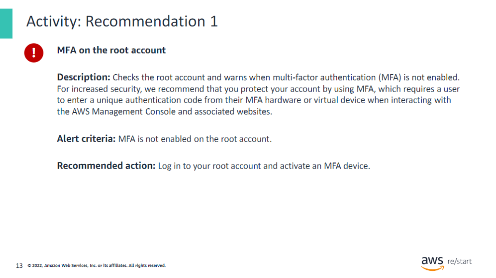

For this recommendation, answer the following questions:

- **What is the status?**
  - The status indicates whether there is an issue or if everything is operating correctly. It can be categorized as red (action recommended), yellow (investigation recommended), or green (no problem detected).

- **What is the problem?**
  - The problem refers to the specific issue identified by the Trusted Advisor check that may affect performance, security, or cost-efficiency.

- **What specific environment details are you given?**
  - Environment details include information such as affected AWS resources, configurations, settings, or permissions related to the identified issue.

- **What is the best practice?**
  - The best practice describes the optimal configuration or approach that aligns with industry standards and AWS recommendations to address the identified issue.

- **What is the recommended action?**
  - The recommended action outlines the steps you should take to resolve the issue, improve performance, enhance security, or reduce costs based on the best practices.

#### Activity: Recommendation 2

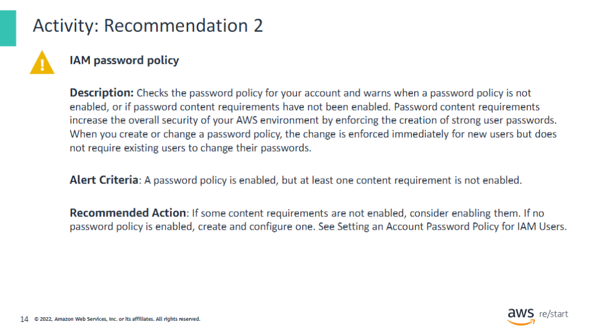

For this recommendation, answer the following questions:

- **What is the status?**
  - The status indicates the current condition of the system or resource, typically categorized as red (action recommended), yellow (investigation recommended), or green (no problem detected).

- **What is the problem?**
  - The problem describes the specific issue or risk identified in the system or resource that needs to be addressed.

- **What specific environment details are you given?**
  - Environment details provide context about the affected resources, including configuration settings, usage patterns, and any relevant metadata.

- **What is the best practice?**
  - The best practice refers to the recommended approach or configuration that aligns with industry standards and optimizes performance, security, or cost-efficiency.

- **What is the recommended action?**
  - The recommended action outlines the steps you should take to resolve the identified problem and implement the best practice.

#### Activity: Recommendation 3

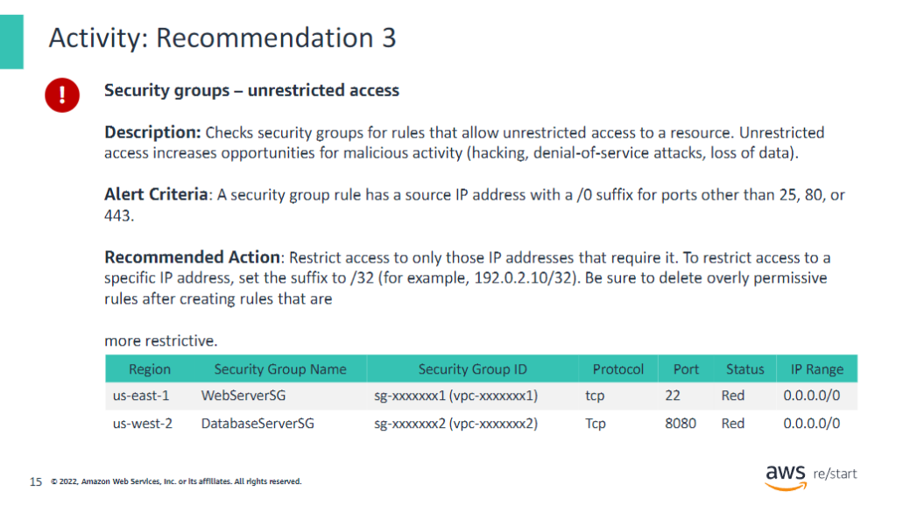

For this recommendation, answer the following questions:

- **What is the status?**
  - Indicates the current state of the system or issue (e.g., red for action recommended, yellow for investigation recommended, green for no problem detected).

- **What is the problem?**
  - Describes the specific issue or risk that has been identified in the system or configuration.

- **What specific environment details are you given?**
  - Provides contextual information about the affected environment, such as system configurations, settings, or specific components involved.

- **What is the best practice?**
  - Refers to the industry-standard approach or configuration that should be adopted to optimize performance, security, or cost-efficiency.

- **What is the recommended action?**
  - Outlines the specific steps or changes that should be implemented to address the problem and align with best practices.

#### Activity: Recommendation No. 4

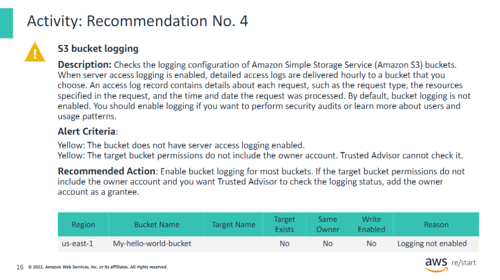

For this recommendation, answer the following questions:

- **What is the status?**
  - The current state of the recommendation, indicating whether action is needed.

- **What is the problem?**
  - A description of the specific issue or risk identified by the recommendation.

- **What specific environment details are you given?**
  - Information about the particular environment, such as system settings, configurations, or affected components.

- **What is the best practice?**
  - The ideal approach or standard to follow for optimizing performance, security, or efficiency.

- **What is the recommended action?**
  - The specific steps or measures suggested to resolve the problem and align with best practices.

## Checkpoint questions

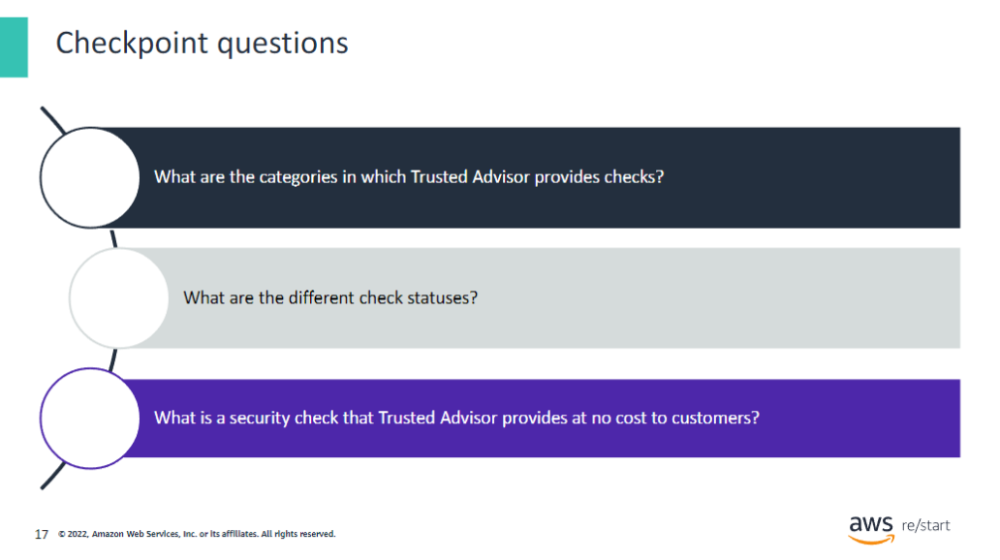

Q1: What are the categories in which Trusted Advisor provides checks?

  
View Answer

  
  - Cost optimization
  - Performance
  - Security
  - Fault tolerance
  - Service limits

Q2: What are the different check statuses?

  
View Answer

  
  - Action recommended (red)
  - Investigation recommended (yellow)
  - No problems detected (green)

Q3: What is a security check that Trusted Advisor provides at no cost to customers?

  
View Answer

  
  Any one of the following:
  
  - IAM use
  - MFA on the root account
  - Security groups – Specific ports unrestricted
  - S3 bucket permissions
  - Amazon EBS public snapshots
  - Amazon RDS public snapshots

## Key Takeaways

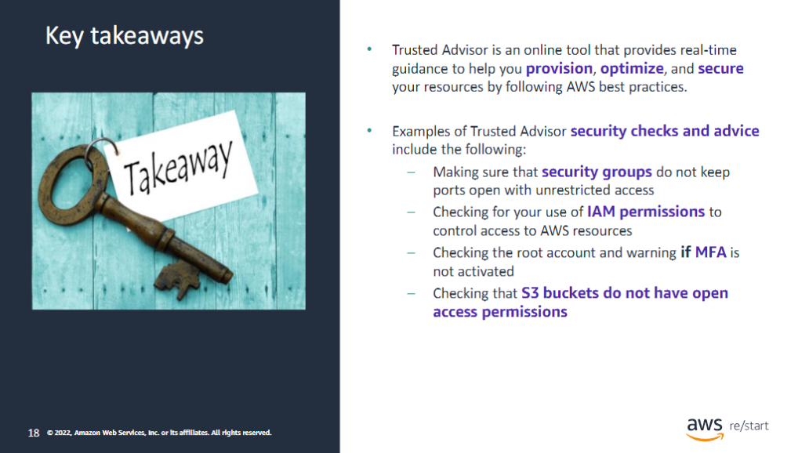

:::tip[This module includes the following keytakeaways:]

- **Trusted Advisor** is an online tool that provides real-time guidance to help you provision, optimize, and secure your resources by following AWS best practices.

- Examples of Trusted Advisor security checks and advice include the following:
  - Making sure that security groups do not keep ports open with unrestricted access
  - Checking for your use of IAM permissions to control access to AWS resources
  - Checking the root account and warning you if MFA is not activated
  - Checking that S3 buckets do not have open access permissions

:::
